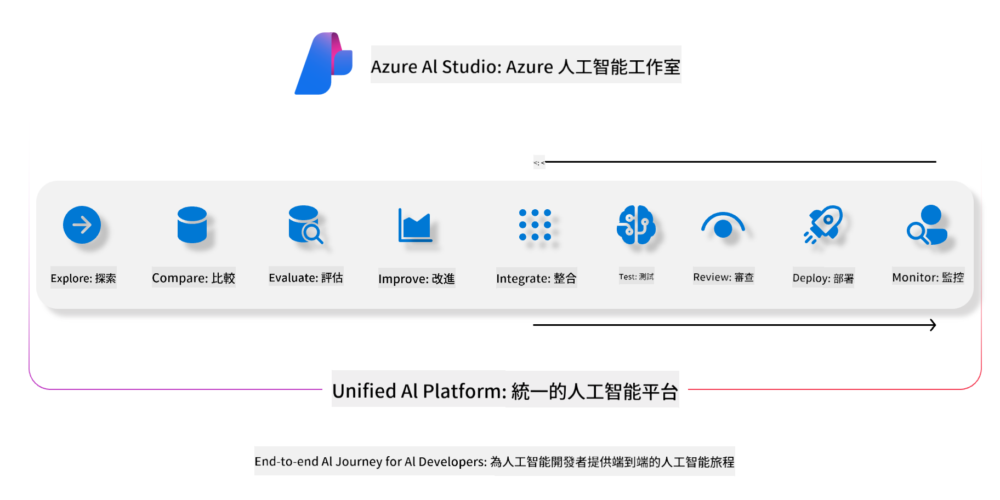
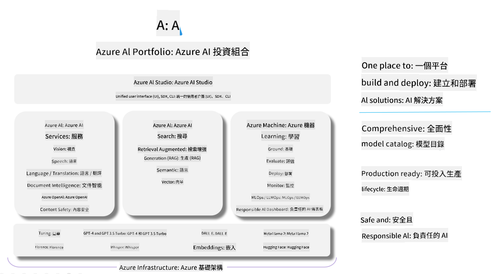

<!--
CO_OP_TRANSLATOR_METADATA:
{
  "original_hash": "5dfb4983a2e74e4b5e8317eb16fc2154",
  "translation_date": "2025-04-04T18:00:54+00:00",
  "source_file": "md\\01.Introduction\\05\\AIFoundry.md",
  "language_code": "hk"
}
-->
# **使用 Azure AI Foundry 進行評估**

如何使用 [Azure AI Foundry](https://ai.azure.com?WT.mc_id=aiml-138114-kinfeylo) 評估您的生成式 AI 應用程式。不論是單輪對話還是多輪對話，Azure AI Foundry 都提供工具來評估模型的性能和安全性。

## 如何使用 Azure AI Foundry 評估生成式 AI 應用程式
如需更詳細的指導，請參閱 [Azure AI Foundry 文件](https://learn.microsoft.com/azure/ai-studio/how-to/evaluate-generative-ai-app?WT.mc_id=aiml-138114-kinfeylo)。

以下是入門步驟：

## 在 Azure AI Foundry 中評估生成式 AI 模型

**必要條件**

- 一個測試數據集，格式為 CSV 或 JSON。
- 一個已部署的生成式 AI 模型（例如 Phi-3、GPT 3.5、GPT 4 或 Davinci 模型）。
- 一個運行時環境及計算實例來執行評估。

## 內建評估指標

Azure AI Foundry 支援評估單輪和複雜的多輪對話。
針對基於特定數據的檢索增強生成（RAG）場景，您可以使用內建評估指標來衡量性能。
此外，您也可以評估一般的單輪問答場景（非 RAG）。

## 創建評估運行

在 Azure AI Foundry 的使用者介面中，導航到 Evaluate 頁面或 Prompt Flow 頁面。
按照評估創建向導設置評估運行。可以選擇性地為您的評估命名。
選擇與您的應用程式目標相符的場景。
選擇一個或多個評估指標來衡量模型的輸出。

## 自定義評估流程（可選）

若需要更高的靈活性，您可以建立自定義評估流程。根據您的特定需求定制評估過程。

## 查看結果

執行評估後，您可以在 Azure AI Foundry 中記錄、查看並分析詳細的評估指標。深入了解您的應用程式的能力和局限性。

**注意** Azure AI Foundry 目前處於公開預覽階段，建議用於實驗和開發用途。對於生產環境的工作負載，請考慮其他選項。探索官方 [AI Foundry 文件](https://learn.microsoft.com/azure/ai-studio/?WT.mc_id=aiml-138114-kinfeylo)，以獲取更多詳細資訊和逐步指導。

**免責聲明**：  
本文檔使用AI翻譯服務 [Co-op Translator](https://github.com/Azure/co-op-translator) 進行翻譯。儘管我們努力確保翻譯的準確性，但請注意，自動翻譯可能會包含錯誤或不準確之處。應以原始語言的文件作為權威來源。對於重要信息，建議使用專業人工翻譯。我們對使用此翻譯所引起的任何誤解或錯誤解釋概不負責。