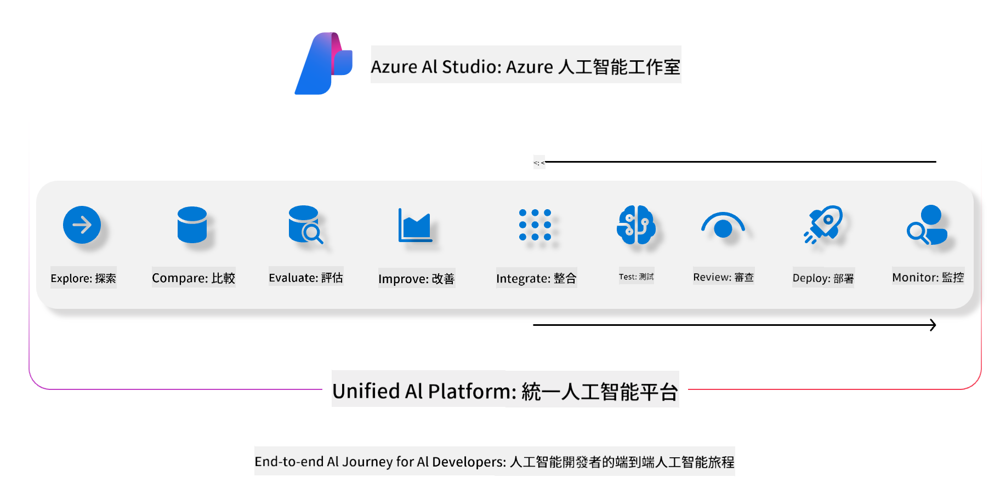
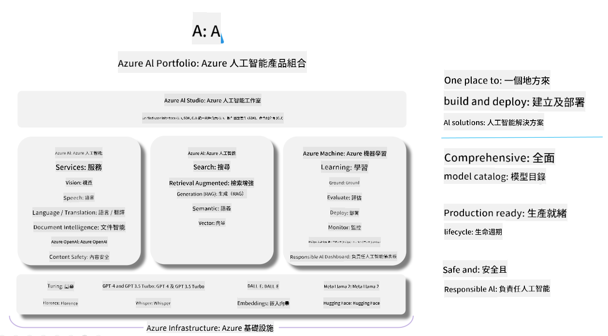

<!--
CO_OP_TRANSLATOR_METADATA:
{
  "original_hash": "7b4235159486df4000e16b7b46ddfec3",
  "translation_date": "2025-05-08T06:04:48+00:00",
  "source_file": "md/01.Introduction/05/AIFoundry.md",
  "language_code": "hk"
}
-->
# **使用 Azure AI Foundry 進行評估**

點樣用 [Azure AI Foundry](https://ai.azure.com?WT.mc_id=aiml-138114-kinfeylo) 去評估你嘅生成式 AI 應用程式。無論係評估單輪定多輪對話，Azure AI Foundry 都提供咗工具幫你評估模型嘅表現同安全性。

## 點樣用 Azure AI Foundry 評估生成式 AI 應用程式  
詳情教學可以參考 [Azure AI Foundry Documentation](https://learn.microsoft.com/azure/ai-studio/how-to/evaluate-generative-ai-app?WT.mc_id=aiml-138114-kinfeylo)

以下係開始嘅步驟：

## 喺 Azure AI Foundry 評估生成式 AI 模型

**先決條件**

- 一個測試數據集，格式可以係 CSV 或 JSON。
- 一個已部署嘅生成式 AI 模型（例如 Phi-3、GPT 3.5、GPT 4 或 Davinci 模型）。
- 一個有計算資源嘅運行環境，用嚟執行評估。

## 內建評估指標

Azure AI Foundry 讓你可以評估單輪同複雜嘅多輪對話。  
對於 Retrieval Augmented Generation (RAG) 場景，即模型基於特定數據，你可以用內建嘅評估指標去衡量表現。  
另外，你亦可以評估一般嘅單輪問答場景（非 RAG）。

## 建立評估流程

喺 Azure AI Foundry 介面，去 Evaluate 頁面或者 Prompt Flow 頁面。  
跟住評估建立嚮導設置評估流程，可以為評估流程加個可選嘅名稱。  
揀選符合你應用目標嘅場景。  
揀一個或多個評估指標，去評估模型輸出。

## 自訂評估流程（可選）

如果想更靈活，可以建立自訂嘅評估流程，根據你嘅具體需求調整評估過程。

## 查看結果

完成評估後，可以喺 Azure AI Foundry 裡面查看、記錄同分析詳細嘅評估指標，深入了解你應用嘅能力同限制。

**Note** Azure AI Foundry 目前仍處於公開預覽階段，建議用嚟做實驗同開發用途。生產環境工作負載可以考慮其他方案。更多詳情同逐步指引，請參考官方 [AI Foundry documentation](https://learn.microsoft.com/azure/ai-studio/?WT.mc_id=aiml-138114-kinfeylo)。

**免責聲明**：  
本文件係使用 AI 翻譯服務 [Co-op Translator](https://github.com/Azure/co-op-translator) 進行翻譯。雖然我哋努力確保準確性，但請注意，自動翻譯可能會有錯誤或不準確之處。原始文件嘅母語版本應被視為權威來源。對於重要資訊，建議採用專業人手翻譯。我哋對因使用本翻譯而引致嘅任何誤解或誤釋概不負責。