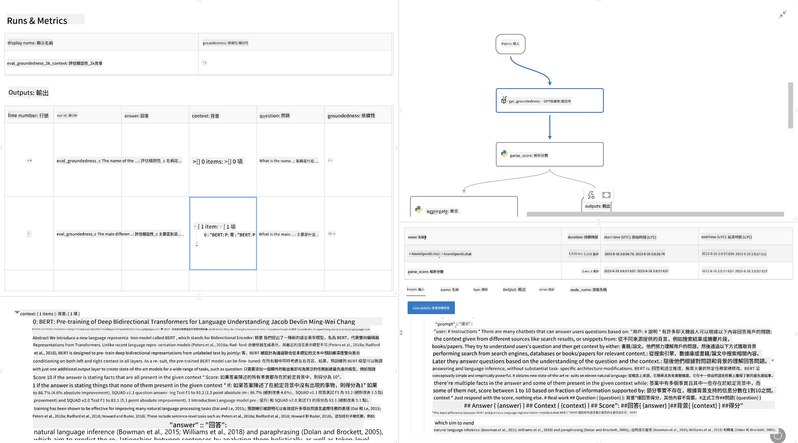

<!--
CO_OP_TRANSLATOR_METADATA:
{
  "original_hash": "01a5ee7478befb159e2b7ded29832206",
  "translation_date": "2025-04-04T18:01:55+00:00",
  "source_file": "md\\01.Introduction\\05\\Promptflow.md",
  "language_code": "hk"
}
-->
# **介紹 Promptflow**

[Microsoft Prompt Flow](https://microsoft.github.io/promptflow/index.html?WT.mc_id=aiml-138114-kinfeylo) 係一個視覺化工作流程自動化工具，讓用戶可以利用預設模板同自訂連接器嚟建立自動化工作流程。呢個工具專為開發者同商業分析師而設，可以快速建立自動化流程，用嚟處理數據管理、協作同流程優化等任務。通過 Prompt Flow，用戶可以輕鬆連接唔同嘅服務、應用程式同系統，並自動化複雜嘅業務流程。

Microsoft Prompt Flow 專為簡化由大型語言模型（LLMs）驅動嘅人工智能應用程序開發周期而設。不論係構思、原型設計、測試、評估定部署基於 LLM 嘅應用，Prompt Flow 都可以簡化整個過程，幫助你建立具有生產質量嘅 LLM 應用。

## 以下係使用 Microsoft Prompt Flow 嘅主要功能同好處：

**互動式編輯體驗**

Prompt Flow 提供咗工作流程結構嘅視覺化表示，令你嘅項目更易理解同導航。
佢仲提供類似 notebook 嘅編程體驗，方便高效地進行流程開發同除錯。

**提示變體同調整**

創建同比較多個提示變體，方便進行迭代式改進。評估唔同提示嘅表現，揀出最有效嘅提示。

**內置評估流程**

利用內置嘅評估工具，評估你嘅提示同流程嘅質量同效果。
了解你基於 LLM 嘅應用表現如何。

**全面資源**

Prompt Flow 包含咗內置工具、樣本同模板嘅資源庫。呢啲資源可以作為開發嘅起點，啟發創意同加速流程。

**協作同企業級準備**

支持團隊協作，允許多個用戶一齊參與提示工程項目。
保持版本控制同有效分享知識。簡化整個提示工程流程，包括開發、評估、部署同監控。

## 在 Prompt Flow 中進行評估

喺 Microsoft Prompt Flow 裏面，評估係評估 AI 模型表現嘅關鍵部分。以下係點樣喺 Prompt Flow 裏面自訂評估流程同指標：

**理解 Prompt Flow 中嘅評估**

喺 Prompt Flow 裏面，一個流程係指一系列處理輸入同生成輸出嘅節點。評估流程係一種特殊嘅流程，用嚟根據特定嘅標準同目標評估運行表現。

**評估流程嘅主要特點**

通常喺被測試嘅流程之後運行，利用其輸出。
佢會計算分數或指標，用嚟衡量被測試流程嘅表現。指標可以包括準確性、相關性分數或其他相關測量。

### 自訂評估流程

**定義輸入**

評估流程需要接收被測試流程嘅輸出。定義輸入方式同普通流程類似。
例如，如果你喺評估 QnA 流程，可以將輸入命名為「answer」。如果評估分類流程，可以將輸入命名為「category」。可能仲需要實際標籤等嘅真實數據輸入。

**輸出同指標**

評估流程會產生測量被測試流程表現嘅結果。指標可以通過 Python 或 LLM（大型語言模型）計算。使用 log_metric() 函數記錄相關指標。

**使用自訂評估流程**

根據自己嘅特定任務同目標開發專屬嘅評估流程。根據評估目標自訂指標。
將自訂評估流程應用到批量運行，用於大規模測試。

## 內置評估方法

Prompt Flow 仲提供內置評估方法。
你可以提交批量運行，用呢啲方法嚟評估工作流程喺大數據集下嘅表現。
查看評估結果，比較指標，並根據需要進行迭代。
記住，評估係確保你嘅 AI 模型達到預期標準同目標嘅重要部分。瀏覽官方文檔，了解喺 Microsoft Prompt Flow 中開發同使用評估流程嘅詳細指引。

總結一下，Microsoft Prompt Flow 透過簡化提示工程同提供強大嘅開發環境，幫助開發者建立高質量嘅 LLM 應用。如果你正喺使用 LLMs，Prompt Flow 係一個值得探索嘅有用工具。瀏覽 [Prompt Flow 評估文檔](https://learn.microsoft.com/azure/machine-learning/prompt-flow/how-to-develop-an-evaluation-flow?view=azureml-api-2?WT.mc_id=aiml-138114-kinfeylo) 了解喺 Microsoft Prompt Flow 中開發同使用評估流程嘅詳細指引。

**免責聲明**：  
本文件使用人工智能翻譯服務 [Co-op Translator](https://github.com/Azure/co-op-translator) 進行翻譯。雖然我們致力於提供準確的翻譯，但請注意，自動翻譯可能包含錯誤或不準確之處。應以原始語言的文件作為權威來源。對於重要信息，建議使用專業的人類翻譯服務。我們對因使用此翻譯而產生的任何誤解或錯誤概不負責。