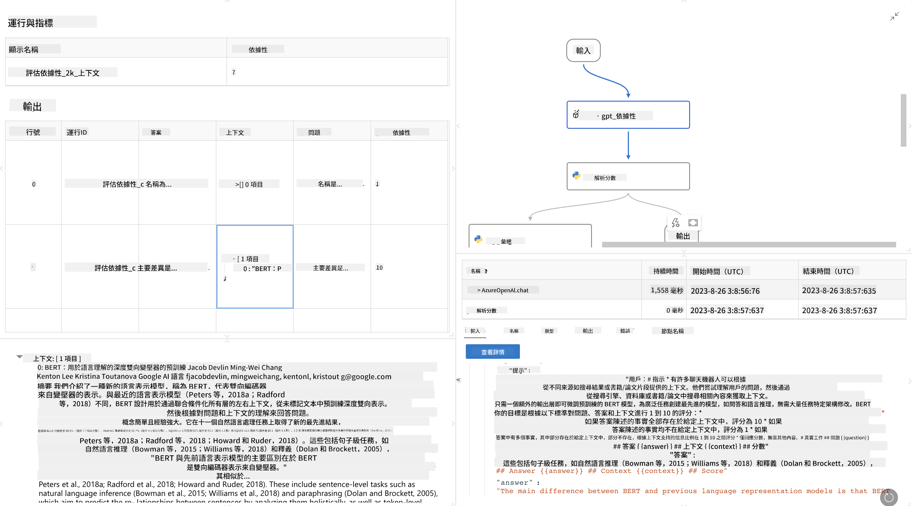

<!--
CO_OP_TRANSLATOR_METADATA:
{
  "original_hash": "3cbe7629d254f1043193b7fe22524d55",
  "translation_date": "2025-05-08T06:07:00+00:00",
  "source_file": "md/01.Introduction/05/Promptflow.md",
  "language_code": "hk"
}
-->
# **介紹 Promptflow**

[Microsoft Prompt Flow](https://microsoft.github.io/promptflow/index.html?WT.mc_id=aiml-138114-kinfeylo) 係一個視覺化工作流程自動化工具，容許用戶用預設嘅模板同自訂連接器去建立自動化工作流程。佢設計目標係方便開發者同業務分析員快速建立自動化流程，應用於數據管理、協作同流程優化等任務。用 Prompt Flow，用戶可以輕鬆連接唔同嘅服務、應用程式同系統，自動化複雜嘅業務流程。

Microsoft Prompt Flow 係專為簡化由大型語言模型（LLMs）驅動嘅 AI 應用程式嘅端到端開發週期而設。無論你係構思、原型設計、測試、評估定部署基於 LLM 嘅應用，Prompt Flow 都可以令流程更簡單，幫你打造具生產質素嘅 LLM 應用。

## Microsoft Prompt Flow 嘅主要功能同優點：

**互動式創作體驗**

Prompt Flow 提供工作流程結構嘅視覺化展示，方便理解同瀏覽你嘅項目。  
佢提供類似筆記本嘅編碼體驗，提升工作流程開發同除錯效率。

**Prompt 變體同調校**

可以建立同比較多個 prompt 變體，促進反覆優化過程。評估唔同 prompt 嘅表現，揀出最有效果嘅。

**內置評估流程**

利用內置嘅評估工具，評估你嘅 prompt 同工作流程嘅質素同效果。  
了解你基於 LLM 嘅應用表現幾好。

**全面資源**

Prompt Flow 包含一系列內置工具、範例同模板。呢啲資源係開發起點，激發創意同加快流程。

**協作同企業級準備**

支援團隊協作，容許多位用戶一齊做 prompt 工程項目。  
維持版本控制，有效分享知識。簡化整個 prompt 工程流程，從開發、評估到部署同監控。

## Prompt Flow 入面嘅評估

喺 Microsoft Prompt Flow 入面，評估係評定你嘅 AI 模型表現嘅關鍵步驟。依家一齊睇下點樣喺 Prompt Flow 入面自訂評估流程同指標：

**了解 Prompt Flow 入面嘅評估**

喺 Prompt Flow，flow 代表一連串節點，負責處理輸入同產生輸出。評估流程係特別設計用嚟根據特定標準同目標評估執行結果嘅流程。

**評估流程嘅主要特點**

通常會喺被測試嘅流程執行後運行，使用其輸出。佢哋會計算分數或指標，衡量被測流程嘅表現。指標可以包括準確度、相關性分數或其他相關量度。

### 自訂評估流程

**定義輸入**

評估流程需要接收被測流程嘅輸出。定義輸入同一般流程一樣。  
例如，評估 QnA 流程時，可以將輸入命名為「answer」。評估分類流程時，輸入可以叫「category」。可能亦需要實際標籤（ground truth）作為輸入。

**輸出同指標**

評估流程會產生衡量被測流程表現嘅結果。指標可以用 Python 或 LLM 計算。用 log_metric() 函數記錄相關指標。

**使用自訂評估流程**

根據你嘅任務同目標，開發專屬嘅評估流程。根據評估目標自訂指標。  
將呢個自訂評估流程應用於批量執行，進行大規模測試。

## 內置評估方法

Prompt Flow 亦提供內置嘅評估方法。  
你可以提交批量執行，利用呢啲方法評估流程喺大數據集上嘅表現。  
查看評估結果、比較指標，並按需要反覆優化。  
記住，評估係確保 AI 模型達到預期標準同目標嘅重要環節。詳情請參考官方文件，了解喺 Microsoft Prompt Flow 入面開發同使用評估流程嘅指引。

總結，Microsoft Prompt Flow 幫助開發者簡化 prompt 工程，提供穩健嘅開發環境，從而打造高質素嘅 LLM 應用。如果你係做 LLM 相關工作，Prompt Flow 係一個值得探索嘅好工具。  
詳閱 [Prompt Flow Evaluation Documents](https://learn.microsoft.com/azure/machine-learning/prompt-flow/how-to-develop-an-evaluation-flow?view=azureml-api-2?WT.mc_id=aiml-138114-kinfeylo) 了解開發同使用評估流程嘅詳細說明。

**免責聲明**：  
本文件係用AI翻譯服務 [Co-op Translator](https://github.com/Azure/co-op-translator) 翻譯。雖然我哋努力確保準確性，但請注意自動翻譯可能會有錯誤或不準確嘅地方。原文文件嘅母語版本應視為權威來源。對於重要資訊，建議使用專業人工翻譯。我哋對因使用此翻譯而引起嘅任何誤解或誤釋概不負責。