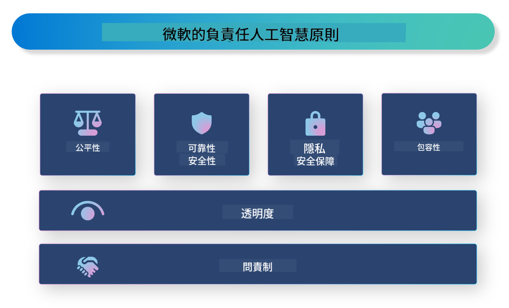

<!--
CO_OP_TRANSLATOR_METADATA:
{
  "original_hash": "3b3107c2477241058ef506743188f399",
  "translation_date": "2025-04-04T18:03:27+00:00",
  "source_file": "md\\01.Introduction\\05\\ResponsibleAI.md",
  "language_code": "hk"
}
-->
# **介紹負責任人工智能**

[Microsoft Responsible AI](https://www.microsoft.com/ai/responsible-ai?WT.mc_id=aiml-138114-kinfeylo) 是一個旨在幫助開發者和組織建立透明、可信及負責任的人工智能系統的倡議。這個倡議提供指引和資源，幫助開發符合道德原則（例如隱私、公平和透明）的負責任人工智能解決方案。我們還會探討建立負責任人工智能系統所面臨的一些挑戰及最佳實踐。

## Microsoft Responsible AI 概覽

**道德原則**

Microsoft Responsible AI 是以一系列道德原則為指導，例如隱私、公平、透明、問責及安全。這些原則旨在確保人工智能系統以道德及負責任的方式開發。

**透明人工智能**

Microsoft Responsible AI 強調人工智能系統的透明性，包括提供清晰的解釋人工智能模型如何運作，以及確保數據來源和算法公開。

**問責人工智能**

[Microsoft Responsible AI](https://www.microsoft.com/ai/responsible-ai?WT.mc_id=aiml-138114-kinfeylo) 提倡開發能夠提供人工智能模型如何作出決策洞察的問責人工智能系統，幫助用戶理解並信任人工智能系統的輸出。

**包容性**

人工智能系統應該旨在惠及所有人。Microsoft 致力於創造考慮多元觀點並避免偏見或歧視的包容性人工智能。

**可靠性與安全性**

確保人工智能系統的可靠性和安全性至關重要。Microsoft 專注於建立穩健的模型，確保其一致性並避免造成有害後果。

**人工智能的公平性**

Microsoft Responsible AI 認識到人工智能系統可能因使用有偏見的數據或算法而延續偏見。該倡議提供指引，幫助開發不因種族、性別或年齡等因素而歧視的公平人工智能系統。

**隱私和安全**

Microsoft Responsible AI 強調保護人工智能系統中的用戶隱私和數據安全的重要性，包括實施強大的數據加密和訪問控制，以及定期審查人工智能系統的漏洞。

**問責與責任**

Microsoft Responsible AI 提倡在人工智能開發和部署中保持問責與責任，包括確保開發者和組織意識到人工智能系統的潛在風險並採取措施減少這些風險。

## 建立負責任人工智能系統的最佳實踐

**使用多元化數據集開發人工智能模型**

為避免人工智能系統的偏見，使用能代表多種觀點和經驗的多元化數據集非常重要。

**採用可解釋的人工智能技術**

可解釋的人工智能技術可以幫助用戶理解人工智能模型如何作出決策，從而增加系統的信任度。

**定期審查人工智能系統的漏洞**

定期審查人工智能系統可以幫助識別需要解決的潛在風險和漏洞。

**實施強大的數據加密和訪問控制**

數據加密和訪問控制可以幫助保護人工智能系統中的用戶隱私和安全。

**在人工智能開發中遵循道德原則**

遵循公平、透明和問責等道德原則，有助於建立信任並確保人工智能系統以負責任的方式開發。

## 使用 AI Foundry 建立負責任人工智能

[Azure AI Foundry](https://ai.azure.com?WT.mc_id=aiml-138114-kinfeylo) 是一個強大的平台，讓開發者和組織能夠快速創建智能、先進、市場準備就緒及負責任的應用程序。以下是 Azure AI Foundry 的一些關鍵功能和能力：

**即用型 API 和模型**

Azure AI Foundry 提供預建和可定制的 API 和模型，涵蓋了多種人工智能任務，包括生成式人工智能、自然語言處理、搜索、監控、翻譯、語音、視覺和決策。

**Prompt Flow**

Azure AI Foundry 的 Prompt Flow 能夠幫助你創建對話式人工智能體驗。它使設計和管理對話流程更簡單，方便構建聊天機器人、虛擬助理和其他互動應用程序。

**檢索增強生成 (RAG)**

RAG 是一種結合檢索和生成方法的技術，通過利用現有知識（檢索）和創意生成（生成）來提高生成回應的質量。

**生成式人工智能的評估與監控指標**

Azure AI Foundry 提供工具來評估和監控生成式人工智能模型。你可以評估其性能、公平性及其他重要指標以確保負責任部署。此外，如果你已創建儀表板，可以使用 Azure Machine Learning Studio 的無代碼界面定制並生成基於 [Responsible AI Toolbox](https://responsibleaitoolbox.ai/?WT.mc_id=aiml-138114-kinfeylo) Python 庫的負責任人工智能儀表板和相關評分卡。這些評分卡幫助你向技術和非技術利益相關者分享與公平性、特徵重要性及其他負責任部署考量相關的關鍵洞察。

使用 AI Foundry 建立負責任人工智能，可以遵循以下最佳實踐：

**定義人工智能系統的問題和目標**

在開始開發過程之前，清晰定義人工智能系統要解決的問題或目標非常重要。這將幫助你識別所需的數據、算法和資源以建立有效的模型。

**收集並預處理相關數據**

用於訓練人工智能系統的數據質量和數量會對其性能產生重大影響。因此，收集相關數據、清理、預處理並確保它能代表你試圖解決的人群或問題非常重要。

**選擇適合的評估方法**

有多種評估算法可用。根據你的數據和問題選擇最適合的算法非常重要。

**評估並解釋模型**

建立人工智能模型後，需使用適當的指標評估其性能並以透明方式解釋結果。這有助於識別模型中的任何偏見或限制，並在必要時進行改進。

**確保透明性和可解釋性**

人工智能系統應該是透明和可解釋的，以便用戶理解其運作方式及決策的形成方式。這對於對人類生活有重大影響的應用（如醫療、金融和法律系統）尤其重要。

**監控並更新模型**

人工智能系統應該持續監控並更新，以確保其長期保持準確和有效。這需要不斷的維護、測試和重新訓練模型。

總結來說，Microsoft Responsible AI 是一個旨在幫助開發者和組織建立透明、可信及負責任人工智能系統的倡議。記住，負責任人工智能的實施至關重要，而 Azure AI Foundry 致力於使其對組織變得實際可行。通過遵循道德原則和最佳實踐，我們可以確保人工智能系統以負責任的方式開發和部署，從而惠及整個社會。

**免責聲明**：  
此文件已使用人工智能翻譯服務 [Co-op Translator](https://github.com/Azure/co-op-translator) 進行翻譯。雖然我們致力於提供準確的翻譯，但請注意，自動翻譯可能包含錯誤或不準確之處。原始文件的母語版本應被視為權威來源。對於關鍵信息，建議尋求專業的人工翻譯。我們不對因使用此翻譯而引起的任何誤解或誤讀承擔責任。