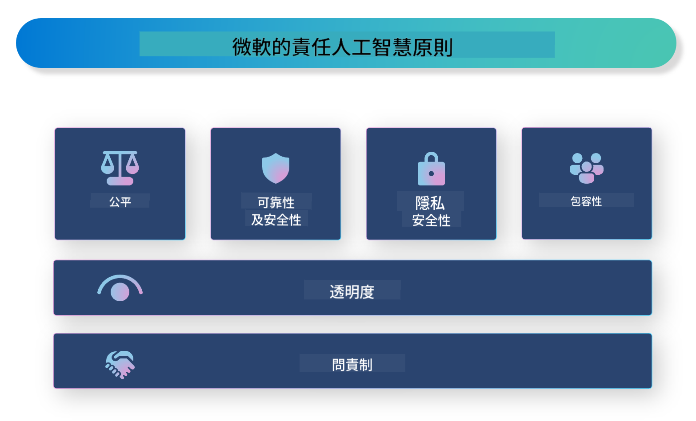

<!--
CO_OP_TRANSLATOR_METADATA:
{
  "original_hash": "805b96b20152936d8f4c587d90d6e06e",
  "translation_date": "2025-05-08T06:05:30+00:00",
  "source_file": "md/01.Introduction/05/ResponsibleAI.md",
  "language_code": "hk"
}
-->
# **介紹負責任的 AI**

[Microsoft Responsible AI](https://www.microsoft.com/ai/responsible-ai?WT.mc_id=aiml-138114-kinfeylo) 是一個旨在幫助開發者和組織建立透明、值得信賴及具問責性的 AI 系統的計劃。該計劃提供指引和資源，協助開發符合隱私、公平及透明等倫理原則的負責任 AI 解決方案。我們亦會探討建立負責任 AI 系統時面對的挑戰和最佳實踐。

## Microsoft Responsible AI 概覽

**倫理原則**

Microsoft Responsible AI 以一系列倫理原則為指導，包括隱私、公平、透明、問責及安全。這些原則確保 AI 系統以合乎倫理和負責任的方式開發。

**透明的 AI**

Microsoft Responsible AI 強調 AI 系統透明度的重要性，這包括清楚解釋 AI 模型的運作方式，以及確保數據來源和算法公開可用。

**具問責性的 AI**

[Microsoft Responsible AI](https://www.microsoft.com/ai/responsible-ai?WT.mc_id=aiml-138114-kinfeylo) 推動開發具問責性的 AI 系統，讓用戶能了解 AI 模型如何作出決策，從而增強對 AI 結果的信任。

**包容性**

AI 系統應設計為惠及所有人。Microsoft 致力打造考慮多元觀點、避免偏見或歧視的包容性 AI。

**可靠性與安全性**

確保 AI 系統可靠且安全至關重要。Microsoft 專注於建立穩健的模型，保持一致表現並避免有害結果。

**AI 公平性**

Microsoft Responsible AI 認識到若 AI 系統以有偏見的數據或算法訓練，可能會加劇偏見。該計劃提供指引，協助開發不因種族、性別或年齡等因素歧視的公平 AI 系統。

**隱私與安全**

Microsoft Responsible AI 強調保護用戶隱私及數據安全的重要性，涵蓋強化數據加密、存取控制，以及定期審核 AI 系統漏洞。

**問責與責任**

Microsoft Responsible AI 推動 AI 開發與部署中的問責與責任，確保開發者及組織了解 AI 系統潛在風險，並採取措施減輕風險。

## 建立負責任 AI 系統的最佳實踐

**使用多元數據集開發 AI 模型**

為避免 AI 系統出現偏見，重要的是使用涵蓋多元觀點和經驗的多樣化數據集。

**採用可解釋的 AI 技術**

可解釋的 AI 技術有助用戶理解 AI 模型如何作出決策，提升系統信任度。

**定期審核 AI 系統漏洞**

定期審核 AI 系統有助發現需處理的潛在風險和漏洞。

**實施強化數據加密與存取控制**

數據加密及存取控制有助保護 AI 系統中用戶的隱私與安全。

**遵循 AI 開發中的倫理原則**

遵守公平、透明、問責等倫理原則，有助建立對 AI 系統的信任，並確保其負責任地開發。

## 使用 AI Foundry 推動負責任 AI

[Azure AI Foundry](https://ai.azure.com?WT.mc_id=aiml-138114-kinfeylo) 是一個強大的平台，讓開發者和組織能迅速打造智能、先進、市場就緒且負責任的應用程式。以下是 Azure AI Foundry 的一些主要功能和能力：

**開箱即用的 API 和模型**

Azure AI Foundry 提供預建及可定制的 API 和模型，涵蓋生成式 AI、對話自然語言處理、搜尋、監控、翻譯、語音、視覺及決策等多種 AI 任務。

**Prompt Flow**

Azure AI Foundry 的 Prompt Flow 讓你能設計和管理對話流程，方便建立聊天機械人、虛擬助理及其他互動應用。

**Retrieval Augmented Generation (RAG)**

RAG 結合檢索式與生成式方法，利用既有知識（檢索）和創造性生成（生成）提升回應品質。

**生成式 AI 的評估及監控指標**

Azure AI Foundry 提供評估和監控生成式 AI 模型的工具，讓你檢視性能、公平性等重要指標，確保負責任部署。此外，若你建立了儀表板，可利用 Azure Machine Learning Studio 的無代碼介面，根據 [Repsonsible AI Toolbox](https://responsibleaitoolbox.ai/?WT.mc_id=aiml-138114-kinfeylo) Python 函式庫自訂並生成負責任 AI 儀表板及相關評分卡。該評分卡有助你與技術及非技術持份者分享公平性、特徵重要性及其他負責任部署的關鍵見解。

使用 AI Foundry 推動負責任 AI，可遵循以下最佳實踐：

**明確定義 AI 系統的問題與目標**

在開始開發前，清楚定義 AI 系統要解決的問題或目標，有助確定所需數據、算法及資源。

**收集及預處理相關數據**

訓練 AI 系統所用數據的質量與數量，會顯著影響性能，因此要收集相關數據，清理及預處理，並確保其能代表你想解決的人群或問題。

**選擇合適的評估算法**

市面上有多種評估算法，需根據數據和問題選擇最合適的算法。

**評估及解讀模型**

建立模型後，需用適當指標評估其表現，並以透明方式解讀結果，協助識別模型中的偏見或限制，並進行改進。

**確保透明度及可解釋性**

AI 系統應具透明度及可解釋性，讓用戶理解系統運作及決策過程，尤其對於醫療、金融及法律等對人生命有重大影響的應用尤為重要。

**監控及更新模型**

AI 系統需持續監控及更新，確保長期保持準確及有效，這包括定期維護、測試及再訓練模型。

總結來說，Microsoft Responsible AI 是一個幫助開發者和組織建立透明、可信及具問責性 AI 系統的計劃。負責任的 AI 實踐至關重要，而 Azure AI Foundry 旨在協助組織將其落實。只要遵循倫理原則及最佳實踐，我們就能確保 AI 系統以對社會整體有益的方式被開發和部署。

**免責聲明**：  
本文件使用 AI 翻譯服務 [Co-op Translator](https://github.com/Azure/co-op-translator) 進行翻譯。雖然我們致力於確保準確性，但請注意，自動翻譯可能包含錯誤或不準確之處。原始文件的母語版本應被視為權威來源。對於重要資訊，建議採用專業人工翻譯。我們對因使用此翻譯而引起的任何誤解或誤譯概不負責。