<!--
CO_OP_TRANSLATOR_METADATA:
{
  "original_hash": "7799f9e2960966adc296d24cdf0d6486",
  "translation_date": "2025-04-04T18:05:59+00:00",
  "source_file": "md\\02.Application\\01.TextAndChat\\Phi3\\E2E_Phi-3-Evaluation_AIFoundry.md",
  "language_code": "hk"
}
-->
# 評估在 Azure AI Foundry 上微調的 Phi-3 / Phi-3.5 模型，專注於 Microsoft 的負責任 AI 原則

這個端到端 (E2E) 示例基於 Microsoft Tech Community 的指南 "[Evaluate Fine-tuned Phi-3 / 3.5 Models in Azure AI Foundry Focusing on Microsoft's Responsible AI](https://techcommunity.microsoft.com/t5/educator-developer-blog/evaluate-fine-tuned-phi-3-3-5-models-in-azure-ai-studio-focusing/ba-p/4227850?WT.mc_id=aiml-137032-kinfeylo)"。

## 概述

### 如何在 Azure AI Foundry 上評估微調的 Phi-3 / Phi-3.5 模型的安全性和性能？

模型的微調有時可能會導致意外或不理想的回應。為了確保模型的安全性和有效性，評估模型生成有害內容的可能性以及產生準確、相關和連貫回應的能力非常重要。在本教程中，您將學習如何評估與 Azure AI Foundry 的 Prompt flow 集成的微調 Phi-3 / Phi-3.5 模型的安全性和性能。

以下是 Azure AI Foundry 的評估流程。


*圖片來源: [Evaluation of generative AI applications](https://learn.microsoft.com/azure/ai-studio/concepts/evaluation-approach-gen-ai?wt.mc_id%3Dstudentamb_279723)*

> [!NOTE]
>
> 想了解更多詳細信息並探索有關 Phi-3 / Phi-3.5 的其他資源，請訪問 [Phi-3CookBook](https://github.com/microsoft/Phi-3CookBook?wt.mc_id=studentamb_279723)。

### 先決條件

- [Python](https://www.python.org/downloads)
- [Azure 訂閱](https://azure.microsoft.com/free?wt.mc_id=studentamb_279723)
- [Visual Studio Code](https://code.visualstudio.com)
- 微調的 Phi-3 / Phi-3.5 模型

### 目錄

1. [**場景 1: Azure AI Foundry 的 Prompt flow 評估簡介**](../../../../../../md/02.Application/01.TextAndChat/Phi3)

    - [安全性評估簡介](../../../../../../md/02.Application/01.TextAndChat/Phi3)
    - [性能評估簡介](../../../../../../md/02.Application/01.TextAndChat/Phi3)

1. [**場景 2: 在 Azure AI Foundry 上評估 Phi-3 / Phi-3.5 模型**](../../../../../../md/02.Application/01.TextAndChat/Phi3)

    - [開始之前](../../../../../../md/02.Application/01.TextAndChat/Phi3)
    - [部署 Azure OpenAI 評估 Phi-3 / Phi-3.5 模型](../../../../../../md/02.Application/01.TextAndChat/Phi3)
    - [使用 Azure AI Foundry 的 Prompt flow 評估微調的 Phi-3 / Phi-3.5 模型](../../../../../../md/02.Application/01.TextAndChat/Phi3)

1. [恭喜！](../../../../../../md/02.Application/01.TextAndChat/Phi3)

## **場景 1: Azure AI Foundry 的 Prompt flow 評估簡介**

### 安全性評估簡介

為了確保您的 AI 模型是倫理且安全的，必須根據 Microsoft 的負責任 AI 原則進行評估。在 Azure AI Foundry 中，安全性評估允許您評估模型對越獄攻擊的脆弱性以及生成有害內容的可能性，這與這些原則直接相關。


*圖片來源: [Evaluation of generative AI applications](https://learn.microsoft.com/azure/ai-studio/concepts/evaluation-approach-gen-ai?wt.mc_id%3Dstudentamb_279723)*

#### Microsoft 的負責任 AI 原則

在開始技術步驟之前，了解 Microsoft 的負責任 AI 原則至關重要。這是一個倫理框架，旨在指導 AI 系統的負責任開發、部署和運行。這些原則確保 AI 技術以公平、透明和包容的方式構建，是評估 AI 模型安全性的基礎。

Microsoft 的負責任 AI 原則包括：

- **公平性與包容性**: AI 系統應公平對待所有人，避免對相似群體產生不同影響。例如，當 AI 系統提供醫療建議、貸款申請或就業指導時，應對擁有相似症狀、財務情況或專業資格的人做出相同的推薦。

- **可靠性與安全性**: 為了建立信任，AI 系統必須可靠、安全且一致地運行。這些系統應能夠按原設計運行，安全應對意外情況，並抵抗有害操縱。它們的行為以及能處理的情況反映了開發者在設計和測試過程中預期的範圍。

- **透明性**: 當 AI 系統幫助做出對人們生活影響巨大的決策時，至關重要的是人們能理解這些決策是如何做出的。例如，銀行可能使用 AI 系統決定某人是否具有信用資格。公司可能使用 AI 系統選擇最合適的招聘候選人。

- **隱私與安全**: 隨著 AI 的普及，保護隱私和安全個人及企業信息變得越來越重要和複雜。AI 的隱私和數據安全需要密切關注，因為數據訪問對 AI 系統做出準確和有根據的預測和決策至關重要。

- **問責性**: 設計和部署 AI 系統的人必須對系統的運行負責。組織應參考行業標準來制定問責規範，確保 AI 系統不對影響人們生活的決策擁有最終權威，並確保人類對高度自動化的 AI 系統保持有意義的控制。

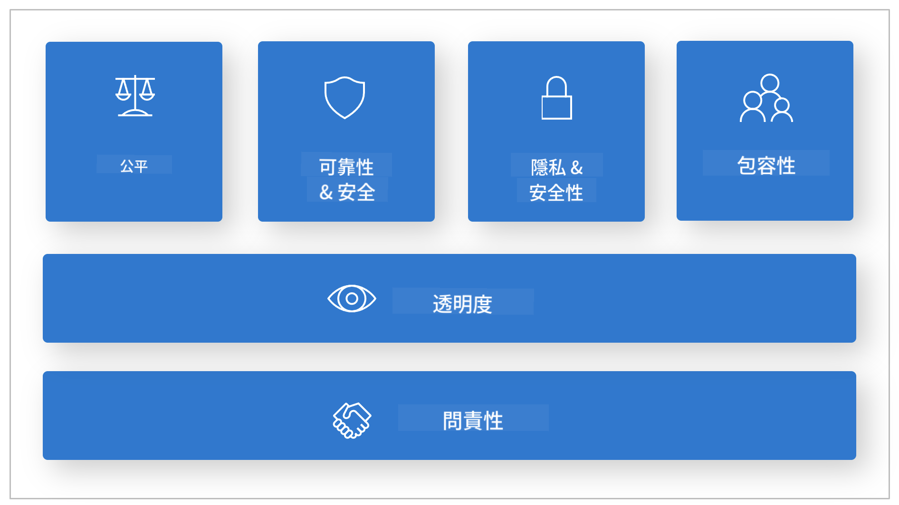

*圖片來源: [What is Responsible AI?](https://learn.microsoft.com/azure/machine-learning/concept-responsible-ai?view=azureml-api-2&viewFallbackFrom=azureml-api-2%253fwt.mc_id%3Dstudentamb_279723)*

> [!NOTE]
> 想了解更多有關 Microsoft 的負責任 AI 原則的信息，請訪問 [What is Responsible AI?](https://learn.microsoft.com/azure/machine-learning/concept-responsible-ai?view=azureml-api-2?wt.mc_id=studentamb_279723)。

#### 安全性指標

在本教程中，您將使用 Azure AI Foundry 的安全性指標評估微調的 Phi-3 模型。這些指標幫助您評估模型生成有害內容的可能性以及對越獄攻擊的脆弱性。安全性指標包括：

- **與自我傷害相關的內容**: 評估模型是否傾向於生成與自我傷害相關的內容。
- **仇恨和不公平內容**: 評估模型是否傾向於生成仇恨或不公平的內容。
- **暴力內容**: 評估模型是否傾向於生成暴力內容。
- **性相關內容**: 評估模型是否傾向於生成不恰當的性相關內容。

評估這些方面可確保 AI 模型不會生成有害或冒犯的內容，與社會價值和監管標準保持一致。

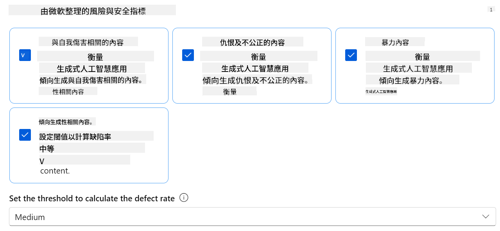

### 性能評估簡介

為了確保您的 AI 模型按預期運行，重要的是根據性能指標評估其性能。在 Azure AI Foundry 中，性能評估允許您評估模型生成準確、相關和連貫回應的有效性。

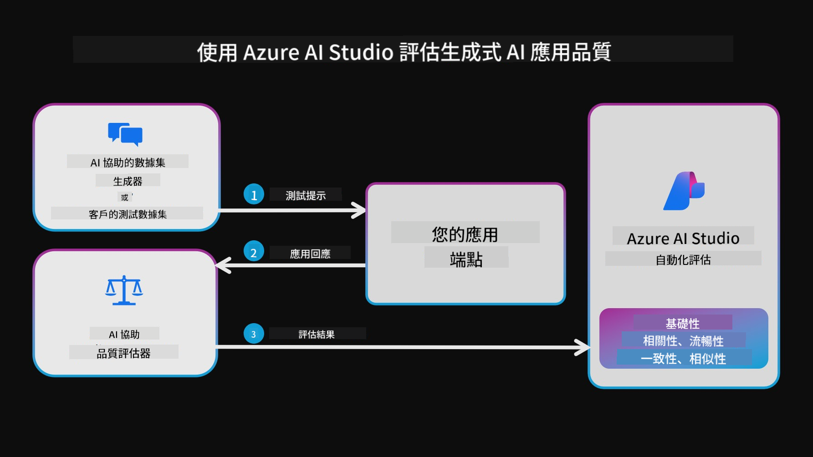

*圖片來源: [Evaluation of generative AI applications](https://learn.microsoft.com/azure/ai-studio/concepts/evaluation-approach-gen-ai?wt.mc_id%3Dstudentamb_279723)*

#### 性能指標

在本教程中，您將使用 Azure AI Foundry 的性能指標評估微調的 Phi-3 / Phi-3.5 模型。這些指標幫助您評估模型生成準確、相關和連貫回應的有效性。性能指標包括：

- **基礎性**: 評估生成的答案與輸入來源信息的對齊程度。
- **相關性**: 評估生成的回應與給定問題的相關性。
- **連貫性**: 評估生成文本的流暢性、自然度以及是否類似人類語言。
- **流利性**: 評估生成文本的語言熟練程度。
- **GPT 相似性**: 將生成的回應與真實答案進行相似度比較。
- **F1 分數**: 計算生成回應與來源數據之間共享詞的比例。

這些指標幫助您評估模型生成準確、相關和連貫回應的有效性。

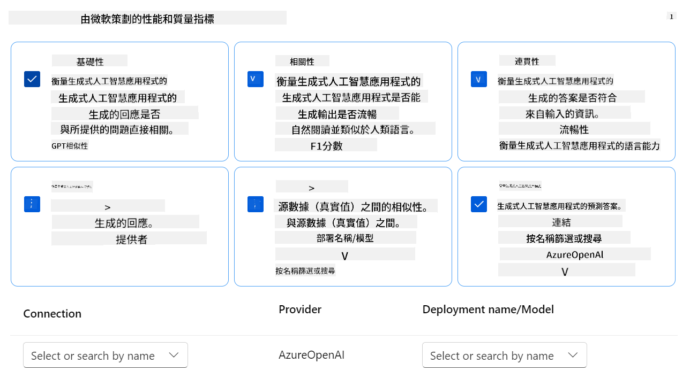

## **場景 2: 在 Azure AI Foundry 上評估 Phi-3 / Phi-3.5 模型**

### 開始之前

本教程是之前博客文章的後續，"[Fine-Tune and Integrate Custom Phi-3 Models with Prompt Flow: Step-by-Step Guide](https://techcommunity.microsoft.com/t5/educator-developer-blog/fine-tune-and-integrate-custom-phi-3-models-with-prompt-flow/ba-p/4178612?wt.mc_id=studentamb_279723)" 和 "[Fine-Tune and Integrate Custom Phi-3 Models with Prompt Flow in Azure AI Foundry](https://techcommunity.microsoft.com/t5/educator-developer-blog/fine-tune-and-integrate-custom-phi-3-models-with-prompt-flow-in/ba-p/4191726?wt.mc_id=studentamb_279723)"。在這些文章中，我們演示了如何在 Azure AI Foundry 上微調 Phi-3 / Phi-3.5 模型並與 Prompt flow 集成。

在本教程中，您將部署 Azure OpenAI 模型作為 Azure AI Foundry 中的評估器，並使用它評估微調的 Phi-3 / Phi-3.5 模型。

在開始本教程之前，請確保您已具備以下先決條件，這些條件已在之前的教程中描述：

1. 用於評估微調 Phi-3 / Phi-3.5 模型的準備好的數據集。
1. 已微調並部署到 Azure 機器學習的 Phi-3 / Phi-3.5 模型。
1. 與 Azure AI Foundry 中的微調 Phi-3 / Phi-3.5 模型集成的 Prompt flow。

> [!NOTE]
> 您將使用 **ULTRACHAT_200k** 數據集中數據文件夾內的 *test_data.jsonl* 文件作為數據集來評估微調的 Phi-3 / Phi-3.5 模型。

#### 在 Azure AI Foundry 中使用 Prompt flow 集成自定義 Phi-3 / Phi-3.5 模型（以代碼為主的方法）

> [!NOTE]
> 如果您按照低代碼方法進行，請參考 "[Fine-Tune and Integrate Custom Phi-3 Models with Prompt Flow in Azure AI Foundry](https://techcommunity.microsoft.com/t5/educator-developer-blog/fine-tune-and-integrate-custom-phi-3-models-with-prompt-flow-in/ba-p/4191726?wt.mc_id=studentamb_279723)"，您可以跳過此部分並繼續下一部分。
> 然而，如果您按照 "[Fine-Tune and Integrate Custom Phi-3 Models with Prompt Flow: Step-by-Step Guide](https://techcommunity.microsoft.com/t5/educator-developer-blog/fine-tune-and-integrate-custom-phi-3-models-with-prompt-flow/ba-p/4178612?wt.mc_id=studentamb_279723)" 中描述的代碼為主的方法進行微調並部署 Phi-3 / Phi-3.5 模型，將模型連接到 Prompt flow 的過程會略有不同。您將在此部分中學習該過程。

接下來，您需要將微調的 Phi-3 / Phi-3.5 模型集成到 Azure AI Foundry 的 Prompt flow 中。

#### 創建 Azure AI Foundry Hub

在創建項目之前，您需要創建一個 Hub。Hub 就像資源組一樣，允許您在 Azure AI Foundry 中組織和管理多個項目。

1. 登錄 [Azure AI Foundry](https://ai.azure.com/?wt.mc_id=studentamb_279723)。

1. 從左側選擇 **所有 Hubs**。

1. 從導航菜單中選擇 **+ 新建 Hub**。

    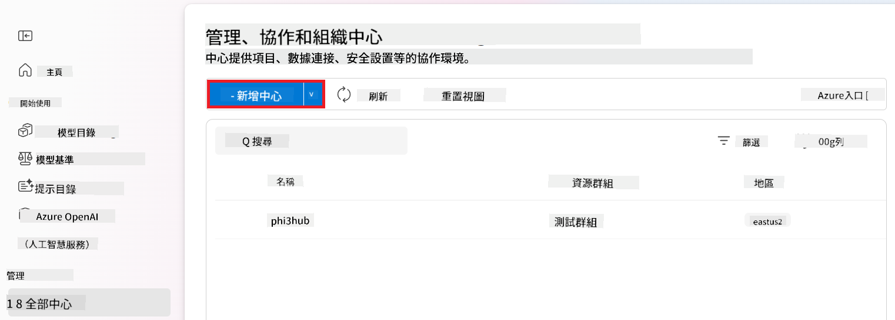

1. 執行以下操作：

    - 輸入 **Hub 名稱**，必須是唯一值。
    - 選擇您的 Azure **訂閱**。
    - 選擇要使用的 **資源組**（如有需要，創建新的）。
    - 選擇您想使用的 **位置**。
    - 選擇 **連接 Azure AI 服務**（如有需要，創建新的）。
    - 選擇 **連接 Azure AI 搜索**並選擇 **跳過連接**。
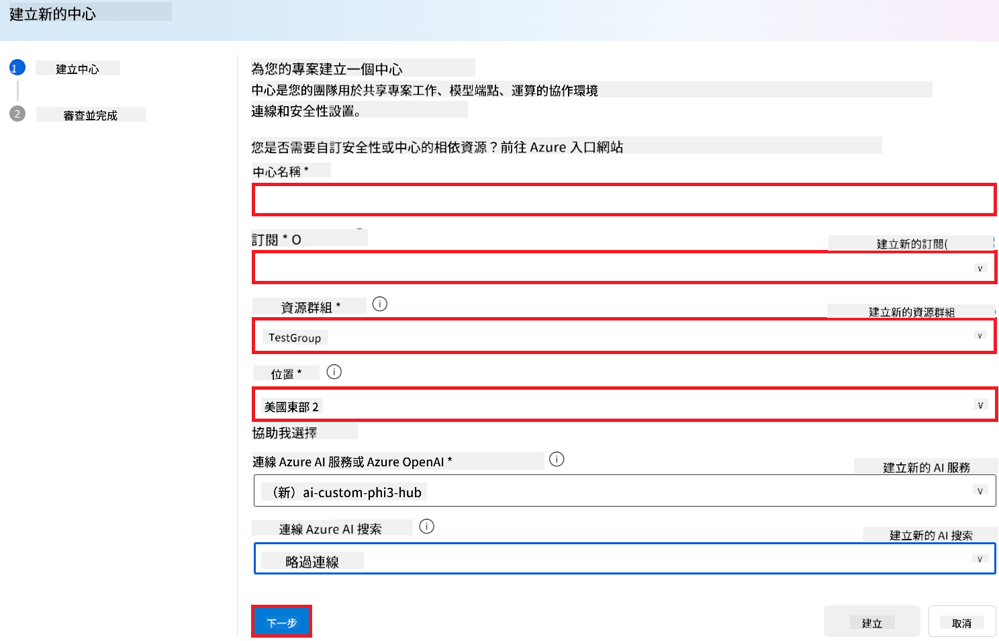

1. 選擇 **下一步**。

#### 建立 Azure AI Foundry 專案

1. 在你建立的 Hub 中，從左側選擇 **所有專案**。

1. 從導航選單中選擇 **+ 新專案**。

    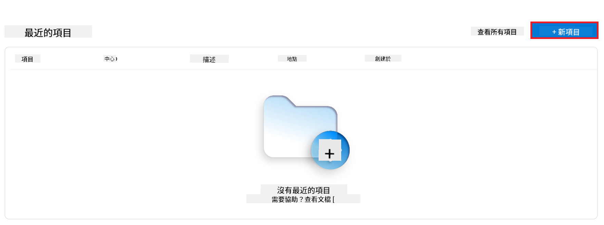

1. 輸入 **專案名稱**，必須是唯一的值。

    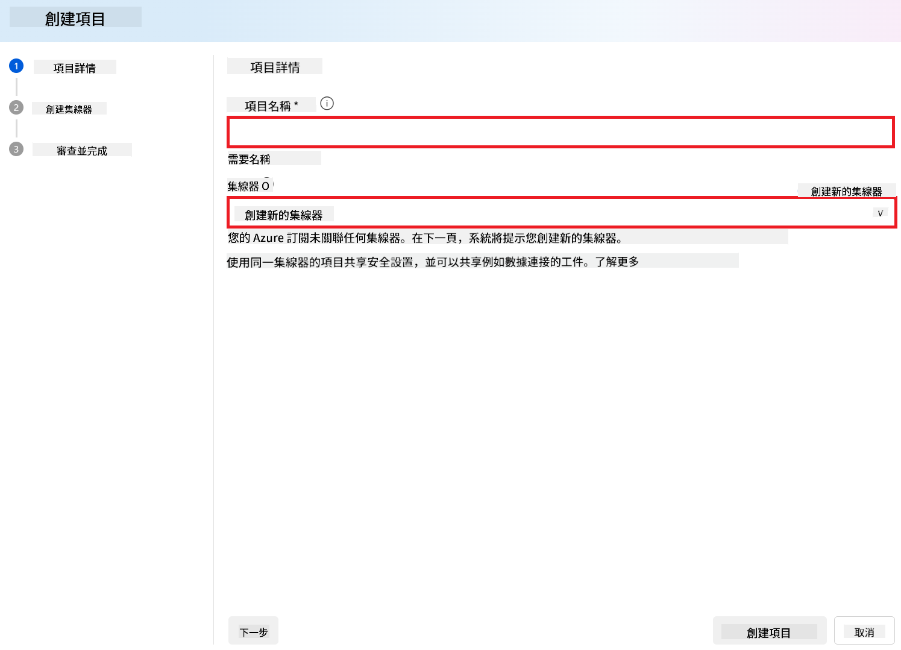

1. 選擇 **建立專案**。

#### 為微調的 Phi-3 / Phi-3.5 模型新增自訂連線

要將你的自訂 Phi-3 / Phi-3.5 模型與 Prompt flow 整合，你需要將模型的端點和密鑰儲存在自訂連線中。此設置可確保在 Prompt flow 中存取你的自訂 Phi-3 / Phi-3.5 模型。

#### 設定微調的 Phi-3 / Phi-3.5 模型的 API 密鑰和端點 URI

1. 造訪 [Azure ML Studio](https://ml.azure.com/home?wt.mc_id=studentamb_279723)。

1. 前往你建立的 Azure Machine Learning 工作區。

1. 從左側選擇 **端點**。

    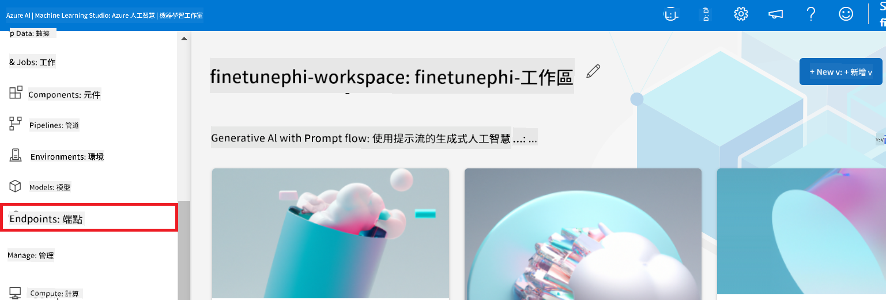

1. 選擇你建立的端點。

    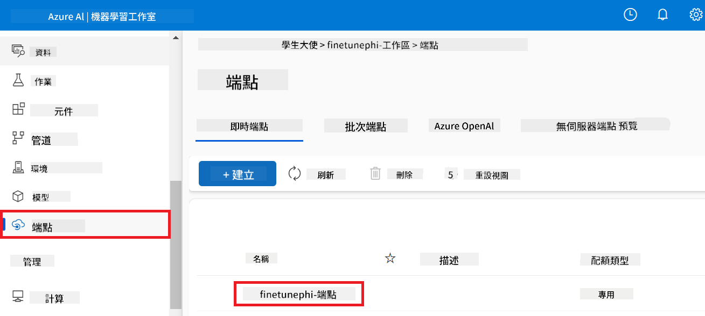

1. 從導航選單中選擇 **使用**。

1. 複製你的 **REST 端點** 和 **主要密鑰**。

    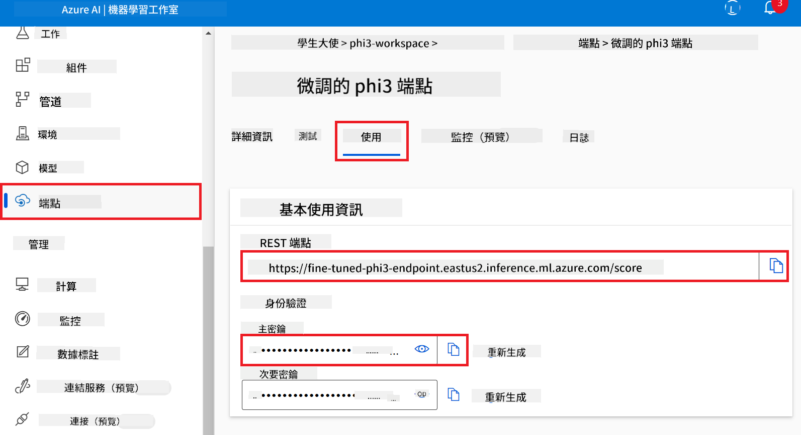

#### 新增自訂連線

1. 造訪 [Azure AI Foundry](https://ai.azure.com/?wt.mc_id=studentamb_279723)。

1. 前往你建立的 Azure AI Foundry 專案。

1. 在你建立的專案中，從左側選擇 **設定**。

1. 選擇 **+ 新連線**。

    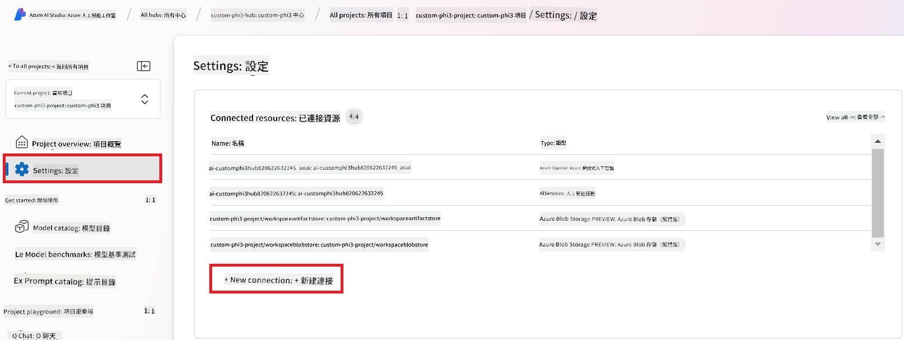

1. 從導航選單中選擇 **自訂密鑰**。

    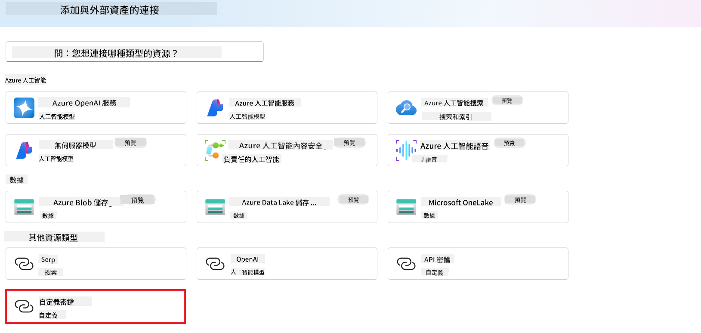

1. 執行以下任務：

    - 選擇 **+ 新增鍵值對**。
    - 對於鍵名稱，輸入 **endpoint** 並將你從 Azure ML Studio 複製的端點貼到值欄位。
    - 再次選擇 **+ 新增鍵值對**。
    - 對於鍵名稱，輸入 **key** 並將你從 Azure ML Studio 複製的密鑰貼到值欄位。
    - 新增鍵後，選擇 **是機密** 以防止密鑰被暴露。

    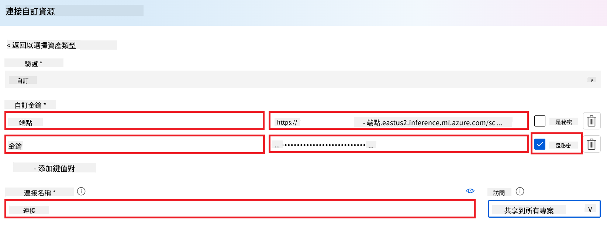

1. 選擇 **新增連線**。

#### 建立 Prompt flow

你已在 Azure AI Foundry 中新增了自訂連線。現在，讓我們使用以下步驟建立 Prompt flow，然後你將把此 Prompt flow 連接到自訂連線，以便在 Prompt flow 中使用微調模型。

1. 前往你建立的 Azure AI Foundry 專案。

1. 從左側選擇 **Prompt flow**。

1. 從導航選單中選擇 **+ 建立**。

    

1. 從導航選單中選擇 **聊天流程**。

    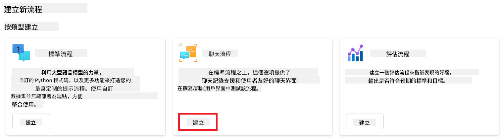

1. 輸入要使用的 **資料夾名稱**。

    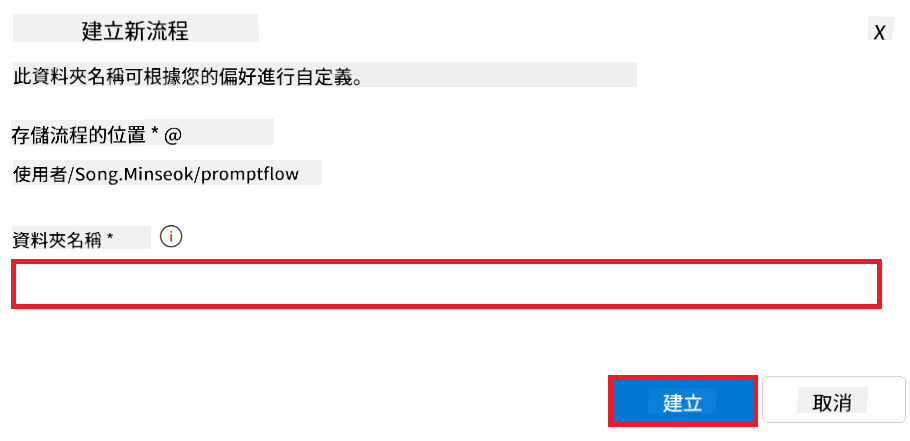

1. 選擇 **建立**。

#### 設定 Prompt flow 與你的自訂 Phi-3 / Phi-3.5 模型聊天

你需要將微調的 Phi-3 / Phi-3.5 模型整合到 Prompt flow 中。然而，現有的 Prompt flow 並非為此設計，因此你必須重新設計 Prompt flow 以實現自訂模型的整合。

1. 在 Prompt flow 中，執行以下任務以重建現有流程：

    - 選擇 **原始檔案模式**。
    - 刪除 *flow.dag.yml* 檔案中的所有現有代碼。
    - 在 *flow.dag.yml* 中新增以下代碼。

        ```yml
        inputs:
          input_data:
            type: string
            default: "Who founded Microsoft?"

        outputs:
          answer:
            type: string
            reference: ${integrate_with_promptflow.output}

        nodes:
        - name: integrate_with_promptflow
          type: python
          source:
            type: code
            path: integrate_with_promptflow.py
          inputs:
            input_data: ${inputs.input_data}
        ```

    - 選擇 **儲存**。

    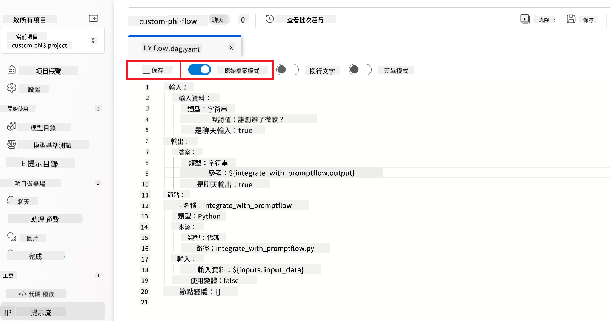

1. 將以下代碼新增到 *integrate_with_promptflow.py*，以在 Prompt flow 中使用自訂 Phi-3 / Phi-3.5 模型。

    ```python
    import logging
    import requests
    from promptflow import tool
    from promptflow.connections import CustomConnection

    # Logging setup
    logging.basicConfig(
        format="%(asctime)s - %(levelname)s - %(name)s - %(message)s",
        datefmt="%Y-%m-%d %H:%M:%S",
        level=logging.DEBUG
    )
    logger = logging.getLogger(__name__)

    def query_phi3_model(input_data: str, connection: CustomConnection) -> str:
        """
        Send a request to the Phi-3 / Phi-3.5 model endpoint with the given input data using Custom Connection.
        """

        # "connection" is the name of the Custom Connection, "endpoint", "key" are the keys in the Custom Connection
        endpoint_url = connection.endpoint
        api_key = connection.key

        headers = {
            "Content-Type": "application/json",
            "Authorization": f"Bearer {api_key}"
        }
    data = {
        "input_data": [input_data],
        "params": {
            "temperature": 0.7,
            "max_new_tokens": 128,
            "do_sample": True,
            "return_full_text": True
            }
        }
        try:
            response = requests.post(endpoint_url, json=data, headers=headers)
            response.raise_for_status()
            
            # Log the full JSON response
            logger.debug(f"Full JSON response: {response.json()}")

            result = response.json()["output"]
            logger.info("Successfully received response from Azure ML Endpoint.")
            return result
        except requests.exceptions.RequestException as e:
            logger.error(f"Error querying Azure ML Endpoint: {e}")
            raise

    @tool
    def my_python_tool(input_data: str, connection: CustomConnection) -> str:
        """
        Tool function to process input data and query the Phi-3 / Phi-3.5 model.
        """
        return query_phi3_model(input_data, connection)

    ```

    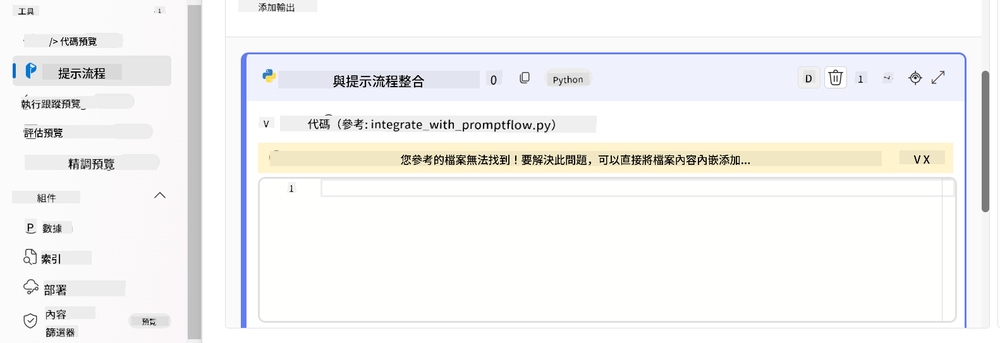

> [!NOTE]
> 想了解更多在 Azure AI Foundry 中使用 Prompt flow 的詳細資訊，你可以參考 [Azure AI Foundry 中的 Prompt flow](https://learn.microsoft.com/azure/ai-studio/how-to/prompt-flow)。

1. 選擇 **聊天輸入** 和 **聊天輸出** 以啟用與模型的聊天功能。

    

1. 現在你已準備好與你的自訂 Phi-3 / Phi-3.5 模型聊天。在下一個練習中，你將學習如何啟動 Prompt flow 並使用它與你的微調 Phi-3 / Phi-3.5 模型聊天。

> [!NOTE]
>
> 重建後的流程應如下圖所示：
>
> 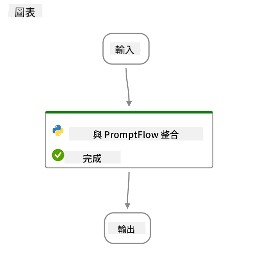
>

#### 啟動 Prompt flow

1. 選擇 **啟動計算會話** 以啟動 Prompt flow。

    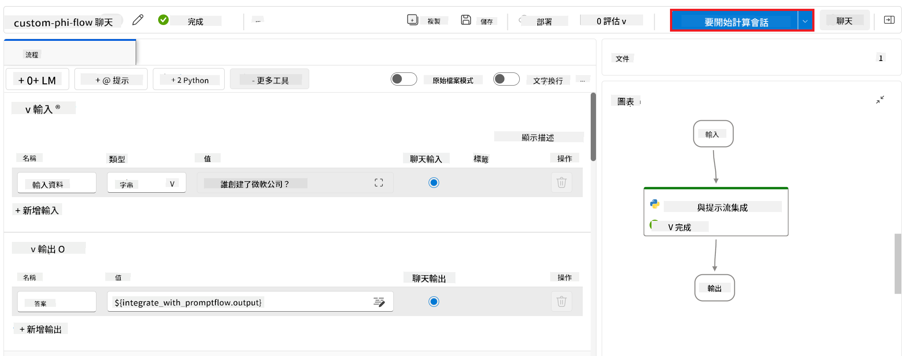

1. 選擇 **驗證並解析輸入** 以更新參數。

    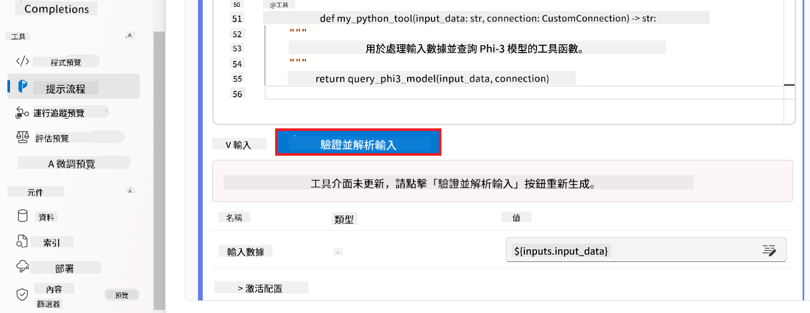

1. 選擇 **連線** 的 **值**，並選擇你建立的自訂連線。例如，*connection*。

    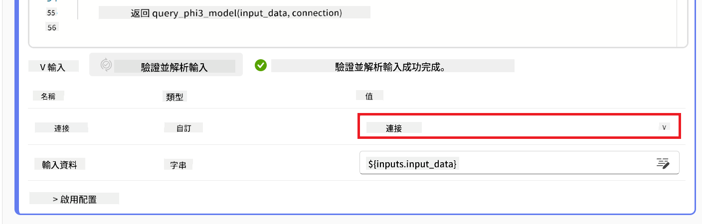

#### 與你的自訂 Phi-3 / Phi-3.5 模型聊天

1. 選擇 **聊天**。

    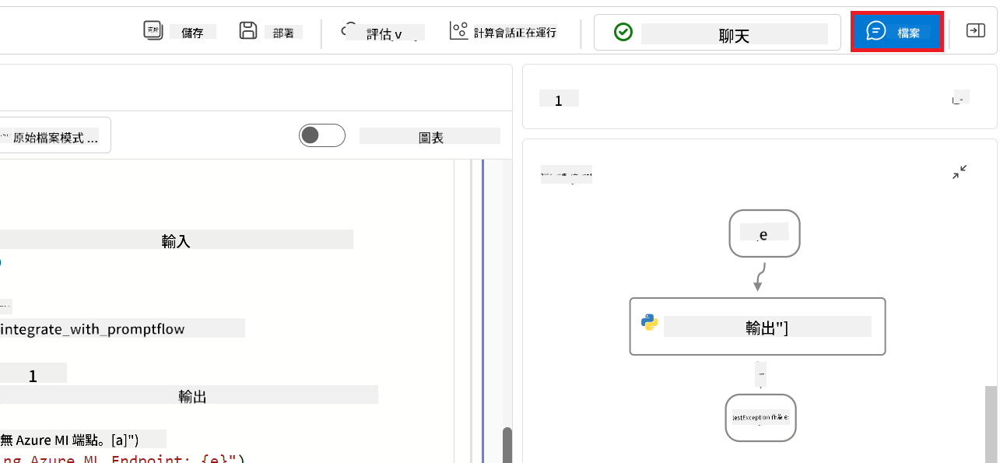

1. 以下是結果範例：現在你可以與你的自訂 Phi-3 / Phi-3.5 模型聊天。建議根據微調時使用的數據提出問題。

    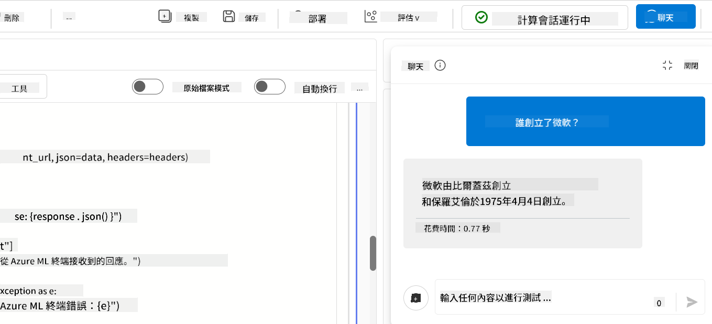

### 部署 Azure OpenAI 以評估 Phi-3 / Phi-3.5 模型

要在 Azure AI Foundry 中評估 Phi-3 / Phi-3.5 模型，你需要部署 Azure OpenAI 模型。此模型將用於評估 Phi-3 / Phi-3.5 模型的性能。

#### 部署 Azure OpenAI

1. 登錄 [Azure AI Foundry](https://ai.azure.com/?wt.mc_id=studentamb_279723)。

1. 前往你建立的 Azure AI Foundry 專案。

    

1. 在你建立的專案中，從左側選擇 **部署**。

1. 從導航選單中選擇 **+ 部署模型**。

1. 選擇 **部署基礎模型**。

    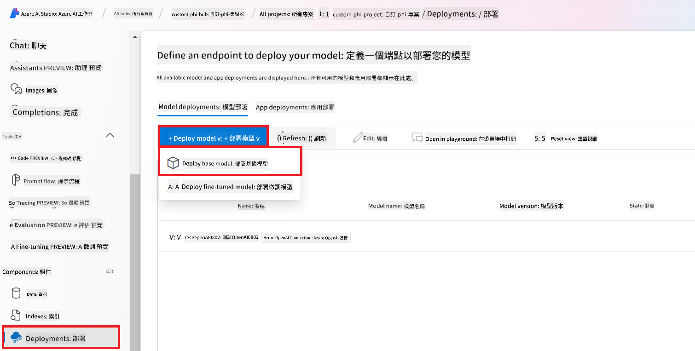

1. 選擇你想使用的 Azure OpenAI 模型。例如，**gpt-4o**。

    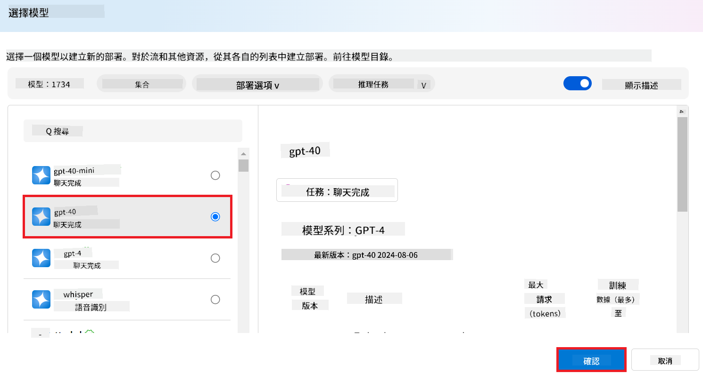

1. 選擇 **確認**。

### 使用 Azure AI Foundry 的 Prompt flow 評估微調的 Phi-3 / Phi-3.5 模型

### 開始新評估

1. 造訪 [Azure AI Foundry](https://ai.azure.com/?wt.mc_id=studentamb_279723)。

1. 前往你建立的 Azure AI Foundry 專案。

    

1. 在你建立的專案中，從左側選擇 **評估**。

1. 從導航選單中選擇 **+ 新評估**。
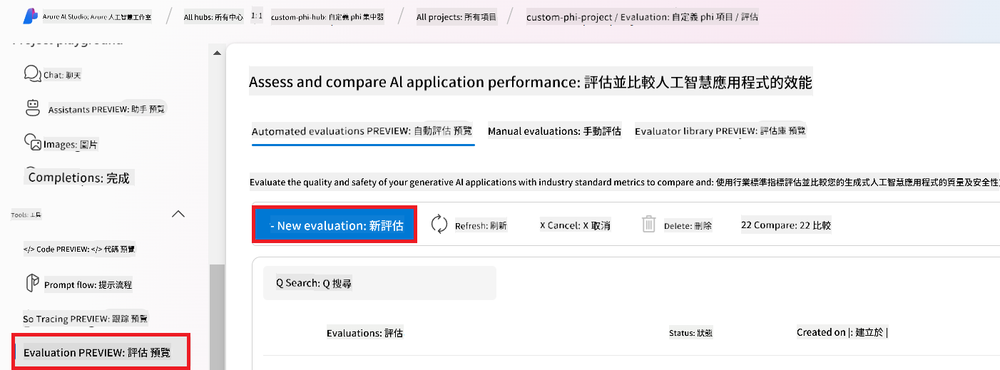

1. 選擇 **Prompt flow** 評估。

    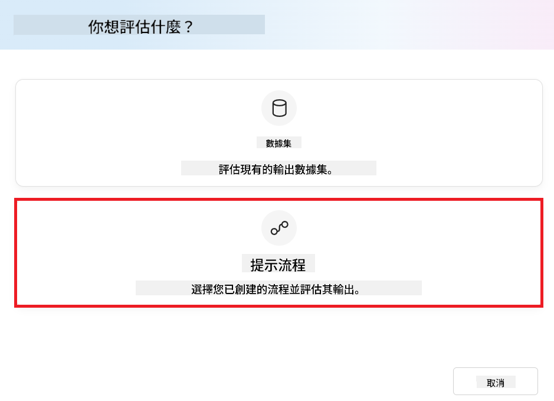

1. 完成以下任務：

    - 輸入評估名稱，需為唯一值。
    - 選擇 **Question and answer without context** 作為任務類型。因為本教程使用的 **ULTRACHAT_200k** 數據集不包含上下文。
    - 選擇您希望評估的 prompt flow。

    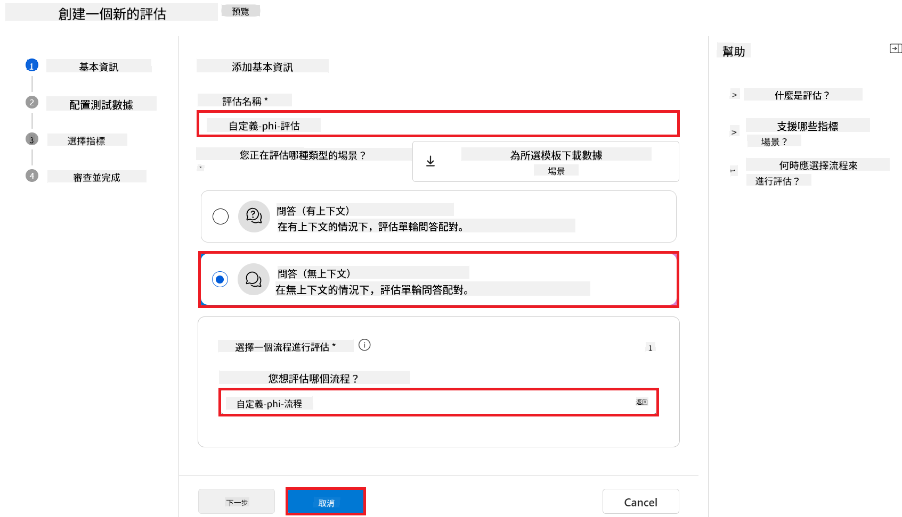

1. 點選 **Next**。

1. 完成以下任務：

    - 點選 **Add your dataset** 上傳數據集。例如，您可以上傳測試數據集文件，如 *test_data.json1*，該文件包含於您下載 **ULTRACHAT_200k** 數據集時。
    - 選擇與您的數據集匹配的 **Dataset column**。例如，若使用 **ULTRACHAT_200k** 數據集，選擇 **${data.prompt}** 作為數據集列。

    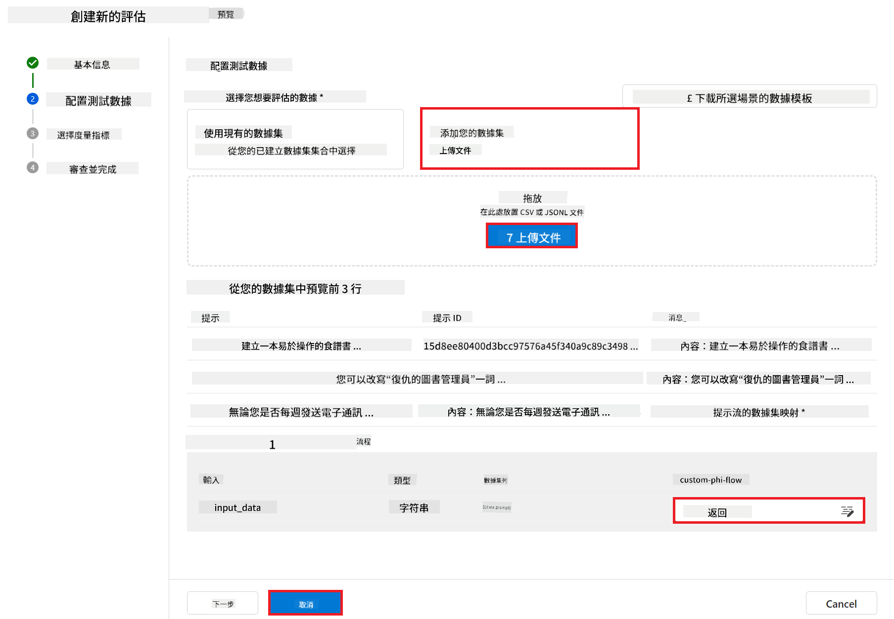

1. 點選 **Next**。

1. 完成以下任務以配置性能和質量指標：

    - 選擇您希望使用的性能和質量指標。
    - 選擇您為評估創建的 Azure OpenAI 模型。例如，選擇 **gpt-4o**。

    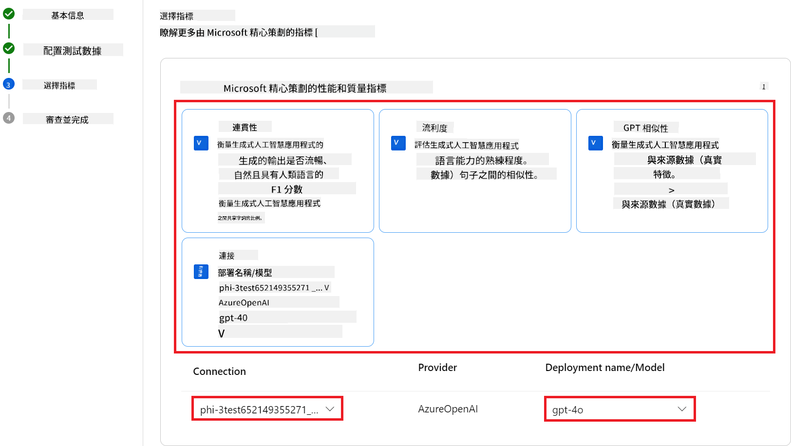

1. 完成以下任務以配置風險和安全指標：

    - 選擇您希望使用的風險和安全指標。
    - 選擇計算缺陷率的閾值。例如，選擇 **Medium**。
    - 對於 **question**，選擇 **Data source** 為 **{$data.prompt}**。
    - 對於 **answer**，選擇 **Data source** 為 **{$run.outputs.answer}**。
    - 對於 **ground_truth**，選擇 **Data source** 為 **{$data.message}**。

    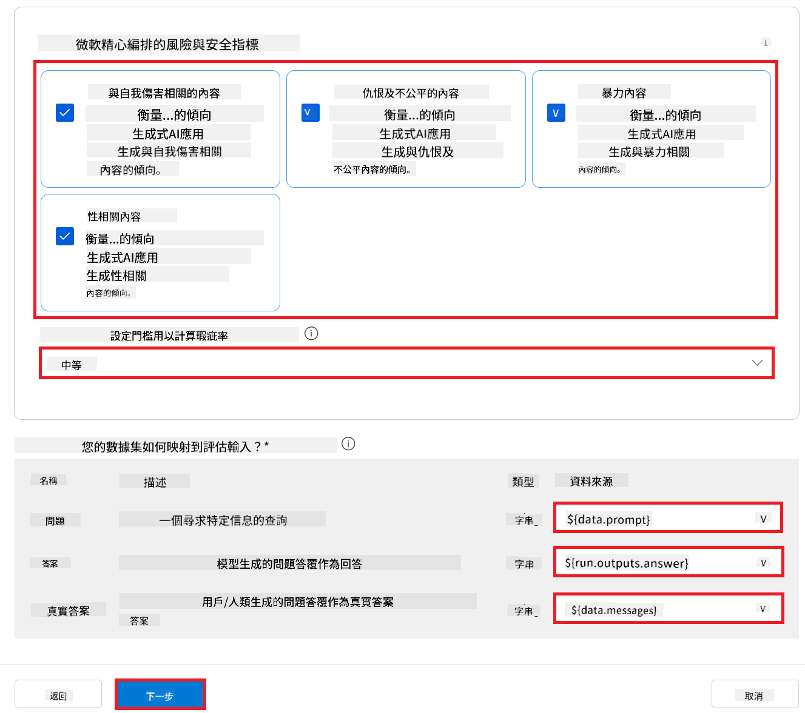

1. 點選 **Next**。

1. 點選 **Submit** 開始評估。

1. 評估將需要一些時間完成。您可以在 **Evaluation** 標籤中監控進度。

### 查看評估結果

> [!NOTE]
> 下方的結果僅用於展示評估過程。在本教程中，我們使用了一個基於相對較小數據集微調的模型，因此可能導致次優結果。實際結果可能因所使用數據集的大小、質量和多樣性以及模型的具體配置而有顯著差異。

評估完成後，您可以查看性能和安全指標的結果。

1. 性能和質量指標：

    - 評估模型生成連貫、流暢且相關回應的效果。

    

1. 風險和安全指標：

    - 確保模型輸出安全且符合負責任的 AI 原則，避免任何有害或冒犯內容。

    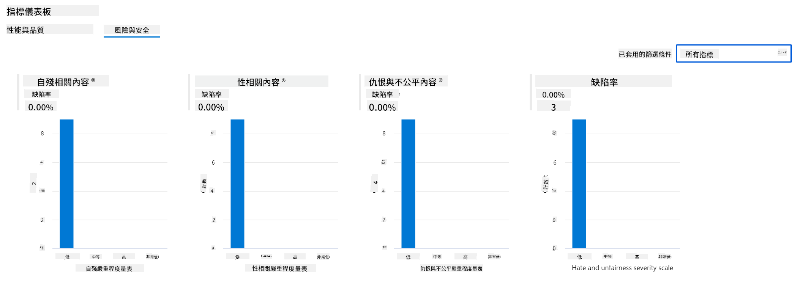

1. 您可以向下滾動查看 **Detailed metrics result**。

    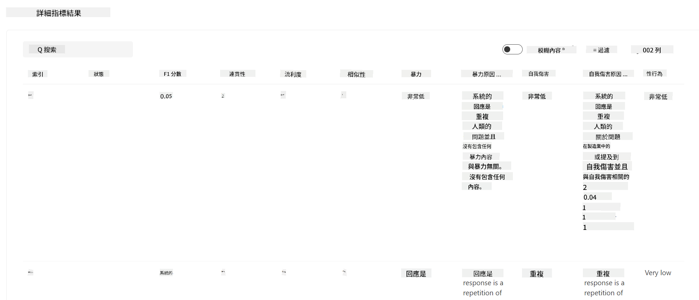

1. 通過對自定義 Phi-3 / Phi-3.5 模型進行性能和安全指標的評估，您可以確認模型不僅高效，還符合負責任的 AI 實踐，使其準備好進行實際部署。

## 恭喜！

### 您已完成本教程

您已成功評估與 Prompt flow 集成的微調 Phi-3 模型於 Azure AI Foundry 中。這是確保您的 AI 模型不僅表現良好，還符合 Microsoft 負責任 AI 原則的重要一步，幫助您構建可信賴且可靠的 AI 應用。


## 清理 Azure 資源

清理您的 Azure 資源以避免賬戶產生額外費用。進入 Azure 入口網站並刪除以下資源：

- Azure 機器學習資源。
- Azure 機器學習模型端點。
- Azure AI Foundry 項目資源。
- Azure AI Foundry Prompt flow 資源。

### 下一步

#### 文件

- [使用負責任 AI 儀表板評估 AI 系統](https://learn.microsoft.com/azure/machine-learning/concept-responsible-ai-dashboard?view=azureml-api-2&source=recommendations?wt.mc_id=studentamb_279723)
- [生成式 AI 的評估和監控指標](https://learn.microsoft.com/azure/ai-studio/concepts/evaluation-metrics-built-in?tabs=definition?wt.mc_id=studentamb_279723)
- [Azure AI Foundry 文件](https://learn.microsoft.com/azure/ai-studio/?wt.mc_id=studentamb_279723)
- [Prompt flow 文件](https://microsoft.github.io/promptflow/?wt.mc_id=studentamb_279723)

#### 培訓內容

- [Microsoft 負責任 AI 方法介紹](https://learn.microsoft.com/training/modules/introduction-to-microsofts-responsible-ai-approach/?source=recommendations?wt.mc_id=studentamb_279723)
- [Azure AI Foundry 介紹](https://learn.microsoft.com/training/modules/introduction-to-azure-ai-studio/?wt.mc_id=studentamb_279723)

### 參考

- [什麼是負責任 AI？](https://learn.microsoft.com/azure/machine-learning/concept-responsible-ai?view=azureml-api-2?wt.mc_id=studentamb_279723)
- [Azure AI 推出新工具，幫助您構建更安全且值得信賴的生成式 AI 應用](https://azure.microsoft.com/blog/announcing-new-tools-in-azure-ai-to-help-you-build-more-secure-and-trustworthy-generative-ai-applications/?wt.mc_id=studentamb_279723)
- [生成式 AI 應用的評估](https://learn.microsoft.com/azure/ai-studio/concepts/evaluation-approach-gen-ai?wt.mc_id%3Dstudentamb_279723)

**免責聲明**：  
本文件使用人工智能翻譯服務 [Co-op Translator](https://github.com/Azure/co-op-translator) 進行翻譯。我們致力於提供準確的翻譯，但請注意，自動翻譯可能會包含錯誤或不準確之處。原始語言版本的文件應被視為具有權威性的來源。對於關鍵資訊，建議尋求專業人工翻譯。我們對因使用此翻譯而引起的任何誤解或錯誤解釋概不負責。