<!--
CO_OP_TRANSLATOR_METADATA:
{
  "original_hash": "455be2b7b9c3390d367d528f8fab2aa0",
  "translation_date": "2025-05-08T05:37:14+00:00",
  "source_file": "md/02.Application/01.TextAndChat/Phi3/E2E_Phi-3-FineTuning_PromptFlow_Integration.md",
  "language_code": "hk"
}
-->
# 微調及整合自訂 Phi-3 模型至 Prompt flow

此端對端（E2E）範例根據 Microsoft Tech Community 的指南「[Fine-Tune and Integrate Custom Phi-3 Models with Prompt Flow: Step-by-Step Guide](https://techcommunity.microsoft.com/t5/educator-developer-blog/fine-tune-and-integrate-custom-phi-3-models-with-prompt-flow/ba-p/4178612?WT.mc_id=aiml-137032-kinfeylo)」製作，介紹如何微調、部署及整合自訂 Phi-3 模型至 Prompt flow。

## 概覽

在此 E2E 範例中，你將學習如何微調 Phi-3 模型並將它整合到 Prompt flow。透過 Azure Machine Learning 及 Prompt flow，建立一套部署及使用自訂 AI 模型的工作流程。此 E2E 範例分為三個情境：

**情境 1：設定 Azure 資源及準備微調**

**情境 2：微調 Phi-3 模型並於 Azure Machine Learning Studio 部署**

**情境 3：整合至 Prompt flow 並與自訂模型對話**

以下為此 E2E 範例的概覽。

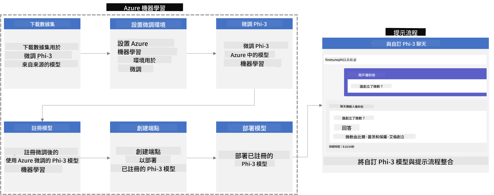

### 目錄

1. **[情境 1：設定 Azure 資源及準備微調](../../../../../../md/02.Application/01.TextAndChat/Phi3)**
    - [建立 Azure Machine Learning 工作區](../../../../../../md/02.Application/01.TextAndChat/Phi3)
    - [申請 Azure 訂閱的 GPU 配額](../../../../../../md/02.Application/01.TextAndChat/Phi3)
    - [新增角色指派](../../../../../../md/02.Application/01.TextAndChat/Phi3)
    - [設定專案](../../../../../../md/02.Application/01.TextAndChat/Phi3)
    - [準備微調用資料集](../../../../../../md/02.Application/01.TextAndChat/Phi3)

1. **[情境 2：微調 Phi-3 模型並於 Azure Machine Learning Studio 部署](../../../../../../md/02.Application/01.TextAndChat/Phi3)**
    - [設定 Azure CLI](../../../../../../md/02.Application/01.TextAndChat/Phi3)
    - [微調 Phi-3 模型](../../../../../../md/02.Application/01.TextAndChat/Phi3)
    - [部署微調後模型](../../../../../../md/02.Application/01.TextAndChat/Phi3)

1. **[情境 3：整合至 Prompt flow 並與自訂模型對話](../../../../../../md/02.Application/01.TextAndChat/Phi3)**
    - [將自訂 Phi-3 模型整合至 Prompt flow](../../../../../../md/02.Application/01.TextAndChat/Phi3)
    - [與自訂模型對話](../../../../../../md/02.Application/01.TextAndChat/Phi3)

## 情境 1：設定 Azure 資源及準備微調

### 建立 Azure Machine Learning 工作區

1. 在入口網站頁面頂部的 **搜尋列** 輸入 *azure machine learning*，並從結果中選擇 **Azure Machine Learning**。

    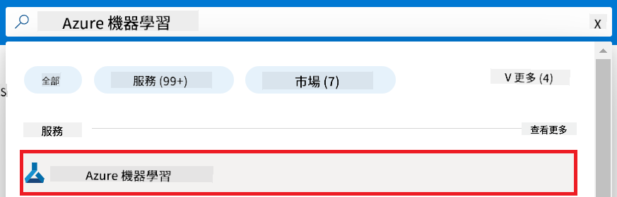

1. 從導覽選單選擇 **+ 建立**。

1. 從導覽選單選擇 **新工作區**。

    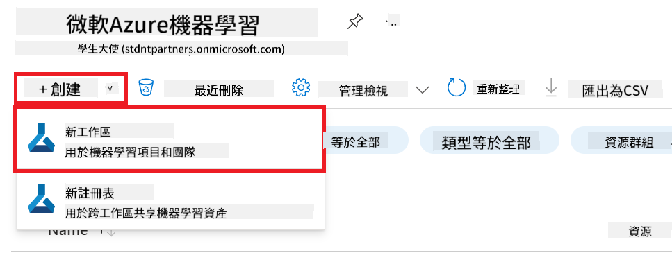

1. 執行以下操作：

    - 選擇你的 Azure **訂閱**。
    - 選擇要使用的 **資源群組**（如需要可建立新群組）。
    - 輸入 **工作區名稱**，必須是唯一的。
    - 選擇你想使用的 **區域**。
    - 選擇要使用的 **儲存帳戶**（如需要可建立新帳戶）。
    - 選擇要使用的 **Key vault**（如需要可建立新金鑰保管庫）。
    - 選擇要使用的 **Application insights**（如需要可建立新的）。
    - 選擇要使用的 **容器註冊表**（如需要可建立新的）。

    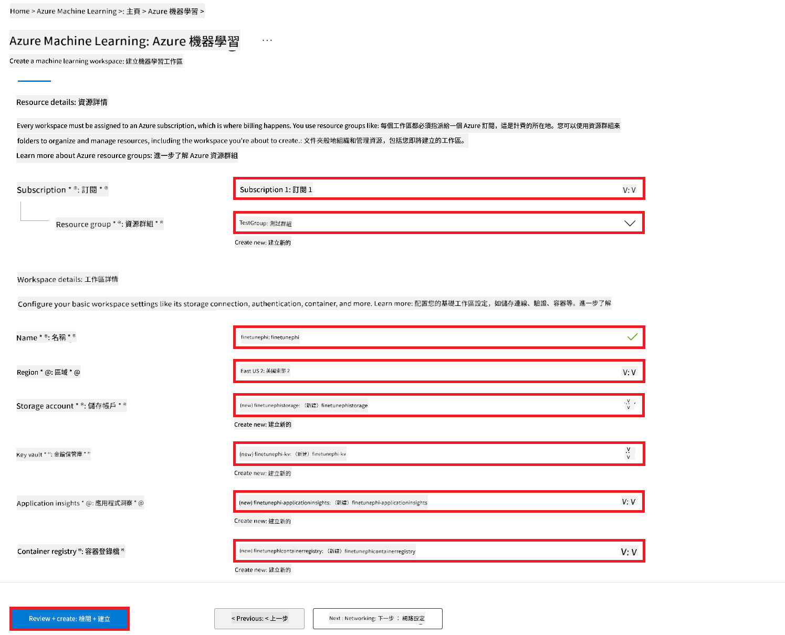

1. 選擇 **檢閱 + 建立**。

1. 選擇 **建立**。

### 申請 Azure 訂閱的 GPU 配額

在此 E2E 範例中，你將使用 *Standard_NC24ads_A100_v4 GPU* 來進行微調，該 GPU 需要申請配額；而部署時使用的 *Standard_E4s_v3* CPU 則不需申請配額。

> [!NOTE]
>
> 只有按用量付費訂閱（標準訂閱類型）才有資格申請 GPU 配額；優惠訂閱目前不支援。
>
> 若使用優惠訂閱（例如 Visual Studio Enterprise 訂閱）或想快速測試微調與部署流程，本教學也提供使用 CPU 及最小資料集微調的指引。但需注意，使用 GPU 配合較大資料集微調的效果會明顯較佳。

1. 前往 [Azure ML Studio](https://ml.azure.com/home?wt.mc_id=studentamb_279723)。

1. 執行以下步驟申請 *Standard NCADSA100v4 Family* 配額：

    - 從左側分頁選擇 **配額**。
    - 選擇要使用的 **虛擬機器系列**，例如選擇包含 *Standard_NC24ads_A100_v4* GPU 的 **Standard NCADSA100v4 Family Cluster Dedicated vCPUs**。
    - 從導覽選單選擇 **申請配額**。

        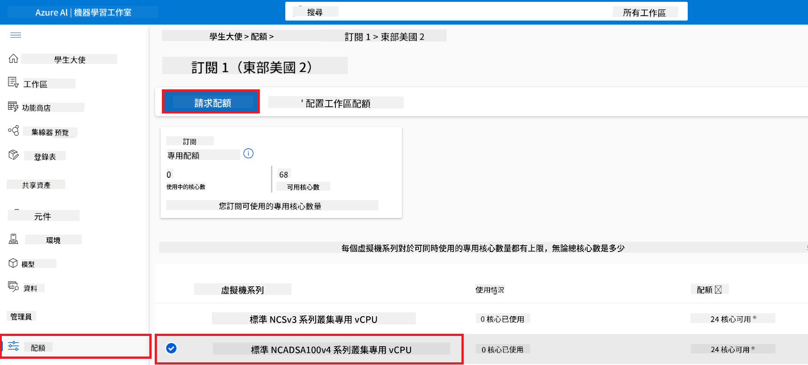

    - 在申請配額頁面輸入你想使用的 **新核心限制**，例如 24。
    - 選擇 **提交** 申請 GPU 配額。

> [!NOTE]
> 你可參考 [Sizes for Virtual Machines in Azure](https://learn.microsoft.com/azure/virtual-machines/sizes/overview?tabs=breakdownseries%2Cgeneralsizelist%2Ccomputesizelist%2Cmemorysizelist%2Cstoragesizelist%2Cgpusizelist%2Cfpgasizelist%2Chpcsizelist) 文件，選擇適合需求的 GPU 或 CPU。

### 新增角色指派

要微調並部署模型，必須先建立 User Assigned Managed Identity (UAI)，並指派適當權限。此 UAI 將用於部署時的身份驗證。

#### 建立 User Assigned Managed Identity (UAI)

1. 在入口網站頂部的 **搜尋列** 輸入 *managed identities*，並從結果中選擇 **Managed Identities**。

    

1. 選擇 **+ 建立**。

    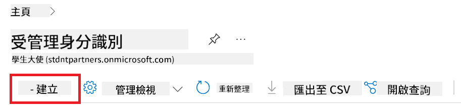

1. 執行以下操作：

    - 選擇你的 Azure **訂閱**。
    - 選擇要使用的 **資源群組**（如需要可建立新的）。
    - 選擇你想使用的 **區域**。
    - 輸入 **名稱**，必須是唯一的。

1. 選擇 **檢閱 + 建立**。

1. 選擇 **+ 建立**。

#### 為 Managed Identity 新增 Contributor 角色指派

1. 前往你剛建立的 Managed Identity 資源。

1. 從左側分頁選擇 **Azure 角色指派**。

1. 從導覽選單選擇 **+ 新增角色指派**。

1. 在新增角色指派頁面，執行以下操作：

    - 將 **範圍**設為 **資源群組**。
    - 選擇你的 Azure **訂閱**。
    - 選擇要使用的 **資源群組**。
    - 將 **角色**設為 **Contributor**。

    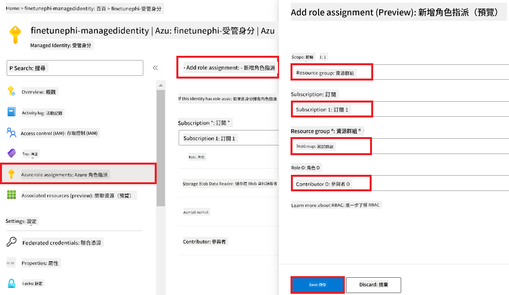

1. 選擇 **儲存**。

#### 為 Managed Identity 新增 Storage Blob Data Reader 角色指派

1. 在入口網站頂部的 **搜尋列** 輸入 *storage accounts*，並從結果中選擇 **Storage accounts**。

    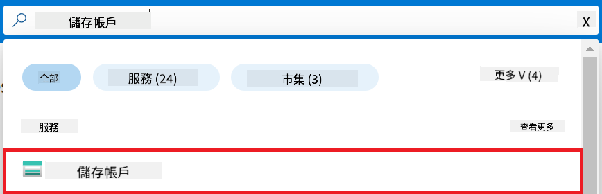

1. 選擇與你建立的 Azure Machine Learning 工作區相關聯的儲存帳戶，例如 *finetunephistorage*。

1. 執行以下步驟前往新增角色指派頁面：

    - 前往你建立的 Azure 儲存帳戶。
    - 從左側分頁選擇 **存取控制 (IAM)**。
    - 從導覽選單選擇 **+ 新增**。
    - 選擇 **新增角色指派**。

    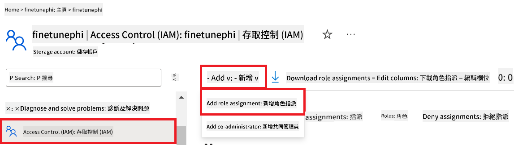

1. 在新增角色指派頁面，執行以下操作：

    - 在角色頁面搜尋列輸入 *Storage Blob Data Reader*，並選擇 **Storage Blob Data Reader**。
    - 點選 **下一步**。
    - 在成員頁面，將 **指派存取權給** 設為 **Managed identity**。
    - 點選 **+ 選擇成員**。
    - 在選擇 Managed identities 頁面，選擇你的 Azure **訂閱**。
    - 選擇要指派的 **Managed identity**。
    - 選擇你剛建立的 Managed Identity，例如 *finetunephi-managedidentity*。
    - 點選 **選擇**。

    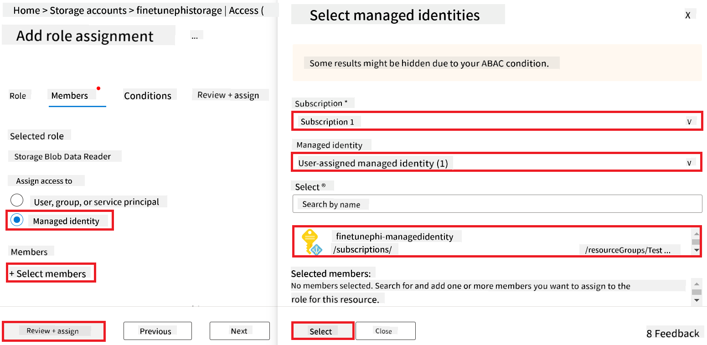

1. 選擇 **檢閱 + 指派**。

#### 為 Managed Identity 新增 AcrPull 角色指派

1. 在入口網站頂部的 **搜尋列** 輸入 *container registries*，並從結果中選擇 **Container registries**。

    

1. 選擇與 Azure Machine Learning 工作區相關聯的容器註冊表，例如 *finetunephicontainerregistries*。

1. 執行以下步驟前往新增角色指派頁面：

    - 從左側分頁選擇 **存取控制 (IAM)**。
    - 從導覽選單選擇 **+ 新增**。
    - 選擇 **新增角色指派**。

1. 在新增角色指派頁面，執行以下操作：

    - 在角色頁面搜尋列輸入 *AcrPull*，並選擇 **AcrPull**。
    - 點選 **下一步**。
    - 在成員頁面，將 **指派存取權給** 設為 **Managed identity**。
    - 點選 **+ 選擇成員**。
    - 在選擇 Managed identities 頁面，選擇你的 Azure **訂閱**。
    - 選擇要指派的 **Managed identity**。
    - 選擇你剛建立的 Managed Identity，例如 *finetunephi-managedidentity*。
    - 點選 **選擇**。
    - 選擇 **檢閱 + 指派**。

### 設定專案

接著，你將建立一個資料夾作為工作目錄，並設定虛擬環境，開發一個與使用者互動且利用 Azure Cosmos DB 中的聊天記錄來回應的程式。

#### 建立工作資料夾

1. 開啟終端機視窗，輸入以下指令，在預設路徑下建立名為 *finetune-phi* 的資料夾。

    ```console
    mkdir finetune-phi
    ```

1. 在終端機中輸入以下指令，切換到你剛建立的 *finetune-phi* 資料夾。

    ```console
    cd finetune-phi
    ```

#### 建立虛擬環境

1. 在終端機中輸入以下指令，建立名為 *.venv* 的虛擬環境。

    ```console
    python -m venv .venv
    ```

1. 在終端機中輸入以下指令，啟動虛擬環境。

    ```console
    .venv\Scripts\activate.bat
    ```

> [!NOTE]
>
> 若成功啟動，你會看到命令提示字元前面出現 *(.venv)*。

#### 安裝所需套件

1. 在終端機中輸入以下指令，安裝所需套件。

    ```console
    pip install datasets==2.19.1
    pip install transformers==4.41.1
    pip install azure-ai-ml==1.16.0
    pip install torch==2.3.1
    pip install trl==0.9.4
    pip install promptflow==1.12.0
    ```

#### 建立專案檔案

在此練習中，你將建立專案所需的主要檔案，包括下載資料集的腳本、設定 Azure Machine Learning 環境、微調 Phi-3 模型、部署微調後模型等。同時會建立 *conda.yml* 來設定微調環境。

本練習包含：

- 建立 *download_dataset.py* 用來下載資料集。
- 建立 *setup_ml.py* 用來設定 Azure Machine Learning 環境。
- 在 *finetuning_dir* 資料夾建立 *fine_tune.py*，用資料集微調 Phi-3 模型。
- 建立 *conda.yml* 設定微調環境。
- 建立 *deploy_model.py* 部署微調後模型。
- 建立 *integrate_with_promptflow.py*，將微調模型整合並透過 Prompt flow 執行。
- 建立 *flow.dag.yml*，設定 Prompt flow 的工作流程結構。
- 建立 *config.py* 輸入 Azure 相關資訊。

> [!NOTE]
>
> 完整資料夾結構：
>
> ```text
> └── YourUserName
> .    └── finetune-phi
> .        ├── finetuning_dir
> .        │      └── fine_tune.py
> .        ├── conda.yml
> .        ├── config.py
> .        ├── deploy_model.py
> .        ├── download_dataset.py
> .        ├── flow.dag.yml
> .        ├── integrate_with_promptflow.py
> .        └── setup_ml.py
> ```

1. 開啟 **Visual Studio Code**。

1. 從選單列選擇 **檔案**。

1. 選擇 **開啟資料夾**。

1. 選擇你剛建立的 *finetune-phi* 資料夾，路徑類似 *C:\Users\yourUserName\finetune-phi*。

    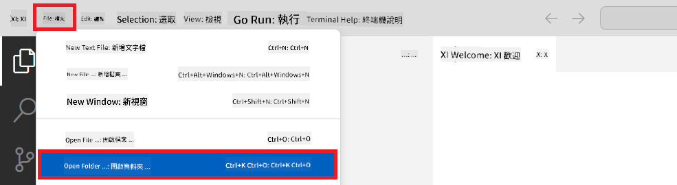

1. 在 Visual Studio Code 左側窗格中，右鍵點擊並選擇 **新增檔案**，建立名為 *download_dataset.py* 的檔案。

1. 在左側窗格中，右鍵點擊並選擇 **新增檔案**，建立名為 *setup_ml.py* 的檔案。

1. 在左側窗格中，右鍵點擊並選擇 **新增檔案**，建立名為 *deploy_model.py* 的檔案。

    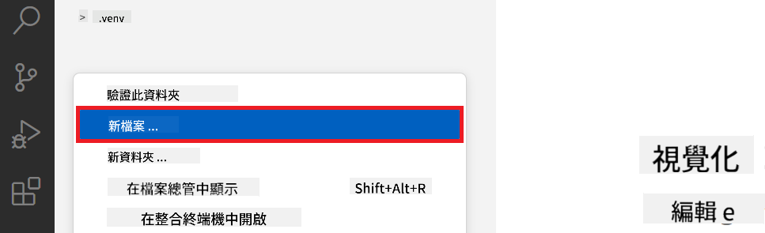

1. 在左側窗格中，右鍵點擊並選擇 **新增資料夾**，建立名為 *finetuning_dir* 的資料夾。

1. 在 *finetuning_dir* 資料夾中，建立新檔案 *fine_tune.py*。

#### 建立並設定 *conda.yml* 檔案

1. 在左側窗格中，右鍵點擊並選擇 **新增檔案**，建立 *conda.yml*。

1. 將以下內容加入 *conda.yml*，用以設定 Phi-3 模型微調環境。

    ```yml
    name: phi-3-training-env
    channels:
      - defaults
      - conda-forge
    dependencies:
      - python=3.10
      - pip
      - numpy<2.0
      - pip:
          - torch==2.4.0
          - torchvision==0.19.0
          - trl==0.8.6
          - transformers==4.41
          - datasets==2.21.0
          - azureml-core==1.57.0
          - azure-storage-blob==12.19.0
          - azure-ai-ml==1.16
          - azure-identity==1.17.1
          - accelerate==0.33.0
          - mlflow==2.15.1
          - azureml-mlflow==1.57.0
    ```

#### 建立並設定 *config.py* 檔案

1. 在左側窗格中，右鍵點擊並選擇 **新增檔案**，建立 *config.py*。

1. 將以下內容加入 *config.py*，輸入你的 Azure 資訊。

    ```python
    # Azure settings
    AZURE_SUBSCRIPTION_ID = "your_subscription_id"
    AZURE_RESOURCE_GROUP_NAME = "your_resource_group_name" # "TestGroup"

    # Azure Machine Learning settings
    AZURE_ML_WORKSPACE_NAME = "your_workspace_name" # "finetunephi-workspace"

    # Azure Managed Identity settings
    AZURE_MANAGED_IDENTITY_CLIENT_ID = "your_azure_managed_identity_client_id"
    AZURE_MANAGED_IDENTITY_NAME = "your_azure_managed_identity_name" # "finetunephi-mangedidentity"
    AZURE_MANAGED_IDENTITY_RESOURCE_ID = f"/subscriptions/{AZURE_SUBSCRIPTION_ID}/resourceGroups/{AZURE_RESOURCE_GROUP_NAME}/providers/Microsoft.ManagedIdentity/userAssignedIdentities/{AZURE_MANAGED_IDENTITY_NAME}"

    # Dataset file paths
    TRAIN_DATA_PATH = "data/train_data.jsonl"
    TEST_DATA_PATH = "data/test_data.jsonl"

    # Fine-tuned model settings
    AZURE_MODEL_NAME = "your_fine_tuned_model_name" # "finetune-phi-model"
    AZURE_ENDPOINT_NAME = "your_fine_tuned_model_endpoint_name" # "finetune-phi-endpoint"
    AZURE_DEPLOYMENT_NAME = "your_fine_tuned_model_deployment_name" # "finetune-phi-deployment"

    AZURE_ML_API_KEY = "your_fine_tuned_model_api_key"
    AZURE_ML_ENDPOINT = "your_fine_tuned_model_endpoint_uri" # "https://{your-endpoint-name}.{your-region}.inference.ml.azure.com/score"
    ```

#### 新增 Azure 環境變數

1. 執行以下操作以新增 Azure 訂閱 ID：

    - 在入口網站頂部的 **搜尋列** 輸入 *subscriptions*，並從結果中選擇 **Subscriptions**。
    - 選擇你目前使用的 Azure 訂閱。
    - 複製並貼上你的訂閱 ID 至 *config.py* 檔案中。
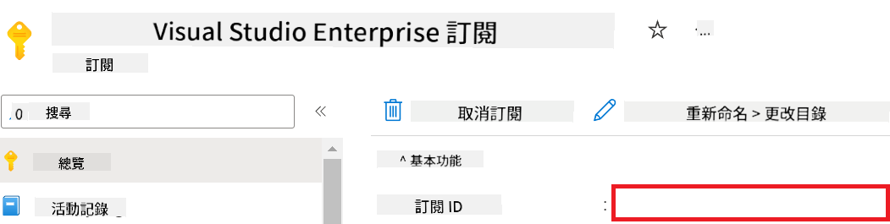

1. 跟住以下步驟加入 Azure Workspace 名稱：

    - 去到你建立嘅 Azure Machine Learning 資源。
    - 複製同貼上你嘅帳戶名稱入 *config.py* 文件。

    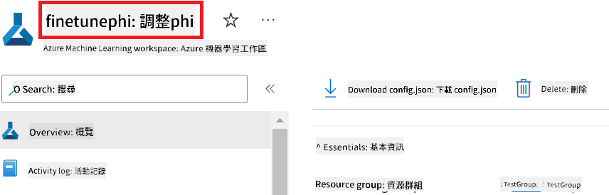

1. 跟住以下步驟加入 Azure Resource Group 名稱：

    - 去到你建立嘅 Azure Machine Learning 資源。
    - 複製同貼上你嘅 Azure Resource Group 名稱入 *config.py* 文件。

    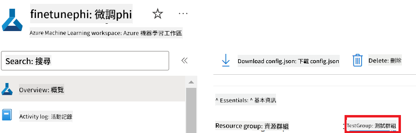

2. 跟住以下步驟加入 Azure Managed Identity 名稱：

    - 去到你建立嘅 Managed Identities 資源。
    - 複製同貼上你嘅 Azure Managed Identity 名稱入 *config.py* 文件。

    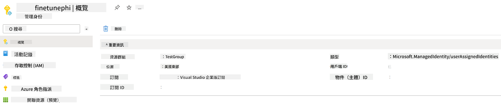

### 準備用作微調嘅數據集

今次練習，你會執行 *download_dataset.py* 文件，下載 *ULTRACHAT_200k* 數據集到你嘅本地環境。之後會用呢個數據集喺 Azure Machine Learning 入面微調 Phi-3 模型。

#### 用 *download_dataset.py* 下載你嘅數據集

1. 喺 Visual Studio Code 打開 *download_dataset.py* 文件。

1. 喺 *download_dataset.py* 入面加入以下程式碼。

    ```python
    import json
    import os
    from datasets import load_dataset
    from config import (
        TRAIN_DATA_PATH,
        TEST_DATA_PATH)

    def load_and_split_dataset(dataset_name, config_name, split_ratio):
        """
        Load and split a dataset.
        """
        # Load the dataset with the specified name, configuration, and split ratio
        dataset = load_dataset(dataset_name, config_name, split=split_ratio)
        print(f"Original dataset size: {len(dataset)}")
        
        # Split the dataset into train and test sets (80% train, 20% test)
        split_dataset = dataset.train_test_split(test_size=0.2)
        print(f"Train dataset size: {len(split_dataset['train'])}")
        print(f"Test dataset size: {len(split_dataset['test'])}")
        
        return split_dataset

    def save_dataset_to_jsonl(dataset, filepath):
        """
        Save a dataset to a JSONL file.
        """
        # Create the directory if it does not exist
        os.makedirs(os.path.dirname(filepath), exist_ok=True)
        
        # Open the file in write mode
        with open(filepath, 'w', encoding='utf-8') as f:
            # Iterate over each record in the dataset
            for record in dataset:
                # Dump the record as a JSON object and write it to the file
                json.dump(record, f)
                # Write a newline character to separate records
                f.write('\n')
        
        print(f"Dataset saved to {filepath}")

    def main():
        """
        Main function to load, split, and save the dataset.
        """
        # Load and split the ULTRACHAT_200k dataset with a specific configuration and split ratio
        dataset = load_and_split_dataset("HuggingFaceH4/ultrachat_200k", 'default', 'train_sft[:1%]')
        
        # Extract the train and test datasets from the split
        train_dataset = dataset['train']
        test_dataset = dataset['test']

        # Save the train dataset to a JSONL file
        save_dataset_to_jsonl(train_dataset, TRAIN_DATA_PATH)
        
        # Save the test dataset to a separate JSONL file
        save_dataset_to_jsonl(test_dataset, TEST_DATA_PATH)

    if __name__ == "__main__":
        main()

    ```

> [!TIP]
>
> **用最細數據集同 CPU 微調嘅指引**
>
> 如果你想用 CPU 微調，呢個方法適合有福利訂閱（例如 Visual Studio Enterprise Subscription）嘅用戶，或者想快啲試下微調同部署流程。
>
> 將 `dataset = load_and_split_dataset("HuggingFaceH4/ultrachat_200k", 'default', 'train_sft[:1%]')` with `dataset = load_and_split_dataset("HuggingFaceH4/ultrachat_200k", 'default', 'train_sft[:10]')` 換掉
>

1. 喺終端機入面打以下指令，執行 script，將數據集下載到本地環境。

    ```console
    python download_data.py
    ```

1. 確認數據集已成功儲存喺本地 *finetune-phi/data* 目錄。

> [!NOTE]
>
> **數據集大小同微調時間**
>
> 呢個 E2E 範例只用咗數據集嘅 1%（`train_sft[:1%]`），大大減少咗數據量，加快咗上傳同微調時間。你可以調整呢個百分比，搵到訓練時間同模型效能嘅平衡。用細啲嘅數據子集，可以減少微調所需時間，令整個過程更易處理。

## 情境 2：喺 Azure Machine Learning Studio 微調 Phi-3 模型同部署

### 設定 Azure CLI

你需要設定 Azure CLI 來驗證你嘅環境。Azure CLI 令你可以喺命令行直接管理 Azure 資源，並提供 Azure Machine Learning 訪問資源所需嘅憑證。開始之前，請安裝 [Azure CLI](https://learn.microsoft.com/cli/azure/install-azure-cli)

1. 開啟終端機，打以下指令登入你嘅 Azure 帳戶。

    ```console
    az login
    ```

1. 選擇你要用嘅 Azure 帳戶。

1. 選擇你要用嘅 Azure 訂閱。

    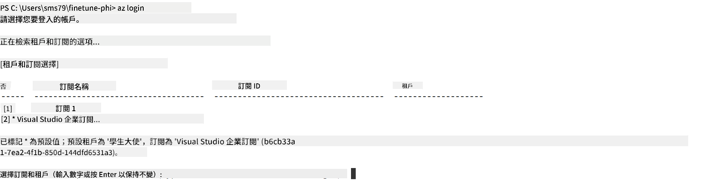

> [!TIP]
>
> 如果你登入 Azure 有困難，可以試用裝置碼登入。開啟終端機，打以下指令登入 Azure 帳戶：
>
> ```console
> az login --use-device-code
> ```
>

### 微調 Phi-3 模型

今次練習，你會用提供嘅數據集微調 Phi-3 模型。首先，你會喺 *fine_tune.py* 文件定義微調流程。然後，設定 Azure Machine Learning 環境，並透過執行 *setup_ml.py* 文件開始微調。呢個 script 確保微調喺 Azure Machine Learning 環境入面執行。

執行 *setup_ml.py* 就會喺 Azure Machine Learning 環境執行微調流程。

#### 喺 *fine_tune.py* 文件加入程式碼

1. 去 *finetuning_dir* 資料夾，喺 Visual Studio Code 打開 *fine_tune.py* 文件。

1. 喺 *fine_tune.py* 入面加入以下程式碼。

    ```python
    import argparse
    import sys
    import logging
    import os
    from datasets import load_dataset
    import torch
    import mlflow
    from transformers import AutoModelForCausalLM, AutoTokenizer, TrainingArguments
    from trl import SFTTrainer

    # To avoid the INVALID_PARAMETER_VALUE error in MLflow, disable MLflow integration
    os.environ["DISABLE_MLFLOW_INTEGRATION"] = "True"

    # Logging setup
    logging.basicConfig(
        format="%(asctime)s - %(levelname)s - %(name)s - %(message)s",
        datefmt="%Y-%m-%d %H:%M:%S",
        handlers=[logging.StreamHandler(sys.stdout)],
        level=logging.WARNING
    )
    logger = logging.getLogger(__name__)

    def initialize_model_and_tokenizer(model_name, model_kwargs):
        """
        Initialize the model and tokenizer with the given pretrained model name and arguments.
        """
        model = AutoModelForCausalLM.from_pretrained(model_name, **model_kwargs)
        tokenizer = AutoTokenizer.from_pretrained(model_name)
        tokenizer.model_max_length = 2048
        tokenizer.pad_token = tokenizer.unk_token
        tokenizer.pad_token_id = tokenizer.convert_tokens_to_ids(tokenizer.pad_token)
        tokenizer.padding_side = 'right'
        return model, tokenizer

    def apply_chat_template(example, tokenizer):
        """
        Apply a chat template to tokenize messages in the example.
        """
        messages = example["messages"]
        if messages[0]["role"] != "system":
            messages.insert(0, {"role": "system", "content": ""})
        example["text"] = tokenizer.apply_chat_template(
            messages, tokenize=False, add_generation_prompt=False
        )
        return example

    def load_and_preprocess_data(train_filepath, test_filepath, tokenizer):
        """
        Load and preprocess the dataset.
        """
        train_dataset = load_dataset('json', data_files=train_filepath, split='train')
        test_dataset = load_dataset('json', data_files=test_filepath, split='train')
        column_names = list(train_dataset.features)

        train_dataset = train_dataset.map(
            apply_chat_template,
            fn_kwargs={"tokenizer": tokenizer},
            num_proc=10,
            remove_columns=column_names,
            desc="Applying chat template to train dataset",
        )

        test_dataset = test_dataset.map(
            apply_chat_template,
            fn_kwargs={"tokenizer": tokenizer},
            num_proc=10,
            remove_columns=column_names,
            desc="Applying chat template to test dataset",
        )

        return train_dataset, test_dataset

    def train_and_evaluate_model(train_dataset, test_dataset, model, tokenizer, output_dir):
        """
        Train and evaluate the model.
        """
        training_args = TrainingArguments(
            bf16=True,
            do_eval=True,
            output_dir=output_dir,
            eval_strategy="epoch",
            learning_rate=5.0e-06,
            logging_steps=20,
            lr_scheduler_type="cosine",
            num_train_epochs=3,
            overwrite_output_dir=True,
            per_device_eval_batch_size=4,
            per_device_train_batch_size=4,
            remove_unused_columns=True,
            save_steps=500,
            seed=0,
            gradient_checkpointing=True,
            gradient_accumulation_steps=1,
            warmup_ratio=0.2,
        )

        trainer = SFTTrainer(
            model=model,
            args=training_args,
            train_dataset=train_dataset,
            eval_dataset=test_dataset,
            max_seq_length=2048,
            dataset_text_field="text",
            tokenizer=tokenizer,
            packing=True
        )

        train_result = trainer.train()
        trainer.log_metrics("train", train_result.metrics)

        mlflow.transformers.log_model(
            transformers_model={"model": trainer.model, "tokenizer": tokenizer},
            artifact_path=output_dir,
        )

        tokenizer.padding_side = 'left'
        eval_metrics = trainer.evaluate()
        eval_metrics["eval_samples"] = len(test_dataset)
        trainer.log_metrics("eval", eval_metrics)

    def main(train_file, eval_file, model_output_dir):
        """
        Main function to fine-tune the model.
        """
        model_kwargs = {
            "use_cache": False,
            "trust_remote_code": True,
            "torch_dtype": torch.bfloat16,
            "device_map": None,
            "attn_implementation": "eager"
        }

        # pretrained_model_name = "microsoft/Phi-3-mini-4k-instruct"
        pretrained_model_name = "microsoft/Phi-3.5-mini-instruct"

        with mlflow.start_run():
            model, tokenizer = initialize_model_and_tokenizer(pretrained_model_name, model_kwargs)
            train_dataset, test_dataset = load_and_preprocess_data(train_file, eval_file, tokenizer)
            train_and_evaluate_model(train_dataset, test_dataset, model, tokenizer, model_output_dir)

    if __name__ == "__main__":
        parser = argparse.ArgumentParser()
        parser.add_argument("--train-file", type=str, required=True, help="Path to the training data")
        parser.add_argument("--eval-file", type=str, required=True, help="Path to the evaluation data")
        parser.add_argument("--model_output_dir", type=str, required=True, help="Directory to save the fine-tuned model")
        args = parser.parse_args()
        main(args.train_file, args.eval_file, args.model_output_dir)

    ```

1. 儲存同關閉 *fine_tune.py* 文件。

> [!TIP]
> **你可以微調 Phi-3.5 模型**
>
> 喺 *fine_tune.py* 文件，你可以改變 `pretrained_model_name` from `"microsoft/Phi-3-mini-4k-instruct"` to any model you want to fine-tune. For example, if you change it to `"microsoft/Phi-3.5-mini-instruct"`, you'll be using the Phi-3.5-mini-instruct model for fine-tuning. To find and use the model name you prefer, visit [Hugging Face](https://huggingface.co/), search for the model you're interested in, and then copy and paste its name into the `pretrained_model_name` 呢個欄位。
>
> :::image type="content" source="../../imgs/03/FineTuning-PromptFlow/finetunephi3.5.png" alt-text="微調 Phi-3.5。":::
>

#### 喺 *setup_ml.py* 文件加入程式碼

1. 喺 Visual Studio Code 打開 *setup_ml.py* 文件。

1. 喺 *setup_ml.py* 入面加入以下程式碼。

    ```python
    import logging
    from azure.ai.ml import MLClient, command, Input
    from azure.ai.ml.entities import Environment, AmlCompute
    from azure.identity import AzureCliCredential
    from config import (
        AZURE_SUBSCRIPTION_ID,
        AZURE_RESOURCE_GROUP_NAME,
        AZURE_ML_WORKSPACE_NAME,
        TRAIN_DATA_PATH,
        TEST_DATA_PATH
    )

    # Constants

    # Uncomment the following lines to use a CPU instance for training
    # COMPUTE_INSTANCE_TYPE = "Standard_E16s_v3" # cpu
    # COMPUTE_NAME = "cpu-e16s-v3"
    # DOCKER_IMAGE_NAME = "mcr.microsoft.com/azureml/openmpi4.1.0-ubuntu20.04:latest"

    # Uncomment the following lines to use a GPU instance for training
    COMPUTE_INSTANCE_TYPE = "Standard_NC24ads_A100_v4"
    COMPUTE_NAME = "gpu-nc24s-a100-v4"
    DOCKER_IMAGE_NAME = "mcr.microsoft.com/azureml/curated/acft-hf-nlp-gpu:59"

    CONDA_FILE = "conda.yml"
    LOCATION = "eastus2" # Replace with the location of your compute cluster
    FINETUNING_DIR = "./finetuning_dir" # Path to the fine-tuning script
    TRAINING_ENV_NAME = "phi-3-training-environment" # Name of the training environment
    MODEL_OUTPUT_DIR = "./model_output" # Path to the model output directory in azure ml

    # Logging setup to track the process
    logger = logging.getLogger(__name__)
    logging.basicConfig(
        format="%(asctime)s - %(levelname)s - %(name)s - %(message)s",
        datefmt="%Y-%m-%d %H:%M:%S",
        level=logging.WARNING
    )

    def get_ml_client():
        """
        Initialize the ML Client using Azure CLI credentials.
        """
        credential = AzureCliCredential()
        return MLClient(credential, AZURE_SUBSCRIPTION_ID, AZURE_RESOURCE_GROUP_NAME, AZURE_ML_WORKSPACE_NAME)

    def create_or_get_environment(ml_client):
        """
        Create or update the training environment in Azure ML.
        """
        env = Environment(
            image=DOCKER_IMAGE_NAME,  # Docker image for the environment
            conda_file=CONDA_FILE,  # Conda environment file
            name=TRAINING_ENV_NAME,  # Name of the environment
        )
        return ml_client.environments.create_or_update(env)

    def create_or_get_compute_cluster(ml_client, compute_name, COMPUTE_INSTANCE_TYPE, location):
        """
        Create or update the compute cluster in Azure ML.
        """
        try:
            compute_cluster = ml_client.compute.get(compute_name)
            logger.info(f"Compute cluster '{compute_name}' already exists. Reusing it for the current run.")
        except Exception:
            logger.info(f"Compute cluster '{compute_name}' does not exist. Creating a new one with size {COMPUTE_INSTANCE_TYPE}.")
            compute_cluster = AmlCompute(
                name=compute_name,
                size=COMPUTE_INSTANCE_TYPE,
                location=location,
                tier="Dedicated",  # Tier of the compute cluster
                min_instances=0,  # Minimum number of instances
                max_instances=1  # Maximum number of instances
            )
            ml_client.compute.begin_create_or_update(compute_cluster).wait()  # Wait for the cluster to be created
        return compute_cluster

    def create_fine_tuning_job(env, compute_name):
        """
        Set up the fine-tuning job in Azure ML.
        """
        return command(
            code=FINETUNING_DIR,  # Path to fine_tune.py
            command=(
                "python fine_tune.py "
                "--train-file ${{inputs.train_file}} "
                "--eval-file ${{inputs.eval_file}} "
                "--model_output_dir ${{inputs.model_output}}"
            ),
            environment=env,  # Training environment
            compute=compute_name,  # Compute cluster to use
            inputs={
                "train_file": Input(type="uri_file", path=TRAIN_DATA_PATH),  # Path to the training data file
                "eval_file": Input(type="uri_file", path=TEST_DATA_PATH),  # Path to the evaluation data file
                "model_output": MODEL_OUTPUT_DIR
            }
        )

    def main():
        """
        Main function to set up and run the fine-tuning job in Azure ML.
        """
        # Initialize ML Client
        ml_client = get_ml_client()

        # Create Environment
        env = create_or_get_environment(ml_client)
        
        # Create or get existing compute cluster
        create_or_get_compute_cluster(ml_client, COMPUTE_NAME, COMPUTE_INSTANCE_TYPE, LOCATION)

        # Create and Submit Fine-Tuning Job
        job = create_fine_tuning_job(env, COMPUTE_NAME)
        returned_job = ml_client.jobs.create_or_update(job)  # Submit the job
        ml_client.jobs.stream(returned_job.name)  # Stream the job logs
        
        # Capture the job name
        job_name = returned_job.name
        print(f"Job name: {job_name}")

    if __name__ == "__main__":
        main()

    ```

1. 將 `COMPUTE_INSTANCE_TYPE`, `COMPUTE_NAME`, and `LOCATION` 換成你嘅具體資料。

    ```python
   # Uncomment the following lines to use a GPU instance for training
    COMPUTE_INSTANCE_TYPE = "Standard_NC24ads_A100_v4"
    COMPUTE_NAME = "gpu-nc24s-a100-v4"
    ...
    LOCATION = "eastus2" # Replace with the location of your compute cluster
    ```

> [!TIP]
>
> **用最細數據集同 CPU 微調嘅指引**
>
> 如果你想用 CPU 微調，呢個方法適合有福利訂閱（例如 Visual Studio Enterprise Subscription）嘅用戶，或者想快啲試下微調同部署流程。
>
> 1. 打開 *setup_ml* 文件。
> 1. 將 `COMPUTE_INSTANCE_TYPE`, `COMPUTE_NAME`, and `DOCKER_IMAGE_NAME` with the following. If you do not have access to *Standard_E16s_v3*, you can use an equivalent CPU instance or request a new quota.
> 1. Replace `LOCATION` 換成你嘅具體資料。
>
>    ```python
>    # Uncomment the following lines to use a CPU instance for training
>    COMPUTE_INSTANCE_TYPE = "Standard_E16s_v3" # cpu
>    COMPUTE_NAME = "cpu-e16s-v3"
>    DOCKER_IMAGE_NAME = "mcr.microsoft.com/azureml/openmpi4.1.0-ubuntu20.04:latest"
>    LOCATION = "eastus2" # Replace with the location of your compute cluster
>    ```
>

1. 喺終端機打以下指令執行 *setup_ml.py*，開始喺 Azure Machine Learning 入面微調。

    ```python
    python setup_ml.py
    ```

1. 今次練習，你成功用 Azure Machine Learning 微調咗 Phi-3 模型。執行 *setup_ml.py* script，已設定好 Azure Machine Learning 環境，並開始執行喺 *fine_tune.py* 定義嘅微調流程。請留意，微調過程可能需要一段時間。執行 `python setup_ml.py` command, you need to wait for the process to complete. You can monitor the status of the fine-tuning job by following the link provided in the terminal to the Azure Machine Learning portal.

    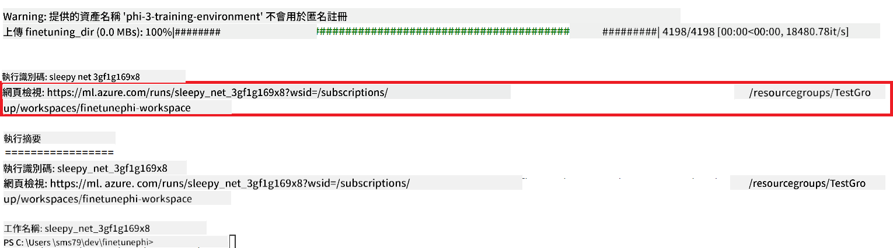

### Deploy the fine-tuned model

To integrate the fine-tuned Phi-3 model with Prompt Flow, you need to deploy the model to make it accessible for real-time inference. This process involves registering the model, creating an online endpoint, and deploying the model.

#### Set the model name, endpoint name, and deployment name for deployment

1. Open *config.py* file.

1. Replace `AZURE_MODEL_NAME = "your_fine_tuned_model_name"` with the desired name for your model.

1. Replace `AZURE_ENDPOINT_NAME = "your_fine_tuned_model_endpoint_name"` with the desired name for your endpoint.

1. Replace `AZURE_DEPLOYMENT_NAME = "your_fine_tuned_model_deployment_name"`，並用你想用嘅部署名稱。

#### 喺 *deploy_model.py* 文件加入程式碼

執行 *deploy_model.py* 文件會自動化整個部署流程。佢會註冊模型、建立端點，並根據 *config.py* 文件入面嘅設定（包括模型名、端點名、部署名）執行部署。

1. 喺 Visual Studio Code 打開 *deploy_model.py* 文件。

1. 喺 *deploy_model.py* 入面加入以下程式碼。

    ```python
    import logging
    from azure.identity import AzureCliCredential
    from azure.ai.ml import MLClient
    from azure.ai.ml.entities import Model, ProbeSettings, ManagedOnlineEndpoint, ManagedOnlineDeployment, IdentityConfiguration, ManagedIdentityConfiguration, OnlineRequestSettings
    from azure.ai.ml.constants import AssetTypes

    # Configuration imports
    from config import (
        AZURE_SUBSCRIPTION_ID,
        AZURE_RESOURCE_GROUP_NAME,
        AZURE_ML_WORKSPACE_NAME,
        AZURE_MANAGED_IDENTITY_RESOURCE_ID,
        AZURE_MANAGED_IDENTITY_CLIENT_ID,
        AZURE_MODEL_NAME,
        AZURE_ENDPOINT_NAME,
        AZURE_DEPLOYMENT_NAME
    )

    # Constants
    JOB_NAME = "your-job-name"
    COMPUTE_INSTANCE_TYPE = "Standard_E4s_v3"

    deployment_env_vars = {
        "SUBSCRIPTION_ID": AZURE_SUBSCRIPTION_ID,
        "RESOURCE_GROUP_NAME": AZURE_RESOURCE_GROUP_NAME,
        "UAI_CLIENT_ID": AZURE_MANAGED_IDENTITY_CLIENT_ID,
    }

    # Logging setup
    logging.basicConfig(
        format="%(asctime)s - %(levelname)s - %(name)s - %(message)s",
        datefmt="%Y-%m-%d %H:%M:%S",
        level=logging.DEBUG
    )
    logger = logging.getLogger(__name__)

    def get_ml_client():
        """Initialize and return the ML Client."""
        credential = AzureCliCredential()
        return MLClient(credential, AZURE_SUBSCRIPTION_ID, AZURE_RESOURCE_GROUP_NAME, AZURE_ML_WORKSPACE_NAME)

    def register_model(ml_client, model_name, job_name):
        """Register a new model."""
        model_path = f"azureml://jobs/{job_name}/outputs/artifacts/paths/model_output"
        logger.info(f"Registering model {model_name} from job {job_name} at path {model_path}.")
        run_model = Model(
            path=model_path,
            name=model_name,
            description="Model created from run.",
            type=AssetTypes.MLFLOW_MODEL,
        )
        model = ml_client.models.create_or_update(run_model)
        logger.info(f"Registered model ID: {model.id}")
        return model

    def delete_existing_endpoint(ml_client, endpoint_name):
        """Delete existing endpoint if it exists."""
        try:
            endpoint_result = ml_client.online_endpoints.get(name=endpoint_name)
            logger.info(f"Deleting existing endpoint {endpoint_name}.")
            ml_client.online_endpoints.begin_delete(name=endpoint_name).result()
            logger.info(f"Deleted existing endpoint {endpoint_name}.")
        except Exception as e:
            logger.info(f"No existing endpoint {endpoint_name} found to delete: {e}")

    def create_or_update_endpoint(ml_client, endpoint_name, description=""):
        """Create or update an endpoint."""
        delete_existing_endpoint(ml_client, endpoint_name)
        logger.info(f"Creating new endpoint {endpoint_name}.")
        endpoint = ManagedOnlineEndpoint(
            name=endpoint_name,
            description=description,
            identity=IdentityConfiguration(
                type="user_assigned",
                user_assigned_identities=[ManagedIdentityConfiguration(resource_id=AZURE_MANAGED_IDENTITY_RESOURCE_ID)]
            )
        )
        endpoint_result = ml_client.online_endpoints.begin_create_or_update(endpoint).result()
        logger.info(f"Created new endpoint {endpoint_name}.")
        return endpoint_result

    def create_or_update_deployment(ml_client, endpoint_name, deployment_name, model):
        """Create or update a deployment."""

        logger.info(f"Creating deployment {deployment_name} for endpoint {endpoint_name}.")
        deployment = ManagedOnlineDeployment(
            name=deployment_name,
            endpoint_name=endpoint_name,
            model=model.id,
            instance_type=COMPUTE_INSTANCE_TYPE,
            instance_count=1,
            environment_variables=deployment_env_vars,
            request_settings=OnlineRequestSettings(
                max_concurrent_requests_per_instance=3,
                request_timeout_ms=180000,
                max_queue_wait_ms=120000
            ),
            liveness_probe=ProbeSettings(
                failure_threshold=30,
                success_threshold=1,
                period=100,
                initial_delay=500,
            ),
            readiness_probe=ProbeSettings(
                failure_threshold=30,
                success_threshold=1,
                period=100,
                initial_delay=500,
            ),
        )
        deployment_result = ml_client.online_deployments.begin_create_or_update(deployment).result()
        logger.info(f"Created deployment {deployment.name} for endpoint {endpoint_name}.")
        return deployment_result

    def set_traffic_to_deployment(ml_client, endpoint_name, deployment_name):
        """Set traffic to the specified deployment."""
        try:
            # Fetch the current endpoint details
            endpoint = ml_client.online_endpoints.get(name=endpoint_name)
            
            # Log the current traffic allocation for debugging
            logger.info(f"Current traffic allocation: {endpoint.traffic}")
            
            # Set the traffic allocation for the deployment
            endpoint.traffic = {deployment_name: 100}
            
            # Update the endpoint with the new traffic allocation
            endpoint_poller = ml_client.online_endpoints.begin_create_or_update(endpoint)
            updated_endpoint = endpoint_poller.result()
            
            # Log the updated traffic allocation for debugging
            logger.info(f"Updated traffic allocation: {updated_endpoint.traffic}")
            logger.info(f"Set traffic to deployment {deployment_name} at endpoint {endpoint_name}.")
            return updated_endpoint
        except Exception as e:
            # Log any errors that occur during the process
            logger.error(f"Failed to set traffic to deployment: {e}")
            raise


    def main():
        ml_client = get_ml_client()

        registered_model = register_model(ml_client, AZURE_MODEL_NAME, JOB_NAME)
        logger.info(f"Registered model ID: {registered_model.id}")

        endpoint = create_or_update_endpoint(ml_client, AZURE_ENDPOINT_NAME, "Endpoint for finetuned Phi-3 model")
        logger.info(f"Endpoint {AZURE_ENDPOINT_NAME} is ready.")

        try:
            deployment = create_or_update_deployment(ml_client, AZURE_ENDPOINT_NAME, AZURE_DEPLOYMENT_NAME, registered_model)
            logger.info(f"Deployment {AZURE_DEPLOYMENT_NAME} is created for endpoint {AZURE_ENDPOINT_NAME}.")

            set_traffic_to_deployment(ml_client, AZURE_ENDPOINT_NAME, AZURE_DEPLOYMENT_NAME)
            logger.info(f"Traffic is set to deployment {AZURE_DEPLOYMENT_NAME} at endpoint {AZURE_ENDPOINT_NAME}.")
        except Exception as e:
            logger.error(f"Failed to create or update deployment: {e}")

    if __name__ == "__main__":
        main()

    ```

1. 跟住以下步驟，取得 `JOB_NAME`:

    - Navigate to Azure Machine Learning resource that you created.
    - Select **Studio web URL** to open the Azure Machine Learning workspace.
    - Select **Jobs** from the left side tab.
    - Select the experiment for fine-tuning. For example, *finetunephi*.
    - Select the job that you created.
    - Copy and paste your job Name into the `JOB_NAME = "your-job-name"` in *deploy_model.py* file.

1. Replace `COMPUTE_INSTANCE_TYPE`，並填入你嘅具體資料。

1. 喺終端機打以下指令執行 *deploy_model.py*，開始喺 Azure Machine Learning 入面部署。

    ```python
    python deploy_model.py
    ```

> [!WARNING]
> 為避免額外收費，記得喺 Azure Machine Learning workspace 刪除已建立嘅端點。
>

#### 喺 Azure Machine Learning Workspace 檢查部署狀態

1. 去 [Azure ML Studio](https://ml.azure.com/home?wt.mc_id=studentamb_279723)。

1. 去到你建立嘅 Azure Machine Learning workspace。

1. 選擇 **Studio web URL** 開啟 Azure Machine Learning workspace。

1. 喺左側分頁揀 **Endpoints**。

    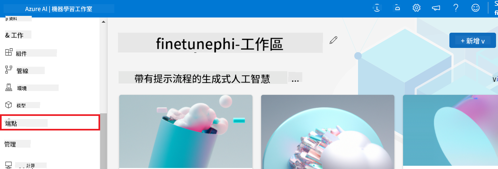

2. 揀你建立嘅端點。

    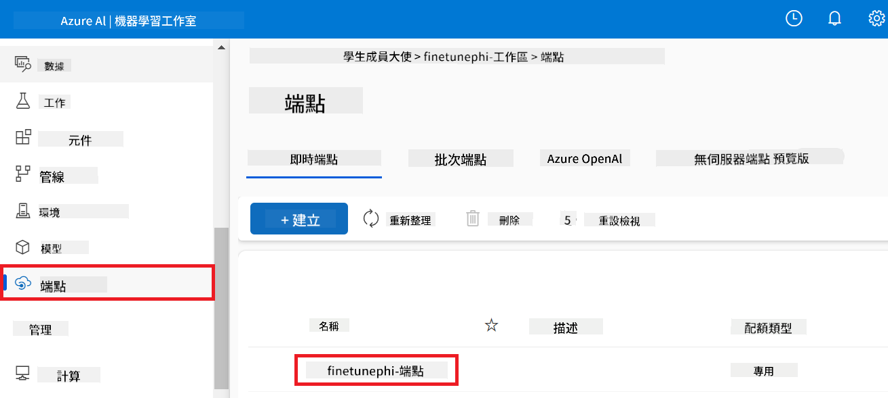

3. 呢頁面可以管理部署過程中建立嘅端點。

## 情境 3：整合 Prompt flow 同你嘅自訂模型對話

### 將自訂 Phi-3 模型整合入 Prompt flow

成功部署微調模型後，你可以將佢整合入 Prompt flow，用你嘅模型喺實時應用，實現多種互動任務。

#### 設定微調後 Phi-3 模型嘅 api key 同 endpoint uri

1. 去你建立嘅 Azure Machine Learning workspace。
1. 喺左側分頁揀 **Endpoints**。
1. 揀你建立嘅端點。
1. 喺導航選單揀 **Consume**。
1. 複製同貼上你嘅 **REST endpoint** 入 *config.py* 文件，替換 `AZURE_ML_ENDPOINT = "your_fine_tuned_model_endpoint_uri"` with your **REST endpoint**.
1. Copy and paste your **Primary key** into the *config.py* file, replacing `AZURE_ML_API_KEY = "your_fine_tuned_model_api_key"` 同你嘅 **Primary key**。

    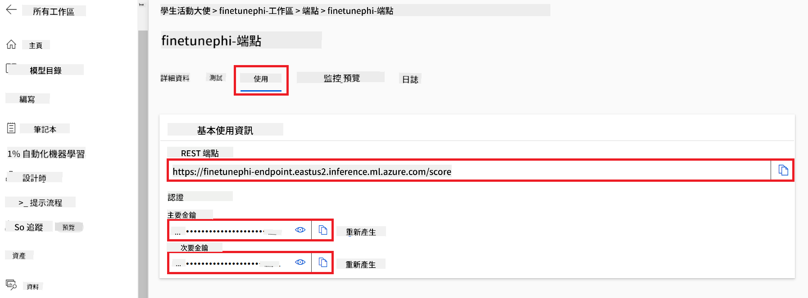

#### 喺 *flow.dag.yml* 文件加入程式碼

1. 喺 Visual Studio Code 打開 *flow.dag.yml* 文件。

1. 喺 *flow.dag.yml* 入面加入以下程式碼。

    ```yml
    inputs:
      input_data:
        type: string
        default: "Who founded Microsoft?"

    outputs:
      answer:
        type: string
        reference: ${integrate_with_promptflow.output}

    nodes:
    - name: integrate_with_promptflow
      type: python
      source:
        type: code
        path: integrate_with_promptflow.py
      inputs:
        input_data: ${inputs.input_data}
    ```

#### 喺 *integrate_with_promptflow.py* 文件加入程式碼

1. 喺 Visual Studio Code 打開 *integrate_with_promptflow.py* 文件。

1. 喺 *integrate_with_promptflow.py* 入面加入以下程式碼。

    ```python
    import logging
    import requests
    from promptflow.core import tool
    import asyncio
    import platform
    from config import (
        AZURE_ML_ENDPOINT,
        AZURE_ML_API_KEY
    )

    # Logging setup
    logging.basicConfig(
        format="%(asctime)s - %(levelname)s - %(name)s - %(message)s",
        datefmt="%Y-%m-%d %H:%M:%S",
        level=logging.DEBUG
    )
    logger = logging.getLogger(__name__)

    def query_azml_endpoint(input_data: list, endpoint_url: str, api_key: str) -> str:
        """
        Send a request to the Azure ML endpoint with the given input data.
        """
        headers = {
            "Content-Type": "application/json",
            "Authorization": f"Bearer {api_key}"
        }
        data = {
            "input_data": [input_data],
            "params": {
                "temperature": 0.7,
                "max_new_tokens": 128,
                "do_sample": True,
                "return_full_text": True
            }
        }
        try:
            response = requests.post(endpoint_url, json=data, headers=headers)
            response.raise_for_status()
            result = response.json()[0]
            logger.info("Successfully received response from Azure ML Endpoint.")
            return result
        except requests.exceptions.RequestException as e:
            logger.error(f"Error querying Azure ML Endpoint: {e}")
            raise

    def setup_asyncio_policy():
        """
        Setup asyncio event loop policy for Windows.
        """
        if platform.system() == 'Windows':
            asyncio.set_event_loop_policy(asyncio.WindowsSelectorEventLoopPolicy())
            logger.info("Set Windows asyncio event loop policy.")

    @tool
    def my_python_tool(input_data: str) -> str:
        """
        Tool function to process input data and query the Azure ML endpoint.
        """
        setup_asyncio_policy()
        return query_azml_endpoint(input_data, AZURE_ML_ENDPOINT, AZURE_ML_API_KEY)

    ```

### 同你嘅自訂模型對話

1. 喺終端機打以下指令執行 *deploy_model.py*，開始喺 Azure Machine Learning 部署流程。

    ```python
    pf flow serve --source ./ --port 8080 --host localhost
    ```

1. 以下係結果示例：而家你可以同你嘅自訂 Phi-3 模型對話。建議根據用嚟微調嘅數據問問題。

    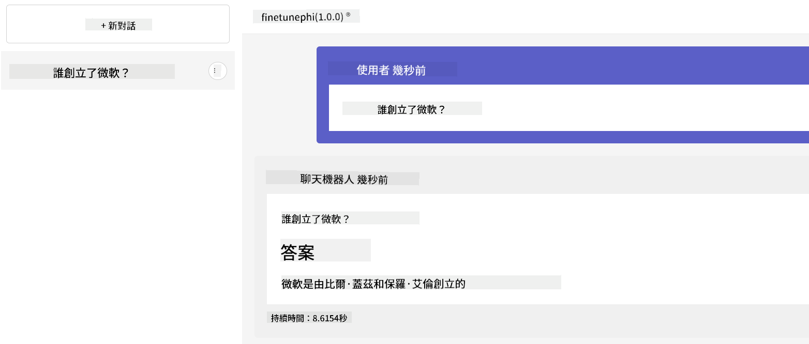

**免責聲明**：  
本文件由 AI 翻譯服務 [Co-op Translator](https://github.com/Azure/co-op-translator) 翻譯而成。雖然我們力求準確，但請注意自動翻譯可能包含錯誤或不準確之處。原始文件的母語版本應被視為權威來源。對於重要資訊，建議使用專業人工翻譯。我們對因使用此翻譯而引致的任何誤解或誤釋概不負責。