<!--
CO_OP_TRANSLATOR_METADATA:
{
  "original_hash": "0df910a227098303cc392b6ad204c271",
  "translation_date": "2026-01-06T04:18:05+00:00",
  "source_file": "md/02.Application/01.TextAndChat/Phi3/E2E_Phi-3-FineTuning_PromptFlow_Integration_AIFoundry.md",
  "language_code": "hk"
}
-->
# 微調及整合自訂 Phi-3 模型與 Azure AI Foundry 中的 Prompt flow

此端對端（E2E）範例基於 Microsoft Tech Community 中的指南「[微調及整合自訂 Phi-3 模型與 Azure AI Foundry 中的 Prompt flow](https://techcommunity.microsoft.com/t5/educator-developer-blog/fine-tune-and-integrate-custom-phi-3-models-with-prompt-flow-in/ba-p/4191726?WT.mc_id=aiml-137032-kinfeylo)」。介紹如何微調、自訂 Phi-3 模型的部署及在 Azure AI Foundry 中整合 Prompt flow。
與需在本機執行程式碼的端對端範例「[微調及整合自訂 Phi-3 模型與 Prompt Flow](./E2E_Phi-3-FineTuning_PromptFlow_Integration.md)」不同，此教學完全聚焦於如何在 Azure AI / ML Studio 內微調及整合模型。

## 總覽

在此端對端範例中，您將學會如何微調 Phi-3 模型並將其與 Azure AI Foundry 的 Prompt flow 整合。利用 Azure AI / ML Studio，建立部署及使用自訂 AI 模型的工作流程。本端對端範例分為三個情境：

**情境 1：設定 Azure 資源並準備微調**

**情境 2：微調 Phi-3 模型並在 Azure Machine Learning Studio 部署**

**情境 3：與 Prompt flow 整合並在 Azure AI Foundry 與自訂模型對話**

以下為本端對端範例的總覽。


### 目錄

1. **[情境 1：設定 Azure 資源並準備微調](../../../../../../md/02.Application/01.TextAndChat/Phi3)**
    - [建立 Azure Machine Learning 工作區](../../../../../../md/02.Application/01.TextAndChat/Phi3)
    - [申請 Azure 訂閱中的 GPU 配額](../../../../../../md/02.Application/01.TextAndChat/Phi3)
    - [新增角色指派](../../../../../../md/02.Application/01.TextAndChat/Phi3)
    - [設定專案](../../../../../../md/02.Application/01.TextAndChat/Phi3)
    - [準備微調資料集](../../../../../../md/02.Application/01.TextAndChat/Phi3)

1. **[情境 2：微調 Phi-3 模型並在 Azure Machine Learning Studio 部署](../../../../../../md/02.Application/01.TextAndChat/Phi3)**
    - [微調 Phi-3 模型](../../../../../../md/02.Application/01.TextAndChat/Phi3)
    - [部署微調完成的 Phi-3 模型](../../../../../../md/02.Application/01.TextAndChat/Phi3)

1. **[情境 3：與 Prompt flow 整合並在 Azure AI Foundry 與自訂模型對話](../../../../../../md/02.Application/01.TextAndChat/Phi3)**
    - [將自訂 Phi-3 模型整合至 Prompt flow](../../../../../../md/02.Application/01.TextAndChat/Phi3)
    - [與您的自訂 Phi-3 模型聊天](../../../../../../md/02.Application/01.TextAndChat/Phi3)

## 情境 1：設定 Azure 資源並準備微調

### 建立 Azure Machine Learning 工作區

1. 在入口網站頁面頂部的 **搜尋欄** 輸入 *azure machine learning*，並從出現的選項中選擇 **Azure Machine Learning**。

    

2. 從導覽選單中選擇 **+ Create**。

3. 從導覽選單中選擇 **New workspace**。

    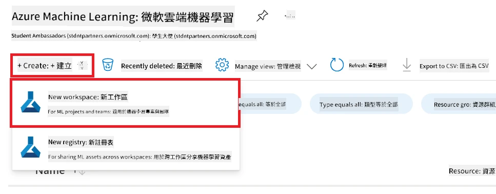

4. 執行以下工作：

    - 選擇您的 Azure **訂閱**。
    - 選擇要使用的 **資源群組**（如有需要可新建）。
    - 輸入 **工作區名稱**，必須是唯一值。
    - 選擇您想使用的 **區域**。
    - 選擇要使用的 **儲存帳戶**（如有需要可新建）。
    - 選擇要使用的 **Key vault**（如有需要可新建）。
    - 選擇要使用的 **Application insights**（如有需要可新建）。
    - 選擇要使用的 **Container registry**（如有需要可新建）。

    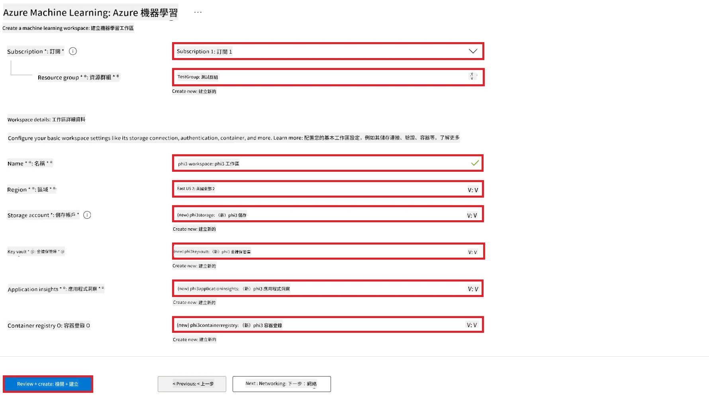

5. 選擇 **Review + Create**。

6. 選擇 **Create**。

### 於 Azure 訂閱中申請 GPU 配額

在本教學中，您將學習如何使用 GPU 微調及部署 Phi-3 模型。微調時使用 *Standard_NC24ads_A100_v4* GPU，需申請配額；部署時使用 *Standard_NC6s_v3* GPU，也需申請配額。

> [!NOTE]
>
> 只有 Pay-As-You-Go 訂閱（標準訂閱類型）可申請 GPU 分配，優惠訂閱目前不支援。
>

1. 訪問 [Azure ML Studio](https://ml.azure.com/home?wt.mc_id=studentamb_279723)。

1. 申請 *Standard NCADSA100v4 Family* 配額：

    - 從左側標籤選擇 **Quota**。
    - 選擇要使用的 **虛擬機器系列**。例如，選擇包含 *Standard_NC24ads_A100_v4* GPU 的 **Standard NCADSA100v4 Family Cluster Dedicated vCPUs**。
    - 從導覽選單選擇 **Request quota**。

        

    - 在申請配額頁面輸入您想使用的 **新核心限制**，例如 24。
    - 選擇 **Submit** 提交 GPU 配額申請。

1. 申請 *Standard NCSv3 Family* 配額：

    - 從左側標籤選擇 **Quota**。
    - 選擇要使用的 **虛擬機器系列**。例如，選擇包含 *Standard_NC6s_v3* GPU 的 **Standard NCSv3 Family Cluster Dedicated vCPUs**。
    - 從導覽選單選擇 **Request quota**。
    - 在申請配額頁面輸入您想使用的 **新核心限制**，例如 24。
    - 選擇 **Submit** 提交 GPU 配額申請。

### 新增角色指派

為了微調及部署模型，您需要先建立一個使用者指派管理身分（User Assigned Managed Identity，簡稱 UAI）並賦予適當權限。此 UAI 將用於部署時的驗證。

#### 建立 User Assigned Managed Identity (UAI)

1. 在入口網站頁面頂部的 **搜尋欄** 輸入 *managed identities*，並從出現的選項中選擇 **Managed Identities**。

    

1. 選擇 **+ Create**。

    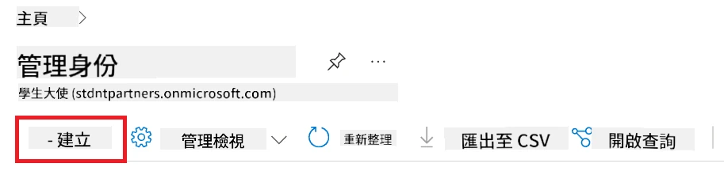

1. 執行以下工作：

    - 選擇您的 Azure **訂閱**。
    - 選擇要使用的 **資源群組**（如有需要可新建）。
    - 選擇您想使用的 **區域**。
    - 輸入 **名稱**，必須是唯一值。

    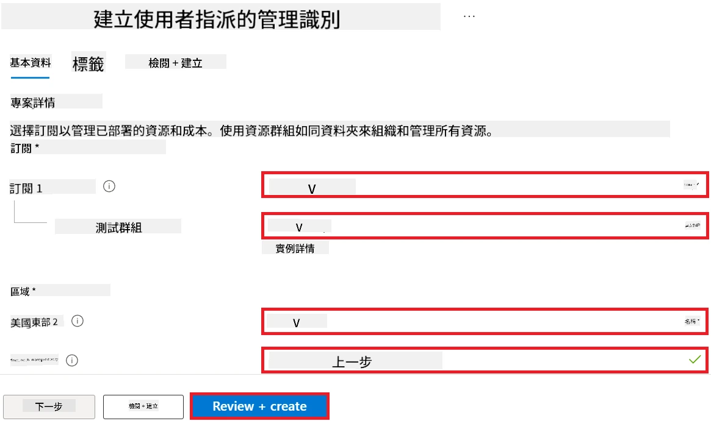

1. 選擇 **Review + create**。

1. 選擇 **+ Create**。

#### 將 Contributor 角色指派給 Managed Identity

1. 移動至您建立的 Managed Identity 資源。

1. 從左側標籤選擇 **Azure role assignments**。

1. 從導覽選單選擇 **+Add role assignment**。

1. 在新增角色指派頁面，執行以下操作：
    - 將 **範圍**設定為 **Resource group**。
    - 選擇您的 Azure **訂閱**。
    - 選擇要使用的 **資源群組**。
    - 將 **角色**選為 **Contributor**。

    

2. 選擇 **Save**。

#### 將 Storage Blob Data Reader 角色指派給 Managed Identity

1. 在入口網站頁面頂部的 **搜尋欄** 輸入 *storage accounts*，並從選項中選擇 **Storage accounts**。

    

1. 選擇與您之前建立的 Azure Machine Learning 工作區相關聯的儲存帳戶，例如 *finetunephistorage*。

1. 執行以下操作以進入新增角色指派頁面：

    - 移動至您建立的 Azure 儲存帳戶。
    - 從左側標籤選擇 **Access Control (IAM)**。
    - 從導覽選單選擇 **+ Add**。
    - 選擇 **Add role assignment**。

    

1. 在新增角色指派頁面，執行以下操作：

    - 在角色頁面的搜尋欄輸入 *Storage Blob Data Reader* 並從選項中選擇 **Storage Blob Data Reader**。
    - 選擇 **Next**。
    - 在成員頁面選擇 **Assign access to** **Managed identity**。
    - 選擇 **+ Select members**。
    - 在選擇管理身分頁面選擇您的 Azure **訂閱**。
    - 選擇 **Managed identity** 於 **Manage Identity**。
    - 選擇您所建立的 Managed Identity，例如 *finetunephi-managedidentity*。
    - 選擇 **Select**。

    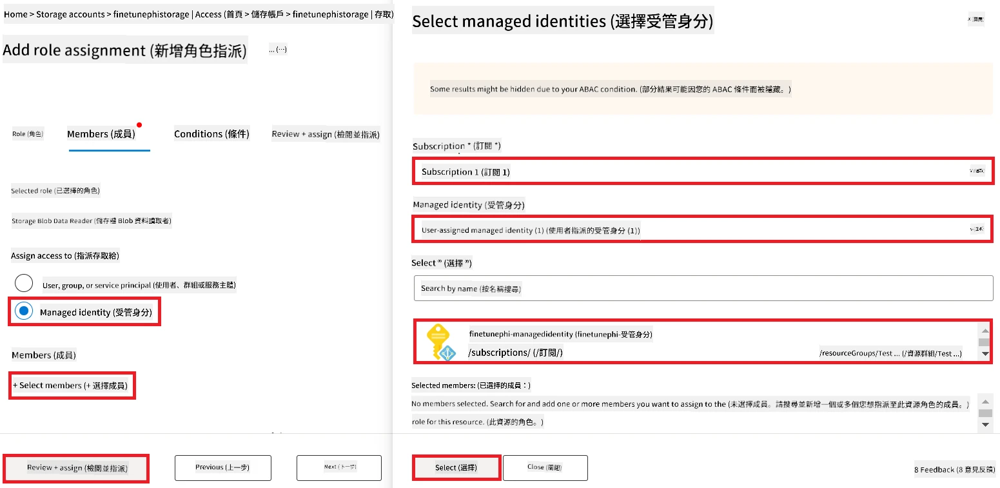

1. 選擇 **Review + assign**。

#### 將 AcrPull 角色指派給 Managed Identity

1. 在入口網站頁面頂部的 **搜尋欄** 輸入 *container registries*，並從選項中選擇 **Container registries**。

    

1. 選擇與 Azure Machine Learning 工作區相關聯的 Container Registry，例如 *finetunephicontainerregistry*。

1. 執行以下操作以進入新增角色指派頁面：

    - 選擇 **Access Control (IAM)** 從左側標籤。
    - 選擇 **+ Add** 從導覽選單。
    - 選擇 **Add role assignment**。

1. 在新增角色指派頁面，執行以下操作：

    - 在角色頁面搜尋欄輸入 *AcrPull* 並從選項中選擇 **AcrPull**。
    - 選擇 **Next**。
    - 在成員頁面選擇 **Assign access to** **Managed identity**。
    - 選擇 **+ Select members**。
    - 選擇您的 Azure **訂閱**。
    - 選擇 **Managed identity** 於 **Manage Identity**。
    - 選擇您建立的 Managed Identity，例如 *finetunephi-managedidentity*。
    - 選擇 **Select**。
    - 選擇 **Review + assign**。

### 設定專案

為下載微調所需資料集，您將設置本機環境。

本練習中，您將：

- 建立專案工作資料夾。
- 建立虛擬環境。
- 安裝必需套件。
- 建立 *download_dataset.py* 檔案以下載資料集。

#### 建立專案工作資料夾

1. 開啟終端機視窗，輸入以下指令以在預設路徑建立名為 *finetune-phi* 的資料夾。

    ```console
    mkdir finetune-phi
    ```

2. 在你的終端機中輸入以下指令，切換到你建立的 *finetune-phi* 資料夾。

    ```console
    cd finetune-phi
    ```

#### 建立虛擬環境

1. 在你的終端機中輸入以下指令，建立一個名為 *.venv* 的虛擬環境。

    ```console
    python -m venv .venv
    ```

2. 在你的終端機中輸入以下指令，啟用虛擬環境。

    ```console
    .venv\Scripts\activate.bat
    ```

> [!NOTE]
> 如果成功，指令提示符前方會看到 *(.venv)*。

#### 安裝所需的套件

1. 在你的終端機中輸入以下指令，安裝所需的套件。

    ```console
    pip install datasets==2.19.1
    ```

#### 建立 `donload_dataset.py`

> [!NOTE]
> 完整資料夾結構：
>
> ```text
> └── YourUserName
> .    └── finetune-phi
> .        └── download_dataset.py
> ```

1. 開啟 **Visual Studio Code**。

1. 從選單列中選擇 **檔案**。

1. 選擇 **開啟資料夾**。

1. 選擇你建立的 *finetune-phi* 資料夾，位置在 *C:\Users\yourUserName\finetune-phi*。

    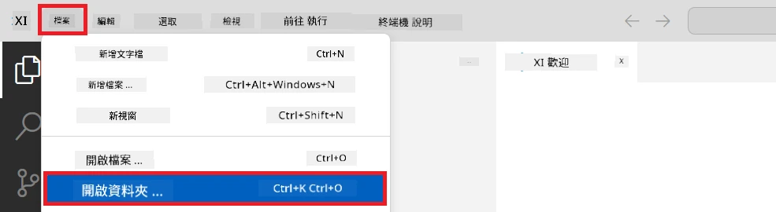

1. 在 Visual Studio Code 左側窗格按右鍵，選擇 **新增檔案**，建立一個名為 *download_dataset.py* 的新檔案。

    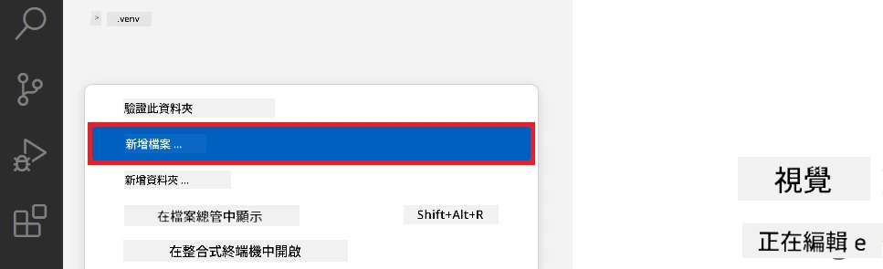

### 準備精調用資料集

在本練習中，你會執行 *download_dataset.py* 檔案，以下載 *ultrachat_200k* 資料集到你本地的環境。接著會使用這個資料集來針對 Azure Machine Learning 中的 Phi-3 模型進行微調。

在本練習中，你將會：

- 在 *download_dataset.py* 檔案中加入下載資料集的程式碼。
- 執行 *download_dataset.py* 檔案，下載資料集到本地環境。

#### 使用 *download_dataset.py* 下載你的資料集

1. 在 Visual Studio Code 中打開 *download_dataset.py* 檔案。

1. 將下列程式碼加入 *download_dataset.py* 檔案中。

    ```python
    import json
    import os
    from datasets import load_dataset

    def load_and_split_dataset(dataset_name, config_name, split_ratio):
        """
        Load and split a dataset.
        """
        # 載入指定名稱、配置及劃分比例的數據集
        dataset = load_dataset(dataset_name, config_name, split=split_ratio)
        print(f"Original dataset size: {len(dataset)}")
        
        # 將數據集劃分為訓練集及測試集（80%訓練，20%測試）
        split_dataset = dataset.train_test_split(test_size=0.2)
        print(f"Train dataset size: {len(split_dataset['train'])}")
        print(f"Test dataset size: {len(split_dataset['test'])}")
        
        return split_dataset

    def save_dataset_to_jsonl(dataset, filepath):
        """
        Save a dataset to a JSONL file.
        """
        # 若目錄不存在則創建目錄
        os.makedirs(os.path.dirname(filepath), exist_ok=True)
        
        # 以寫入模式開啟檔案
        with open(filepath, 'w', encoding='utf-8') as f:
            # 遍歷數據集中的每條記錄
            for record in dataset:
                # 將記錄作為 JSON 物件序列化並寫入檔案
                json.dump(record, f)
                # 寫入換行符分隔紀錄
                f.write('\n')
        
        print(f"Dataset saved to {filepath}")

    def main():
        """
        Main function to load, split, and save the dataset.
        """
        # 載入並劃分具有特定配置及比例的 ULTRACHAT_200k 數據集
        dataset = load_and_split_dataset("HuggingFaceH4/ultrachat_200k", 'default', 'train_sft[:1%]')
        
        # 從劃分結果中提取訓練集及測試集
        train_dataset = dataset['train']
        test_dataset = dataset['test']

        # 將訓練集保存為 JSONL 檔案
        save_dataset_to_jsonl(train_dataset, "data/train_data.jsonl")
        
        # 將測試集保存到另一個 JSONL 檔案
        save_dataset_to_jsonl(test_dataset, "data/test_data.jsonl")

    if __name__ == "__main__":
        main()

    ```

1. 在你的終端機中輸入以下指令，執行腳本並下載資料集到你的本地環境。

    ```console
    python download_dataset.py
    ```

1. 確認資料集已成功保存至本地的 *finetune-phi/data* 目錄。

> [!NOTE]
>
> #### 資料集大小與微調時間說明
>
> 本教學中，你只使用了 1% 的資料集（`split='train[:1%]'`）。這大幅減少了資料量，加快了上傳與微調速度。你可以調整百分比，以取得訓練時間與模型效能間的平衡。使用較小的資料子集可縮短微調所需時間，使教學過程更加可控。

## 情境 2：微調 Phi-3 模型並在 Azure Machine Learning Studio 中部署

### 微調 Phi-3 模型

在本練習中，你將在 Azure Machine Learning Studio 中微調 Phi-3 模型。

在本練習中，你將會：

- 建立用於微調的計算叢集。
- 在 Azure Machine Learning Studio 中微調 Phi-3 模型。

#### 建立微調用計算叢集

1. 前往 [Azure ML Studio](https://ml.azure.com/home?wt.mc_id=studentamb_279723)。

1. 從左側分頁選擇 **計算**。

1. 從導覽選單選擇 **計算叢集**。

1. 選擇 **+ 新增**。

    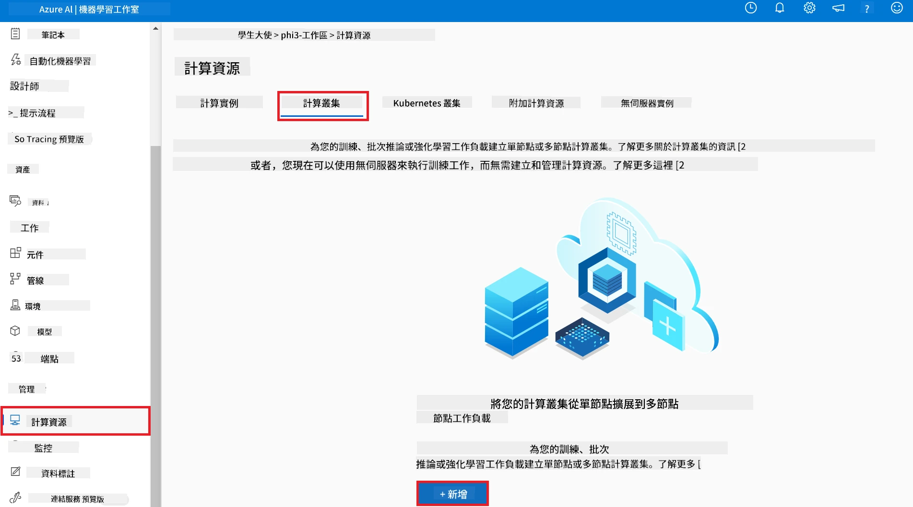

1. 進行以下操作：

    - 選擇你想使用的 **區域**。
    - 將 **虛擬機層級** 選為 **專用**。
    - 將 **虛擬機類型** 選為 **GPU**。
    - 將 **虛擬機大小** 過濾器選為 **從所有選項中選擇**。
    - 選擇 **虛擬機大小** 為 **Standard_NC24ads_A100_v4**。

    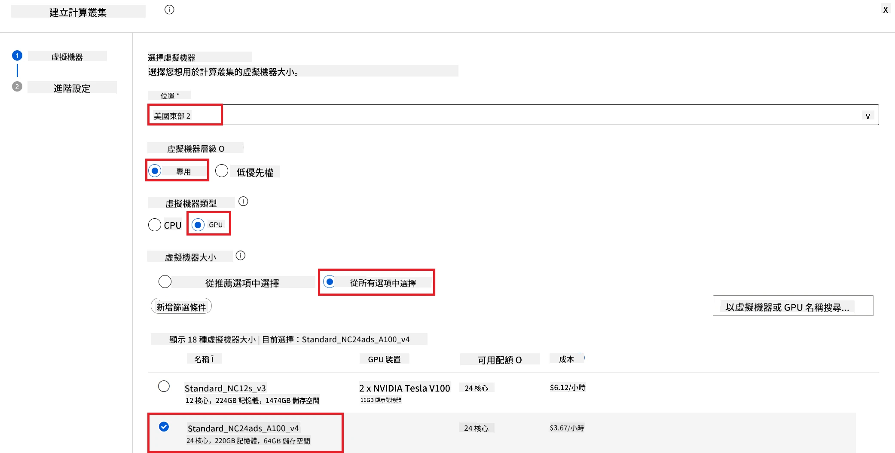

1. 選擇 **下一步**。

1. 進行以下操作：

    - 輸入 **計算名稱**，此名稱必須唯一。
    - 將 **最小節點數量** 設為 **0**。
    - 將 **最大節點數量** 設為 **1**。
    - 將 **空閒秒數後縮放** 設為 **120**。

    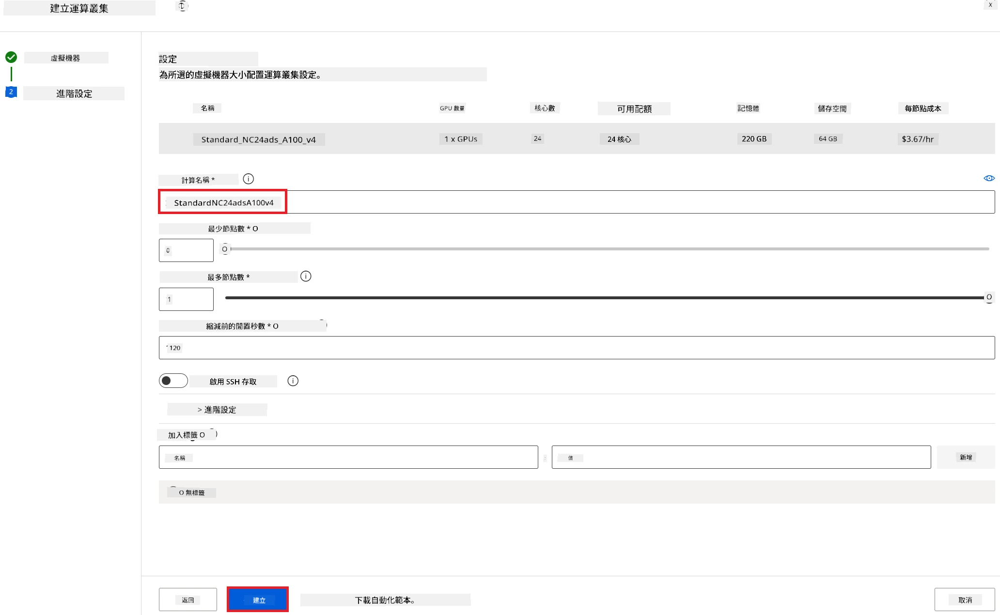

1. 選擇 **建立**。

#### 微調 Phi-3 模型

1. 前往 [Azure ML Studio](https://ml.azure.com/home?wt.mc_id=studentamb_279723)。

1. 選擇你建立的 Azure Machine Learning 工作區。

    

1. 進行以下操作：

    - 從左側分頁選擇 **模型目錄**。
    - 在 **搜尋欄** 輸入 *phi-3-mini-4k*，並從出現的選項中選擇 **Phi-3-mini-4k-instruct**。

    

1. 從導覽選單中選擇 **微調**。

    

1. 進行以下操作：

    - 將 **選擇任務類型** 設為 **聊天完成**。
    - 選擇 **+ 選擇資料** 以上傳 **訓練資料**。
    - 將驗證資料上傳類型設為 **提供不同的驗證資料**。
    - 選擇 **+ 選擇資料** 以上傳 **驗證資料**。

    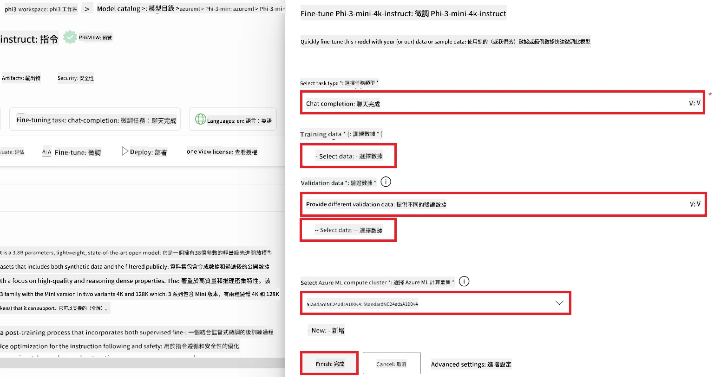

> [!TIP]
>
> 你可以選擇 **進階設定**，自訂像是 **learning_rate** 和 **lr_scheduler_type** 等配置，以最佳化微調流程，符合你的需求。

1. 選擇 **完成**。

1. 在本練習中，你已成功使用 Azure Machine Learning 微調 Phi-3 模型。請注意微調過程可能花費相當時間。執行微調工作後，需要等待完成。你可以透過 Azure Machine Learning 工作區左側的工作標籤來監控微調工作的狀態。接下來的章節將帶你部署微調後的模型並整合至 Prompt flow。

    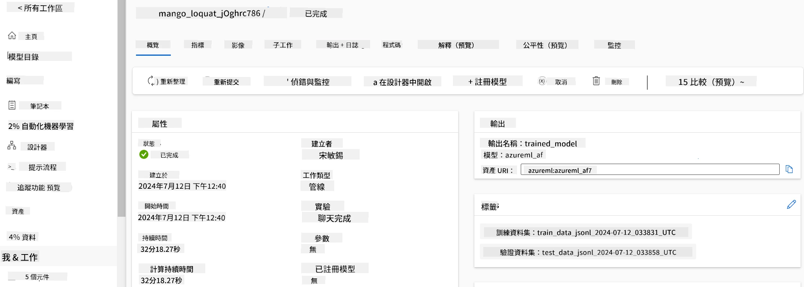

### 部署微調後的 Phi-3 模型

要將微調後的 Phi-3 模型與 Prompt flow 整合，需要先部署模型，使其可用於即時推理。此流程包含模型註冊、建立線上端點與部署模型。

在本練習中，你將：

- 在 Azure Machine Learning 工作區中註冊微調後的模型。
- 建立線上端點。
- 部署註冊的微調後 Phi-3 模型。

#### 註冊微調後的模型

1. 前往 [Azure ML Studio](https://ml.azure.com/home?wt.mc_id=studentamb_279723)。

1. 選擇你建立的 Azure Machine Learning 工作區。

    

1. 從左側分頁中選擇 **模型**。
1. 選擇 **+ 註冊**。
1. 選擇 **從工作輸出**。

    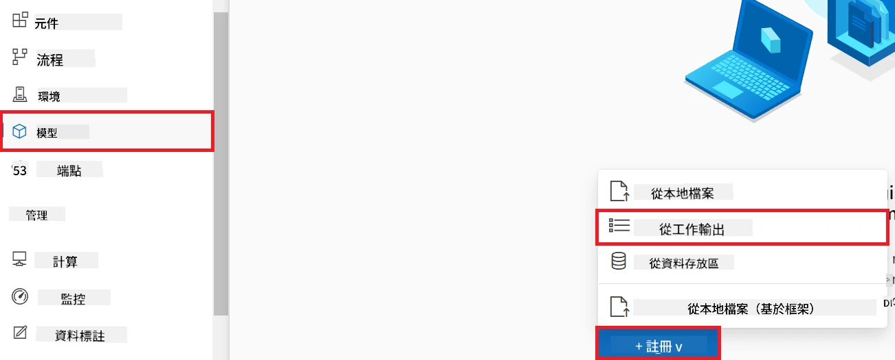

1. 選擇你建立的工作。

    

1. 選擇 **下一步**。

1. 將 **模型類型** 設為 **MLflow**。

1. 確認已選擇 **工作輸出**；應已自動選擇。

    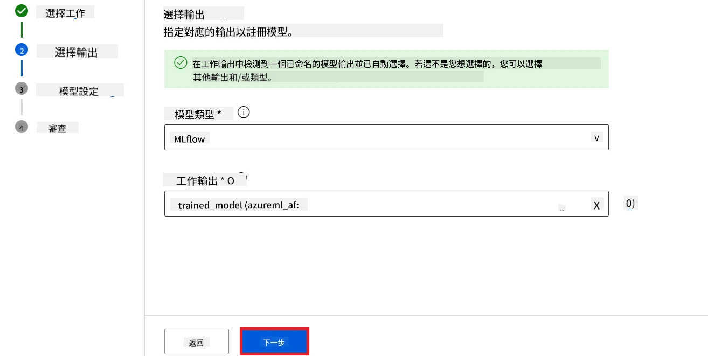

2. 選擇 **下一步**。

3. 選擇 **註冊**。

    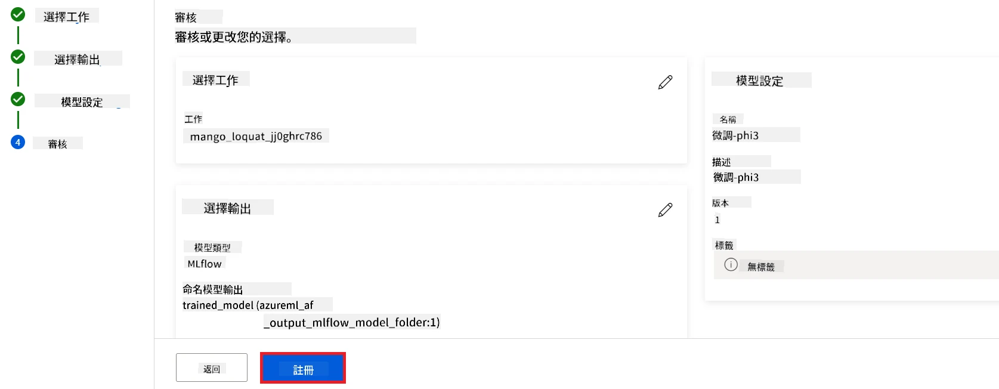

4. 你可以透過左側分頁的 **模型** 頁面查看已註冊的模型。

    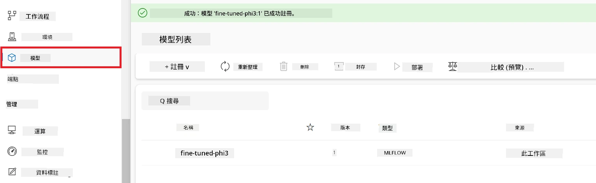

#### 部署微調後的模型

1. 前往你建立的 Azure Machine Learning 工作區。

1. 從左側分頁選擇 **端點**。

1. 從導覽選單選擇 **即時端點**。

    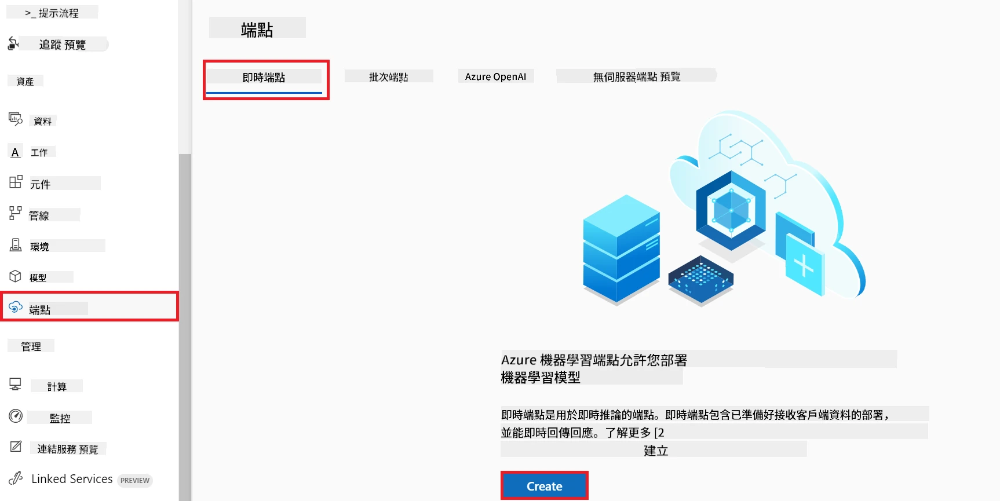

1. 選擇 **建立**。

1. 選擇你註冊的模型。

    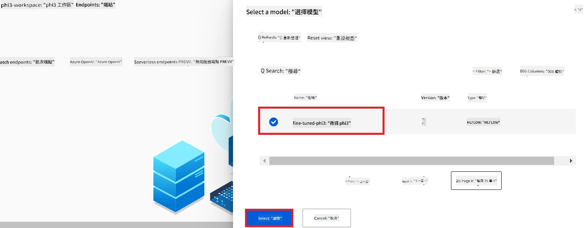

1. 選擇 **選擇**。

1. 進行以下操作：

    - 選擇 **虛擬機** 為 *Standard_NC6s_v3*。
    - 選擇你想使用的 **實例數量**，例如 *1*。
    - 將 **端點** 設為 **新增**，以建立新端點。
    - 輸入 **端點名稱**，必須唯一。
    - 輸入 **部署名稱**，必須唯一。

    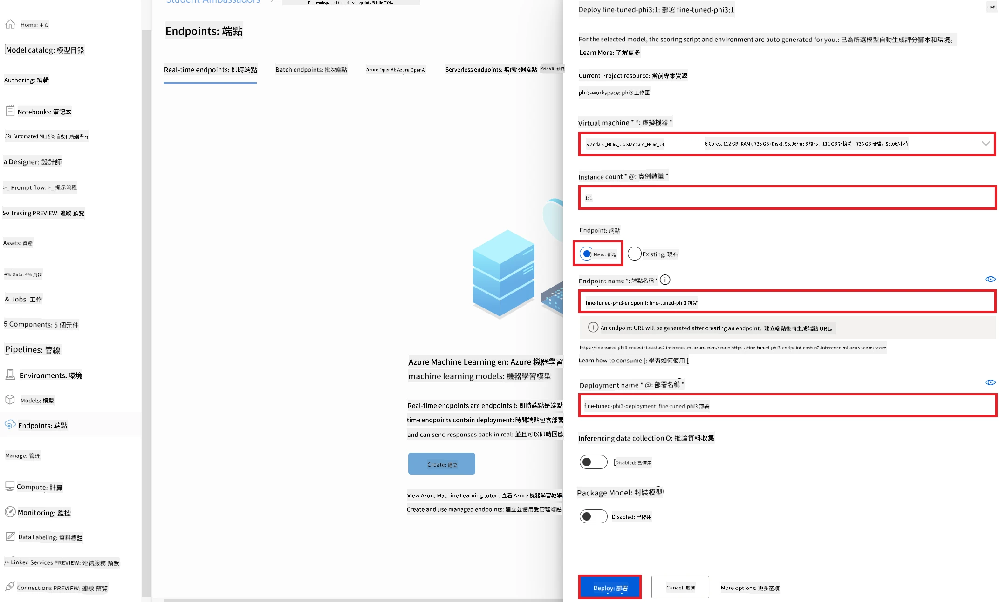

1. 選擇 **部署**。

> [!WARNING]
> 為避免產生額外費用，請務必刪除你在 Azure Machine Learning 工作區中建立的端點。
>

#### 在 Azure Machine Learning 工作區查看部署狀態

1. 前往你建立的 Azure Machine Learning 工作區。

1. 從左側分頁選擇 **端點**。

1. 選擇你建立的端點。

    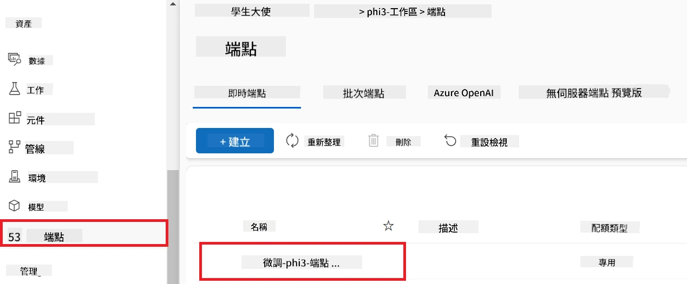

1. 在此頁面中，你可以管理部署過程中的端點。

> [!NOTE]
> 部署完成後，請確保 **即時流量** 設為 **100%**。若不是，請選擇 **更新流量** 以調整流量設定。流量設為 0% 時，無法測試模型。
>
> 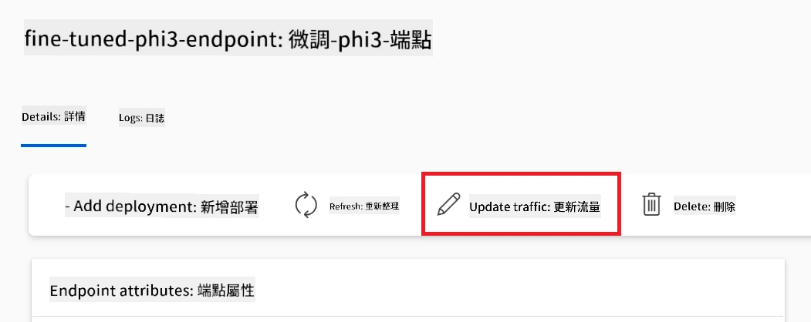
>

## 情境 3：與 Prompt flow 整合並在 Azure AI Foundry 中與你的自訂模型對話

### 將自訂的 Phi-3 模型與 Prompt flow 整合

成功部署微調後的模型後，你可以將其與 Prompt Flow 整合，在即時應用中使用你的模型，實現與自訂 Phi-3 模型的各種互動任務。

在本練習中，你將會：

- 建立 Azure AI Foundry Hub。
- 建立 Azure AI Foundry 專案。
- 建立 Prompt flow。
- 新增微調後 Phi-3 模型的自訂連線。
- 設定 Prompt flow 與你的自訂 Phi-3 模型進行對話。

> [!NOTE]
> 你也可以使用 Azure ML Studio 與 Promptflow 進行整合，整合流程與此相同。

#### 建立 Azure AI Foundry Hub

在建立專案之前，需先建立 Hub。Hub 類似資源群組，讓你能在 Azure AI Foundry 中組織與管理多個專案。

1. 前往 [Azure AI Foundry](https://ai.azure.com/?WT.mc_id=aiml-137032-kinfeylo)。

1. 從左側分頁選擇 **所有 Hub**。

1. 從導覽選單選擇 **+ 新增 Hub**。
    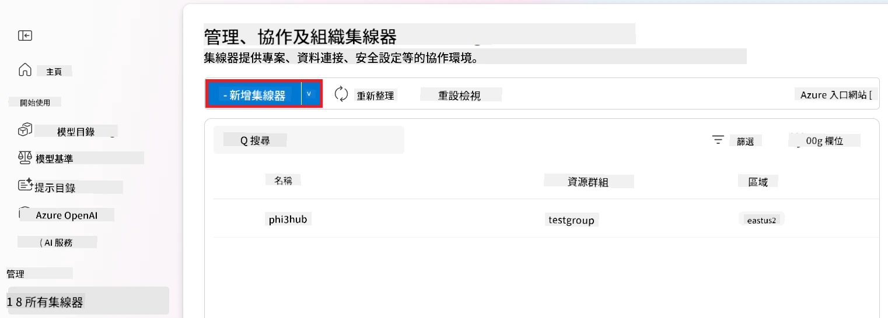

1. 執行以下任務：

    - 輸入 **Hub 名稱**。必須是唯一值。
    - 選擇你的 Azure **訂閱**。
    - 選擇要使用的 **資源群組**（如有需要，請建立新的）。
    - 選擇你想使用的 **位置**。
    - 選擇要使用的 **連接 Azure AI 服務**（如有需要，請建立新的）。
    - 選擇 **連接 Azure AI 搜尋**，並選擇 **跳過連接**。

    

1. 選擇 **下一步**。

#### 建立 Azure AI Foundry 專案

1. 在你建立的 Hub 中，從左側標籤選擇 **所有專案**。

1. 從導航選單選擇 **+ 新專案**。

    

1. 輸入 **專案名稱**。必須是唯一值。

    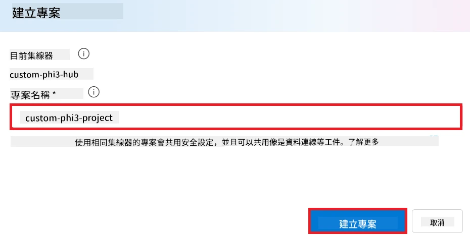

1. 選擇 **建立專案**。

#### 新增自訂連接以連結精調的 Phi-3 模型

要將你的自訂 Phi-3 模型與 Prompt flow 整合，需要將模型的端點和金鑰儲存在自訂連接中。此設定確保您可以在 Prompt flow 中存取你的自訂 Phi-3 模型。

#### 設定精調 Phi-3 模型的 api key 與端點 uri

1. 訪問 [Azure ML Studio](https://ml.azure.com/home?WT.mc_id=aiml-137032-kinfeylo)。

1. 導航到你建立的 Azure 機器學習工作區。

1. 從左側標籤選擇 **端點**。

    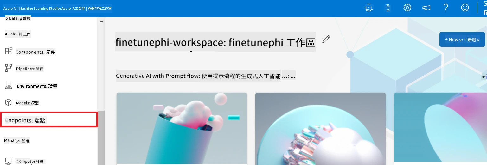

1. 選擇你建立的端點。

    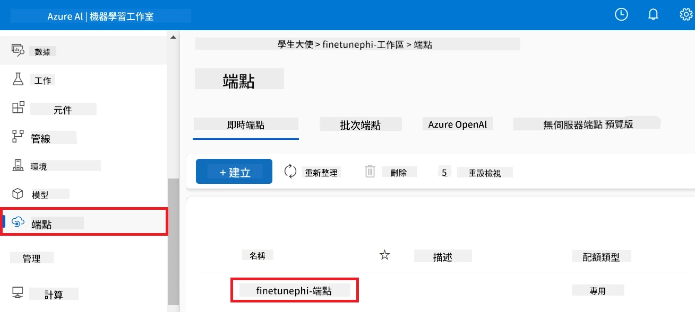

1. 從導航選單選擇 **使用**。

1. 複製你的 **REST 端點** 和 **主金鑰**。

    

#### 新增自訂連接

1. 訪問 [Azure AI Foundry](https://ai.azure.com/?WT.mc_id=aiml-137032-kinfeylo)。

1. 導航到你建立的 Azure AI Foundry 專案。

1. 在你建立的專案中，從左側標籤選擇 **設定**。

1. 選擇 **+ 新增連接**。

    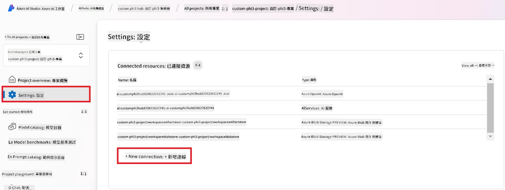

1. 從導航選單選擇 **自訂金鑰**。

    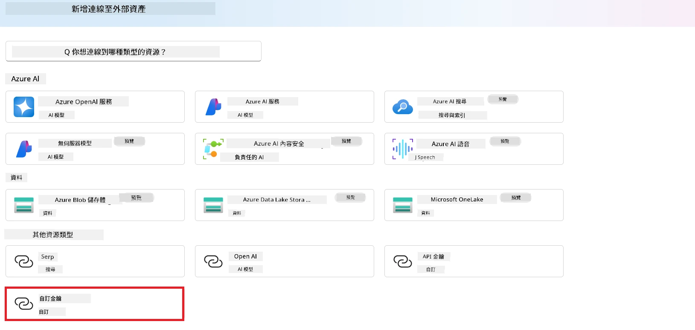

1. 執行以下任務：

    - 選擇 **+ 新增鍵值對**。
    - 在鍵名稱欄位輸入 **endpoint**，並將從 Azure ML Studio 複製的端點貼到值欄位。
    - 再次選擇 **+ 新增鍵值對**。
    - 在鍵名稱欄位輸入 **key**，並將從 Azure ML Studio 複製的金鑰貼到值欄位。
    - 新增鍵值後，選擇 **是機密** 以防止金鑰被曝光。

    

1. 選擇 **新增連接**。

#### 建立 Prompt flow

你已在 Azure AI Foundry 中新增了自訂連接。接下來，使用以下步驟建立一個 Prompt flow。然後，你將把此 Prompt flow 連接至自訂連接，從而在 Prompt flow 中使用精調模型。

1. 導航到你建立的 Azure AI Foundry 專案。

1. 從左側標籤選擇 **Prompt flow**。

1. 從導航選單選擇 **+ 建立**。

    

1. 從導航選單選擇 **聊天流程**。

    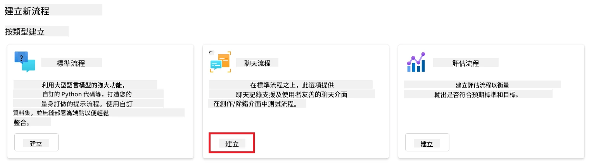

1. 輸入要使用的 **資料夾名稱**。

    

2. 選擇 **建立**。

#### 設定 Prompt flow 以與你的自訂 Phi-3 模型聊天

你需要將精調的 Phi-3 模型整合到 Prompt flow。現有的 Prompt flow 不適用於此目的，因此你必須重新設計 Prompt flow 來實現自訂模型的整合。

1. 在 Prompt flow 中，執行以下任務來重建現有流程：

    - 選擇 **原始檔案模式**。
    - 刪除 *flow.dag.yml* 檔案中所有現有代碼。
    - 將以下代碼新增到 *flow.dag.yml* 檔案中。

        ```yml
        inputs:
          input_data:
            type: string
            default: "Who founded Microsoft?"

        outputs:
          answer:
            type: string
            reference: ${integrate_with_promptflow.output}

        nodes:
        - name: integrate_with_promptflow
          type: python
          source:
            type: code
            path: integrate_with_promptflow.py
          inputs:
            input_data: ${inputs.input_data}
        ```

    - 選擇 **儲存**。

    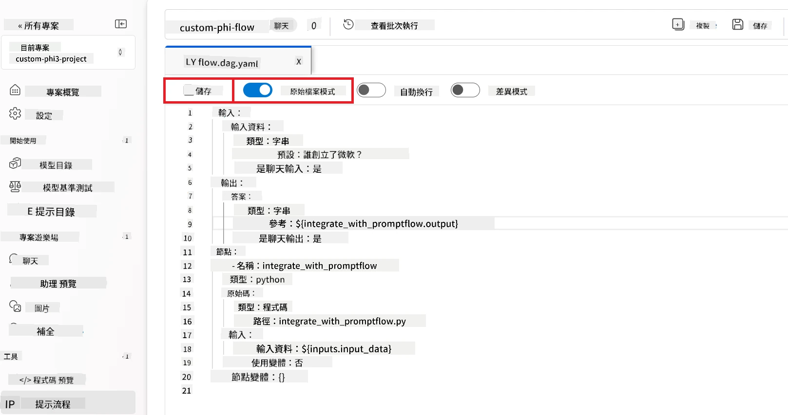

1. 將以下代碼新增到 *integrate_with_promptflow.py* 檔案，以便在 Prompt flow 中使用自訂 Phi-3 模型。

    ```python
    import logging
    import requests
    from promptflow import tool
    from promptflow.connections import CustomConnection

    # 日誌設置
    logging.basicConfig(
        format="%(asctime)s - %(levelname)s - %(name)s - %(message)s",
        datefmt="%Y-%m-%d %H:%M:%S",
        level=logging.DEBUG
    )
    logger = logging.getLogger(__name__)

    def query_phi3_model(input_data: str, connection: CustomConnection) -> str:
        """
        Send a request to the Phi-3 model endpoint with the given input data using Custom Connection.
        """

        # 「connection」係自訂連線嘅名稱，「endpoint」、「key」係自訂連線入面嘅金鑰
        endpoint_url = connection.endpoint
        api_key = connection.key

        headers = {
            "Content-Type": "application/json",
            "Authorization": f"Bearer {api_key}"
        }
        data = {
            "input_data": {
                "input_string": [
                    {"role": "user", "content": input_data}
                ],
                "parameters": {
                    "temperature": 0.7,
                    "max_new_tokens": 128
                }
            }
        }
        try:
            response = requests.post(endpoint_url, json=data, headers=headers)
            response.raise_for_status()
            
            # 紀錄完整嘅 JSON 回應
            logger.debug(f"Full JSON response: {response.json()}")

            result = response.json()["output"]
            logger.info("Successfully received response from Azure ML Endpoint.")
            return result
        except requests.exceptions.RequestException as e:
            logger.error(f"Error querying Azure ML Endpoint: {e}")
            raise

    @tool
    def my_python_tool(input_data: str, connection: CustomConnection) -> str:
        """
        Tool function to process input data and query the Phi-3 model.
        """
        return query_phi3_model(input_data, connection)

    ```

    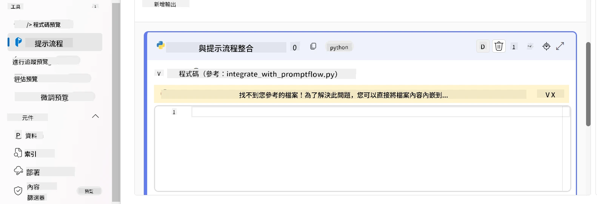

> [!NOTE]
> 有關在 Azure AI Foundry 中使用 Prompt flow 的更詳細資訊，請參考 [Azure AI Foundry 中的 Prompt flow](https://learn.microsoft.com/azure/ai-studio/how-to/prompt-flow)。

1. 選擇 **聊天輸入**、**聊天輸出** 以啟用與模型的聊天。

    

1. 現在你已準備好與自訂 Phi-3 模型聊天。在下一個練習中，你將學習如何啟動 Prompt flow 並使用其與精調的 Phi-3 模型聊天。

> [!NOTE]
>
> 重建後的流程應該看起來如下圖：
>
> 
>

### 與你的自訂 Phi-3 模型聊天

現在你已經完成精調並將自訂 Phi-3 模型與 Prompt flow 整合，準備與它開始互動。此練習將指導你設定並啟動與模型聊天的流程。透過遵循這些步驟，你將能充分利用精調 Phi-3 模型用於各種任務和對話的能力。

- 使用 Prompt flow 與你的自訂 Phi-3 模型聊天。

#### 啟動 Prompt flow

1. 選擇 **啟動計算會話** 以啟動 Prompt flow。

    

1. 選擇 **驗證與解析輸入** 以更新參數。

    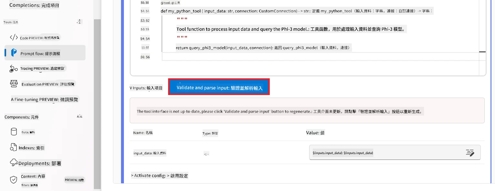

1. 選擇 **連接** 的 **值**，並選擇你建立的自訂連接。例如，*connection*。

    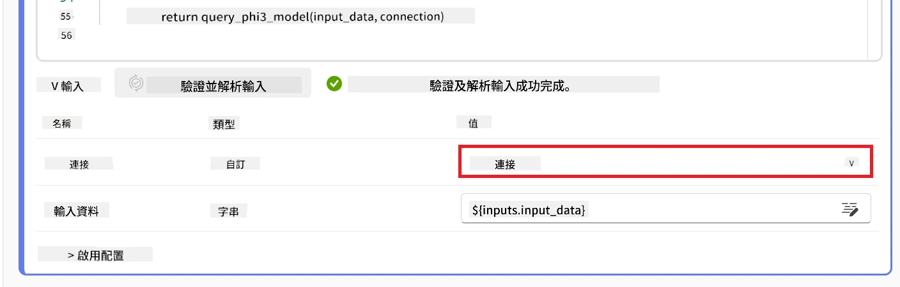

#### 與你的自訂模型聊天

1. 選擇 **聊天**。

    

1. 以下是結果範例：現在你可以與你的自訂 Phi-3 模型聊天。建議依據用於精調的資料提出問題。

    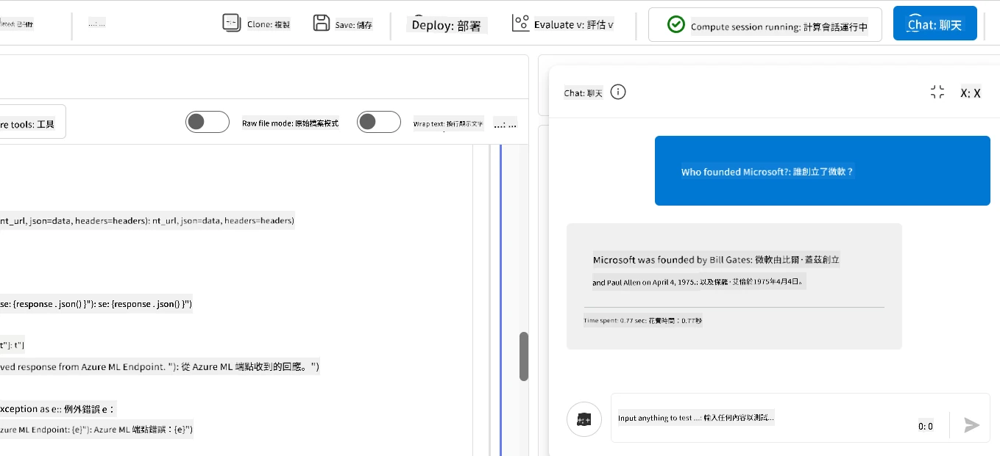

---

<!-- CO-OP TRANSLATOR DISCLAIMER START -->
**聲明**：  
本文件係使用 AI 翻譯服務 [Co-op Translator](https://github.com/Azure/co-op-translator) 所翻譯。雖然我哋致力確保準確性，但請注意，自動翻譯可能包含錯誤或不準確之處。原始文件嘅母語版本應視為權威來源。對於重要資訊，建議採用專業人手翻譯。本公司對因使用此翻譯而引致嘅任何誤解或誤釋概不負責。
<!-- CO-OP TRANSLATOR DISCLAIMER END -->