<!--
CO_OP_TRANSLATOR_METADATA:
{
  "original_hash": "ed86d361ac6d4cc8bfb47428e6a2a247",
  "translation_date": "2025-04-04T18:14:45+00:00",
  "source_file": "md\\02.Application\\01.TextAndChat\\Phi3\\E2E_Phi-3-FineTuning_PromptFlow_Integration_AIFoundry.md",
  "language_code": "hk"
}
-->
# 微調及整合自訂 Phi-3 模型與 Azure AI Foundry 中的 Prompt Flow

這個端到端（E2E）範例基於 Microsoft Tech Community 的指南「[Fine-Tune and Integrate Custom Phi-3 Models with Prompt Flow in Azure AI Foundry](https://techcommunity.microsoft.com/t5/educator-developer-blog/fine-tune-and-integrate-custom-phi-3-models-with-prompt-flow-in/ba-p/4191726?WT.mc_id=aiml-137032-kinfeylo)」，介紹如何在 Azure AI Foundry 中微調、部署及整合自訂 Phi-3 模型與 Prompt Flow。與端到端範例「[Fine-Tune and Integrate Custom Phi-3 Models with Prompt Flow](./E2E_Phi-3-FineTuning_PromptFlow_Integration.md)」不同的是，本教程完全專注於在 Azure AI / ML Studio 中微調和整合模型，而不涉及本地執行代碼。

## 概述

在此端到端範例中，您將學習如何微調 Phi-3 模型並將其整合到 Azure AI Foundry 的 Prompt Flow 中。藉助 Azure AI / ML Studio，您將建立一個工作流程來部署和使用自訂 AI 模型。此端到端範例分為三個場景：

**場景 1：設置 Azure 資源並準備微調**

**場景 2：微調 Phi-3 模型並部署到 Azure Machine Learning Studio**

**場景 3：整合到 Prompt Flow 並在 Azure AI Foundry 中與您的自訂模型進行交互**

以下是此端到端範例的概述。

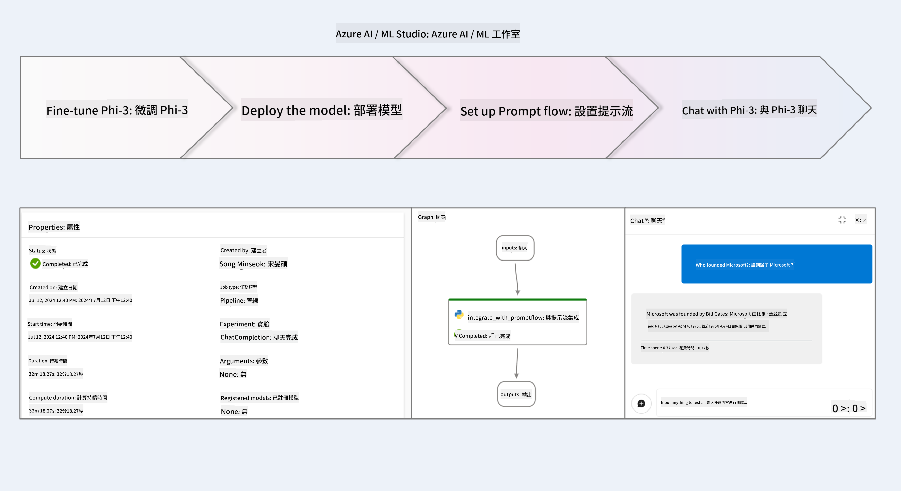

### 目錄

1. **[場景 1：設置 Azure 資源並準備微調](../../../../../../md/02.Application/01.TextAndChat/Phi3)**
    - [創建 Azure Machine Learning 工作區](../../../../../../md/02.Application/01.TextAndChat/Phi3)
    - [在 Azure 訂閱中申請 GPU 配額](../../../../../../md/02.Application/01.TextAndChat/Phi3)
    - [添加角色分配](../../../../../../md/02.Application/01.TextAndChat/Phi3)
    - [設置項目](../../../../../../md/02.Application/01.TextAndChat/Phi3)
    - [準備微調所需的數據集](../../../../../../md/02.Application/01.TextAndChat/Phi3)

1. **[場景 2：微調 Phi-3 模型並部署到 Azure Machine Learning Studio](../../../../../../md/02.Application/01.TextAndChat/Phi3)**
    - [微調 Phi-3 模型](../../../../../../md/02.Application/01.TextAndChat/Phi3)
    - [部署微調後的 Phi-3 模型](../../../../../../md/02.Application/01.TextAndChat/Phi3)

1. **[場景 3：整合到 Prompt Flow 並在 Azure AI Foundry 中與您的自訂模型進行交互](../../../../../../md/02.Application/01.TextAndChat/Phi3)**
    - [將自訂 Phi-3 模型整合到 Prompt Flow](../../../../../../md/02.Application/01.TextAndChat/Phi3)
    - [與您的自訂 Phi-3 模型進行交互](../../../../../../md/02.Application/01.TextAndChat/Phi3)

## 場景 1：設置 Azure 資源並準備微調

### 創建 Azure Machine Learning 工作區

1. 在入口網站頁面的**搜索欄**中輸入 *azure machine learning*，並從出現的選項中選擇 **Azure Machine Learning**。

    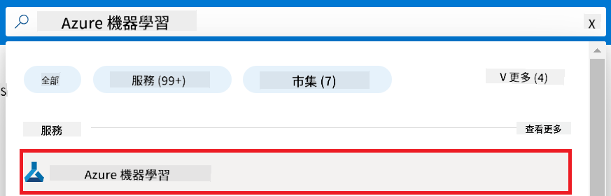

2. 從導航菜單中選擇 **+ 創建**。

3. 從導航菜單中選擇 **新工作區**。

    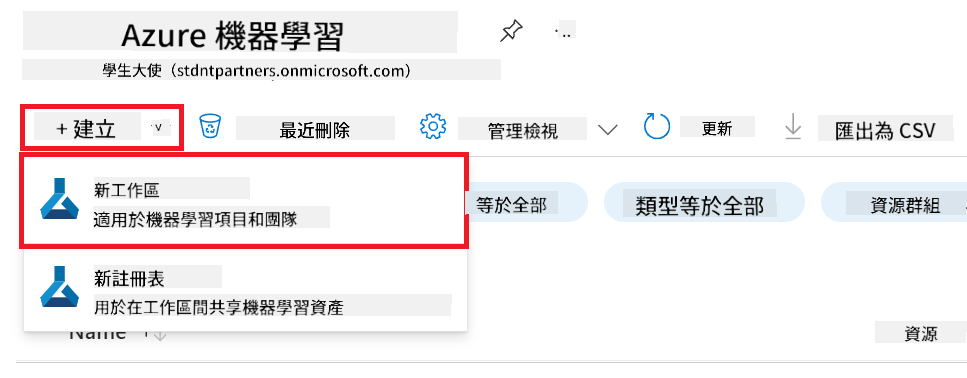

4. 完成以下任務：

    - 選擇您的 Azure **訂閱**。
    - 選擇要使用的**資源組**（如有需要可創建新的）。
    - 輸入 **工作區名稱**，需為唯一值。
    - 選擇您希望使用的**區域**。
    - 選擇要使用的**存儲帳戶**（如有需要可創建新的）。
    - 選擇要使用的**密鑰保管庫**（如有需要可創建新的）。
    - 選擇要使用的**應用洞察**（如有需要可創建新的）。
    - 選擇要使用的**容器註冊表**（如有需要可創建新的）。

    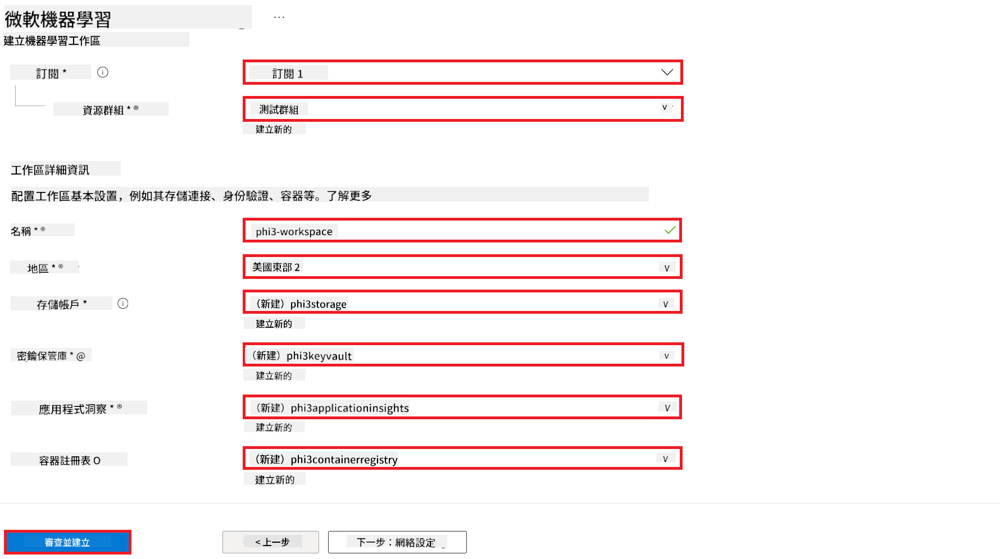

5. 選擇 **檢查 + 創建**。

6. 選擇 **創建**。

### 在 Azure 訂閱中申請 GPU 配額

在本教程中，您將使用 GPU 微調並部署 Phi-3 模型。微調使用 *Standard_NC24ads_A100_v4* GPU，部署使用 *Standard_NC6s_v3* GPU，兩者均需要申請配額。

> [!NOTE]
>
> 只有「按需付費」訂閱（標準訂閱類型）才有資格分配 GPU；目前不支持福利訂閱。
>

1. 訪問 [Azure ML Studio](https://ml.azure.com/home?wt.mc_id=studentamb_279723)。

1. 執行以下任務以申請 *Standard NCADSA100v4 Family* 配額：

    - 從左側選項卡中選擇 **配額**。
    - 選擇要使用的**虛擬機系列**，例如 **Standard NCADSA100v4 Family Cluster Dedicated vCPUs**，其中包含 *Standard_NC24ads_A100_v4* GPU。
    - 從導航菜單中選擇 **申請配額**。

        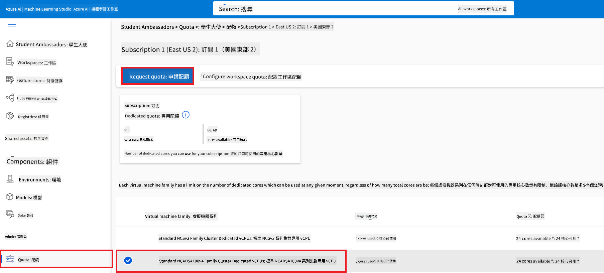

    - 在申請配額頁面中，輸入您希望使用的**新核心限制**，例如 24。
    - 在申請配額頁面中，選擇 **提交**以申請 GPU 配額。

1. 執行以下任務以申請 *Standard NCSv3 Family* 配額：

    - 從左側選項卡中選擇 **配額**。
    - 選擇要使用的**虛擬機系列**，例如 **Standard NCSv3 Family Cluster Dedicated vCPUs**，其中包含 *Standard_NC6s_v3* GPU。
    - 從導航菜單中選擇 **申請配額**。
    - 在申請配額頁面中，輸入您希望使用的**新核心限制**，例如 24。
    - 在申請配額頁面中，選擇 **提交**以申請 GPU 配額。

### 添加角色分配

要微調和部署您的模型，您需要先創建一個「用戶分配的托管身份」（UAI），並為其分配適當的權限。此 UAI 將在部署期間用於身份驗證。

#### 創建用戶分配的托管身份（UAI）

1. 在入口網站頁面的**搜索欄**中輸入 *managed identities*，並從出現的選項中選擇 **Managed Identities**。

    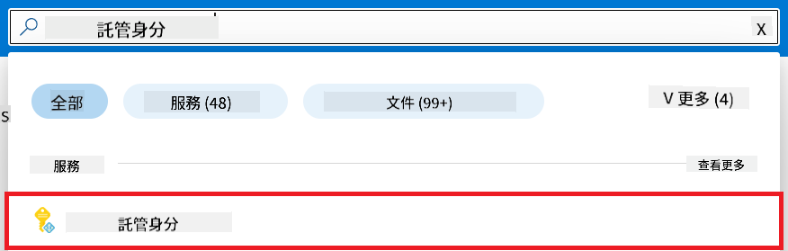

1. 選擇 **+ 創建**。

    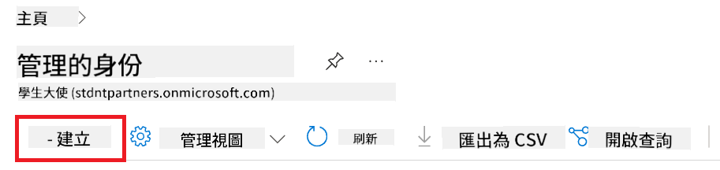

1. 完成以下任務：

    - 選擇您的 Azure **訂閱**。
    - 選擇要使用的**資源組**（如有需要可創建新的）。
    - 選擇您希望使用的**區域**。
    - 輸入 **名稱**，需為唯一值。

    

1. 選擇 **檢查 + 創建**。

1. 選擇 **+ 創建**。

#### 為托管身份添加 Contributor 角色分配

1. 導航到您創建的托管身份資源。

1. 從左側選項卡中選擇 **Azure 角色分配**。

1. 從導航菜單中選擇 **+ 添加角色分配**。

1. 在添加角色分配頁面中，完成以下任務：
    - 將**範圍**設置為 **資源組**。
    - 選擇您的 Azure **訂閱**。
    - 選擇要使用的**資源組**。
    - 將**角色**設置為 **Contributor**。

    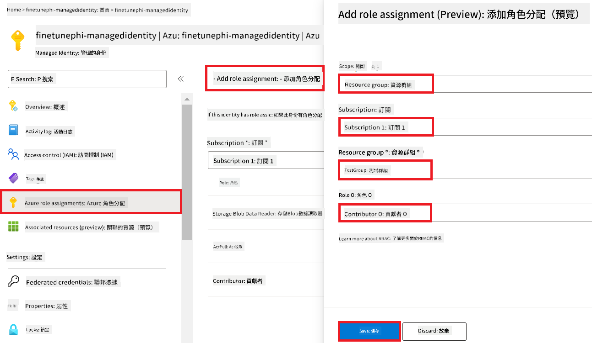

2. 選擇 **保存**。

#### 為托管身份添加 Storage Blob Data Reader 角色分配

1. 在入口網站頁面的**搜索欄**中輸入 *storage accounts*，並從出現的選項中選擇 **Storage accounts**。

    

1. 選擇與您創建的 Azure Machine Learning 工作區相關聯的存儲帳戶。例如，*finetunephistorage*。

1. 執行以下任務以導航到添加角色分配頁面：

    - 導航到您創建的 Azure 存儲帳戶。
    - 從左側選項卡中選擇 **訪問控制（IAM）**。
    - 從導航菜單中選擇 **+ 添加**。
    - 從導航菜單中選擇 **添加角色分配**。

    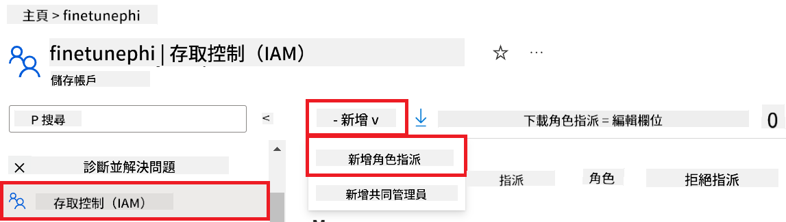

1. 在添加角色分配頁面中，完成以下任務：

    - 在角色頁面中，在**搜索欄**中輸入 *Storage Blob Data Reader*，並從出現的選項中選擇 **Storage Blob Data Reader**。
    - 在角色頁面中，選擇 **下一步**。
    - 在成員頁面中，選擇 **分配訪問給** **托管身份**。
    - 在成員頁面中，選擇 **+ 選擇成員**。
    - 在選擇托管身份頁面中，選擇您的 Azure **訂閱**。
    - 在選擇托管身份頁面中，選擇 **托管身份**至 **托管身份**。
    - 在選擇托管身份頁面中，選擇您創建的托管身份。例如，*finetunephi-managedidentity*。
    - 在選擇托管身份頁面中，選擇 **選擇**。

    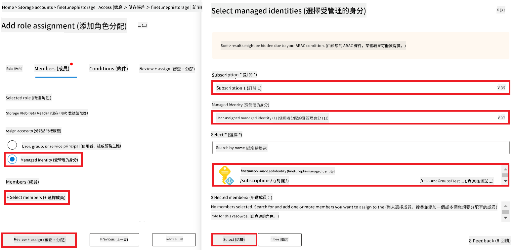

1. 選擇 **檢查 + 分配**。

#### 為托管身份添加 AcrPull 角色分配

1. 在入口網站頁面的**搜索欄**中輸入 *container registries*，並從出現的選項中選擇 **Container registries**。

    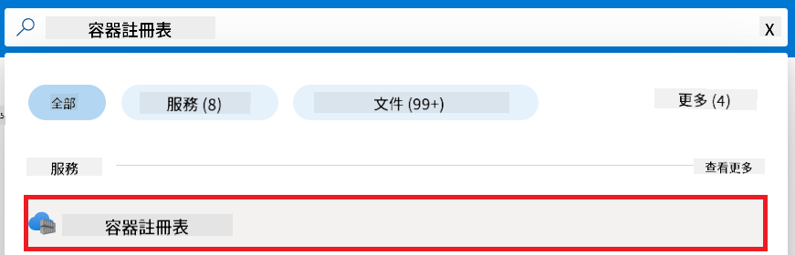

1. 選擇與 Azure Machine Learning 工作區相關聯的容器註冊表。例如，*finetunephicontainerregistry*。

1. 執行以下任務以導航到添加角色分配頁面：

    - 從左側選項卡中選擇 **訪問控制（IAM）**。
    - 從導航菜單中選擇 **+ 添加**。
    - 從導航菜單中選擇 **添加角色分配**。

1. 在添加角色分配頁面中，完成以下任務：

    - 在角色頁面中，在**搜索欄**中輸入 *AcrPull*，並從出現的選項中選擇 **AcrPull**。
    - 在角色頁面中，選擇 **下一步**。
    - 在成員頁面中，選擇 **分配訪問給** **托管身份**。
    - 在成員頁面中，選擇 **+ 選擇成員**。
    - 在選擇托管身份頁面中，選擇您的 Azure **訂閱**。
    - 在選擇托管身份頁面中，選擇 **托管身份**至 **托管身份**。
    - 在選擇托管身份頁面中，選擇您創建的托管身份。例如，*finetunephi-managedidentity*。
    - 在選擇托管身份頁面中，選擇 **選擇**。
    - 選擇 **檢查 + 分配**。

### 設置項目

為下載微調所需的數據集，您需要設置本地環境。

在此操作中，您將：

- 創建一個工作文件夾。
- 創建虛擬環境。
- 安裝所需的套件。
- 創建 *download_dataset.py* 文件以下載數據集。

#### 創建工作文件夾

1. 打開終端窗口，輸入以下命令以在默認路徑中創建名為 *finetune-phi* 的文件夾。

    ```console
    mkdir finetune-phi
    ```

2. 在終端中輸入以下命令以進入您創建的 *finetune-phi* 文件夾。

    ```console
    cd finetune-phi
    ```

#### 創建虛擬環境

1. 在終端中輸入以下命令以創建名為 *.venv* 的虛擬環境。

    ```console
    python -m venv .venv
    ```

2. 在終端中輸入以下命令以激活虛擬環境。

    ```console
    .venv\Scripts\activate.bat
    ```

> [!NOTE]
> 如果成功，您應該能在命令提示符前看到 *(.venv)*。

#### 安裝所需的套件

1. 在終端中輸入以下命令以安裝所需的套件。

    ```console
    pip install datasets==2.19.1
    ```

#### 創建 `download_dataset.py`

> [!NOTE]
> 完整文件夾結構：
>
> ```text
> └── YourUserName
> .    └── finetune-phi
> .        └── download_dataset.py
> ```

1. 打開 **Visual Studio Code**。

1. 從菜單欄中選擇 **文件**。

1. 選擇 **打開文件夾**。

1. 選擇您創建的 *finetune-phi* 文件夾，位於 *C:\Users\yourUserName\finetune-phi*。

    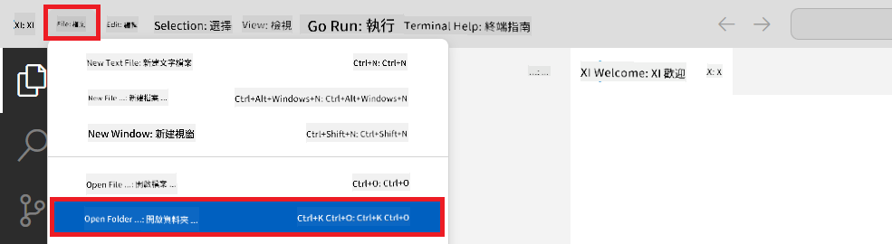

1. 在 Visual Studio Code 的左側窗格中右鍵點擊並選擇 **新建文件**，以創建名為 *download_dataset.py* 的新文件。

    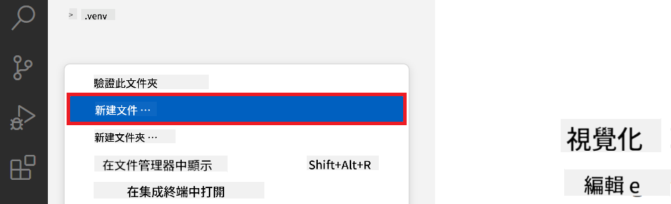

### 準備微調所需的數據集

在此操作中，您將運行 *download_dataset.py* 文件以將 *ultrachat_200k* 數據集下載到您的本地環境。您將使用此數據集在 Azure Machine Learning 中微調 Phi-3 模型。

在此操作中，您將：

- 在 *download_dataset.py* 文件中添加代碼以下載數據集。
- 運行 *download_dataset.py* 文件以將數據集下載到您的本地環境。

#### 使用 *download_dataset.py* 下載您的數據集

1. 在 Visual Studio Code 中打開 *download_dataset.py* 文件。

1. 在 *download_dataset.py* 文件中添加以下代碼。

    ```python
    import json
    import os
    from datasets import load_dataset

    def load_and_split_dataset(dataset_name, config_name, split_ratio):
        """
        Load and split a dataset.
        """
        # Load the dataset with the specified name, configuration, and split ratio
        dataset = load_dataset(dataset_name, config_name, split=split_ratio)
        print(f"Original dataset size: {len(dataset)}")
        
        # Split the dataset into train and test sets (80% train, 20% test)
        split_dataset = dataset.train_test_split(test_size=0.2)
        print(f"Train dataset size: {len(split_dataset['train'])}")
        print(f"Test dataset size: {len(split_dataset['test'])}")
        
        return split_dataset

    def save_dataset_to_jsonl(dataset, filepath):
        """
        Save a dataset to a JSONL file.
        """
        # Create the directory if it does not exist
        os.makedirs(os.path.dirname(filepath), exist_ok=True)
        
        # Open the file in write mode
        with open(filepath, 'w', encoding='utf-8') as f:
            # Iterate over each record in the dataset
            for record in dataset:
                # Dump the record as a JSON object and write it to the file
                json.dump(record, f)
                # Write a newline character to separate records
                f.write('\n')
        
        print(f"Dataset saved to {filepath}")

    def main():
        """
        Main function to load, split, and save the dataset.
        """
        # Load and split the ULTRACHAT_200k dataset with a specific configuration and split ratio
        dataset = load_and_split_dataset("HuggingFaceH4/ultrachat_200k", 'default', 'train_sft[:1%]')
        
        # Extract the train and test datasets from the split
        train_dataset = dataset['train']
        test_dataset = dataset['test']

        # Save the train dataset to a JSONL file
        save_dataset_to_jsonl(train_dataset, "data/train_data.jsonl")
        
        # Save the test dataset to a separate JSONL file
        save_dataset_to_jsonl(test_dataset, "data/test_data.jsonl")

    if __name__ == "__main__":
        main()

    ```

1. 在終端中輸入以下命令以運行腳本並將數據集下載到您的本地環境。

    ```console
    python download_dataset.py
    ```

1. 驗證數據集是否成功保存到您的本地 *finetune-phi/data* 目錄。

> [!NOTE]
>
> #### 關於數據集大小及微調時間的注意事項
>
> 在本教程中，您僅使用數據集的 1%（`split='train[:1%]'`）。這顯著減少了數據量，加快了上傳和微調過程。您可以調整百分比以找到訓練時間和模型性能之間的最佳平衡。使用較小的數據集子集能減少微調所需時間，使教程過程更易管理。

## 場景 2：微調 Phi-3 模型並部署到 Azure Machine Learning Studio


1. 訪問 [Azure ML Studio](https://ml.azure.com/home?wt.mc_id=studentamb_279723)。

1. 從左側選單選擇 **Compute**。

1. 在導航欄中選擇 **Compute clusters**。

1. 點擊 **+ New**。

    

1. 完成以下操作：

    - 選擇你想使用的 **Region**。
    - 將 **Virtual machine tier** 設置為 **Dedicated**。
    - 將 **Virtual machine type** 設置為 **GPU**。
    - 將 **Virtual machine size** 篩選設置為 **Select from all options**。
    - 將 **Virtual machine size** 設置為 **Standard_NC24ads_A100_v4**。

    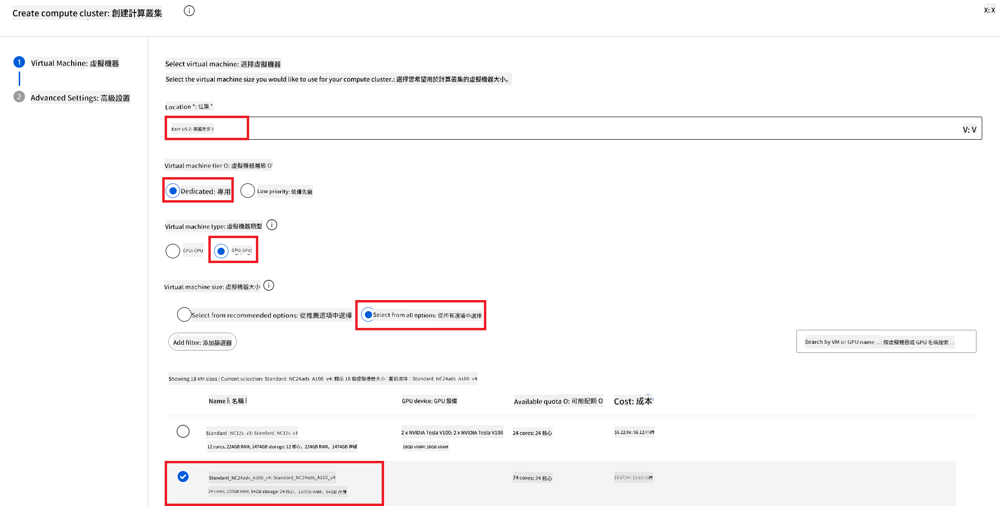

1. 點擊 **Next**。

1. 完成以下操作：

    - 輸入 **Compute name**，必須是唯一值。
    - 將 **Minimum number of nodes** 設置為 **0**。
    - 將 **Maximum number of nodes** 設置為 **1**。
    - 將 **Idle seconds before scale down** 設置為 **120**。

    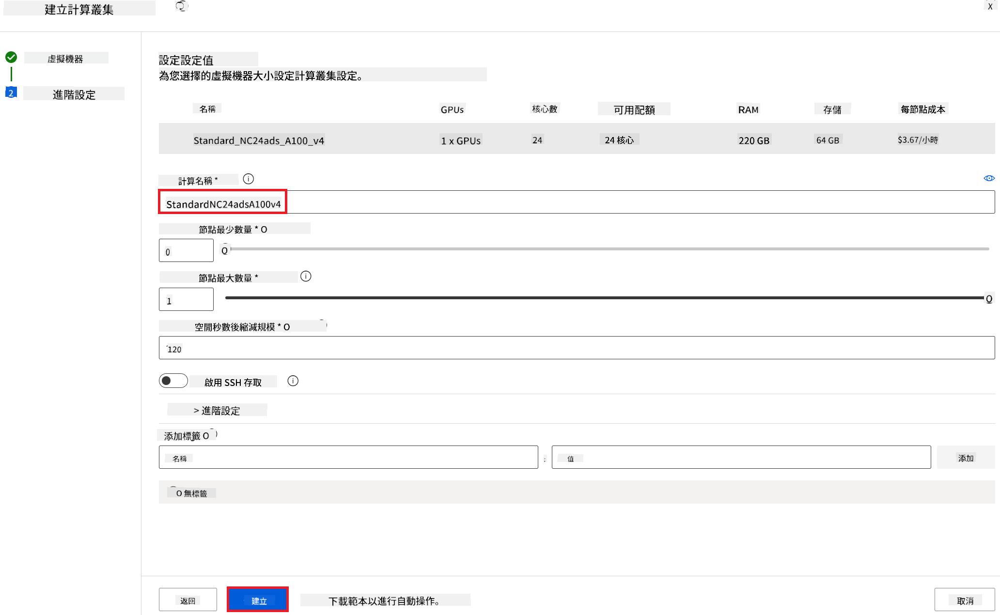

1. 點擊 **Create**。

#### 微調 Phi-3 模型

1. 訪問 [Azure ML Studio](https://ml.azure.com/home?wt.mc_id=studentamb_279723)。

1. 選擇你創建的 Azure Machine Learning 工作區。

    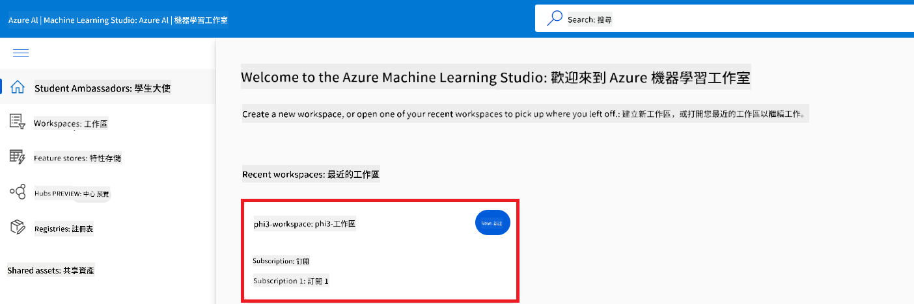

1. 完成以下操作：

    - 從左側選單選擇 **Model catalog**。
    - 在 **搜索欄**中輸入 *phi-3-mini-4k*，並從出現的選項中選擇 **Phi-3-mini-4k-instruct**。

    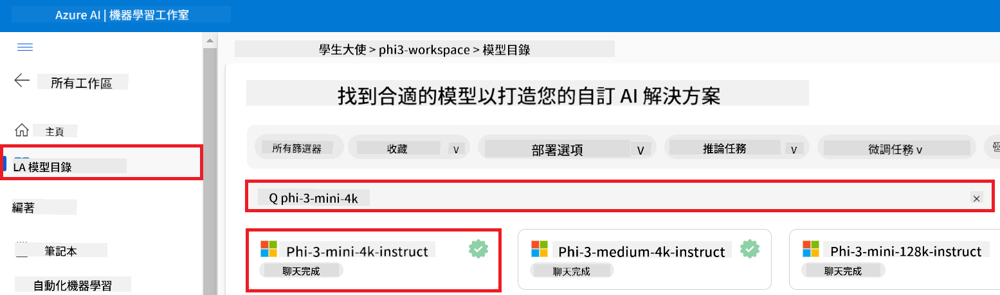

1. 從導航欄選擇 **Fine-tune**。

    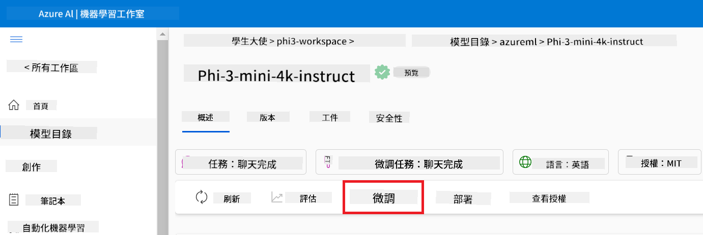

1. 完成以下操作：

    - 將 **Select task type** 設置為 **Chat completion**。
    - 點擊 **+ Select data** 上傳 **Training data**。
    - 將驗證數據上傳類型設置為 **Provide different validation data**。
    - 點擊 **+ Select data** 上傳 **Validation data**。

    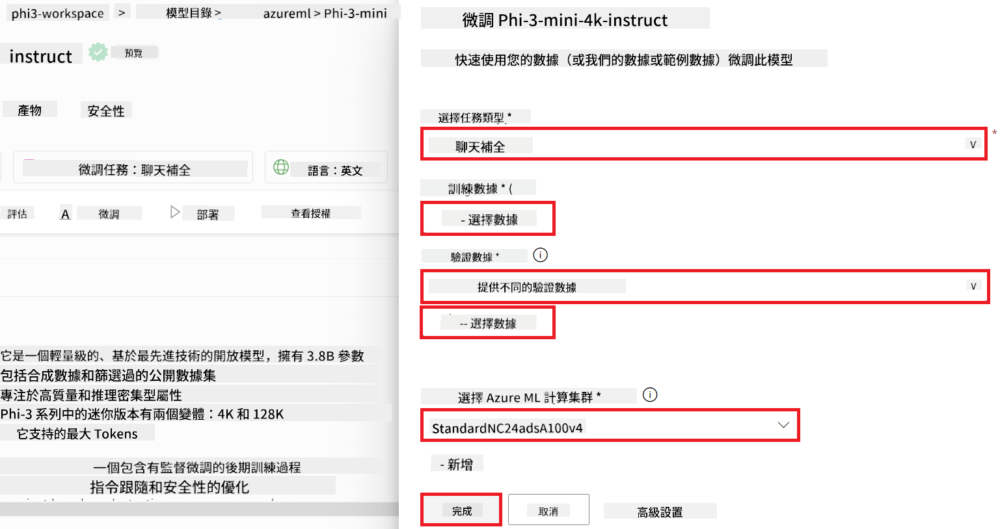

    > [!TIP]
    >
    > 你可以選擇 **Advanced settings** 自定義配置，例如 **learning_rate** 和 **lr_scheduler_type**，以根據你的特定需求優化微調過程。

1. 點擊 **Finish**。

1. 在本練習中，你成功使用 Azure Machine Learning 微調了 Phi-3 模型。請注意，微調過程可能需要較長時間。運行微調任務後，你需要等待其完成。你可以通過導航到 Azure Machine Learning 工作區左側的 Jobs 標籤來監控微調任務的狀態。在下一系列中，你將部署微調模型並與 Prompt flow 集成。

    

### 部署微調後的 Phi-3 模型

要將微調後的 Phi-3 模型與 Prompt flow 集成，你需要部署模型以便進行實時推斷。此過程包括註冊模型、創建在線端點以及部署模型。

在本練習中，你將：

- 在 Azure Machine Learning 工作區註冊微調模型。
- 創建在線端點。
- 部署已註冊的微調 Phi-3 模型。

#### 註冊微調模型

1. 訪問 [Azure ML Studio](https://ml.azure.com/home?wt.mc_id=studentamb_279723)。

1. 選擇你創建的 Azure Machine Learning 工作區。

    

1. 從左側選單選擇 **Models**。
1. 點擊 **+ Register**。
1. 選擇 **From a job output**。

    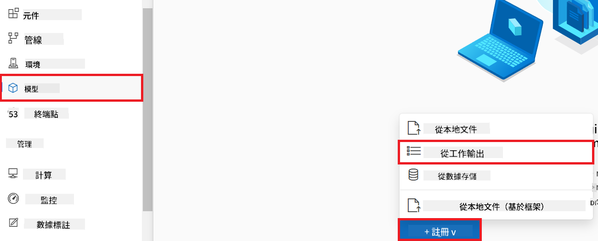

1. 選擇你創建的任務。

    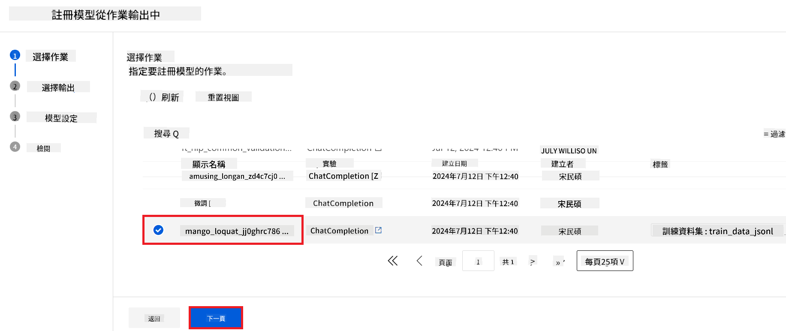

1. 點擊 **Next**。

1. 將 **Model type** 設置為 **MLflow**。

1. 確保 **Job output** 被選中；它應該自動被選中。

    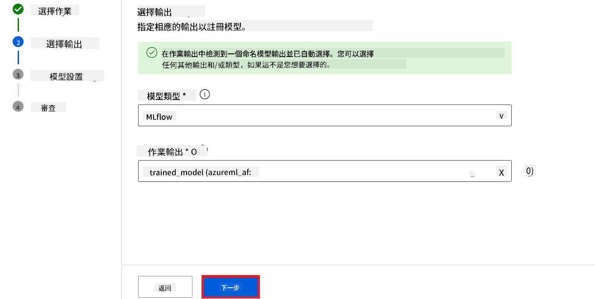

2. 點擊 **Next**。

3. 點擊 **Register**。

    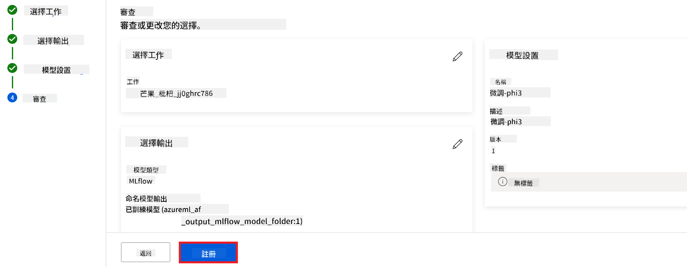

4. 你可以通過導航到左側選單的 **Models** 來查看已註冊的模型。

    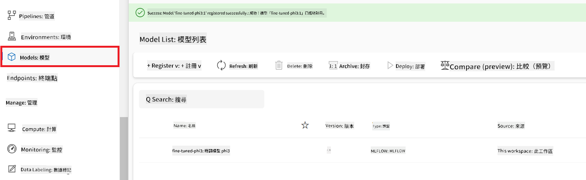

#### 部署微調模型

1. 導航到你創建的 Azure Machine Learning 工作區。

1. 從左側選單選擇 **Endpoints**。

1. 在導航欄中選擇 **Real-time endpoints**。

    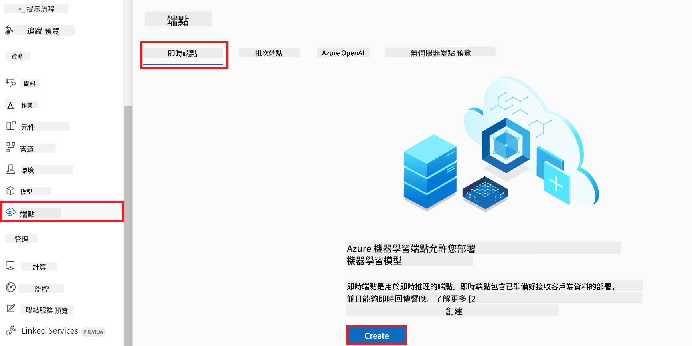

1. 點擊 **Create**。

1. 選擇你創建的已註冊模型。

    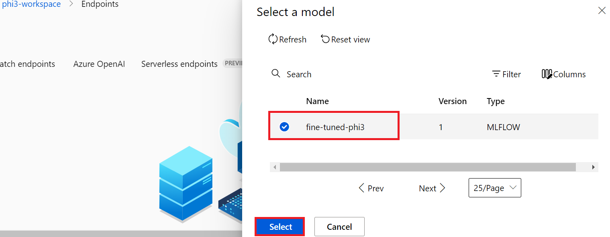

1. 點擊 **Select**。

1. 完成以下操作：

    - 將 **Virtual machine** 設置為 *Standard_NC6s_v3*。
    - 選擇你想使用的 **Instance count**，例如 *1*。
    - 將 **Endpoint** 設置為 **New** 以創建端點。
    - 輸入 **Endpoint name**，必須是唯一值。
    - 輸入 **Deployment name**，必須是唯一值。

    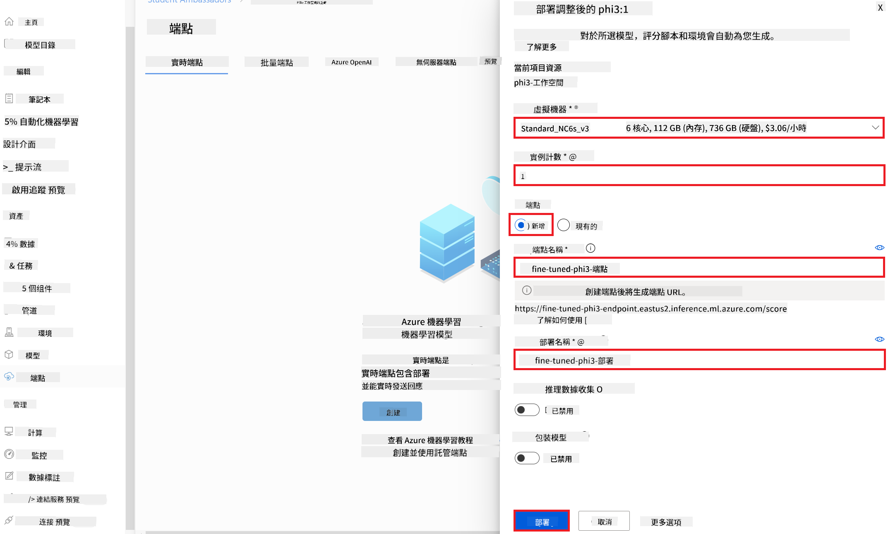

1. 點擊 **Deploy**。

> [!WARNING]
> 為避免額外費用，請確保在 Azure Machine Learning 工作區中刪除已創建的端點。
>

#### 在 Azure Machine Learning 工作區中檢查部署狀態

1. 導航到你創建的 Azure Machine Learning 工作區。

1. 從左側選單選擇 **Endpoints**。

1. 選擇你創建的端點。

    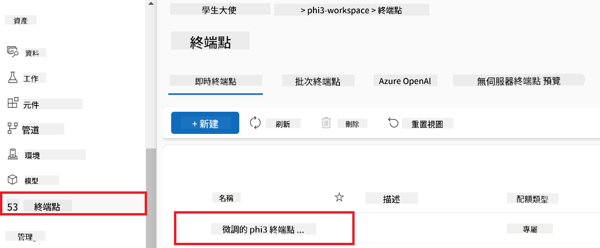

1. 在此頁面，你可以在部署過程中管理端點。

> [!NOTE]
> 部署完成後，請確保 **Live traffic** 設置為 **100%**。如果不是，請選擇 **Update traffic** 調整流量設置。注意，如果流量設置為 0%，則無法測試模型。
>
> 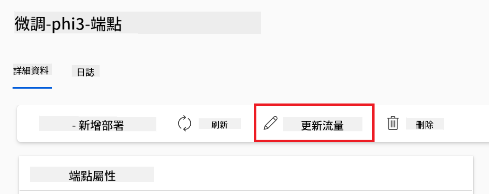
>

## 場景 3：與 Prompt flow 集成並在 Azure AI Foundry 中與自定義模型交互

### 將自定義 Phi-3 模型與 Prompt flow 集成

成功部署你的微調模型後，你現在可以將其與 Prompt Flow 集成，以在實時應用中使用你的模型，從而實現與自定義 Phi-3 模型的多種交互任務。

在本練習中，你將：

- 創建 Azure AI Foundry Hub。
- 創建 Azure AI Foundry Project。
- 創建 Prompt flow。
- 為微調 Phi-3 模型添加自定義連接。
- 設置 Prompt flow 與你的自定義 Phi-3 模型交互。

> [!NOTE]
> 你也可以使用 Azure ML Studio 與 Promptflow 集成。相同的集成過程適用於 Azure ML Studio。

#### 創建 Azure AI Foundry Hub

在創建 Project 之前，你需要創建 Hub。Hub 類似於資源組，允許你在 Azure AI Foundry 中組織和管理多個 Project。

1. 訪問 [Azure AI Foundry](https://ai.azure.com/?WT.mc_id=aiml-137032-kinfeylo)。

1. 從左側選單選擇 **All hubs**。

1. 在導航欄中選擇 **+ New hub**。

    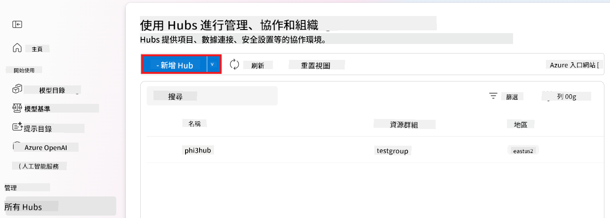

1. 完成以下操作：

    - 輸入 **Hub name**，必須是唯一值。
    - 選擇你的 Azure **Subscription**。
    - 選擇要使用的 **Resource group**（如有需要，創建一個新的）。
    - 選擇你想使用的 **Location**。
    - 選擇要使用的 **Connect Azure AI Services**（如有需要，創建一個新的）。
    - 將 **Connect Azure AI Search** 設置為 **Skip connecting**。

    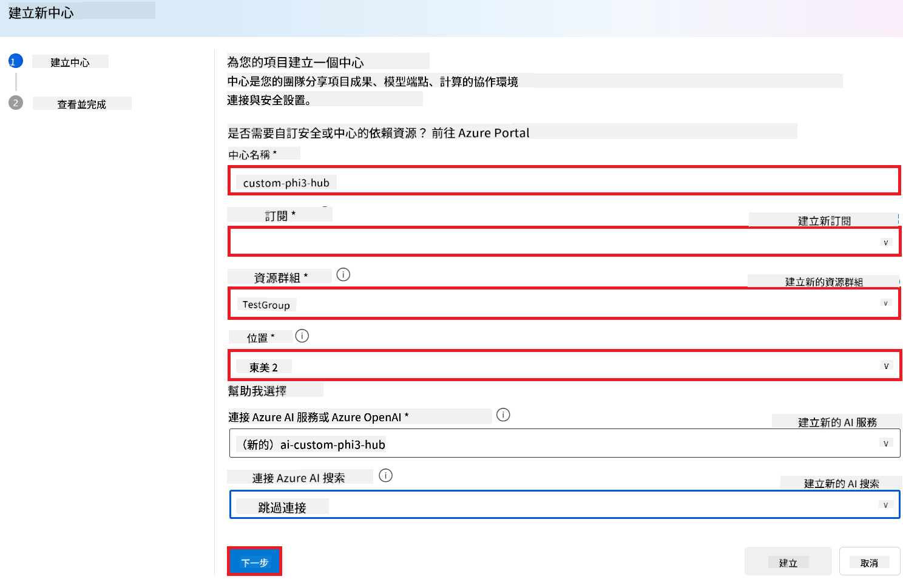

1. 點擊 **Next**。

#### 創建 Azure AI Foundry Project

1. 在你創建的 Hub 中，從左側選單選擇 **All projects**。

1. 在導航欄中選擇 **+ New project**。

    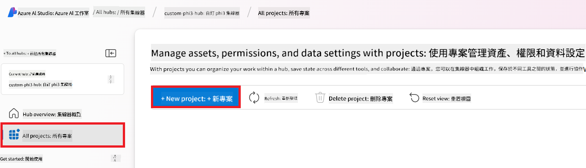

1. 輸入 **Project name**，必須是唯一值。

    

1. 點擊 **Create a project**。

#### 為微調 Phi-3 模型添加自定義連接

要將你的自定義 Phi-3 模型與 Prompt flow 集成，你需要在自定義連接中保存模型的端點和密鑰。此設置確保在 Prompt flow 中訪問你的自定義 Phi-3 模型。

#### 設置微調 Phi-3 模型的 API 密鑰和端點 URI

1. 訪問 [Azure ML Studio](https://ml.azure.com/home?WT.mc_id=aiml-137032-kinfeylo)。

1. 導航到你創建的 Azure Machine Learning 工作區。

1. 從左側選單選擇 **Endpoints**。

    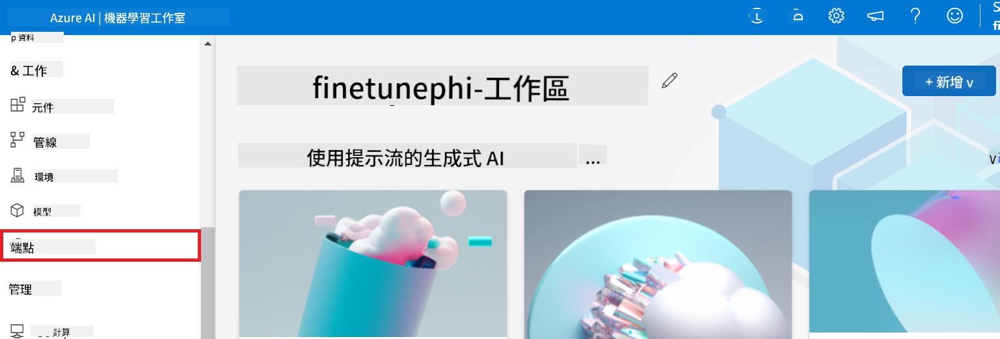

1. 選擇你創建的端點。

    

1. 從導航欄選擇 **Consume**。

1. 複製你的 **REST endpoint** 和 **Primary key**。
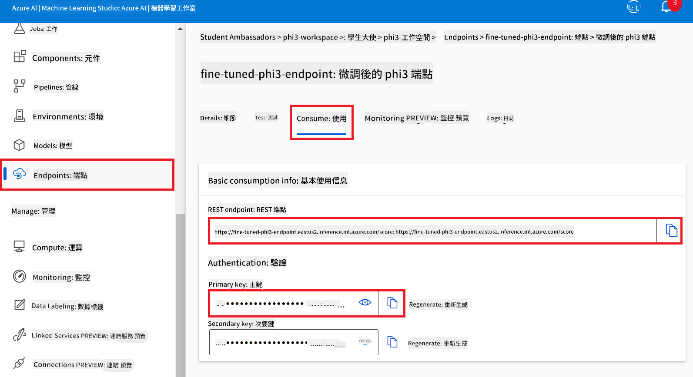

#### 加入自訂連接

1. 瀏覽 [Azure AI Foundry](https://ai.azure.com/?WT.mc_id=aiml-137032-kinfeylo)。

1. 前往你已建立嘅 Azure AI Foundry 項目。

1. 喺你建立嘅項目中，揀選左邊嘅 **Settings**。

1. 選擇 **+ New connection**。

    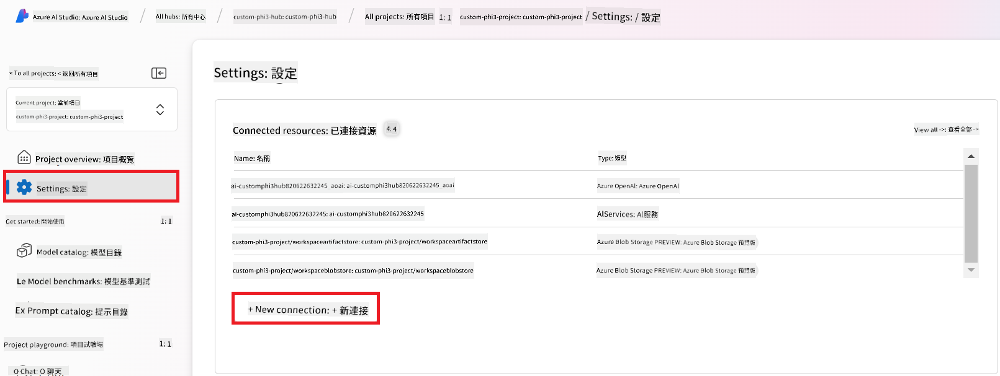

1. 喺導航選單揀選 **Custom keys**。

    

1. 執行以下操作：

    - 選擇 **+ Add key value pairs**。
    - 喺密鑰名稱輸入 **endpoint**，並將你喺 Azure ML Studio 複製嘅 endpoint 貼到值字段。
    - 再次選擇 **+ Add key value pairs**。
    - 喺密鑰名稱輸入 **key**，並將你喺 Azure ML Studio 複製嘅 key 貼到值字段。
    - 加入密鑰後，選擇 **is secret**，防止密鑰被暴露。

    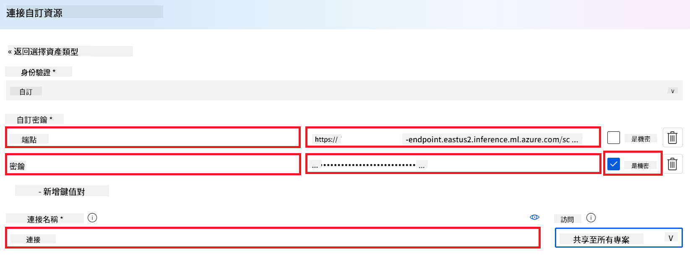

1. 選擇 **Add connection**。

#### 建立 Prompt flow

你已經喺 Azure AI Foundry 中加入咗自訂連接。接住落嚟，我哋會利用以下步驟建立 Prompt flow。然後，你會將呢個 Prompt flow 連接到自訂連接，咁你就可以喺 Prompt flow 中使用經微調嘅模型。

1. 前往你已建立嘅 Azure AI Foundry 項目。

1. 喺左邊選擇 **Prompt flow**。

1. 喺導航選單選擇 **+ Create**。

    

1. 喺導航選單選擇 **Chat flow**。

    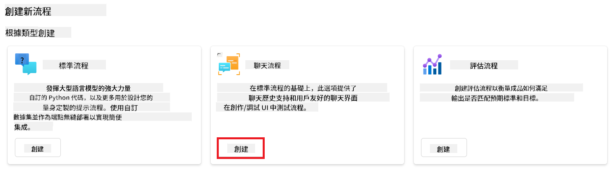

1. 輸入 **Folder name**。

    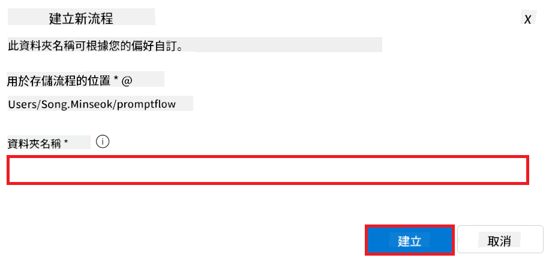

2. 選擇 **Create**。

#### 設置 Prompt flow 同你嘅自訂 Phi-3 模型聊天

你需要將經微調嘅 Phi-3 模型整合到 Prompt flow 中。不過，現有嘅 Prompt flow 並唔係為此目的設計嘅。因此，你需要重新設計 Prompt flow，令其可以整合自訂模型。

1. 喺 Prompt flow 中，執行以下操作以重建現有流程：

    - 選擇 **Raw file mode**。
    - 刪除 *flow.dag.yml* 文件中所有現有代碼。
    - 喺 *flow.dag.yml* 文件中加入以下代碼：

        ```yml
        inputs:
          input_data:
            type: string
            default: "Who founded Microsoft?"

        outputs:
          answer:
            type: string
            reference: ${integrate_with_promptflow.output}

        nodes:
        - name: integrate_with_promptflow
          type: python
          source:
            type: code
            path: integrate_with_promptflow.py
          inputs:
            input_data: ${inputs.input_data}
        ```

    - 選擇 **Save**。

    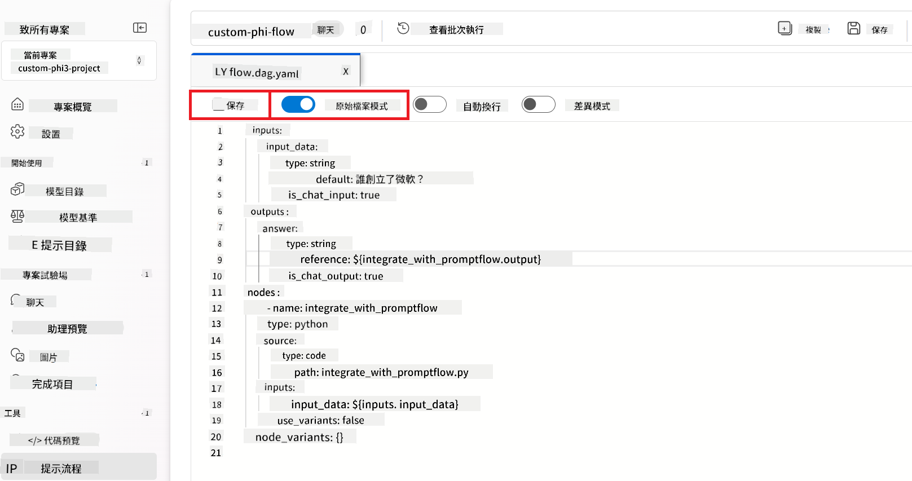

1. 喺 *integrate_with_promptflow.py* 文件中加入以下代碼，以喺 Prompt flow 中使用自訂 Phi-3 模型。

    ```python
    import logging
    import requests
    from promptflow import tool
    from promptflow.connections import CustomConnection

    # Logging setup
    logging.basicConfig(
        format="%(asctime)s - %(levelname)s - %(name)s - %(message)s",
        datefmt="%Y-%m-%d %H:%M:%S",
        level=logging.DEBUG
    )
    logger = logging.getLogger(__name__)

    def query_phi3_model(input_data: str, connection: CustomConnection) -> str:
        """
        Send a request to the Phi-3 model endpoint with the given input data using Custom Connection.
        """

        # "connection" is the name of the Custom Connection, "endpoint", "key" are the keys in the Custom Connection
        endpoint_url = connection.endpoint
        api_key = connection.key

        headers = {
            "Content-Type": "application/json",
            "Authorization": f"Bearer {api_key}"
        }
        data = {
            "input_data": {
                "input_string": [
                    {"role": "user", "content": input_data}
                ],
                "parameters": {
                    "temperature": 0.7,
                    "max_new_tokens": 128
                }
            }
        }
        try:
            response = requests.post(endpoint_url, json=data, headers=headers)
            response.raise_for_status()
            
            # Log the full JSON response
            logger.debug(f"Full JSON response: {response.json()}")

            result = response.json()["output"]
            logger.info("Successfully received response from Azure ML Endpoint.")
            return result
        except requests.exceptions.RequestException as e:
            logger.error(f"Error querying Azure ML Endpoint: {e}")
            raise

    @tool
    def my_python_tool(input_data: str, connection: CustomConnection) -> str:
        """
        Tool function to process input data and query the Phi-3 model.
        """
        return query_phi3_model(input_data, connection)

    ```

    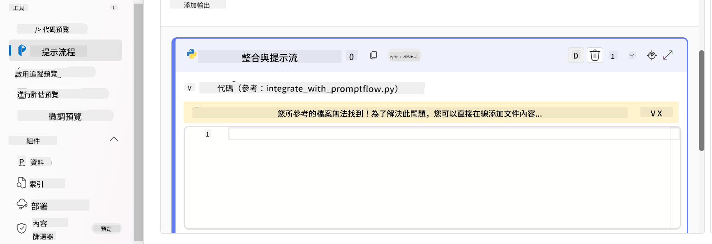

> [!NOTE]
> 如需更詳細嘅 Azure AI Foundry 中使用 Prompt flow 嘅資訊，你可以參考 [Prompt flow in Azure AI Foundry](https://learn.microsoft.com/azure/ai-studio/how-to/prompt-flow)。

1. 選擇 **Chat input** 同 **Chat output** 以啟用同你嘅模型聊天。

    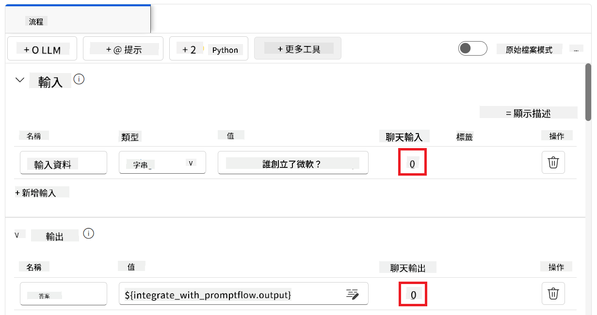

1. 而家你已準備好同自訂 Phi-3 模型聊天。喺下一個練習中，你會學習如何啟動 Prompt flow 並利用其同經微調嘅 Phi-3 模型聊天。

> [!NOTE]
>
> 重建後嘅流程應該如下圖所示：
>
> 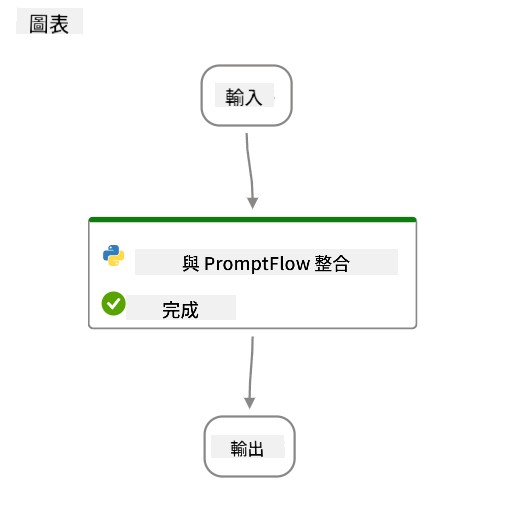
>

### 同你嘅自訂 Phi-3 模型聊天

而家你已微調並整合咗自訂 Phi-3 模型到 Prompt flow，你可以開始同模型互動。呢個練習會指導你如何設置同啟動 Prompt flow，同模型進行聊天。跟住呢啲步驟，你就可以充分利用經微調嘅 Phi-3 模型進行各種任務同對話。

- 使用 Prompt flow 同你嘅自訂 Phi-3 模型聊天。

#### 啟動 Prompt flow

1. 選擇 **Start compute sessions** 以啟動 Prompt flow。

    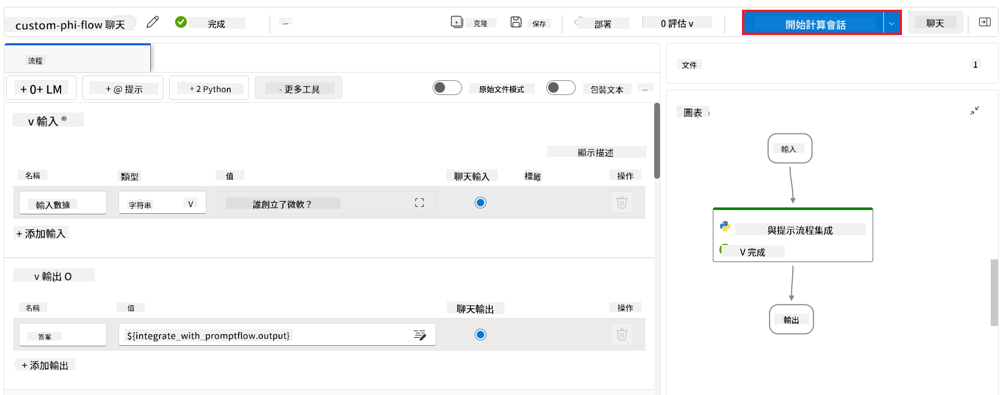

1. 選擇 **Validate and parse input** 以更新參數。

    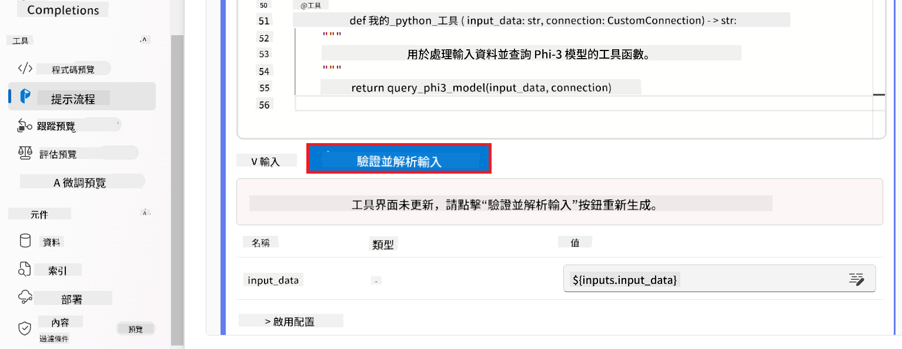

1. 選擇 **connection** 嘅 **Value**，指向你創建嘅自訂連接。例如，*connection*。

    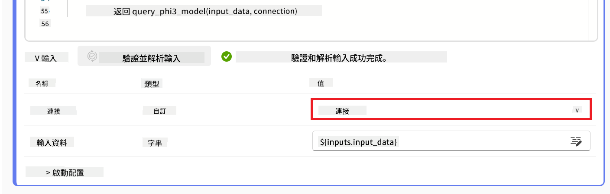

#### 同你嘅自訂模型聊天

1. 選擇 **Chat**。

    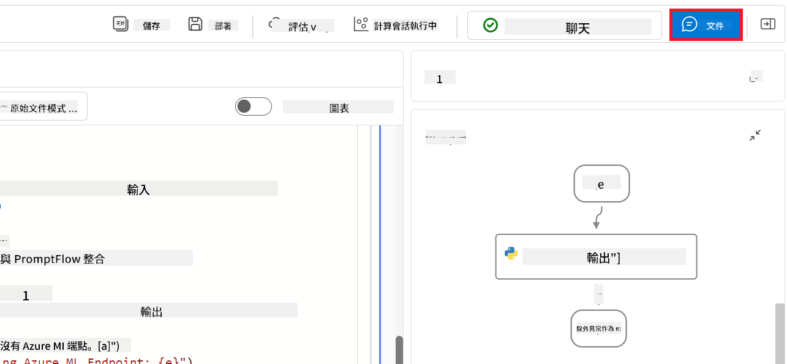

1. 以下係結果示例：而家你可以同你嘅自訂 Phi-3 模型聊天。建議根據用於微調嘅數據問問題。

    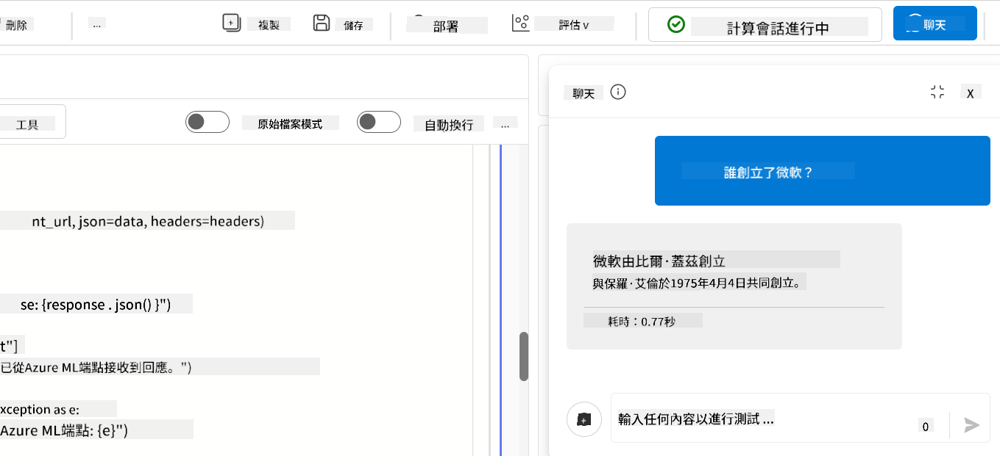

**免責聲明**：  
本文檔已使用AI翻譯服務[Co-op Translator](https://github.com/Azure/co-op-translator)進行翻譯。雖然我們努力確保翻譯的準確性，但請注意，自動翻譯可能包含錯誤或不準確之處。原始語言的文檔應被視為權威來源。對於關鍵信息，建議使用專業人工翻譯。我們不對因使用此翻譯而產生的任何誤解或錯誤解釋承擔責任。