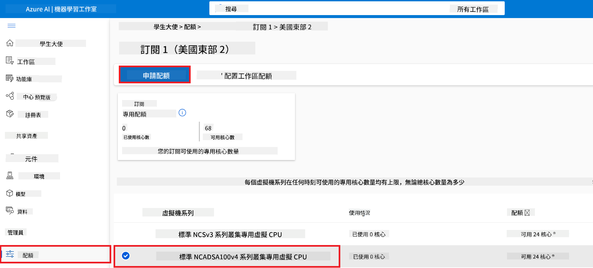
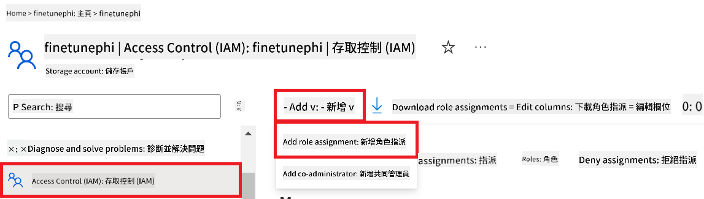
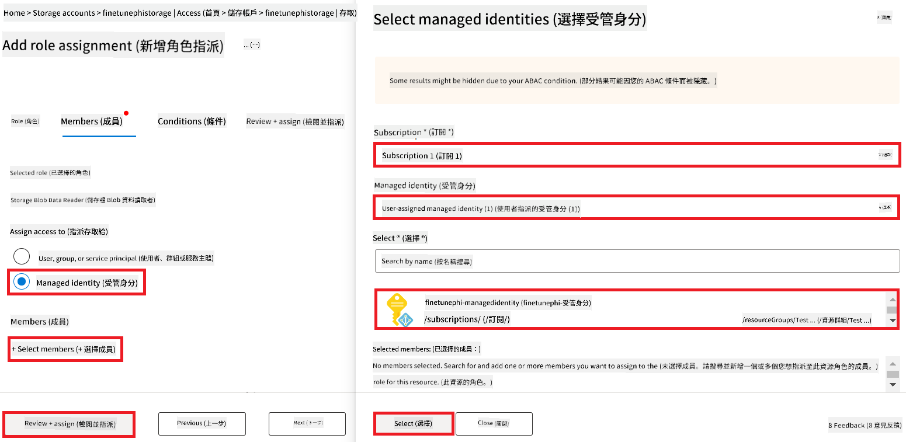
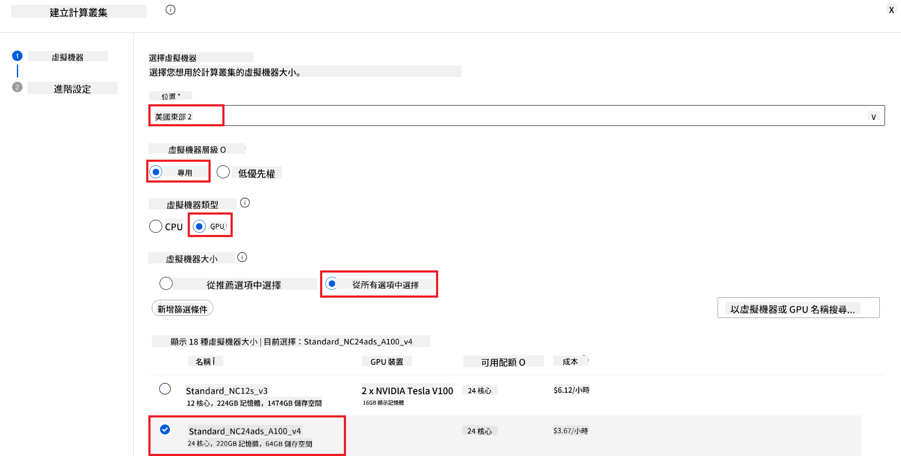
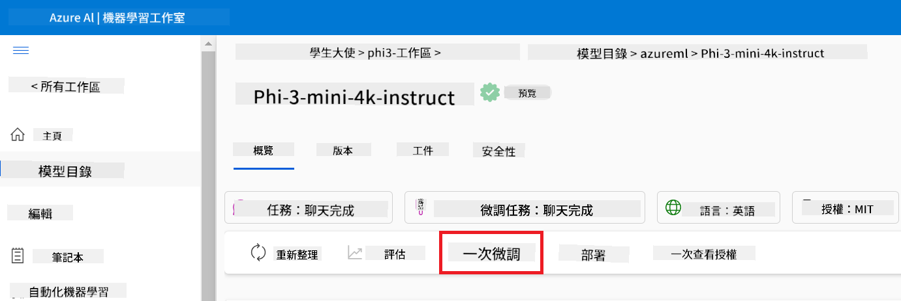
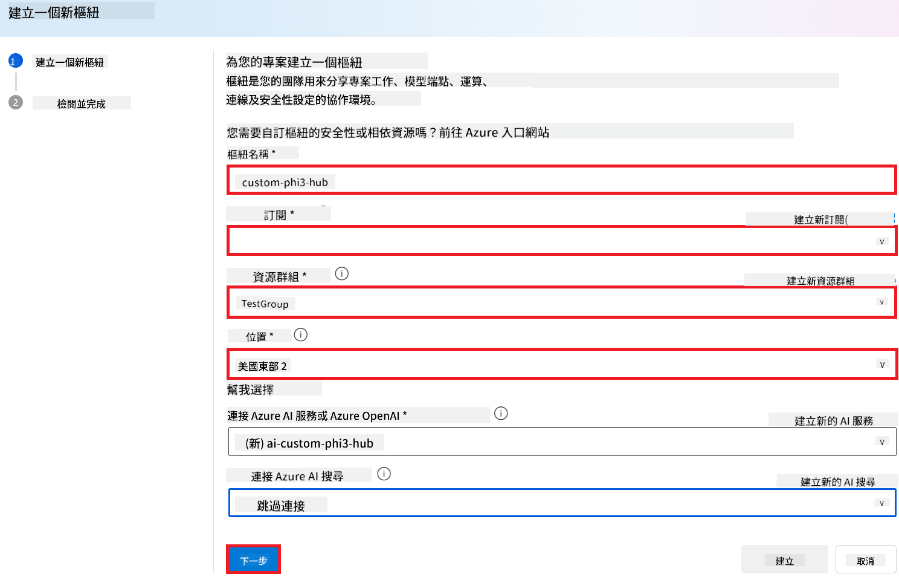
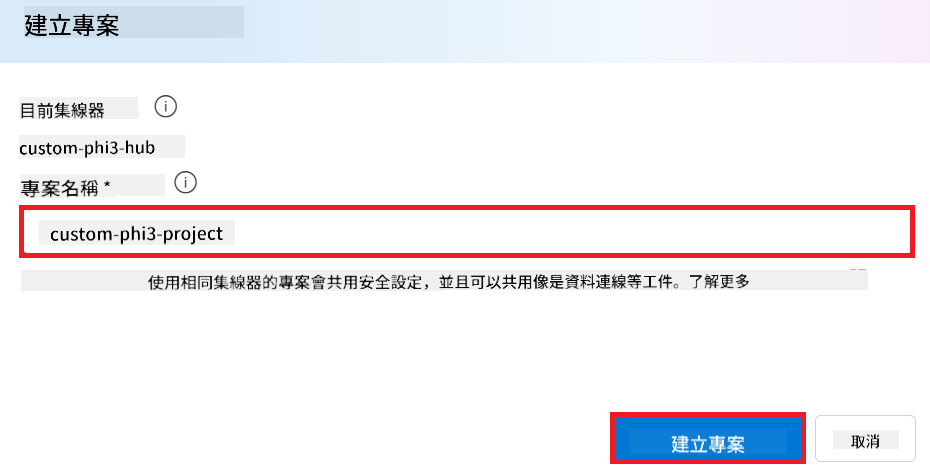

<!--
CO_OP_TRANSLATOR_METADATA:
{
  "original_hash": "ecbd9179a21edbaafaf114d47f09f3e3",
  "translation_date": "2025-07-17T01:08:57+00:00",
  "source_file": "md/02.Application/01.TextAndChat/Phi3/E2E_Phi-3-FineTuning_PromptFlow_Integration_AIFoundry.md",
  "language_code": "hk"
}
-->
# 在 Azure AI Foundry 中使用 Prompt flow 微調及整合自訂 Phi-3 模型

此端對端（E2E）範例基於 Microsoft Tech Community 的指南「[Fine-Tune and Integrate Custom Phi-3 Models with Prompt Flow in Azure AI Foundry](https://techcommunity.microsoft.com/t5/educator-developer-blog/fine-tune-and-integrate-custom-phi-3-models-with-prompt-flow-in/ba-p/4191726?WT.mc_id=aiml-137032-kinfeylo)」。內容介紹如何在 Azure AI Foundry 中微調、部署及整合自訂 Phi-3 模型與 Prompt flow。與需在本地執行程式碼的 E2E 範例「[Fine-Tune and Integrate Custom Phi-3 Models with Prompt Flow](./E2E_Phi-3-FineTuning_PromptFlow_Integration.md)」不同，本教學完全聚焦於在 Azure AI / ML Studio 內微調及整合模型。

## 概覽

在此 E2E 範例中，您將學習如何微調 Phi-3 模型並將其與 Azure AI Foundry 的 Prompt flow 整合。透過 Azure AI / ML Studio，您將建立一個部署及使用自訂 AI 模型的工作流程。此 E2E 範例分為三個情境：

**情境 1：設定 Azure 資源並準備微調**

**情境 2：微調 Phi-3 模型並在 Azure Machine Learning Studio 部署**

**情境 3：與 Prompt flow 整合並在 Azure AI Foundry 與自訂模型聊天**

以下為此 E2E 範例的總覽。


### 目錄

1. **[情境 1：設定 Azure 資源並準備微調](../../../../../../md/02.Application/01.TextAndChat/Phi3)**
    - [建立 Azure Machine Learning 工作區](../../../../../../md/02.Application/01.TextAndChat/Phi3)
    - [申請 Azure 訂閱中的 GPU 配額](../../../../../../md/02.Application/01.TextAndChat/Phi3)
    - [新增角色指派](../../../../../../md/02.Application/01.TextAndChat/Phi3)
    - [設定專案](../../../../../../md/02.Application/01.TextAndChat/Phi3)
    - [準備微調用資料集](../../../../../../md/02.Application/01.TextAndChat/Phi3)

1. **[情境 2：微調 Phi-3 模型並在 Azure Machine Learning Studio 部署](../../../../../../md/02.Application/01.TextAndChat/Phi3)**
    - [微調 Phi-3 模型](../../../../../../md/02.Application/01.TextAndChat/Phi3)
    - [部署微調後的 Phi-3 模型](../../../../../../md/02.Application/01.TextAndChat/Phi3)

1. **[情境 3：與 Prompt flow 整合並在 Azure AI Foundry 與自訂模型聊天](../../../../../../md/02.Application/01.TextAndChat/Phi3)**
    - [將自訂 Phi-3 模型與 Prompt flow 整合](../../../../../../md/02.Application/01.TextAndChat/Phi3)
    - [與自訂 Phi-3 模型聊天](../../../../../../md/02.Application/01.TextAndChat/Phi3)

## 情境 1：設定 Azure 資源並準備微調

### 建立 Azure Machine Learning 工作區

1. 在入口網站頁面頂部的 **搜尋列** 輸入 *azure machine learning*，並從出現的選項中選擇 **Azure Machine Learning**。

    

2. 從導覽選單選擇 **+ 建立**。

3. 從導覽選單選擇 **新增工作區**。

    

4. 執行以下操作：

    - 選擇您的 Azure **訂閱**。
    - 選擇要使用的 **資源群組**（如有需要可新建）。
    - 輸入 **工作區名稱**，必須是唯一值。
    - 選擇您想使用的 **區域**。
    - 選擇要使用的 **儲存帳戶**（如有需要可新建）。
    - 選擇要使用的 **金鑰保管庫**（如有需要可新建）。
    - 選擇要使用的 **應用程式洞察**（如有需要可新建）。
    - 選擇要使用的 **容器登錄**（如有需要可新建）。

    

5. 選擇 **檢閱 + 建立**。

6. 選擇 **建立**。

### 申請 Azure 訂閱中的 GPU 配額

本教學將示範如何使用 GPU 微調及部署 Phi-3 模型。微調時會使用 *Standard_NC24ads_A100_v4* GPU，需申請配額。部署時會使用 *Standard_NC6s_v3* GPU，同樣需申請配額。

> [!NOTE]
>
> 只有按使用付費訂閱（標準訂閱類型）有資格申請 GPU 配額，優惠訂閱目前不支援。
>

1. 前往 [Azure ML Studio](https://ml.azure.com/home?wt.mc_id=studentamb_279723)。

1. 申請 *Standard NCADSA100v4 Family* 配額：

    - 從左側標籤選擇 **Quota**。
    - 選擇要使用的 **虛擬機器系列**，例如選擇包含 *Standard_NC24ads_A100_v4* GPU 的 **Standard NCADSA100v4 Family Cluster Dedicated vCPUs**。
    - 從導覽選單選擇 **Request quota**。

        

    - 在申請配額頁面輸入您想使用的 **新核心限制**，例如 24。
    - 選擇 **Submit** 提交 GPU 配額申請。

1. 申請 *Standard NCSv3 Family* 配額：

    - 從左側標籤選擇 **Quota**。
    - 選擇要使用的 **虛擬機器系列**，例如選擇包含 *Standard_NC6s_v3* GPU 的 **Standard NCSv3 Family Cluster Dedicated vCPUs**。
    - 從導覽選單選擇 **Request quota**。
    - 在申請配額頁面輸入您想使用的 **新核心限制**，例如 24。
    - 選擇 **Submit** 提交 GPU 配額申請。

### 新增角色指派

要微調及部署模型，您必須先建立使用者指派的管理身分（User Assigned Managed Identity，UAI），並賦予適當權限。此 UAI 將用於部署時的身份驗證。

#### 建立使用者指派的管理身分 (UAI)

1. 在入口網站頁面頂部的 **搜尋列** 輸入 *managed identities*，並從出現的選項中選擇 **Managed Identities**。

    

1. 選擇 **+ 建立**。

    

1. 執行以下操作：

    - 選擇您的 Azure **訂閱**。
    - 選擇要使用的 **資源群組**（如有需要可新建）。
    - 選擇您想使用的 **區域**。
    - 輸入 **名稱**，必須是唯一值。

    

1. 選擇 **檢閱 + 建立**。

1. 選擇 **+ 建立**。

#### 新增 Contributor 角色指派給管理身分

1. 前往您建立的管理身分資源。

1. 從左側標籤選擇 **Azure 角色指派**。

1. 從導覽選單選擇 **+ 新增角色指派**。

1. 在新增角色指派頁面執行以下操作：
    - 將 **範圍** 設為 **資源群組**。
    - 選擇您的 Azure **訂閱**。
    - 選擇要使用的 **資源群組**。
    - 將 **角色** 設為 **Contributor**。

    

2. 選擇 **儲存**。

#### 新增 Storage Blob Data Reader 角色指派給管理身分

1. 在入口網站頁面頂部的 **搜尋列** 輸入 *storage accounts*，並從出現的選項中選擇 **Storage accounts**。

    

1. 選擇與您建立的 Azure Machine Learning 工作區相關聯的儲存帳戶，例如 *finetunephistorage*。

1. 執行以下操作以進入新增角色指派頁面：

    - 前往您建立的 Azure 儲存帳戶。
    - 從左側標籤選擇 **存取控制 (IAM)**。
    - 從導覽選單選擇 **+ 新增**。
    - 選擇 **新增角色指派**。

    

1. 在新增角色指派頁面執行以下操作：

    - 在角色頁面搜尋列輸入 *Storage Blob Data Reader*，並從選項中選擇 **Storage Blob Data Reader**。
    - 選擇 **下一步**。
    - 在成員頁面，將 **指派存取權給** 設為 **Managed identity**。
    - 選擇 **+ 選擇成員**。
    - 在選擇管理身分頁面，選擇您的 Azure **訂閱**。
    - 選擇要指派的 **管理身分**。
    - 選擇您建立的管理身分，例如 *finetunephi-managedidentity*。
    - 選擇 **選擇**。

    

1. 選擇 **檢閱 + 指派**。

#### 新增 AcrPull 角色指派給管理身分

1. 在入口網站頁面頂部的 **搜尋列** 輸入 *container registries*，並從出現的選項中選擇 **Container registries**。

    

1. 選擇與 Azure Machine Learning 工作區相關聯的容器登錄，例如 *finetunephicontainerregistry*。

1. 執行以下操作以進入新增角色指派頁面：

    - 從左側標籤選擇 **存取控制 (IAM)**。
    - 從導覽選單選擇 **+ 新增**。
    - 選擇 **新增角色指派**。

1. 在新增角色指派頁面執行以下操作：

    - 在角色頁面搜尋列輸入 *AcrPull*，並從選項中選擇 **AcrPull**。
    - 選擇 **下一步**。
    - 在成員頁面，將 **指派存取權給** 設為 **Managed identity**。
    - 選擇 **+ 選擇成員**。
    - 在選擇管理身分頁面，選擇您的 Azure **訂閱**。
    - 選擇要指派的 **管理身分**。
    - 選擇您建立的管理身分，例如 *finetunephi-managedidentity*。
    - 選擇 **選擇**。
    - 選擇 **檢閱 + 指派**。

### 設定專案

為了下載微調所需的資料集，您將設定本地環境。

在此練習中，您將：

- 建立一個資料夾作為工作目錄。
- 建立虛擬環境。
- 安裝所需套件。
- 建立 *download_dataset.py* 檔案以下載資料集。

#### 建立工作資料夾

1. 開啟終端機視窗，輸入以下指令，在預設路徑下建立名為 *finetune-phi* 的資料夾。

    ```console
    mkdir finetune-phi
    ```

2. 在終端機中輸入以下指令，切換到您剛建立的 *finetune-phi* 資料夾。
#### 建立虛擬環境

1. 在終端機輸入以下指令，建立名為 *.venv* 的虛擬環境。

    ```console
    python -m venv .venv
    ```

2. 在終端機輸入以下指令，啟動虛擬環境。

    ```console
    .venv\Scripts\activate.bat
    ```


> [!NOTE]
> 如果成功，指令提示符前會顯示 *(.venv)*。

#### 安裝所需套件

1. 在終端機輸入以下指令，安裝所需套件。

    ```console
    pip install datasets==2.19.1
    ```

#### 建立 `download_dataset.py`

> [!NOTE]
> 完整資料夾結構：
>
> ```text
> └── YourUserName
> .    └── finetune-phi
> .        └── download_dataset.py
> ```

1. 開啟 **Visual Studio Code**。

1. 從選單列選擇 **File**。

1. 選擇 **Open Folder**。

1. 選擇你建立的 *finetune-phi* 資料夾，路徑位於 *C:\Users\yourUserName\finetune-phi*。

    

1. 在 Visual Studio Code 左側窗格中，右鍵點擊並選擇 **New File**，建立名為 *download_dataset.py* 的新檔案。

    

### 準備微調用資料集

在本練習中，你將執行 *download_dataset.py* 檔案，將 *ultrachat_200k* 資料集下載到本地環境，接著使用該資料集在 Azure Machine Learning 中微調 Phi-3 模型。

本練習中，你將：

- 在 *download_dataset.py* 檔案中加入下載資料集的程式碼。
- 執行 *download_dataset.py* 檔案，將資料集下載到本地環境。

#### 使用 *download_dataset.py* 下載資料集

1. 在 Visual Studio Code 中開啟 *download_dataset.py* 檔案。

1. 將以下程式碼加入 *download_dataset.py* 檔案中。

    ```python
    import json
    import os
    from datasets import load_dataset

    def load_and_split_dataset(dataset_name, config_name, split_ratio):
        """
        Load and split a dataset.
        """
        # Load the dataset with the specified name, configuration, and split ratio
        dataset = load_dataset(dataset_name, config_name, split=split_ratio)
        print(f"Original dataset size: {len(dataset)}")
        
        # Split the dataset into train and test sets (80% train, 20% test)
        split_dataset = dataset.train_test_split(test_size=0.2)
        print(f"Train dataset size: {len(split_dataset['train'])}")
        print(f"Test dataset size: {len(split_dataset['test'])}")
        
        return split_dataset

    def save_dataset_to_jsonl(dataset, filepath):
        """
        Save a dataset to a JSONL file.
        """
        # Create the directory if it does not exist
        os.makedirs(os.path.dirname(filepath), exist_ok=True)
        
        # Open the file in write mode
        with open(filepath, 'w', encoding='utf-8') as f:
            # Iterate over each record in the dataset
            for record in dataset:
                # Dump the record as a JSON object and write it to the file
                json.dump(record, f)
                # Write a newline character to separate records
                f.write('\n')
        
        print(f"Dataset saved to {filepath}")

    def main():
        """
        Main function to load, split, and save the dataset.
        """
        # Load and split the ULTRACHAT_200k dataset with a specific configuration and split ratio
        dataset = load_and_split_dataset("HuggingFaceH4/ultrachat_200k", 'default', 'train_sft[:1%]')
        
        # Extract the train and test datasets from the split
        train_dataset = dataset['train']
        test_dataset = dataset['test']

        # Save the train dataset to a JSONL file
        save_dataset_to_jsonl(train_dataset, "data/train_data.jsonl")
        
        # Save the test dataset to a separate JSONL file
        save_dataset_to_jsonl(test_dataset, "data/test_data.jsonl")

    if __name__ == "__main__":
        main()

    ```

1. 在終端機輸入以下指令，執行腳本並將資料集下載到本地環境。

    ```console
    python download_dataset.py
    ```

1. 確認資料集已成功儲存至本地 *finetune-phi/data* 目錄。

> [!NOTE]
>
> #### 關於資料集大小與微調時間的說明
>
> 本教學中只使用資料集的 1%（`split='train[:1%]'`），大幅減少資料量，加快上傳與微調速度。你可以調整此比例，以取得訓練時間與模型效能的最佳平衡。使用較小的資料子集能縮短微調所需時間，使教學過程更易管理。

## 情境 2：微調 Phi-3 模型並在 Azure Machine Learning Studio 部署

### 微調 Phi-3 模型

在本練習中，你將在 Azure Machine Learning Studio 中微調 Phi-3 模型。

本練習中，你將：

- 建立用於微調的運算叢集。
- 在 Azure Machine Learning Studio 中微調 Phi-3 模型。

#### 建立用於微調的運算叢集

1. 前往 [Azure ML Studio](https://ml.azure.com/home?wt.mc_id=studentamb_279723)。

1. 從左側標籤選擇 **Compute**。

1. 從導覽選單選擇 **Compute clusters**。

1. 選擇 **+ New**。

    

1. 執行以下設定：

    - 選擇你想使用的 **Region**。
    - 將 **Virtual machine tier** 設為 **Dedicated**。
    - 將 **Virtual machine type** 設為 **GPU**。
    - 將 **Virtual machine size** 篩選器設為 **Select from all options**。
    - 選擇 **Virtual machine size** 為 **Standard_NC24ads_A100_v4**。

    

1. 選擇 **Next**。

1. 執行以下設定：

    - 輸入 **Compute name**，必須是唯一值。
    - 將 **Minimum number of nodes** 設為 **0**。
    - 將 **Maximum number of nodes** 設為 **1**。
    - 將 **Idle seconds before scale down** 設為 **120**。

    

1. 選擇 **Create**。

#### 微調 Phi-3 模型

1. 前往 [Azure ML Studio](https://ml.azure.com/home?wt.mc_id=studentamb_279723)。

1. 選擇你建立的 Azure Machine Learning 工作區。

    

1. 執行以下操作：

    - 從左側標籤選擇 **Model catalog**。
    - 在 **search bar** 輸入 *phi-3-mini-4k*，並從出現的選項中選擇 **Phi-3-mini-4k-instruct**。

    

1. 從導覽選單選擇 **Fine-tune**。

    

1. 執行以下設定：

    - 將 **Select task type** 設為 **Chat completion**。
    - 選擇 **+ Select data** 上傳 **Training data**。
    - 將驗證資料上傳類型設為 **Provide different validation data**。
    - 選擇 **+ Select data** 上傳 **Validation data**。

    

    > [!TIP]
    >
    > 你可以選擇 **Advanced settings** 自訂設定，如 **learning_rate** 和 **lr_scheduler_type**，以根據需求優化微調流程。

1. 選擇 **Finish**。

1. 本練習中，你已成功使用 Azure Machine Learning 微調 Phi-3 模型。請注意，微調過程可能需要相當長的時間。提交微調工作後，需等待其完成。你可以在 Azure Machine Learning 工作區左側的 Jobs 標籤中監控微調工作的狀態。接下來的系列中，你將部署微調後的模型並與 Prompt flow 整合。

    

### 部署微調後的 Phi-3 模型

為了將微調後的 Phi-3 模型與 Prompt flow 整合，你需要部署模型，使其可用於即時推論。此流程包含註冊模型、建立線上端點及部署模型。

本練習中，你將：

- 在 Azure Machine Learning 工作區註冊微調後的模型。
- 建立線上端點。
- 部署已註冊的微調 Phi-3 模型。

#### 註冊微調後的模型

1. 前往 [Azure ML Studio](https://ml.azure.com/home?wt.mc_id=studentamb_279723)。

1. 選擇你建立的 Azure Machine Learning 工作區。

    

1. 從左側標籤選擇 **Models**。

1. 選擇 **+ Register**。

1. 選擇 **From a job output**。

    

1. 選擇你建立的工作。

    

1. 選擇 **Next**。

1. 將 **Model type** 設為 **MLflow**。

1. 確認已選擇 **Job output**，此選項應自動被選中。

    

2. 選擇 **Next**。

3. 選擇 **Register**。

    

4. 你可以透過左側標籤的 **Models** 選單查看已註冊的模型。

    

#### 部署微調後的模型

1. 前往你建立的 Azure Machine Learning 工作區。

1. 從左側標籤選擇 **Endpoints**。

1. 從導覽選單選擇 **Real-time endpoints**。

    

1. 選擇 **Create**。

1. 選擇你已註冊的模型。

    

1. 選擇 **Select**。

1. 執行以下設定：

    - 將 **Virtual machine** 設為 *Standard_NC6s_v3*。
    - 選擇你想使用的 **Instance count**，例如 *1*。
    - 將 **Endpoint** 設為 **New** 以建立新端點。
    - 輸入 **Endpoint name**，必須是唯一值。
    - 輸入 **Deployment name**，必須是唯一值。

    

1. 選擇 **Deploy**。

> [!WARNING]
> 為避免額外費用，請務必在 Azure Machine Learning 工作區刪除已建立的端點。
>

#### 在 Azure Machine Learning 工作區檢查部署狀態

1. 前往你建立的 Azure Machine Learning 工作區。

1. 從左側標籤選擇 **Endpoints**。

1. 選擇你建立的端點。

    

1. 在此頁面，你可以管理部署過程中的端點。

> [!NOTE]
> 部署完成後，請確保 **Live traffic** 設為 **100%**。若未設定，請選擇 **Update traffic** 以調整流量設定。流量設為 0% 時無法測試模型。
>
> 
>

## 情境 3：與 Prompt flow 整合並在 Azure AI Foundry 使用自訂模型聊天

### 將自訂 Phi-3 模型與 Prompt flow 整合

成功部署微調後的模型後，你可以將其與 Prompt Flow 整合，於即時應用中使用你的模型，實現多種互動任務。

本練習中，你將：

- 建立 Azure AI Foundry Hub。
- 建立 Azure AI Foundry 專案。
- 建立 Prompt flow。
- 為微調後的 Phi-3 模型新增自訂連線。
- 設定 Prompt flow 與你的自訂 Phi-3 模型進行聊天。
> [!NOTE]
> 你亦可以使用 Azure ML Studio 與 Promptflow 整合。相同的整合流程同樣適用於 Azure ML Studio。
#### 建立 Azure AI Foundry Hub

在建立專案之前，您需要先建立一個 Hub。Hub 就像是一個資源群組，讓您能夠在 Azure AI Foundry 中組織和管理多個專案。

1. 前往 [Azure AI Foundry](https://ai.azure.com/?WT.mc_id=aiml-137032-kinfeylo)。

1. 從左側標籤選擇 **All hubs**。

1. 從導覽選單選擇 **+ New hub**。

    

1. 執行以下操作：

    - 輸入 **Hub name**，必須是唯一的名稱。
    - 選擇您的 Azure **Subscription**。
    - 選擇要使用的 **Resource group**（如有需要可建立新的）。
    - 選擇您想使用的 **Location**。
    - 選擇要連接的 **Connect Azure AI Services**（如有需要可建立新的）。
    - 選擇 **Connect Azure AI Search**，並選擇 **Skip connecting**。

    

1. 選擇 **Next**。

#### 建立 Azure AI Foundry 專案

1. 在您建立的 Hub 中，從左側標籤選擇 **All projects**。

1. 從導覽選單選擇 **+ New project**。

    

1. 輸入 **Project name**，必須是唯一的名稱。

    

1. 選擇 **Create a project**。

#### 為微調後的 Phi-3 模型新增自訂連線

要將您的自訂 Phi-3 模型整合到 Prompt flow，您需要將模型的端點和金鑰儲存在自訂連線中。這樣設定後，Prompt flow 就能存取您的自訂 Phi-3 模型。

#### 設定微調後 Phi-3 模型的 api key 和 endpoint uri

1. 前往 [Azure ML Studio](https://ml.azure.com/home?WT.mc_id=aiml-137032-kinfeylo)。

1. 進入您建立的 Azure Machine learning 工作區。

1. 從左側標籤選擇 **Endpoints**。

    

1. 選擇您建立的端點。

    

1. 從導覽選單選擇 **Consume**。

1. 複製您的 **REST endpoint** 和 **Primary key**。

    

#### 新增自訂連線

1. 前往 [Azure AI Foundry](https://ai.azure.com/?WT.mc_id=aiml-137032-kinfeylo)。

1. 進入您建立的 Azure AI Foundry 專案。

1. 在您建立的專案中，從左側標籤選擇 **Settings**。

1. 選擇 **+ New connection**。

    

1. 從導覽選單選擇 **Custom keys**。

    

1. 執行以下操作：

    - 選擇 **+ Add key value pairs**。
    - 在鍵名稱輸入 **endpoint**，並將您從 Azure ML Studio 複製的端點貼到值欄位。
    - 再次選擇 **+ Add key value pairs**。
    - 在鍵名稱輸入 **key**，並將您從 Azure ML Studio 複製的金鑰貼到值欄位。
    - 新增完鍵值後，選擇 **is secret**，以防止金鑰外洩。

    

1. 選擇 **Add connection**。

#### 建立 Prompt flow

您已在 Azure AI Foundry 中新增了自訂連線。接下來，讓我們透過以下步驟建立一個 Prompt flow，然後將此 Prompt flow 連接到自訂連線，這樣您就能在 Prompt flow 中使用微調後的模型。

1. 進入您建立的 Azure AI Foundry 專案。

1. 從左側標籤選擇 **Prompt flow**。

1. 從導覽選單選擇 **+ Create**。

    

1. 從導覽選單選擇 **Chat flow**。

    

1. 輸入要使用的 **Folder name**。

    

2. 選擇 **Create**。

#### 設定 Prompt flow 與您的自訂 Phi-3 模型對話

您需要將微調後的 Phi-3 模型整合到 Prompt flow 中。不過，現有的 Prompt flow 並非為此設計，因此您必須重新設計 Prompt flow，才能整合自訂模型。

1. 在 Prompt flow 中，執行以下操作以重建現有流程：

    - 選擇 **Raw file mode**。
    - 刪除 *flow.dag.yml* 檔案中所有現有程式碼。
    - 將以下程式碼加入 *flow.dag.yml* 檔案。

        ```yml
        inputs:
          input_data:
            type: string
            default: "Who founded Microsoft?"

        outputs:
          answer:
            type: string
            reference: ${integrate_with_promptflow.output}

        nodes:
        - name: integrate_with_promptflow
          type: python
          source:
            type: code
            path: integrate_with_promptflow.py
          inputs:
            input_data: ${inputs.input_data}
        ```

    - 選擇 **Save**。

    

1. 將以下程式碼加入 *integrate_with_promptflow.py* 檔案，以便在 Prompt flow 中使用自訂 Phi-3 模型。

    ```python
    import logging
    import requests
    from promptflow import tool
    from promptflow.connections import CustomConnection

    # Logging setup
    logging.basicConfig(
        format="%(asctime)s - %(levelname)s - %(name)s - %(message)s",
        datefmt="%Y-%m-%d %H:%M:%S",
        level=logging.DEBUG
    )
    logger = logging.getLogger(__name__)

    def query_phi3_model(input_data: str, connection: CustomConnection) -> str:
        """
        Send a request to the Phi-3 model endpoint with the given input data using Custom Connection.
        """

        # "connection" is the name of the Custom Connection, "endpoint", "key" are the keys in the Custom Connection
        endpoint_url = connection.endpoint
        api_key = connection.key

        headers = {
            "Content-Type": "application/json",
            "Authorization": f"Bearer {api_key}"
        }
        data = {
            "input_data": {
                "input_string": [
                    {"role": "user", "content": input_data}
                ],
                "parameters": {
                    "temperature": 0.7,
                    "max_new_tokens": 128
                }
            }
        }
        try:
            response = requests.post(endpoint_url, json=data, headers=headers)
            response.raise_for_status()
            
            # Log the full JSON response
            logger.debug(f"Full JSON response: {response.json()}")

            result = response.json()["output"]
            logger.info("Successfully received response from Azure ML Endpoint.")
            return result
        except requests.exceptions.RequestException as e:
            logger.error(f"Error querying Azure ML Endpoint: {e}")
            raise

    @tool
    def my_python_tool(input_data: str, connection: CustomConnection) -> str:
        """
        Tool function to process input data and query the Phi-3 model.
        """
        return query_phi3_model(input_data, connection)

    ```

    

> [!NOTE]
> 如需在 Azure AI Foundry 中使用 Prompt flow 的詳細資訊，請參考 [Prompt flow in Azure AI Foundry](https://learn.microsoft.com/azure/ai-studio/how-to/prompt-flow)。

1. 選擇 **Chat input**、**Chat output**，以啟用與模型的對話功能。

    

1. 現在您已準備好與自訂 Phi-3 模型對話。在下一個練習中，您將學習如何啟動 Prompt flow 並使用它與微調後的 Phi-3 模型進行對話。

> [!NOTE]
>
> 重建後的流程應該長得像下圖：
>
> 
>

### 與您的自訂 Phi-3 模型對話

現在您已微調並將自訂 Phi-3 模型整合到 Prompt flow，準備開始與它互動了。本練習將引導您完成設定並啟動與模型對話的流程。透過這些步驟，您將能充分發揮微調後 Phi-3 模型在各種任務和對話中的能力。

- 使用 Prompt flow 與您的自訂 Phi-3 模型對話。

#### 啟動 Prompt flow

1. 選擇 **Start compute sessions** 以啟動 Prompt flow。

    

1. 選擇 **Validate and parse input** 以更新參數。

    

1. 選擇 **connection** 的 **Value**，連接到您建立的自訂連線。例如，*connection*。

    

#### 與您的自訂模型對話

1. 選擇 **Chat**。

    

1. 以下是範例結果：現在您可以與自訂 Phi-3 模型對話。建議根據用於微調的資料來提問。

    

**免責聲明**：  
本文件由 AI 翻譯服務 [Co-op Translator](https://github.com/Azure/co-op-translator) 進行翻譯。雖然我們致力於確保準確性，但請注意自動翻譯可能包含錯誤或不準確之處。原始文件的母語版本應被視為權威來源。對於重要資訊，建議採用專業人工翻譯。我們不對因使用本翻譯而引起的任何誤解或誤釋承擔責任。