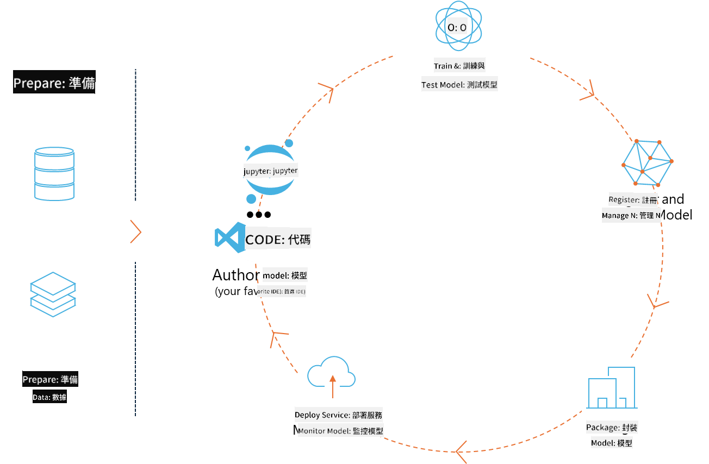
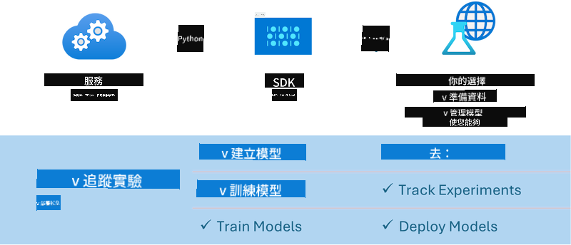

<!--
CO_OP_TRANSLATOR_METADATA:
{
  "original_hash": "1e42c399dcc2fa477925d3ef4038d403",
  "translation_date": "2025-04-04T18:21:27+00:00",
  "source_file": "md\\02.Application\\01.TextAndChat\\Phi3\\E2E_Phi-3-MLflow.md",
  "language_code": "hk"
}
-->
# MLflow

[MLflow](https://mlflow.org/) 係一個開源平台，用嚟管理機器學習嘅全流程生命周期。



MLFlow 用嚟管理機器學習嘅生命周期，包括實驗、可重現性、部署同中央模型註冊。MLFlow目前提供四個組件：

- **MLflow Tracking:** 記錄同查詢實驗、代碼、數據配置同結果。
- **MLflow Projects:** 將數據科學代碼打包成可喺任何平台重現嘅格式。
- **Mlflow Models:** 喺多種服務環境部署機器學習模型。
- **Model Registry:** 喺中央倉庫儲存、註解同管理模型。

MLFlow包括追蹤實驗、將代碼打包成可重現運行，仲可以分享同部署模型嘅功能。MLFlow已經集成到Databricks，並支持多種機器學習庫，令其具有庫無關性。佢可以同任何機器學習庫配合使用，並支持任何編程語言，因為佢提供REST API同CLI方便使用。


MLFlow嘅主要功能包括：

- **實驗追蹤:** 記錄同比較參數同結果。
- **模型管理:** 將模型部署到各種服務同推理平台。
- **模型註冊:** 協作管理MLFlow模型嘅生命周期，包括版本控制同註解。
- **項目:** 打包機器學習代碼，用於分享或者生產用途。

MLFlow仲支持MLOps循環，包括準備數據、註冊同管理模型、打包模型執行、部署服務同監控模型。佢目標係簡化從原型到生產工作流程嘅過程，特別喺雲端同邊緣環境。

## 全流程場景 - 建立封裝器並使用Phi-3作為MLFlow模型

喺呢個全流程示例中，我哋會展示兩種唔同方法，嚟建立Phi-3小型語言模型（SLM）嘅封裝器，並將其作為MLFlow模型本地或者雲端運行，例如Azure Machine Learning workspace。



| 項目 | 描述 | 位置 |
| ------------ | ----------- | -------- |
| Transformer Pipeline | Transformer Pipeline係最簡單嘅選擇，當你想用HuggingFace模型同MLFlow嘅實驗性transformers flavour搭配使用時。 | [**TransformerPipeline.ipynb**](../../../../../../code/06.E2E/E2E_Phi-3-MLflow_TransformerPipeline.ipynb) |
| 自定義Python封裝器 | 喺撰寫本文時，transformer pipeline唔支持用MLFlow封裝HuggingFace模型喺ONNX格式，即使使用實驗性optimum Python包都唔得。對於呢啲情況，你可以為MLFlow模型建立自定義Python封裝器。 | [**CustomPythonWrapper.ipynb**](../../../../../../code/06.E2E/E2E_Phi-3-MLflow_CustomPythonWrapper.ipynb) |

## 項目: Transformer Pipeline

1. 你需要MLFlow同HuggingFace相關嘅Python包：

    ``` Python
    import mlflow
    import transformers
    ```

2. 接住，你應該初始化transformer pipeline，參考HuggingFace註冊表中嘅目標Phi-3模型。從 _Phi-3-mini-4k-instruct_ 模型卡可以睇到，佢嘅任務係“文本生成”類型：

    ``` Python
    pipeline = transformers.pipeline(
        task = "text-generation",
        model = "microsoft/Phi-3-mini-4k-instruct"
    )
    ```

3. 你而家可以將Phi-3模型嘅transformer pipeline保存成MLFlow格式，並提供額外嘅細節，例如目標工件路徑、特定模型配置設置同推理API類型：

    ``` Python
    model_info = mlflow.transformers.log_model(
        transformers_model = pipeline,
        artifact_path = "phi3-mlflow-model",
        model_config = model_config,
        task = "llm/v1/chat"
    )
    ```

## 項目: 自定義Python封裝器

1. 喺呢度我哋可以使用Microsoft嘅[ONNX Runtime generate() API](https://github.com/microsoft/onnxruntime-genai)，用於ONNX模型嘅推理同tokens編碼/解碼。你需要選擇針對目標計算嘅 _onnxruntime_genai_ 包，以下示例針對CPU：

    ``` Python
    import mlflow
    from mlflow.models import infer_signature
    import onnxruntime_genai as og
    ```

1. 我哋嘅自定義類實現咗兩個方法：_load_context()_ 用嚟初始化 **Phi-3 Mini 4K Instruct嘅ONNX模型**、**生成器參數**同**tokenizer**；_predict()_ 用嚟生成提供嘅提示嘅輸出tokens：

    ``` Python
    class Phi3Model(mlflow.pyfunc.PythonModel):
        def load_context(self, context):
            # Retrieving model from the artifacts
            model_path = context.artifacts["phi3-mini-onnx"]
            model_options = {
                 "max_length": 300,
                 "temperature": 0.2,         
            }
        
            # Defining the model
            self.phi3_model = og.Model(model_path)
            self.params = og.GeneratorParams(self.phi3_model)
            self.params.set_search_options(**model_options)
            
            # Defining the tokenizer
            self.tokenizer = og.Tokenizer(self.phi3_model)
    
        def predict(self, context, model_input):
            # Retrieving prompt from the input
            prompt = model_input["prompt"][0]
            self.params.input_ids = self.tokenizer.encode(prompt)
    
            # Generating the model's response
            response = self.phi3_model.generate(self.params)
    
            return self.tokenizer.decode(response[0][len(self.params.input_ids):])
    ```

1. 你而家可以使用 _mlflow.pyfunc.log_model()_ 函數，為Phi-3模型生成自定義Python封裝器（pickle格式），同時保存原始ONNX模型同所需依賴：

    ``` Python
    model_info = mlflow.pyfunc.log_model(
        artifact_path = artifact_path,
        python_model = Phi3Model(),
        artifacts = {
            "phi3-mini-onnx": "cpu_and_mobile/cpu-int4-rtn-block-32-acc-level-4",
        },
        input_example = input_example,
        signature = infer_signature(input_example, ["Run"]),
        extra_pip_requirements = ["torch", "onnxruntime_genai", "numpy"],
    )
    ```

## 生成嘅MLFlow模型嘅簽名

1. 喺Transformer Pipeline項目嘅第三步，我哋設置咗MLFlow模型嘅任務為“_llm/v1/chat_”。呢個指令生成咗模型嘅API封裝器，兼容OpenAI嘅Chat API，如下所示：

    ``` Python
    {inputs: 
      ['messages': Array({content: string (required), name: string (optional), role: string (required)}) (required), 'temperature': double (optional), 'max_tokens': long (optional), 'stop': Array(string) (optional), 'n': long (optional), 'stream': boolean (optional)],
    outputs: 
      ['id': string (required), 'object': string (required), 'created': long (required), 'model': string (required), 'choices': Array({finish_reason: string (required), index: long (required), message: {content: string (required), name: string (optional), role: string (required)} (required)}) (required), 'usage': {completion_tokens: long (required), prompt_tokens: long (required), total_tokens: long (required)} (required)],
    params: 
      None}
    ```

1. 因此，你可以以下面格式提交提示：

    ``` Python
    messages = [{"role": "user", "content": "What is the capital of Spain?"}]
    ```

1. 然後，使用OpenAI API兼容嘅後處理，例如 _response[0][‘choices’][0][‘message’][‘content’]_，將輸出美化成如下格式：

    ``` JSON
    Question: What is the capital of Spain?
    
    Answer: The capital of Spain is Madrid. It is the largest city in Spain and serves as the political, economic, and cultural center of the country. Madrid is located in the center of the Iberian Peninsula and is known for its rich history, art, and architecture, including the Royal Palace, the Prado Museum, and the Plaza Mayor.
    
    Usage: {'prompt_tokens': 11, 'completion_tokens': 73, 'total_tokens': 84}
    ```

1. 喺Custom Python Wrapper項目嘅第三步，我哋允許MLFlow包從提供嘅輸入示例生成模型嘅簽名。我哋MLFlow封裝器嘅簽名會係咁樣：

    ``` Python
    {inputs: 
      ['prompt': string (required)],
    outputs: 
      [string (required)],
    params: 
      None}
    ```

1. 所以，我哋嘅提示需要包含 "prompt" 字典鍵，類似於咁：

    ``` Python
    {"prompt": "<|system|>You are a stand-up comedian.<|end|><|user|>Tell me a joke about atom<|end|><|assistant|>",}
    ```

1. 然後模型嘅輸出會以字符串格式提供：

    ``` JSON
    Alright, here's a little atom-related joke for you!
    
    Why don't electrons ever play hide and seek with protons?
    
    Because good luck finding them when they're always "sharing" their electrons!
    
    Remember, this is all in good fun, and we're just having a little atomic-level humor!
    ```

**免責聲明**：  
本文件使用AI翻譯服務 [Co-op Translator](https://github.com/Azure/co-op-translator) 進行翻譯。儘管我們致力於提供準確的翻譯，請注意自動翻譯可能包含錯誤或不準確之處。原始文件的母語版本應被視為權威來源。對於關鍵信息，建議尋求專業人工翻譯。我們對因使用此翻譯而引起的任何誤解或錯誤解釋不承擔責任。