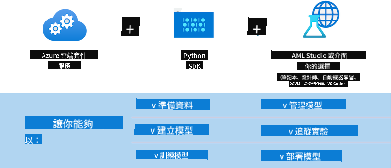

<!--
CO_OP_TRANSLATOR_METADATA:
{
  "original_hash": "f61c383bbf0c3dac97e43f833c258731",
  "translation_date": "2025-05-08T05:35:23+00:00",
  "source_file": "md/02.Application/01.TextAndChat/Phi3/E2E_Phi-3-MLflow.md",
  "language_code": "hk"
}
-->
# MLflow

[MLflow](https://mlflow.org/) 係一個開源平台，專門用嚟管理機器學習嘅整個生命週期。


MLFlow 用嚟管理機器學習嘅生命週期，包括實驗、可重現性、部署同中央模型註冊庫。MLFlow 而家提供四個主要組件。

- **MLflow Tracking:** 記錄同查詢實驗、代碼、數據配置同結果。
- **MLflow Projects:** 將數據科學代碼打包成可以喺任何平台重現嘅格式。
- **Mlflow Models:** 喺唔同嘅服務環境部署機器學習模型。
- **Model Registry:** 喺中央倉庫儲存、註解同管理模型。

佢包括追蹤實驗、將代碼打包成可重現嘅運行，仲可以分享同部署模型嘅功能。MLFlow 已經同 Databricks 整合，支持多種機器學習庫，唔會鎖定某一個庫。你可以用任何機器學習庫同編程語言，因為佢提供 REST API 同 CLI，使用好方便。


MLFlow 嘅主要功能包括：

- **實驗追蹤：** 記錄同比較參數同結果。
- **模型管理：** 將模型部署到各種服務同推理平台。
- **模型註冊庫：** 協作管理 MLflow 模型嘅生命週期，包括版本控制同註解。
- **Projects：** 打包機器學習代碼方便分享或生產使用。

MLFlow 仲支持 MLOps 循環，包括準備數據、註冊同管理模型、打包模型執行、部署服務同監控模型。佢目標係簡化由原型到生產流程嘅過程，特別係喺雲端同邊緣環境。

## E2E 範例 - 建立包裝器同用 Phi-3 作為 MLFlow 模型

呢個 E2E 範例會示範兩種唔同方法，點樣圍繞 Phi-3 細型語言模型 (SLM) 建立包裝器，然後喺本地或者雲端（例如 Azure Machine Learning 工作區）以 MLFlow 模型形式運行。



| Project | Description | Location |
| ------------ | ----------- | -------- |
| Transformer Pipeline | Transformer Pipeline 係用 MLFlow 嘅實驗性 transformers 版本，用 HuggingFace 模型建立包裝器最簡單嘅方法。 | [**TransformerPipeline.ipynb**](../../../../../../code/06.E2E/E2E_Phi-3-MLflow_TransformerPipeline.ipynb) |
| Custom Python Wrapper | 寫呢篇嘅時候，transformer pipeline 未支持用 MLFlow 產生 HuggingFace ONNX 格式模型嘅包裝器，即使用實驗性嘅 optimum Python package。呢啲情況可以自己寫 Python 包裝器嚟用 MLFlow。 | [**CustomPythonWrapper.ipynb**](../../../../../../code/06.E2E/E2E_Phi-3-MLflow_CustomPythonWrapper.ipynb) |

## Project: Transformer Pipeline

1. 你需要安裝 MLFlow 同 HuggingFace 嘅相關 Python 套件：

    ``` Python
    import mlflow
    import transformers
    ```

2. 接住，你要透過 HuggingFace 註冊庫指定目標 Phi-3 模型，初始化 transformer pipeline。從 _Phi-3-mini-4k-instruct_ 嘅模型卡可以見到，佢嘅任務係「文本生成」類型：

    ``` Python
    pipeline = transformers.pipeline(
        task = "text-generation",
        model = "microsoft/Phi-3-mini-4k-instruct"
    )
    ```

3. 而家你可以將 Phi-3 模型嘅 transformer pipeline 儲存成 MLFlow 格式，並提供額外資訊，例如目標 artifacts 路徑、特定模型配置同推理 API 類型：

    ``` Python
    model_info = mlflow.transformers.log_model(
        transformers_model = pipeline,
        artifact_path = "phi3-mlflow-model",
        model_config = model_config,
        task = "llm/v1/chat"
    )
    ```

## Project: Custom Python Wrapper

1. 呢度我哋用 Microsoft 嘅 [ONNX Runtime generate() API](https://github.com/microsoft/onnxruntime-genai) 來做 ONNX 模型嘅推理同 tokens 編碼/解碼。你要揀 _onnxruntime_genai_ 套件配合目標運算資源，以下例子係針對 CPU：

    ``` Python
    import mlflow
    from mlflow.models import infer_signature
    import onnxruntime_genai as og
    ```

1. 我哋自定義嘅類別實作咗兩個方法：_load_context()_ 用嚟初始化 Phi-3 Mini 4K Instruct 嘅 **ONNX 模型**、**生成器參數**同 **tokenizer**；_predict()_ 用嚟根據輸入 prompt 生成輸出 tokens：

    ``` Python
    class Phi3Model(mlflow.pyfunc.PythonModel):
        def load_context(self, context):
            # Retrieving model from the artifacts
            model_path = context.artifacts["phi3-mini-onnx"]
            model_options = {
                 "max_length": 300,
                 "temperature": 0.2,         
            }
        
            # Defining the model
            self.phi3_model = og.Model(model_path)
            self.params = og.GeneratorParams(self.phi3_model)
            self.params.set_search_options(**model_options)
            
            # Defining the tokenizer
            self.tokenizer = og.Tokenizer(self.phi3_model)
    
        def predict(self, context, model_input):
            # Retrieving prompt from the input
            prompt = model_input["prompt"][0]
            self.params.input_ids = self.tokenizer.encode(prompt)
    
            # Generating the model's response
            response = self.phi3_model.generate(self.params)
    
            return self.tokenizer.decode(response[0][len(self.params.input_ids):])
    ```

1. 你而家可以用 _mlflow.pyfunc.log_model()_ 函數，為 Phi-3 模型產生自定義 Python 包裝器（pickle 格式），連同原始 ONNX 模型同所需依賴一齊打包：

    ``` Python
    model_info = mlflow.pyfunc.log_model(
        artifact_path = artifact_path,
        python_model = Phi3Model(),
        artifacts = {
            "phi3-mini-onnx": "cpu_and_mobile/cpu-int4-rtn-block-32-acc-level-4",
        },
        input_example = input_example,
        signature = infer_signature(input_example, ["Run"]),
        extra_pip_requirements = ["torch", "onnxruntime_genai", "numpy"],
    )
    ```

## 產生嘅 MLFlow 模型簽名

1. 喺上面 Transformer Pipeline 專案嘅第 3 步，我哋將 MLFlow 模型嘅任務設為 “_llm/v1/chat_”。呢個設定會產生一個模型 API 包裝器，兼容 OpenAI Chat API，如下所示：

    ``` Python
    {inputs: 
      ['messages': Array({content: string (required), name: string (optional), role: string (required)}) (required), 'temperature': double (optional), 'max_tokens': long (optional), 'stop': Array(string) (optional), 'n': long (optional), 'stream': boolean (optional)],
    outputs: 
      ['id': string (required), 'object': string (required), 'created': long (required), 'model': string (required), 'choices': Array({finish_reason: string (required), index: long (required), message: {content: string (required), name: string (optional), role: string (required)} (required)}) (required), 'usage': {completion_tokens: long (required), prompt_tokens: long (required), total_tokens: long (required)} (required)],
    params: 
      None}
    ```

1. 咁你就可以用以下格式提交 prompt：

    ``` Python
    messages = [{"role": "user", "content": "What is the capital of Spain?"}]
    ```

1. 然後，用兼容 OpenAI API 嘅後處理，例如 _response[0][‘choices’][0][‘message’][‘content’]_，將輸出美化成咁：

    ``` JSON
    Question: What is the capital of Spain?
    
    Answer: The capital of Spain is Madrid. It is the largest city in Spain and serves as the political, economic, and cultural center of the country. Madrid is located in the center of the Iberian Peninsula and is known for its rich history, art, and architecture, including the Royal Palace, the Prado Museum, and the Plaza Mayor.
    
    Usage: {'prompt_tokens': 11, 'completion_tokens': 73, 'total_tokens': 84}
    ```

1. 喺上面 Custom Python Wrapper 專案第 3 步，我哋讓 MLFlow 套件根據輸入範例自動生成模型簽名。呢個 MLFlow 包裝器嘅簽名會係咁：

    ``` Python
    {inputs: 
      ['prompt': string (required)],
    outputs: 
      [string (required)],
    params: 
      None}
    ```

1. 所以，我哋嘅 prompt 需要包含 "prompt" 呢個字典鍵，類似咁：

    ``` Python
    {"prompt": "<|system|>You are a stand-up comedian.<|end|><|user|>Tell me a joke about atom<|end|><|assistant|>",}
    ```

1. 模型嘅輸出會係字串格式：

    ``` JSON
    Alright, here's a little atom-related joke for you!
    
    Why don't electrons ever play hide and seek with protons?
    
    Because good luck finding them when they're always "sharing" their electrons!
    
    Remember, this is all in good fun, and we're just having a little atomic-level humor!
    ```

**免責聲明**：  
本文件係用 AI 翻譯服務 [Co-op Translator](https://github.com/Azure/co-op-translator) 翻譯。雖然我哋致力保持準確，但請注意自動翻譯可能包含錯誤或不準確之處。原文版本應視為權威來源。對於重要資料，建議採用專業人工翻譯。因使用本翻譯而引致嘅任何誤會或誤解，我哋概不負責。