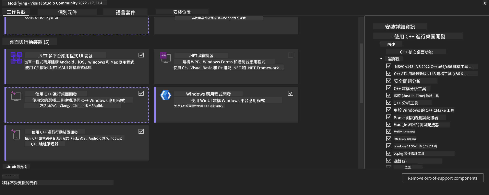
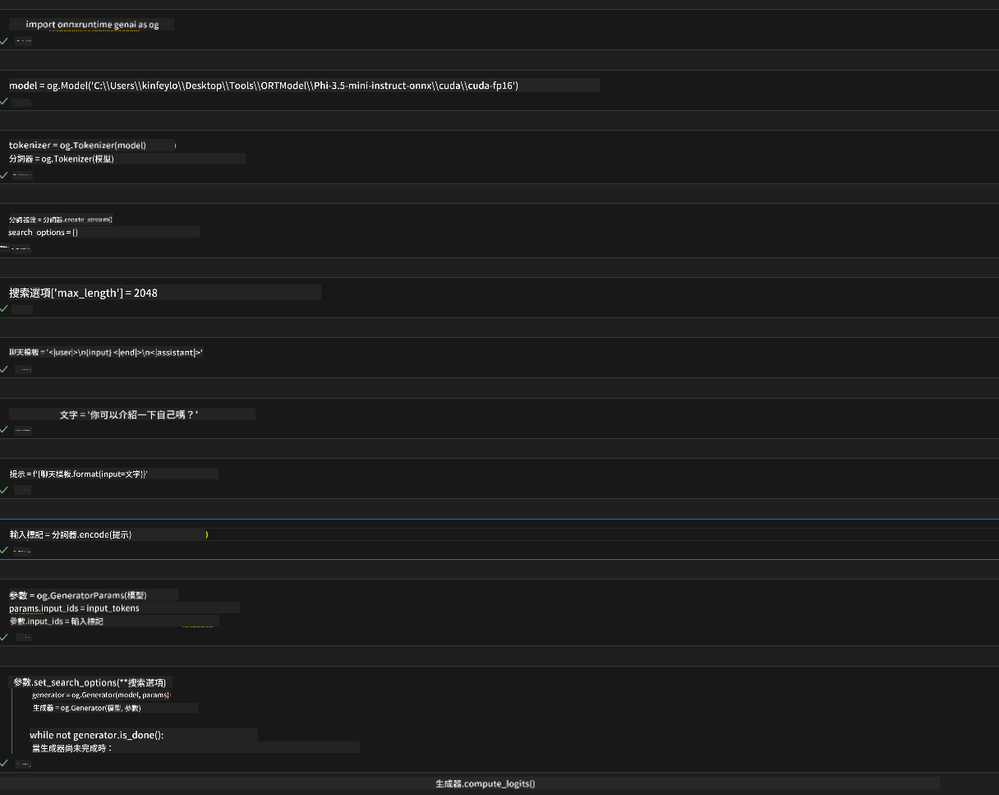
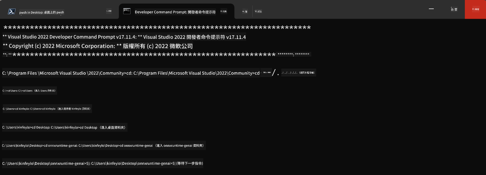

<!--
CO_OP_TRANSLATOR_METADATA:
{
  "original_hash": "9fe95f5575ecf5985eb9f67d205d0136",
  "translation_date": "2025-04-04T18:22:32+00:00",
  "source_file": "md\\02.Application\\01.TextAndChat\\Phi3\\ORTWindowGPUGuideline.md",
  "language_code": "hk"
}
-->
# **OnnxRuntime GenAI Windows GPU 指引**

呢個指引提供咗喺 Windows 上設置同使用 ONNX Runtime (ORT) 配合 GPU 嘅步驟，幫助你利用 GPU 加速模型，提升性能同效率。

文件內容包括：

- **環境設置**：講解點樣安裝所需嘅依賴，例如 CUDA、cuDNN 同 ONNX Runtime。
- **配置**：教你點樣配置環境同 ONNX Runtime，以有效利用 GPU 資源。
- **優化建議**：提供調整 GPU 設定嘅技巧，令性能達到最佳。

### **1. Python 3.10.x /3.11.8**

   ***提醒*** 建議使用 [miniforge](https://github.com/conda-forge/miniforge/releases/latest/download/Miniforge3-Windows-x86_64.exe) 作為你嘅 Python 環境。

   ```bash

   conda create -n pydev python==3.11.8

   conda activate pydev

   ```

   ***注意*** 如果之前已經安裝咗任何 ONNX 嘅 Python library，請先卸載。

### **2. 用 winget 安裝 CMake**

   ```bash

   winget install -e --id Kitware.CMake

   ```

### **3. 安裝 Visual Studio 2022 - C++ 桌面開發**

   ***注意*** 如果你唔需要編譯，可以跳過呢一步。



### **4. 安裝 NVIDIA 驅動**

1. **NVIDIA GPU 驅動** [https://www.nvidia.com/en-us/drivers/](https://www.nvidia.com/en-us/drivers/)

2. **NVIDIA CUDA 12.4** [https://developer.nvidia.com/cuda-12-4-0-download-archive](https://developer.nvidia.com/cuda-12-4-0-download-archive)

3. **NVIDIA CUDNN 9.4** [https://developer.nvidia.com/cudnn-downloads](https://developer.nvidia.com/cudnn-downloads)

***提醒*** 安裝時請使用默認設定。

### **5. 設置 NVIDIA 環境變量**

將 NVIDIA CUDNN 9.4 嘅 lib、bin、include 文件複製到 NVIDIA CUDA 12.4 嘅對應文件夾。

- 將 *'C:\Program Files\NVIDIA\CUDNN\v9.4\bin\12.6'* 文件複製到 *'C:\Program Files\NVIDIA GPU Computing Toolkit\CUDA\v12.4\bin'*

- 將 *'C:\Program Files\NVIDIA\CUDNN\v9.4\include\12.6'* 文件複製到 *'C:\Program Files\NVIDIA GPU Computing Toolkit\CUDA\v12.4\include'*

- 將 *'C:\Program Files\NVIDIA\CUDNN\v9.4\lib\12.6'* 文件複製到 *'C:\Program Files\NVIDIA GPU Computing Toolkit\CUDA\v12.4\lib\x64'*

### **6. 下載 Phi-3.5-mini-instruct-onnx**

   ```bash

   winget install -e --id Git.Git

   winget install -e --id GitHub.GitLFS

   git lfs install

   git clone https://huggingface.co/microsoft/Phi-3.5-mini-instruct-onnx

   ```

### **7. 執行 InferencePhi35Instruct.ipynb**

   打開 [Notebook](../../../../../../code/09.UpdateSamples/Aug/ortgpu-phi35-instruct.ipynb) 並執行。



### **8. 編譯 ORT GenAI GPU**

   ***注意*** 

   1. 首先請卸載所有有關 onnx、onnxruntime 同 onnxruntime-genai 嘅內容。

   ```bash

   pip list 
   
   ```

   然後卸載所有 onnxruntime library，例如：

   ```bash

   pip uninstall onnxruntime

   pip uninstall onnxruntime-genai

   pip uninstall onnxruntume-genai-cuda
   
   ```

   2. 檢查 Visual Studio 擴展支持。

   查看 *C:\Program Files\NVIDIA GPU Computing Toolkit\CUDA\v12.4\extras*，確保 *C:\Program Files\NVIDIA GPU Computing Toolkit\CUDA\v12.4\extras\visual_studio_integration* 文件夾存在。

   如果唔存在，請檢查其他 CUDA 工具包驅動文件夾，並將 *visual_studio_integration* 文件夾及內容複製到 *C:\Program Files\NVIDIA GPU Computing Toolkit\CUDA\v12.4\extras\visual_studio_integration*。

   - 如果唔需要編譯，可以跳過呢一步。

   ```bash

   git clone https://github.com/microsoft/onnxruntime-genai

   ```

   - 下載 [https://github.com/microsoft/onnxruntime/releases/download/v1.19.2/onnxruntime-win-x64-gpu-1.19.2.zip](https://github.com/microsoft/onnxruntime/releases/download/v1.19.2/onnxruntime-win-x64-gpu-1.19.2.zip)

   - 解壓 *onnxruntime-win-x64-gpu-1.19.2.zip*，並將其重命名為 **ort**，然後將 **ort** 文件夾複製到 *onnxruntime-genai*。

   - 使用 Windows Terminal，進入 VS 2022 嘅開發者命令提示符，並進入 *onnxruntime-genai*。



   - 用你嘅 Python 環境進行編譯。

   ```bash

   cd onnxruntime-genai

   python build.py --use_cuda  --cuda_home "C:\Program Files\NVIDIA GPU Computing Toolkit\CUDA\v12.4" --config Release
 

   cd build/Windows/Release/Wheel

   pip install .whl

   ```

**免責聲明**：  
本文件已使用人工智能翻譯服務 [Co-op Translator](https://github.com/Azure/co-op-translator) 進行翻譯。我們致力於提供準確的翻譯，但請注意，自動翻譯可能包含錯誤或不準確之處。原始文件的母語版本應被視為權威來源。對於重要資訊，建議尋求專業人工翻譯。我們對因使用此翻譯而引起的任何誤解或錯誤解釋不承擔責任。