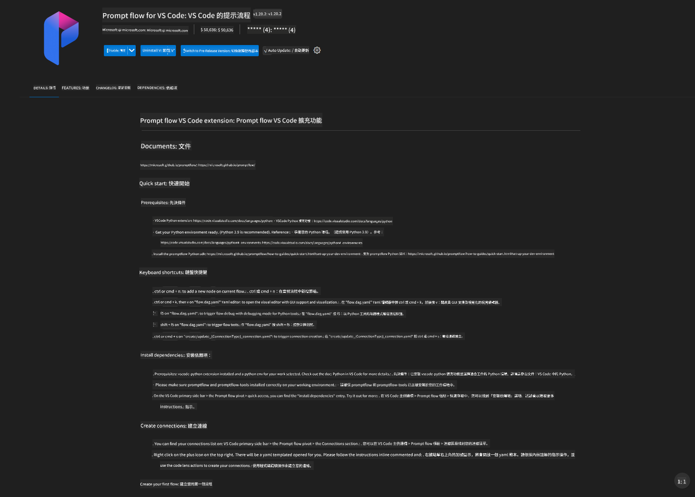
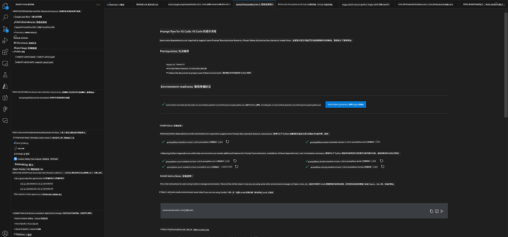
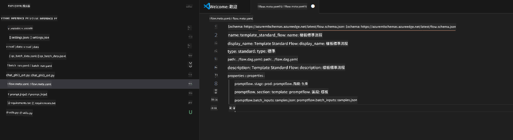
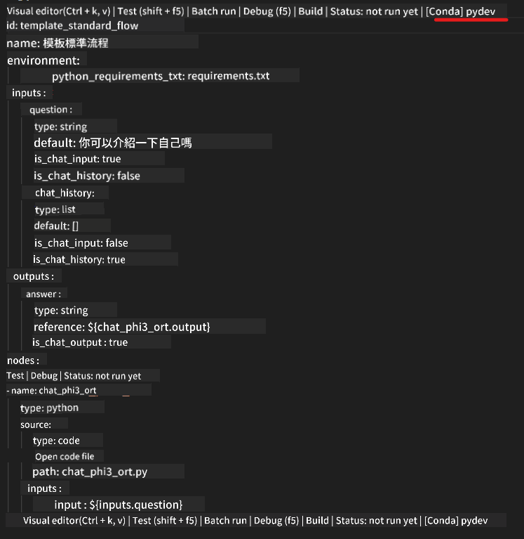
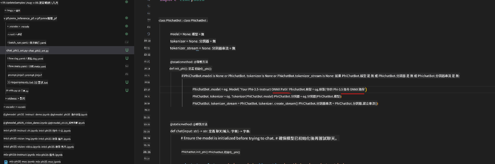
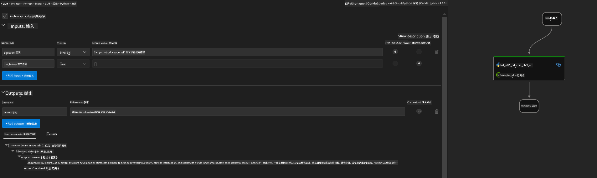
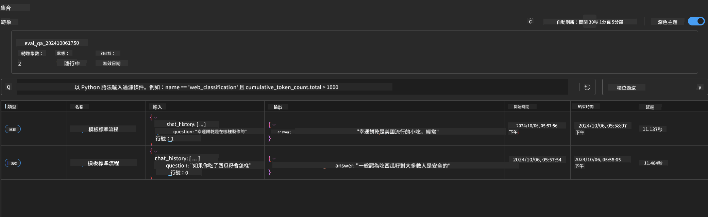

<!--
CO_OP_TRANSLATOR_METADATA:
{
  "original_hash": "92e7dac1e5af0dd7c94170fdaf6860fe",
  "translation_date": "2025-05-08T05:36:27+00:00",
  "source_file": "md/02.Application/01.TextAndChat/Phi3/UsingPromptFlowWithONNX.md",
  "language_code": "hk"
}
-->
# 使用 Windows GPU 配合 Phi-3.5-Instruct ONNX 建立 Prompt flow 解決方案

以下文件示範如何使用 PromptFlow 搭配 ONNX（Open Neural Network Exchange）來開發基於 Phi-3 模型的 AI 應用程式。

PromptFlow 是一套開發工具，旨在簡化基於大型語言模型（LLM）的 AI 應用從構思、原型設計到測試和評估的整個開發流程。

透過整合 PromptFlow 與 ONNX，開發者可以：

- 優化模型效能：利用 ONNX 進行高效的模型推論與部署。
- 簡化開發流程：使用 PromptFlow 管理工作流程並自動化重複任務。
- 強化團隊協作：提供統一的開發環境，促進團隊間更好的合作。

**Prompt flow** 是一套開發工具，設計用來簡化基於 LLM 的 AI 應用從構思、原型設計、測試、評估，到正式部署及監控的完整開發週期。它讓 prompt 工程變得更簡單，並幫助你打造具備生產品質的 LLM 應用。

Prompt flow 能連接 OpenAI、Azure OpenAI Service，以及可自訂的模型（Huggingface、本地 LLM/SLM）。我們希望將 Phi-3.5 的量化 ONNX 模型部署到本地應用。Prompt flow 能協助我們更好地規劃業務，並完成基於 Phi-3.5 的本地解決方案。在此範例中，我們會結合 ONNX Runtime GenAI Library，利用 Windows GPU 完成 Prompt flow 解決方案。

## **安裝**

### **Windows GPU 版 ONNX Runtime GenAI**

請參考此指南設定 Windows GPU 版 ONNX Runtime GenAI [點此查看](./ORTWindowGPUGuideline.md)

### **在 VSCode 中設定 Prompt flow**

1. 安裝 Prompt flow VS Code 擴充功能



2. 安裝完 Prompt flow VS Code 擴充功能後，點選該擴充功能，選擇 **Installation dependencies**，並依照指引在你的環境中安裝 Prompt flow SDK



3. 下載 [Sample Code](../../../../../../code/09.UpdateSamples/Aug/pf/onnx_inference_pf) 並用 VS Code 開啟範例



4. 開啟 **flow.dag.yaml** 選擇你的 Python 環境



   開啟 **chat_phi3_ort.py** 修改 Phi-3.5-instruct ONNX 模型位置



5. 執行你的 prompt flow 進行測試

開啟 **flow.dag.yaml**，點選 visual editor


點擊後執行測試



1. 你也可以在終端機執行批次指令來查看更多結果


```bash

pf run create --file batch_run.yaml --stream --name 'Your eval qa name'    

```

你可以在預設瀏覽器中查看結果




**免責聲明**：  
本文件係用 AI 翻譯服務 [Co-op Translator](https://github.com/Azure/co-op-translator) 翻譯而成。雖然我哋努力確保準確性，但請注意，自動翻譯可能包含錯誤或不準確之處。原始文件嘅母語版本應視為權威來源。對於重要資料，建議使用專業人工翻譯。我哋對因使用此翻譯而引致嘅任何誤解或誤釋概不負責。