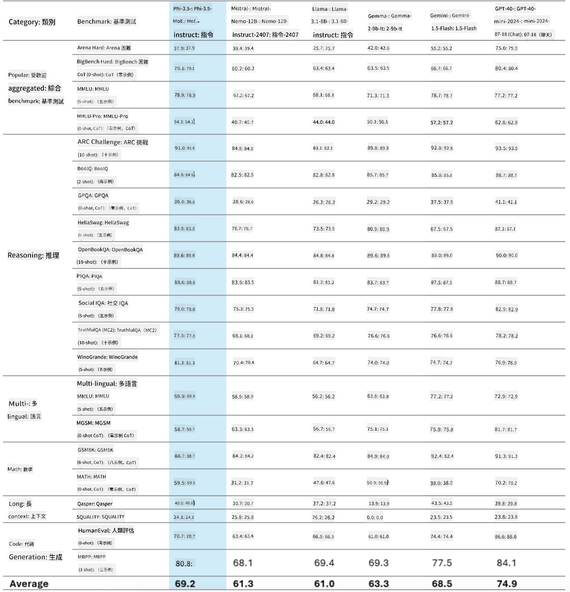
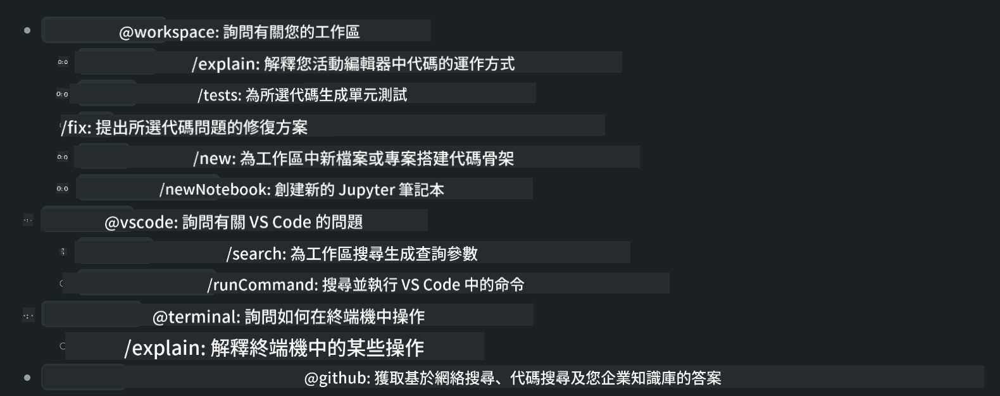
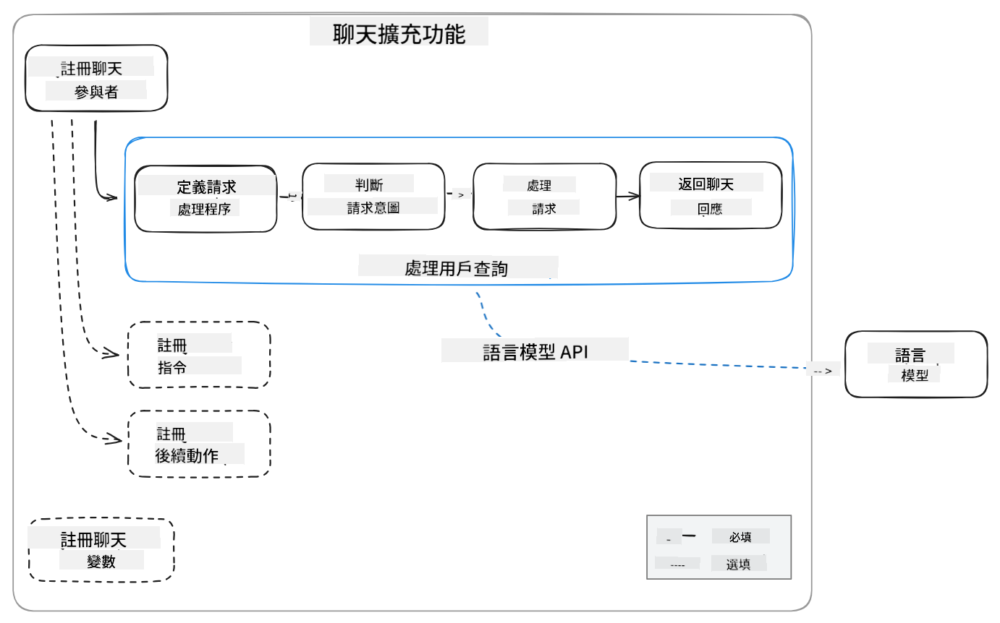
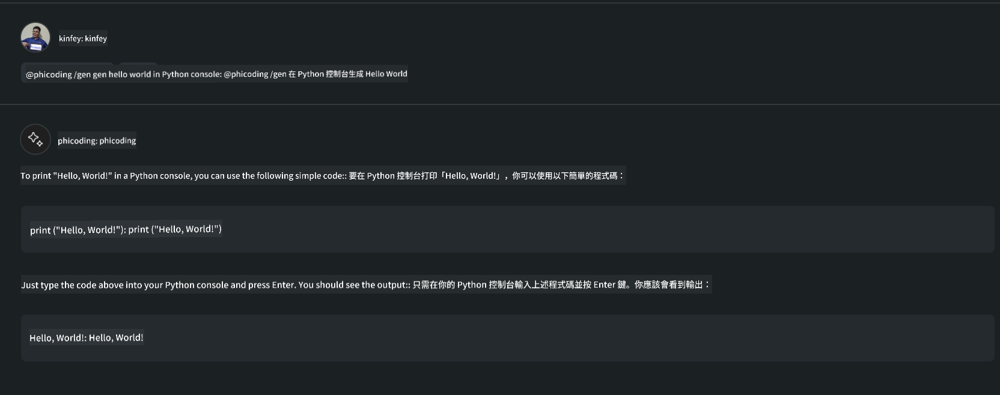
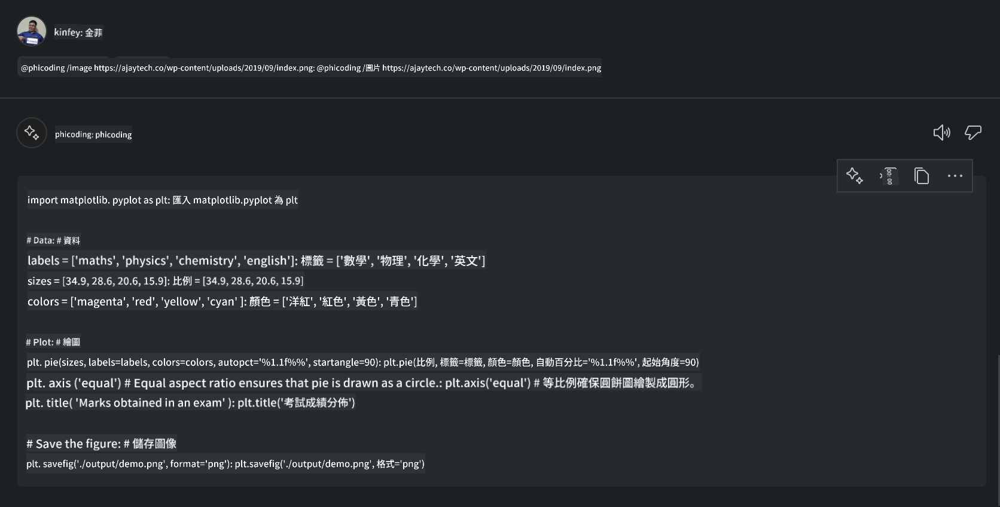

<!--
CO_OP_TRANSLATOR_METADATA:
{
  "original_hash": "35bf81388ac6917277b8d9a0c39bdc70",
  "translation_date": "2025-05-08T05:27:42+00:00",
  "source_file": "md/02.Application/02.Code/Phi3/CreateVSCodeChatAgentWithGitHubModels.md",
  "language_code": "hk"
}
-->
# **用 GitHub Models 嘅 Phi-3.5 自己整 Visual Studio Code Chat Copilot Agent**

你有冇用緊 Visual Studio Code Copilot？特別係 Chat 入面，你可以用唔同嘅 agents 去提升喺 Visual Studio Code 入面創作、寫作同維護項目嘅能力。Visual Studio Code 提供咗一個 API，容許公司同個人根據自己嘅業務去創建唔同嘅 agents，喺唔同嘅專有領域擴展佢哋嘅功能。今次文章我哋會集中講下 GitHub Models 嘅 **Phi-3.5-mini-instruct (128k)** 同 **Phi-3.5-vision-instruct (128k)**，教你點樣整自己嘅 Visual Studio Code Agent。

## **關於 GitHub Models 嘅 Phi-3.5**

我哋知道 Phi-3/3.5-mini-instruct 喺 Phi-3/3.5 家族入面擁有強大嘅代碼理解同生成能力，仲比 Gemma-2-9b 同 Mistral-Nemo-12B-instruct-2407 有優勢。



最新嘅 GitHub Models 已經提供咗 Phi-3.5-mini-instruct (128k) 同 Phi-3.5-vision-instruct (128k) 嘅存取。開發者可以透過 OpenAI SDK、Azure AI Inference SDK 同 REST API 去用佢哋。


***Note: *** 建議用 Azure AI Inference SDK，因為喺生產環境可以更好咁同 Azure Model Catalog 互換。

以下係 **Phi-3.5-mini-instruct (128k)** 同 **Phi-3.5-vision-instruct (128k)** 喺代碼生成場景同 GitHub Models 對接後嘅效果，亦為下面嘅例子做準備。

**Demo: GitHub Models Phi-3.5-mini-instruct (128k) 從 Prompt 生成代碼** ([點擊呢度](../../../../../../code/09.UpdateSamples/Aug/ghmodel_phi35_instruct_demo.ipynb))

**Demo: GitHub Models Phi-3.5-vision-instruct (128k) 從圖片生成代碼** ([點擊呢度](../../../../../../code/09.UpdateSamples/Aug/ghmodel_phi35_vision_demo.ipynb))


## **關於 GitHub Copilot Chat Agent**

GitHub Copilot Chat Agent 可以根據代碼喺唔同嘅項目場景完成唔同嘅任務。系統有四個 agents：workspace、github、terminal、vscode。



加上 ‘@’ 同 agent 名稱，就可以快速完成相應嘅工作。對企業嚟講，如果加入自己業務相關嘅內容，例如需求、編碼、測試規範同發佈，可以基於 GitHub Copilot 擁有更強大嘅企業私有功能。

Visual Studio Code Chat Agent 而家已正式推出 API，容許企業或企業開發者根據唔同軟件業務生態系統去開發 agents。基於 Visual Studio Code Extension 開發嘅方法，你可以輕鬆接入 Visual Studio Code Chat Agent API 嘅介面。我哋可以基於呢個流程去開發。



開發場景支持接入第三方模型 API（例如 GitHub Models、Azure Model Catalog，同基於開源模型嘅自建服務），亦可以用 GitHub Copilot 提供嘅 gpt-35-turbo、gpt-4 同 gpt-4o 模型。

## **基於 Phi-3.5 加入 Agent @phicoding**

我哋嘗試整合 Phi-3.5 嘅編程能力，完成寫代碼、根據圖片生成代碼等任務。完成一個以 Phi-3.5 為核心嘅 Agent - @PHI，以下係部分功能：

1. 透過 GitHub Copilot 提供嘅 GPT-4o，用 **@phicoding /help** 命令生成自我介紹

2. 透過 **Phi-3.5-mini-instruct (128k)** 用 **@phicoding /gen** 命令生成唔同編程語言嘅代碼

3. 透過 **Phi-3.5-vision-instruct (128k)** 同圖片，用 **@phicoding /image** 命令生成代碼


## **相關步驟**

1. 用 npm 安裝 Visual Studio Code Extension 開發支持

```bash

npm install --global yo generator-code 

```
2. 創建 Visual Studio Code Extension 插件（用 Typescript 開發模式，名叫 phiext）

```bash

yo code 

```

3. 打開創建嘅項目，修改 package.json。呢度有相關嘅說明同配置，同 GitHub Models 嘅配置。記住要喺度加你嘅 GitHub Models token。

```json

{
  "name": "phiext",
  "displayName": "phiext",
  "description": "",
  "version": "0.0.1",
  "engines": {
    "vscode": "^1.93.0"
  },
  "categories": [
    "AI",
    "Chat"
  ],
  "activationEvents": [],
  "enabledApiProposals": [
      "chatVariableResolver"
  ],
  "main": "./dist/extension.js",
  "contributes": {
    "chatParticipants": [
        {
            "id": "chat.phicoding",
            "name": "phicoding",
            "description": "Hey! I am Microsoft Phi-3.5, She can help me with coding problems, such as generation code with your natural language, or even generation code about chart from images. Just ask me anything!",
            "isSticky": true,
            "commands": [
                {
                    "name": "help",
                    "description": "Introduce myself to you"
                },
                {
                    "name": "gen",
                    "description": "Generate code for you with Microsoft Phi-3.5-mini-instruct"
                },
                {
                    "name": "image",
                    "description": "Generate code for chart from image(png or jpg) with Microsoft Phi-3.5-vision-instruct, please add image url like this : https://ajaytech.co/wp-content/uploads/2019/09/index.png"
                }
            ]
        }
    ],
    "commands": [
        {
            "command": "phicoding.namesInEditor",
            "title": "Use Microsoft Phi 3.5 in Editor"
        }
    ],
    "configuration": {
      "type": "object",
      "title": "githubmodels",
      "properties": {
        "githubmodels.endpoint": {
          "type": "string",
          "default": "https://models.inference.ai.azure.com",
          "description": "Your GitHub Models Endpoint",
          "order": 0
        },
        "githubmodels.api_key": {
          "type": "string",
          "default": "Your GitHub Models Token",
          "description": "Your GitHub Models Token",
          "order": 1
        },
        "githubmodels.phi35instruct": {
          "type": "string",
          "default": "Phi-3.5-mini-instruct",
          "description": "Your Phi-35-Instruct Model",
          "order": 2
        },
        "githubmodels.phi35vision": {
          "type": "string",
          "default": "Phi-3.5-vision-instruct",
          "description": "Your Phi-35-Vision Model",
          "order": 3
        }
      }
    }
  },
  "scripts": {
    "vscode:prepublish": "npm run package",
    "compile": "webpack",
    "watch": "webpack --watch",
    "package": "webpack --mode production --devtool hidden-source-map",
    "compile-tests": "tsc -p . --outDir out",
    "watch-tests": "tsc -p . -w --outDir out",
    "pretest": "npm run compile-tests && npm run compile && npm run lint",
    "lint": "eslint src",
    "test": "vscode-test"
  },
  "devDependencies": {
    "@types/vscode": "^1.93.0",
    "@types/mocha": "^10.0.7",
    "@types/node": "20.x",
    "@typescript-eslint/eslint-plugin": "^8.3.0",
    "@typescript-eslint/parser": "^8.3.0",
    "eslint": "^9.9.1",
    "typescript": "^5.5.4",
    "ts-loader": "^9.5.1",
    "webpack": "^5.94.0",
    "webpack-cli": "^5.1.4",
    "@vscode/test-cli": "^0.0.10",
    "@vscode/test-electron": "^2.4.1"
  },
  "dependencies": {
    "@types/node-fetch": "^2.6.11",
    "node-fetch": "^3.3.2",
    "@azure-rest/ai-inference": "latest",
    "@azure/core-auth": "latest",
    "@azure/core-sse": "latest"
  }
}


```

4. 修改 src/extension.ts

```typescript

// The module 'vscode' contains the VS Code extensibility API
// Import the module and reference it with the alias vscode in your code below
import * as vscode from 'vscode';
import ModelClient from "@azure-rest/ai-inference";
import { AzureKeyCredential } from "@azure/core-auth";


interface IPhiChatResult extends vscode.ChatResult {
    metadata: {
        command: string;
    };
}


const MODEL_SELECTOR: vscode.LanguageModelChatSelector = { vendor: 'copilot', family: 'gpt-4o' };

function isValidImageUrl(url: string): boolean {
    const regex = /^(https?:\/\/.*\.(?:png|jpg))$/i;
    return regex.test(url);
}
  

// This method is called when your extension is activated
// Your extension is activated the very first time the command is executed
export function activate(context: vscode.ExtensionContext) {

    const codinghandler: vscode.ChatRequestHandler = async (request: vscode.ChatRequest, context: vscode.ChatContext, stream: vscode.ChatResponseStream, token: vscode.CancellationToken): Promise<IPhiChatResult> => {


        const config : any = vscode.workspace.getConfiguration('githubmodels');
        const endPoint: string = config.get('endpoint');
        const apiKey: string = config.get('api_key');
        const phi35instruct: string = config.get('phi35instruct');
        const phi35vision: string = config.get('phi35vision');
        
        if (request.command === 'help') {

            const content = "Welcome to Coding assistant with Microsoft Phi-3.5"; 
            stream.progress(content);


            try {
                const [model] = await vscode.lm.selectChatModels(MODEL_SELECTOR);
                if (model) {
                    const messages = [
                        vscode.LanguageModelChatMessage.User("Please help me express this content in a humorous way: I am a programming assistant who can help you convert natural language into code and generate code based on the charts in the images. output format like this : Hey I am Phi ......")
                    ];
                    const chatResponse = await model.sendRequest(messages, {}, token);
                    for await (const fragment of chatResponse.text) {
                        stream.markdown(fragment);
                    }
                }
            } catch(err) {
                console.log(err);
            }


            return { metadata: { command: 'help' } };

        }

        
        if (request.command === 'gen') {

            const content = "Welcome to use phi-3.5 to generate code";

            stream.progress(content);

            const client = new ModelClient(endPoint, new AzureKeyCredential(apiKey));

            const response = await client.path("/chat/completions").post({
              body: {
                messages: [
                  { role:"system", content: "You are a coding assistant.Help answer all code generation questions." },
                  { role:"user", content: request.prompt }
                ],
                model: phi35instruct,
                temperature: 0.4,
                max_tokens: 1000,
                top_p: 1.
              }
            });

            stream.markdown(response.body.choices[0].message.content);

            return { metadata: { command: 'gen' } };

        }


        
        if (request.command === 'image') {


            const content = "Welcome to use phi-3.5 to generate code from image(png or jpg),image url like this:https://ajaytech.co/wp-content/uploads/2019/09/index.png";

            stream.progress(content);

            if (!isValidImageUrl(request.prompt)) {
                stream.markdown('Please provide a valid image URL');
                return { metadata: { command: 'image' } };
            }
            else
            {

                const client = new ModelClient(endPoint, new AzureKeyCredential(apiKey));
    
                const response = await client.path("/chat/completions").post({
                    body: {
                      messages: [
                        { role: "system", content: "You are a helpful assistant that describes images in details." },
                        { role: "user", content: [
                            { type: "text", text: "Please generate code according to the chart in the picture according to the following requirements\n1. Keep all information in the chart, including data and text\n2. Do not generate additional information that is not included in the chart\n3. Please extract data from the picture, do not generate it from csv\n4. Please save the regenerated chart as a chart and save it to ./output/demo.png"},
                            { type: "image_url", image_url: {url: request.prompt}
                            }
                          ]
                        }
                      ],
                      model: phi35vision,
                      temperature: 0.4,
                      max_tokens: 2048,
                      top_p: 1.
                    }
                  });
    
                
                stream.markdown(response.body.choices[0].message.content);
    
                return { metadata: { command: 'image' } };
            }


        }


        return { metadata: { command: '' } };
    };


    const phi_ext = vscode.chat.createChatParticipant("chat.phicoding", codinghandler);

    phi_ext.iconPath = new vscode.ThemeIcon('sparkle');


    phi_ext.followupProvider = {
        provideFollowups(result: IPhiChatResult, context: vscode.ChatContext, token: vscode.CancellationToken) {
            return [{
                prompt: 'Let us coding with Phi-3.5 😋😋😋😋',
                label: vscode.l10n.t('Enjoy coding with Phi-3.5'),
                command: 'help'
            } satisfies vscode.ChatFollowup];
        }
    };

    context.subscriptions.push(phi_ext);
}

// This method is called when your extension is deactivated
export function deactivate() {}


```

6. 運行

***/help***


***@phicoding /help***


***@phicoding /gen***




***@phicoding /image***




你可以下載示例代碼：[點擊](../../../../../../code/09.UpdateSamples/Aug/vscode)

## **資源**

1. 註冊 GitHub Models [https://gh.io/models](https://gh.io/models)

2. 學習 Visual Studio Code Extension 開發 [https://code.visualstudio.com/api/get-started/your-first-extension](https://code.visualstudio.com/api/get-started/your-first-extension)

3. 了解 Visual Studio Code Copilot Chat API [https://code.visualstudio.com/api/extension-guides/chat](https://code.visualstudio.com/api/extension-guides/chat)

**免責聲明**：  
本文件乃使用 AI 翻譯服務 [Co-op Translator](https://github.com/Azure/co-op-translator) 所翻譯。雖然我們致力於確保準確性，但請注意自動翻譯可能包含錯誤或不準確之處。原始文件的母語版本應視為權威來源。對於重要資料，建議採用專業人工翻譯。因使用本翻譯而引致的任何誤解或誤釋，我們概不負責。