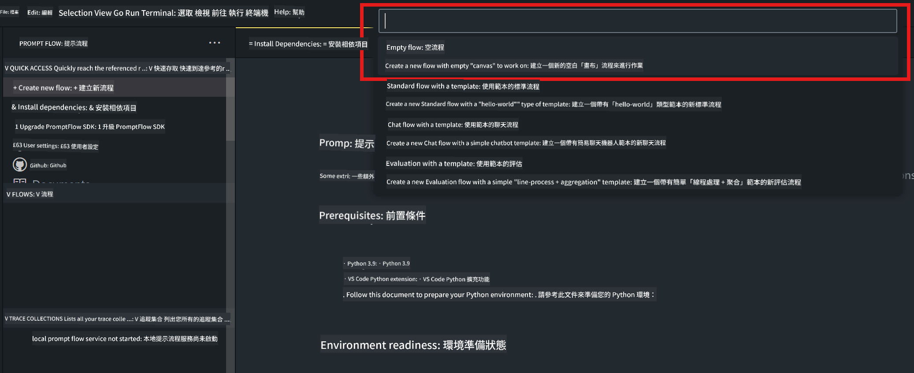
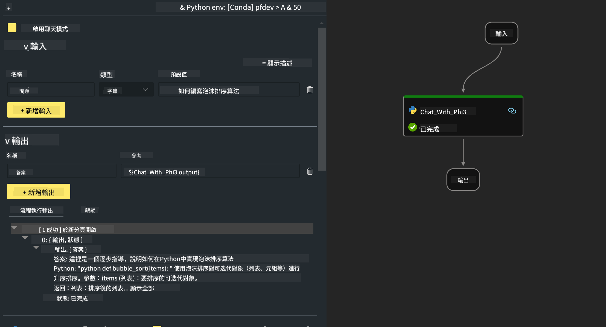
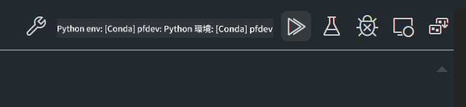

<!--
CO_OP_TRANSLATOR_METADATA:
{
  "original_hash": "bc29f7fe7fc16bed6932733eac8c81b8",
  "translation_date": "2025-05-08T05:30:37+00:00",
  "source_file": "md/02.Application/02.Code/Phi3/VSCodeExt/HOL/AIPC/02.PromptflowWithNPU.md",
  "language_code": "hk"
}
-->
# **Lab 2 - 用 Phi-3-mini 喺 AIPC 運行 Prompt flow**

## **咩係 Prompt flow**

Prompt flow 係一套開發工具，設計嚟簡化基於大型語言模型 (LLM) 嘅 AI 應用由構思、原型設計、測試、評估到生產部署同監控嘅整個開發流程。佢令 prompt 工程更加容易，幫你建立具生產質素嘅 LLM 應用。

用 prompt flow，你可以：

- 建立將 LLM、prompts、Python 代碼同其他工具連結埋一齊嘅可執行工作流程。

- 輕鬆調試同迭代你嘅流程，尤其係同 LLM 互動嘅部分。

- 評估你嘅流程，用更大嘅數據集計算質量同性能指標。

- 將測試同評估整合到你嘅 CI/CD 系統，確保流程質素。

- 將流程部署到你揀嘅服務平台，或者輕鬆整合到你嘅應用代碼庫。

- （可選但強烈建議）利用 Azure AI 嘅雲端版本同團隊協作。

## **咩係 AIPC**

AI PC 有 CPU、GPU 同 NPU，每個都具備特定嘅 AI 加速能力。NPU 即神經網絡處理器，係專門嘅加速器，可以喺你嘅電腦上直接處理人工智能 (AI) 同機器學習 (ML) 任務，而唔需要將數據傳送到雲端處理。GPU 同 CPU 都可以處理呢啲工作，但 NPU 特別擅長低功耗嘅 AI 運算。AI PC 代表咗電腦運作方式嘅根本轉變，唔係為咗解決以前冇嘅問題，而係為日常電腦使用帶來重大提升。

咁佢點運作？相比起用大量公開數據訓練嘅生成式 AI 同大型語言模型，喺你嘅電腦上運行嘅 AI 係更易接觸嘅，幾乎喺各方面都更加普及。概念更易理解，因為係用你嘅數據訓練，唔使連接雲端，呢啲好處對更廣泛嘅用戶群更具吸引力。

短期內，AI PC 世界包括個人助理同較細嘅 AI 模型直接喺你嘅電腦上運行，用你嘅數據提供個人化、私隱性更高、更安全嘅 AI 強化，例如記錄會議紀要、組織幻想足球聯賽、自動化相片同影片編輯嘅提升，或者根據大家嘅到達同離開時間，安排完美嘅家庭聚會行程。

## **喺 AIPC 上建立生成代碼流程**

***Note*** ：如果你未完成環境安裝，請參考 [Lab 0 -Installations](./01.Installations.md)

1. 喺 Visual Studio Code 開啟 Prompt flow Extension，建立一個空嘅流程項目



2. 加入 Inputs 同 Outputs 參數，並新增 Python 代碼作為流程



你可以參考呢個結構 (flow.dag.yaml) 來構建你嘅流程

```yaml

inputs:
  question:
    type: string
    default: how to write Bubble Algorithm
outputs:
  answer:
    type: string
    reference: ${Chat_With_Phi3.output}
nodes:
- name: Chat_With_Phi3
  type: python
  source:
    type: code
    path: Chat_With_Phi3.py
  inputs:
    question: ${inputs.question}


```

3. 喺 ***Chat_With_Phi3.py*** 加入代碼

```python


from promptflow.core import tool

# import torch
from transformers import AutoTokenizer, pipeline,TextStreamer
import intel_npu_acceleration_library as npu_lib

import warnings

import asyncio
import platform

class Phi3CodeAgent:
    
    model = None
    tokenizer = None
    text_streamer = None
    
    model_id = "microsoft/Phi-3-mini-4k-instruct"

    @staticmethod
    def init_phi3():
        
        if Phi3CodeAgent.model is None or Phi3CodeAgent.tokenizer is None or Phi3CodeAgent.text_streamer is None:
            Phi3CodeAgent.model = npu_lib.NPUModelForCausalLM.from_pretrained(
                                    Phi3CodeAgent.model_id,
                                    torch_dtype="auto",
                                    dtype=npu_lib.int4,
                                    trust_remote_code=True
                                )
            Phi3CodeAgent.tokenizer = AutoTokenizer.from_pretrained(Phi3CodeAgent.model_id)
            Phi3CodeAgent.text_streamer = TextStreamer(Phi3CodeAgent.tokenizer, skip_prompt=True)

    

    @staticmethod
    def chat_with_phi3(prompt):
        
        Phi3CodeAgent.init_phi3()

        messages = "<|system|>You are a AI Python coding assistant. Please help me to generate code in Python.The answer only genertated Python code, but any comments and instructions do not need to be generated<|end|><|user|>" + prompt +"<|end|><|assistant|>"


        generation_args = {
            "max_new_tokens": 1024,
            "return_full_text": False,
            "temperature": 0.3,
            "do_sample": False,
            "streamer": Phi3CodeAgent.text_streamer,
        }

        pipe = pipeline(
            "text-generation",
            model=Phi3CodeAgent.model,
            tokenizer=Phi3CodeAgent.tokenizer,
            # **generation_args
        )

        result = ''

        with warnings.catch_warnings():
            warnings.simplefilter("ignore")
            response = pipe(messages, **generation_args)
            result =response[0]['generated_text']
            return result


@tool
def my_python_tool(question: str) -> str:
    if platform.system() == 'Windows':
        asyncio.set_event_loop_policy(asyncio.WindowsSelectorEventLoopPolicy())
    return Phi3CodeAgent.chat_with_phi3(question)


```

4. 你可以喺 Debug 或 Run 測試流程，檢查生成代碼係咪正常



5. 喺終端運行流程作為開發 API

```

pf flow serve --source ./ --port 8080 --host localhost   

```

你可以用 Postman / Thunder Client 測試

### **Note**

1. 第一次運行會比較耐，建議用 Hugging face CLI 下載 phi-3 模型。

2. 鑑於 Intel NPU 運算能力有限，建議使用 Phi-3-mini-4k-instruct。

3. 我哋用 Intel NPU 加速做 INT4 量化轉換，但如果你重啟服務，需要刪除 cache 同 nc_workshop 資料夾。

## **資源**

1. 學習 Promptflow [https://microsoft.github.io/promptflow/](https://microsoft.github.io/promptflow/)

2. 學習 Intel NPU Acceleration [https://github.com/intel/intel-npu-acceleration-library](https://github.com/intel/intel-npu-acceleration-library)

3. 範例代碼，下載 [Local NPU Agent Sample Code](../../../../../../../../../code/07.Lab/01/AIPC)

**免責聲明**：  
本文件係用 AI 翻譯服務 [Co-op Translator](https://github.com/Azure/co-op-translator) 翻譯而成。雖然我哋努力確保準確性，但請注意，自動翻譯可能包含錯誤或不準確之處。原文文件嘅母語版本應視為權威來源。對於重要資訊，建議使用專業人工翻譯。我哋對因使用此翻譯而引起嘅任何誤解或誤釋概不負責。