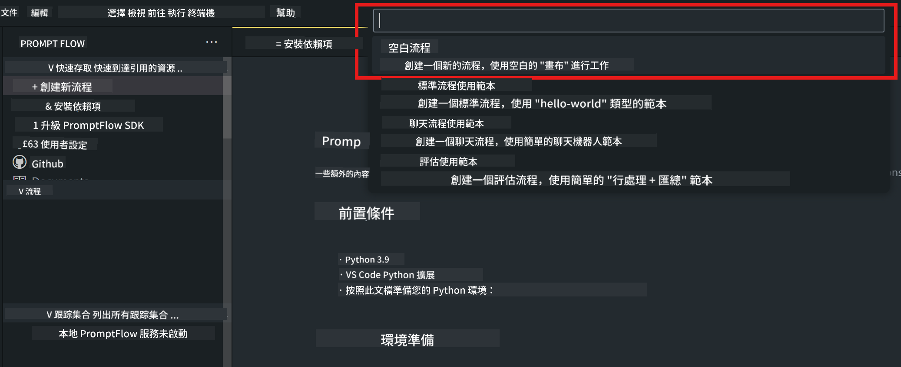
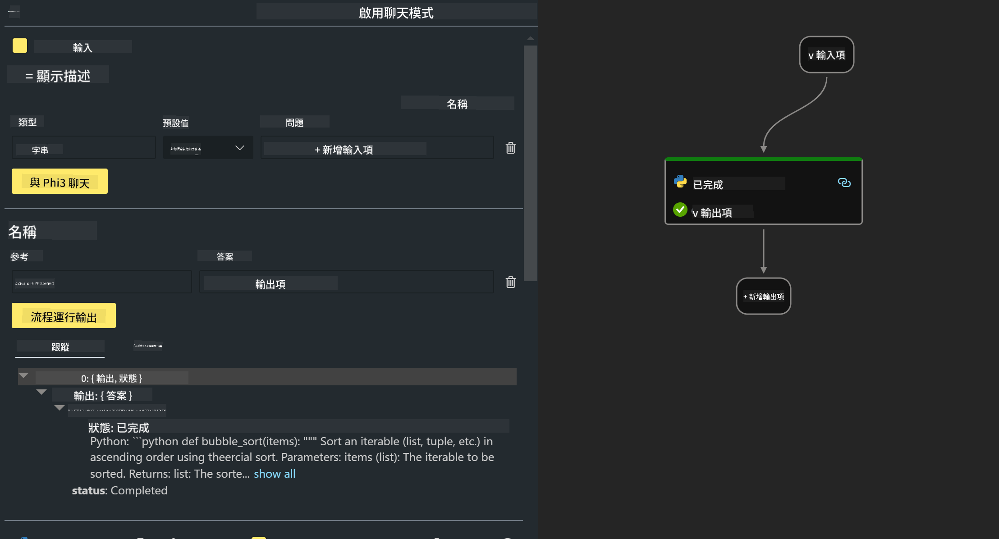
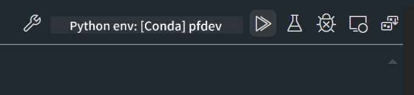

<!--
CO_OP_TRANSLATOR_METADATA:
{
  "original_hash": "b65fb1164cd818b78a83ac6b8021e4b4",
  "translation_date": "2025-04-04T18:31:29+00:00",
  "source_file": "md\\02.Application\\02.Code\\Phi3\\VSCodeExt\\HOL\\AIPC\\02.PromptflowWithNPU.md",
  "language_code": "hk"
}
-->
# **Lab 2 - 使用 Phi-3-mini 在 AIPC 上執行 Prompt flow**

## **什麼是 Prompt flow**

Prompt flow 是一套開發工具，旨在簡化基於 LLM 的 AI 應用的整個開發周期，包括構思、原型設計、測試、評估到生產部署和監控。它讓提示工程變得更加容易，並幫助您建立具備生產品質的 LLM 應用。

使用 Prompt flow，您可以：

- 創建流程，將 LLM、提示、Python 程式碼和其他工具連接在一起，形成可執行的工作流。

- 輕鬆調試和迭代您的流程，尤其是與 LLM 的互動。

- 評估您的流程，使用更大的數據集計算質量和性能指標。

- 將測試和評估整合到您的 CI/CD 系統中，以確保流程的品質。

- 將您的流程部署到您選擇的服務平台，或輕鬆整合到您的應用程式代碼基礎中。

- （可選但強烈推薦）利用 Azure AI 的雲端版本與您的團隊協作。

## **什麼是 AIPC**

AI PC 配備了 CPU、GPU 和 NPU，每個部件都有特定的 AI 加速能力。NPU（神經處理單元）是一種專用加速器，能在您的 PC 上處理人工智慧（AI）和機器學習（ML）任務，而不是將數據發送到雲端進行處理。雖然 GPU 和 CPU 也能處理這些工作負載，但 NPU 對於低功耗的 AI 計算尤其擅長。AI PC 代表了我們電腦運作方式的根本性改變。它並不是為了解決以前不存在的問題，而是對日常 PC 使用的巨大提升。

那它是如何運作的呢？相比於生成式 AI 和基於大量公共數據訓練的大型語言模型（LLMs），在您的 PC 上運行的 AI 更加容易接觸。這個概念更容易理解，因為它是基於您的數據進行訓練，而無需訪問雲端，因此對更廣泛的人群來說更具吸引力。

在短期內，AI PC 的應用包括個人助理和直接在您的 PC 上運行的小型 AI 模型，使用您的數據提供個人化、更私密、更安全的 AI 增強功能，幫助您完成日常工作，例如記錄會議摘要、組織夢幻足球聯盟、進行照片和視頻編輯的自動增強，或者根據每個人的抵達和離開時間安排家庭聚會的完美行程。

## **在 AIPC 上構建生成代碼的流程**

***注意***：如果您尚未完成環境安裝，請訪問 [Lab 0 - 安裝](./01.Installations.md)

1. 在 Visual Studio Code 中打開 Prompt flow 擴展，並創建一個空的流程專案。



2. 添加輸入和輸出參數，並將 Python 程式碼添加為新的流程。



您可以參考這個結構（flow.dag.yaml）來構建您的流程：

```yaml

inputs:
  question:
    type: string
    default: how to write Bubble Algorithm
outputs:
  answer:
    type: string
    reference: ${Chat_With_Phi3.output}
nodes:
- name: Chat_With_Phi3
  type: python
  source:
    type: code
    path: Chat_With_Phi3.py
  inputs:
    question: ${inputs.question}


```

3. 在 ***Chat_With_Phi3.py*** 中添加代碼。

```python


from promptflow.core import tool

# import torch
from transformers import AutoTokenizer, pipeline,TextStreamer
import intel_npu_acceleration_library as npu_lib

import warnings

import asyncio
import platform

class Phi3CodeAgent:
    
    model = None
    tokenizer = None
    text_streamer = None
    
    model_id = "microsoft/Phi-3-mini-4k-instruct"

    @staticmethod
    def init_phi3():
        
        if Phi3CodeAgent.model is None or Phi3CodeAgent.tokenizer is None or Phi3CodeAgent.text_streamer is None:
            Phi3CodeAgent.model = npu_lib.NPUModelForCausalLM.from_pretrained(
                                    Phi3CodeAgent.model_id,
                                    torch_dtype="auto",
                                    dtype=npu_lib.int4,
                                    trust_remote_code=True
                                )
            Phi3CodeAgent.tokenizer = AutoTokenizer.from_pretrained(Phi3CodeAgent.model_id)
            Phi3CodeAgent.text_streamer = TextStreamer(Phi3CodeAgent.tokenizer, skip_prompt=True)

    

    @staticmethod
    def chat_with_phi3(prompt):
        
        Phi3CodeAgent.init_phi3()

        messages = "<|system|>You are a AI Python coding assistant. Please help me to generate code in Python.The answer only genertated Python code, but any comments and instructions do not need to be generated<|end|><|user|>" + prompt +"<|end|><|assistant|>"


        generation_args = {
            "max_new_tokens": 1024,
            "return_full_text": False,
            "temperature": 0.3,
            "do_sample": False,
            "streamer": Phi3CodeAgent.text_streamer,
        }

        pipe = pipeline(
            "text-generation",
            model=Phi3CodeAgent.model,
            tokenizer=Phi3CodeAgent.tokenizer,
            # **generation_args
        )

        result = ''

        with warnings.catch_warnings():
            warnings.simplefilter("ignore")
            response = pipe(messages, **generation_args)
            result =response[0]['generated_text']
            return result


@tool
def my_python_tool(question: str) -> str:
    if platform.system() == 'Windows':
        asyncio.set_event_loop_policy(asyncio.WindowsSelectorEventLoopPolicy())
    return Phi3CodeAgent.chat_with_phi3(question)


```

4. 您可以通過 Debug 或 Run 測試流程，檢查生成代碼是否正常。



5. 在終端中以開發 API 的形式運行流程。

```

pf flow serve --source ./ --port 8080 --host localhost   

```

您可以在 Postman 或 Thunder Client 中測試它。

### **注意事項**

1. 第一次運行需要較長時間。建議通過 Hugging face CLI 下載 phi-3 模型。

2. 考慮到 Intel NPU 的計算能力有限，建議使用 Phi-3-mini-4k-instruct。

3. 我們使用 Intel NPU 加速進行 INT4 量化轉換，但如果重新運行服務，您需要刪除快取和 nc_workshop 文件夾。

## **資源**

1. 學習 Promptflow [https://microsoft.github.io/promptflow/](https://microsoft.github.io/promptflow/)

2. 學習 Intel NPU 加速 [https://github.com/intel/intel-npu-acceleration-library](https://github.com/intel/intel-npu-acceleration-library)

3. 範例代碼，下載 [本地 NPU 代理範例代碼](../../../../../../../../../code/07.Lab/01/AIPC)

**免責聲明**：  
此文件已使用人工智能翻譯服務 [Co-op Translator](https://github.com/Azure/co-op-translator) 進行翻譯。我們致力於提供準確的翻譯，但請注意，自動翻譯可能包含錯誤或不準確之處。原始語言的文件應被視為權威來源。對於關鍵信息，建議尋求專業人工翻譯。我們對因使用此翻譯而引起的任何誤解或錯誤解釋概不負責。