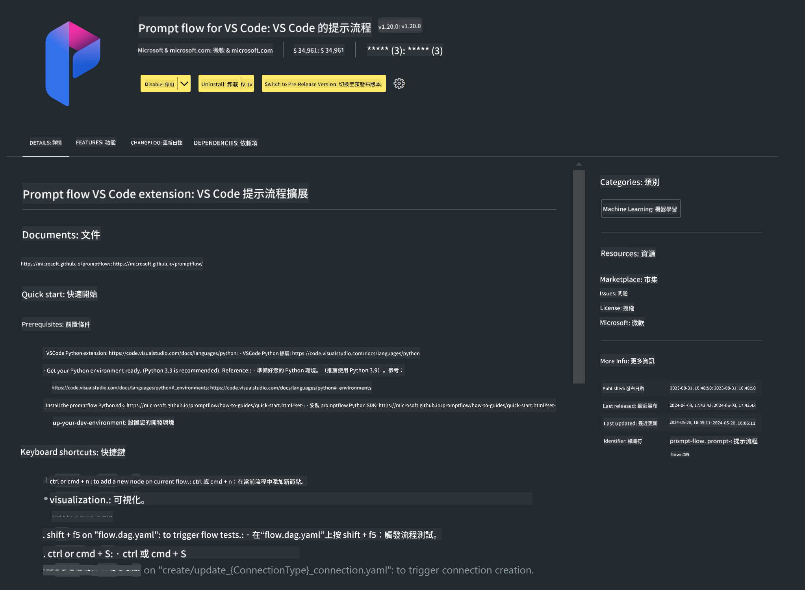

<!--
CO_OP_TRANSLATOR_METADATA:
{
  "original_hash": "1e5970596457ac53bcc49d97b88ff1bd",
  "translation_date": "2025-04-04T18:34:30+00:00",
  "source_file": "md\\02.Application\\02.Code\\Phi3\\VSCodeExt\\HOL\\Apple\\01.Installations.md",
  "language_code": "hk"
}
-->
# **Lab 0 - 安裝**

當我們進入 Lab 時，需要配置相關環境：

### **1. Python 3.11+**

建議使用 miniforge 來配置你的 Python 環境。

配置 miniforge 請參考 [https://github.com/conda-forge/miniforge](https://github.com/conda-forge/miniforge)

配置完成後，在 Power Shell 中執行以下指令：

```bash

conda create -n pyenv python==3.11.8 -y

conda activate pyenv

```

### **2. 安裝 Prompt flow SDK**

在 Lab 1 中，我們會使用 Prompt flow，因此需要配置 Prompt flow SDK。

```bash

pip install promptflow --upgrade

```

你可以使用以下指令檢查 promptflow sdk：

```bash

pf --version

```

### **3. 安裝 Visual Studio Code 的 Prompt flow 擴展**



### **4. Apple 的 MLX 框架**

MLX 是由 Apple 機器學習研究團隊開發的一個針對 Apple Silicon 的機器學習數組框架。你可以使用 **Apple MLX 框架** 來加速 LLM / SLM 的運行。如果想了解更多，可以閱讀 [https://github.com/microsoft/PhiCookBook/blob/main/md/01.Introduction/03/MLX_Inference.md](https://github.com/microsoft/PhiCookBook/blob/main/md/01.Introduction/03/MLX_Inference.md)。

在 bash 中安裝 MLX 框架庫：

```bash

pip install mlx-lm

```

### **5. 其他 Python 庫**

建立 requirements.txt 並加入以下內容：

```txt

notebook
numpy 
scipy 
scikit-learn 
matplotlib 
pandas 
pillow 
graphviz

```

### **6. 安裝 NVM**

在 Powershell 中安裝 nvm：

```bash

brew install nvm

```

安裝 nodejs 18.20：

```bash

nvm install 18.20.0

nvm use 18.20.0

```

### **7. 安裝 Visual Studio Code 的開發支持**

```bash

npm install --global yo generator-code

```

恭喜！你已成功配置 SDK。接下來進行實際操作步驟吧！

**免責聲明**：  
本文件已使用人工智能翻譯服務 [Co-op Translator](https://github.com/Azure/co-op-translator) 進行翻譯。我們致力於提供準確的翻譯，但請注意，自動翻譯可能包含錯誤或不準確之處。應以原始語言的文件作為權威來源。對於關鍵信息，建議尋求專業的人類翻譯。我們對因使用此翻譯而產生的任何誤解或誤釋不承擔責任。