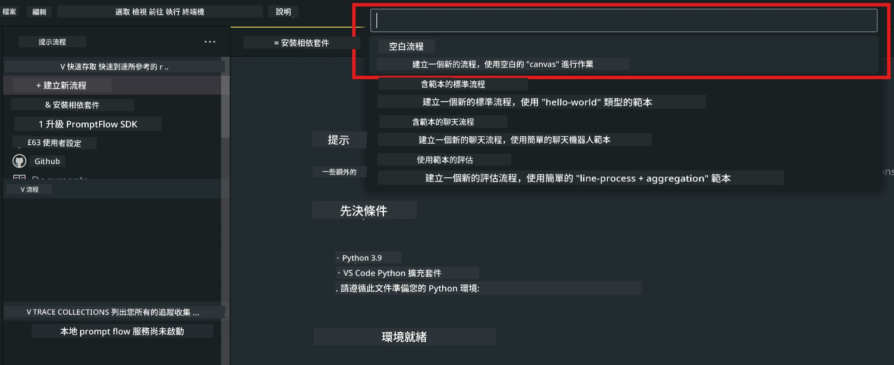
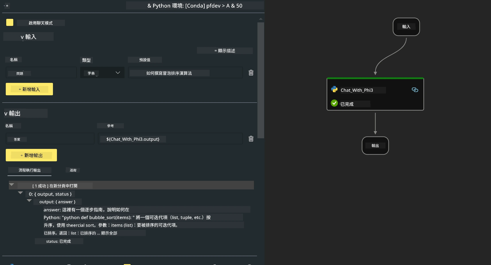

<!--
CO_OP_TRANSLATOR_METADATA:
{
  "original_hash": "3dbbf568625b1ee04b354c2dc81d3248",
  "translation_date": "2025-07-17T04:23:41+00:00",
  "source_file": "md/02.Application/02.Code/Phi3/VSCodeExt/HOL/Apple/02.PromptflowWithMLX.md",
  "language_code": "hk"
}
-->
# **Lab 2 - 在 AIPC 使用 Phi-3-mini 運行 Prompt flow**

## **什麼是 Prompt flow**

Prompt flow 是一套開發工具，旨在簡化基於大型語言模型（LLM）的 AI 應用從構思、原型設計、測試、評估到生產部署及監控的整個開發流程。它讓提示工程變得更簡單，並幫助你打造具備生產級品質的 LLM 應用。

使用 prompt flow，你可以：

- 創建將 LLM、提示、Python 代碼及其他工具串連成可執行工作流程的流程。

- 輕鬆調試和迭代你的流程，特別是與 LLM 的互動部分。

- 評估你的流程，使用更大數據集計算質量和性能指標。

- 將測試和評估整合到你的 CI/CD 系統中，確保流程品質。

- 將流程部署到你選擇的服務平台，或輕鬆整合到應用程式代碼庫。

- （可選但強烈建議）利用 Azure AI 上的雲端版本與團隊協作。

## **在 Apple Silicon 上構建生成代碼流程**

***Note*** ：如果你還未完成環境安裝，請參考 [Lab 0 -Installations](./01.Installations.md)

1. 在 Visual Studio Code 中打開 Prompt flow 擴充功能，並建立一個空白流程專案



2. 新增輸入和輸出參數，並新增 Python 代碼作為新的流程



你可以參考此結構（flow.dag.yaml）來構建你的流程

```yaml

inputs:
  prompt:
    type: string
    default: Write python code for Fibonacci serie. Please use markdown as output
outputs:
  result:
    type: string
    reference: ${gen_code_by_phi3.output}
nodes:
- name: gen_code_by_phi3
  type: python
  source:
    type: code
    path: gen_code_by_phi3.py
  inputs:
    prompt: ${inputs.prompt}


```

3. 量化 phi-3-mini

我們希望能更好地在本地設備上運行 SLM。一般來說，我們會對模型進行量化（INT4、FP16、FP32）

```bash

python -m mlx_lm.convert --hf-path microsoft/Phi-3-mini-4k-instruct

```

**Note:** 預設資料夾為 mlx_model

4. 在 ***Chat_With_Phi3.py*** 中加入代碼

```python


from promptflow import tool

from mlx_lm import load, generate


# The inputs section will change based on the arguments of the tool function, after you save the code
# Adding type to arguments and return value will help the system show the types properly
# Please update the function name/signature per need
@tool
def my_python_tool(prompt: str) -> str:

    model_id = './mlx_model_phi3_mini'

    model, tokenizer = load(model_id)

    # <|user|>\nWrite python code for Fibonacci serie. Please use markdown as output<|end|>\n<|assistant|>

    response = generate(model, tokenizer, prompt="<|user|>\n" + prompt  + "<|end|>\n<|assistant|>", max_tokens=2048, verbose=True)

    return response


```

4. 你可以從除錯或執行流程來測試生成代碼是否正常


5. 在終端機中以開發 API 方式運行流程

```

pf flow serve --source ./ --port 8080 --host localhost   

```

你可以在 Postman / Thunder Client 中測試

### **Note**

1. 第一次運行會花較長時間，建議使用 Hugging face CLI 下載 phi-3 模型。

2. 考慮到 Intel NPU 的運算能力有限，建議使用 Phi-3-mini-4k-instruct。

3. 我們使用 Intel NPU 加速進行 INT4 量化轉換，但如果重新啟動服務，需要刪除 cache 和 nc_workshop 資料夾。

## **資源**

1. 學習 Promptflow [https://microsoft.github.io/promptflow/](https://microsoft.github.io/promptflow/)

2. 學習 Intel NPU Acceleration [https://github.com/intel/intel-npu-acceleration-library](https://github.com/intel/intel-npu-acceleration-library)

3. 範例代碼，下載 [Local NPU Agent Sample Code](../../../../../../../../../code/07.Lab/01/AIPC/local-npu-agent)

**免責聲明**：  
本文件乃使用 AI 翻譯服務 [Co-op Translator](https://github.com/Azure/co-op-translator) 進行翻譯。雖然我們致力於確保準確性，但請注意自動翻譯可能包含錯誤或不準確之處。原始文件的母語版本應被視為權威來源。對於重要資訊，建議採用專業人工翻譯。我們不對因使用本翻譯而引致的任何誤解或誤釋承擔責任。