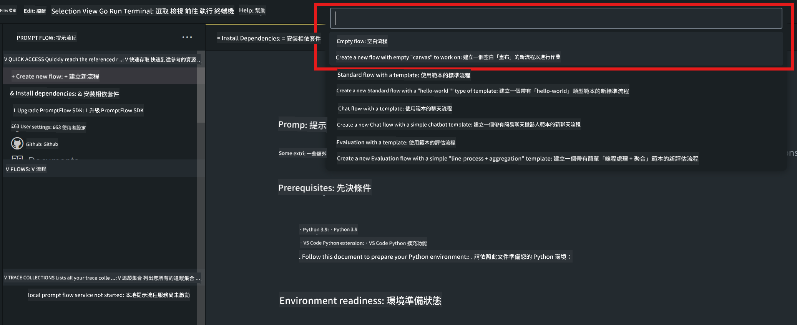
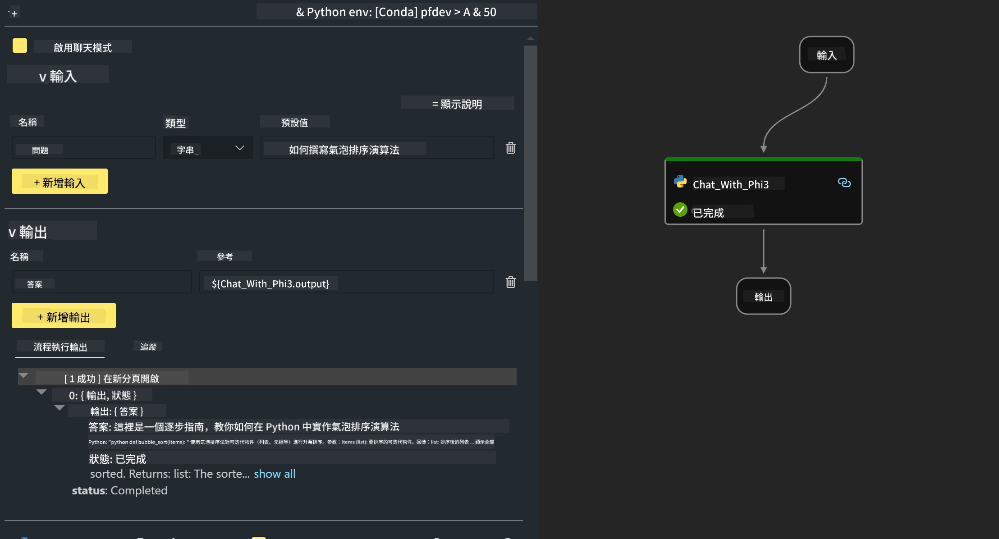

<!--
CO_OP_TRANSLATOR_METADATA:
{
  "original_hash": "3dbbf568625b1ee04b354c2dc81d3248",
  "translation_date": "2025-05-08T05:32:35+00:00",
  "source_file": "md/02.Application/02.Code/Phi3/VSCodeExt/HOL/Apple/02.PromptflowWithMLX.md",
  "language_code": "hk"
}
-->
# **Lab 2 - 用 Phi-3-mini 喺 AIPC 運行 Prompt flow**

## **咩係 Prompt flow**

Prompt flow 係一套開發工具，設計用嚟簡化基於大型語言模型（LLM）嘅 AI 應用由構思、原型設計、測試、評估，到生產部署同監控嘅全過程。佢令 prompt 工程變得容易，仲可以幫你建立具生產質素嘅 LLM 應用。

用 prompt flow，你可以做到：

- 建立將 LLM、prompts、Python 代碼同其他工具串連起嚟嘅可執行工作流程。

- 輕鬆除錯同反覆優化工作流程，特別係同 LLM 互動嗰部分。

- 評估工作流程，用更大數據集計算質量同性能指標。

- 將測試同評估整合入 CI/CD 系統，確保工作流程嘅質素。

- 將工作流程部署到你揀嘅服務平台，或者輕鬆整合入你嘅應用代碼庫。

- （選擇性但強烈建議）利用 Azure AI 嘅雲端版 Prompt flow 同團隊協作。

## **喺 Apple Silicon 上建立生成代碼工作流程**

***Note*** ：如果你未完成環境安裝，請參考 [Lab 0 -Installations](./01.Installations.md)

1. 喺 Visual Studio Code 打開 Prompt flow 擴展，建立一個空白工作流程項目



2. 加入 Inputs 同 Outputs 參數，再新增 Python 代碼作為新工作流程



你可以參考呢個結構（flow.dag.yaml）嚟構建你嘅工作流程

```yaml

inputs:
  prompt:
    type: string
    default: Write python code for Fibonacci serie. Please use markdown as output
outputs:
  result:
    type: string
    reference: ${gen_code_by_phi3.output}
nodes:
- name: gen_code_by_phi3
  type: python
  source:
    type: code
    path: gen_code_by_phi3.py
  inputs:
    prompt: ${inputs.prompt}


```

3. 量化 phi-3-mini

我哋希望喺本地設備更好咁運行 SLM，通常會對模型做量化（INT4、FP16、FP32）

```bash

python -m mlx_lm.convert --hf-path microsoft/Phi-3-mini-4k-instruct

```

**Note:** 預設資料夾係 mlx_model

4. 喺 ***Chat_With_Phi3.py*** 入面加入代碼

```python


from promptflow import tool

from mlx_lm import load, generate


# The inputs section will change based on the arguments of the tool function, after you save the code
# Adding type to arguments and return value will help the system show the types properly
# Please update the function name/signature per need
@tool
def my_python_tool(prompt: str) -> str:

    model_id = './mlx_model_phi3_mini'

    model, tokenizer = load(model_id)

    # <|user|>\nWrite python code for Fibonacci serie. Please use markdown as output<|end|>\n<|assistant|>

    response = generate(model, tokenizer, prompt="<|user|>\n" + prompt  + "<|end|>\n<|assistant|>", max_tokens=2048, verbose=True)

    return response


```

4. 你可以由 Debug 或 Run 測試工作流程，檢查生成代碼係咪正常


5. 喺終端機以開發 API 模式運行工作流程

```

pf flow serve --source ./ --port 8080 --host localhost   

```

你可以喺 Postman / Thunder Client 測試

### **Note**

1. 第一次運行會好耐，建議用 Hugging face CLI 下載 phi-3 模型。

2. 考慮到 Intel NPU 計算能力有限，建議用 Phi-3-mini-4k-instruct。

3. 我哋用 Intel NPU 加速做 INT4 量化轉換，但如果重啟服務，需要刪除 cache 同 nc_workshop 資料夾。

## **資源**

1. 學習 Promptflow [https://microsoft.github.io/promptflow/](https://microsoft.github.io/promptflow/)

2. 學習 Intel NPU Acceleration [https://github.com/intel/intel-npu-acceleration-library](https://github.com/intel/intel-npu-acceleration-library)

3. 範例代碼，下載 [Local NPU Agent Sample Code](../../../../../../../../../code/07.Lab/01/AIPC/local-npu-agent)

**免責聲明**：  
本文件使用 AI 翻譯服務 [Co-op Translator](https://github.com/Azure/co-op-translator) 進行翻譯。雖然我們力求準確，但請注意自動翻譯可能包含錯誤或不準確之處。原始文件的母語版本應視為權威來源。對於重要資訊，建議使用專業人工翻譯。因使用本翻譯而引起的任何誤解或誤釋，我們概不負責。