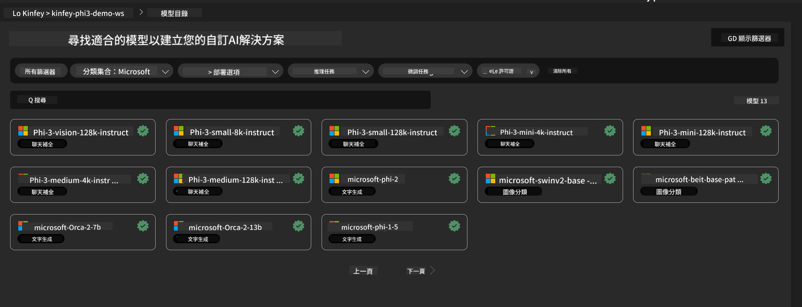
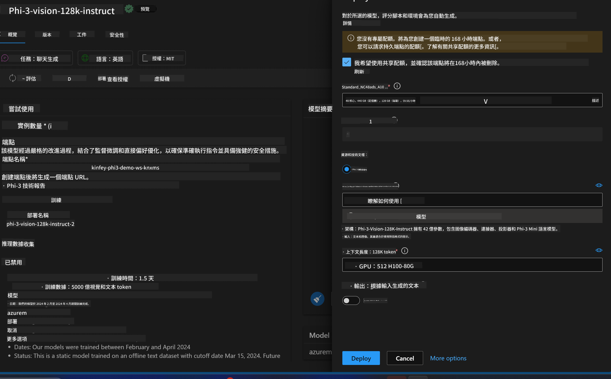

<!--
CO_OP_TRANSLATOR_METADATA:
{
  "original_hash": "594a3b553655c2ebbc0efdeb0b5040c9",
  "translation_date": "2025-04-04T18:36:31+00:00",
  "source_file": "md\\02.Application\\02.Code\\Phi3\\VSCodeExt\\HOL\\Apple\\03.DeployPhi3VisionOnAzure.md",
  "language_code": "hk"
}
-->
# **Lab 3 - 在 Azure Machine Learning Service 部署 Phi-3-Vision**

我們會使用 NPU 完成本地代碼的生產部署，然後希望通過它引入 PHI-3-VISION 的能力，以實現從圖片生成代碼。

在這個介紹中，我們可以快速在 Azure Machine Learning Service 中建立一個 Model As Service Phi-3 Vision 的服務。

***Note***：Phi-3 Vision 需要計算能力以更快速度生成內容。我們需要雲端計算能力來幫助我們實現這一點。

### **1. 建立 Azure Machine Learning Service**

我們需要在 Azure Portal 中建立 Azure Machine Learning Service。如果你想了解如何操作，請訪問這個鏈接 [https://learn.microsoft.com/azure/machine-learning/quickstart-create-resources?view=azureml-api-2](https://learn.microsoft.com/azure/machine-learning/quickstart-create-resources?view=azureml-api-2)

### **2. 在 Azure Machine Learning Service 中選擇 Phi-3 Vision**



### **3. 在 Azure 部署 Phi-3-Vision**



### **4. 在 Postman 測試 Endpoint**


***Note***

1. 傳輸的參數必須包括 Authorization、azureml-model-deployment 和 Content-Type。需要檢查部署信息以獲取這些參數。

2. 傳輸參數時，Phi-3-Vision 需要傳輸一個圖片鏈接。請參考 GPT-4-Vision 的方法進行參數傳輸，例如

```json

{
  "input_data":{
    "input_string":[
      {
        "role":"user",
        "content":[ 
          {
            "type": "text",
            "text": "You are a Python coding assistant.Please create Python code for image "
          },
          {
              "type": "image_url",
              "image_url": {
                "url": "https://ajaytech.co/wp-content/uploads/2019/09/index.png"
              }
          }
        ]
      }
    ],
    "parameters":{
          "temperature": 0.6,
          "top_p": 0.9,
          "do_sample": false,
          "max_new_tokens": 2048
    }
  }
}

```

3. 使用 Post 方法調用 **/score**

**恭喜**！你已經完成了快速 PHI-3-VISION 部署，並嘗試了如何使用圖片生成代碼。接下來，我們可以結合 NPU 和雲端來構建應用程序。

**免責聲明**：  
本文件使用 AI 翻譯服務 [Co-op Translator](https://github.com/Azure/co-op-translator) 進行翻譯。儘管我們致力於提供準確的翻譯，但請注意，自動翻譯可能包含錯誤或不準確之處。應以原文作為權威來源。對於重要信息，建議使用專業人工翻譯。我們對於因使用此翻譯而引起的任何誤解或誤釋不承擔責任。