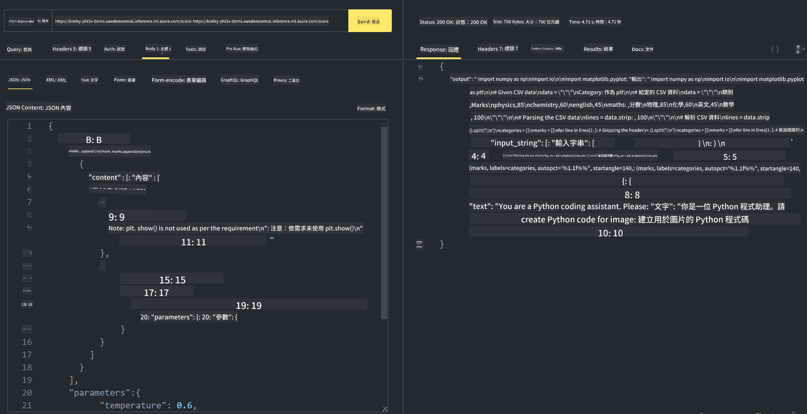

<!--
CO_OP_TRANSLATOR_METADATA:
{
  "original_hash": "20cb4e6ac1686248e8be913ccf6c2bc2",
  "translation_date": "2025-05-08T05:34:25+00:00",
  "source_file": "md/02.Application/02.Code/Phi3/VSCodeExt/HOL/Apple/03.DeployPhi3VisionOnAzure.md",
  "language_code": "hk"
}
-->
# **Lab 3 - 喺 Azure Machine Learning Service 部署 Phi-3-vision**

我哋用 NPU 去完成本地代碼嘅生產部署，之後想透過佢引入 PHI-3-VISION 嘅功能，實現由圖片生成代碼。

喺呢個教學入面，我哋可以快速喺 Azure Machine Learning Service 搭建一個 Model As Service 嘅 Phi-3 Vision 服務。

***Note***：Phi-3 Vision 需要強大嘅運算能力先可以更快咁生成內容，我哋需要用雲端運算資源幫手實現。

### **1. 喺 Azure Portal 創建 Azure Machine Learning Service**

我哋需要喺 Azure Portal 創建一個 Azure Machine Learning Service。如果想學點做，可以去呢條鏈接睇：[https://learn.microsoft.com/azure/machine-learning/quickstart-create-resources?view=azureml-api-2](https://learn.microsoft.com/azure/machine-learning/quickstart-create-resources?view=azureml-api-2)

### **2. 喺 Azure Machine Learning Service 選擇 Phi-3 Vision**


### **3. 喺 Azure 部署 Phi-3-Vision**


### **4. 喺 Postman 測試 Endpoint**



***Note***

1. 傳送嘅參數必須包括 Authorization、azureml-model-deployment 同 Content-Type。你要喺部署資訊入面攞到呢啲資料。

2. 傳送參數嘅時候，Phi-3-Vision 需要傳送圖片連結。可以參考 GPT-4-Vision 嘅方法去傳送參數，例如

```json

{
  "input_data":{
    "input_string":[
      {
        "role":"user",
        "content":[ 
          {
            "type": "text",
            "text": "You are a Python coding assistant.Please create Python code for image "
          },
          {
              "type": "image_url",
              "image_url": {
                "url": "https://ajaytech.co/wp-content/uploads/2019/09/index.png"
              }
          }
        ]
      }
    ],
    "parameters":{
          "temperature": 0.6,
          "top_p": 0.9,
          "do_sample": false,
          "max_new_tokens": 2048
    }
  }
}

```

3. 用 Post 方法調用 **/score**

**恭喜**！你已經完成咗快速部署 PHI-3-VISION，並試咗點用圖片生成代碼。下一步，我哋可以結合 NPU 同雲端去開發應用。

**免責聲明**：  
本文件由 AI 翻譯服務 [Co-op Translator](https://github.com/Azure/co-op-translator) 進行翻譯。雖然我們致力於確保準確性，但請注意自動翻譯可能包含錯誤或不準確之處。原文文件以其原始語言版本為準。對於重要資訊，建議採用專業人工翻譯。我們不會對因使用此翻譯而引起的任何誤解或誤釋負責。