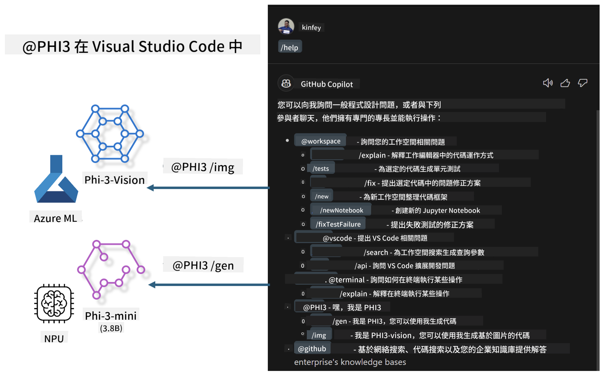

<!--
CO_OP_TRANSLATOR_METADATA:
{
  "original_hash": "7302d85639441c7cedbae09795e6b9a6",
  "translation_date": "2025-04-04T18:28:36+00:00",
  "source_file": "md\\02.Application\\02.Code\\Phi3\\VSCodeExt\\README.md",
  "language_code": "hk"
}
-->
# **打造屬於你的 Visual Studio Code GitHub Copilot Chat：結合 Microsoft Phi-3 系列**

你曾使用過 GitHub Copilot Chat 的工作區代理嗎？想要為你的團隊打造專屬的程式碼代理嗎？這個實作課程希望結合開源模型，建立企業級的程式碼業務代理。

## **基礎知識**

### **為什麼選擇 Microsoft Phi-3**

Phi-3 是一個系列家族，包括 phi-3-mini、phi-3-small 和 phi-3-medium，基於不同的訓練參數，用於文字生成、對話補全和程式碼生成。此外，還有基於 Vision 的 phi-3-vision。這些模型非常適合企業或不同團隊創建離線生成式 AI 解決方案。

推薦閱讀此連結：[https://github.com/microsoft/PhiCookBook/blob/main/md/01.Introduction/01/01.PhiFamily.md](https://github.com/microsoft/PhiCookBook/blob/main/md/01.Introduction/01/01.PhiFamily.md)

### **Microsoft GitHub Copilot Chat**

GitHub Copilot Chat 擴展提供了一個聊天介面，讓你能夠直接在 VS Code 中與 GitHub Copilot 互動，並獲得程式碼相關問題的答案，而無需瀏覽文件或搜尋線上論壇。

Copilot Chat 可能使用語法高亮、縮排和其他格式化功能來讓生成的回答更清晰。根據使用者提出的問題，結果可能包含 Copilot 用於生成回答的上下文連結，例如原始碼檔案或文件，或是存取 VS Code 功能的按鈕。

- Copilot Chat 在開發者的工作流程中進行整合，並在你需要的地方提供協助：

- 直接從編輯器或終端開啟內嵌聊天對話，獲得即時幫助

- 使用聊天視圖，隨時擁有 AI 助手在旁協助

- 啟動快速聊天功能，提出快速問題後立即回到工作中

GitHub Copilot Chat 可用於多種情境，例如：

- 回答如何解決問題的程式碼相關問題

- 解釋他人的程式碼並提出改進建議

- 提議程式碼修正

- 生成單元測試案例

- 生成程式碼文件

推薦閱讀此連結：[https://code.visualstudio.com/docs/copilot/copilot-chat](https://code.visualstudio.com/docs/copilot/copilot-chat?WT.mc_id=aiml-137032-kinfeylo)

### **Microsoft GitHub Copilot Chat @workspace**

在 Copilot Chat 中引用 **@workspace**，讓你能對整個程式碼庫提出問題。根據問題，Copilot 會智能地檢索相關檔案和符號，並在回答中以連結和程式碼範例呈現。

為了回答你的問題，**@workspace** 會檢索開發者在 VS Code 中瀏覽程式碼庫時會用到的相同資源：

- 工作區中的所有檔案，除了被 .gitignore 忽略的檔案

- 目錄結構，包括嵌套的資料夾和檔案名稱

- 如果工作區是 GitHub 儲存庫且已被程式碼搜尋索引，則使用 GitHub 的程式碼搜尋索引

- 工作區中的符號和定義

- 目前選定的文字或編輯器中可見的文字

注意：如果你已開啟檔案或選定忽略檔案中的文字，則 .gitignore 會被略過。

推薦閱讀此連結：[https://code.visualstudio.com/docs/copilot/copilot-chat](https://code.visualstudio.com/docs/copilot/workspace-context?WT.mc_id=aiml-137032-kinfeylo)

## **深入了解這個實作課程**

GitHub Copilot 大幅提升了企業的程式開發效率，每個企業都希望能客製化 GitHub Copilot 的相關功能。許多企業基於自身的業務情境和開源模型，客製化了類似 GitHub Copilot 的 Extensions。對企業而言，客製化的 Extensions 更容易掌控，但這也可能影響使用者體驗。畢竟，GitHub Copilot 在處理一般情境和專業性方面功能更強。如果能保持一致的使用體驗，同時客製化企業自己的 Extension，那將會更好。GitHub Copilot Chat 提供了相關 API，讓企業可以在聊天體驗上進行擴展。保持一致的體驗並擁有客製化功能，能提供更好的使用者體驗。

這個實作課程主要結合 Phi-3 模型、當地 NPU 和 Azure 混合，建立 GitHub Copilot Chat 中的客製化代理 ***@PHI3***，協助企業開發者完成程式碼生成 ***(@PHI3 /gen)*** 和基於圖像生成程式碼 ***(@PHI3 /img)***。

### ***注意：***

這個實作課程目前已在 Intel CPU 的 AIPC 和 Apple Silicon 上實現。我們將持續更新 Qualcomm NPU 的版本。

## **實作課程**

| 名稱 | 描述 | AIPC | Apple |
| ------------ | ----------- | -------- |-------- |
| Lab0 - 安裝(✅) | 配置並安裝相關環境及工具 | [Go](./HOL/AIPC/01.Installations.md) |[Go](./HOL/Apple/01.Installations.md) |
| Lab1 - 使用 Phi-3-mini 執行 Prompt flow (✅) | 結合 AIPC / Apple Silicon，使用當地 NPU 通過 Phi-3-mini 創建程式碼生成 | [Go](./HOL/AIPC/02.PromptflowWithNPU.md) |  [Go](./HOL/Apple/02.PromptflowWithMLX.md) |
| Lab2 - 部署 Phi-3-vision 至 Azure Machine Learning Service (✅) | 通過部署 Azure Machine Learning Service 的 Model Catalog - Phi-3-vision 圖像生成程式碼 | [Go](./HOL/AIPC/03.DeployPhi3VisionOnAzure.md) |[Go](./HOL/Apple/03.DeployPhi3VisionOnAzure.md) |
| Lab3 - 在 GitHub Copilot Chat 中創建 @phi-3 代理 (✅)  | 在 GitHub Copilot Chat 中創建客製化 Phi-3 代理，完成程式碼生成、圖像生成程式碼、RAG 等功能 | [Go](./HOL/AIPC/04.CreatePhi3AgentInVSCode.md) | [Go](./HOL/Apple/04.CreatePhi3AgentInVSCode.md) |
| 範例程式碼 (✅)  | 下載範例程式碼 | [Go](../../../../../../../code/07.Lab/01/AIPC) | [Go](../../../../../../../code/07.Lab/01/Apple) |

## **資源**

1. Phi-3 Cookbook [https://github.com/microsoft/Phi-3CookBook](https://github.com/microsoft/Phi-3CookBook)

2. 更多 GitHub Copilot 相關資訊 [https://learn.microsoft.com/training/paths/copilot/](https://learn.microsoft.com/training/paths/copilot/?WT.mc_id=aiml-137032-kinfeylo)

3. 更多 GitHub Copilot Chat 相關資訊 [https://learn.microsoft.com/training/paths/accelerate-app-development-using-github-copilot/](https://learn.microsoft.com/training/paths/accelerate-app-development-using-github-copilot/?WT.mc_id=aiml-137032-kinfeylo)

4. 更多 GitHub Copilot Chat API 相關資訊 [https://code.visualstudio.com/api/extension-guides/chat](https://code.visualstudio.com/api/extension-guides/chat?WT.mc_id=aiml-137032-kinfeylo)

5. 更多 Azure AI Foundry 相關資訊 [https://learn.microsoft.com/training/paths/create-custom-copilots-ai-studio/](https://learn.microsoft.com/training/paths/create-custom-copilots-ai-studio/?WT.mc_id=aiml-137032-kinfeylo)

6. 更多 Azure AI Foundry 的 Model Catalog 相關資訊 [https://learn.microsoft.com/azure/ai-studio/how-to/model-catalog-overview](https://learn.microsoft.com/azure/ai-studio/how-to/model-catalog-overview)

**免責聲明**：  
本文檔已使用人工智能翻譯服務 [Co-op Translator](https://github.com/Azure/co-op-translator) 進行翻譯。我們致力於提供準確的翻譯，但請注意，機器翻譯可能包含錯誤或不準確之處。原始語言的文件應被視為具權威性的來源。對於關鍵資訊，建議尋求專業人工翻譯。我們對因使用此翻譯而產生的任何誤解或錯誤解釋不承擔責任。