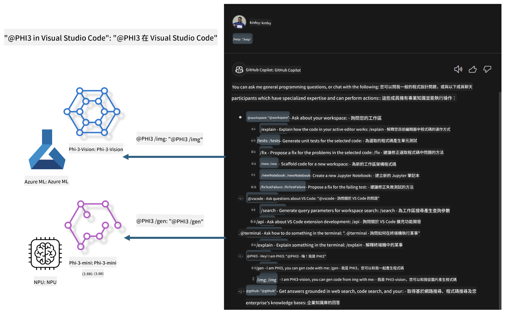

<!--
CO_OP_TRANSLATOR_METADATA:
{
  "original_hash": "00b7a699de8ac405fa821f4c0f7fc0ab",
  "translation_date": "2025-05-08T05:28:43+00:00",
  "source_file": "md/02.Application/02.Code/Phi3/VSCodeExt/README.md",
  "language_code": "hk"
}
-->
# **用 Microsoft Phi-3 系列打造你自己的 Visual Studio Code GitHub Copilot Chat**

你用過 GitHub Copilot Chat 裡的 workspace agent 嗎？想唔想為你團隊打造專屬嘅代碼助手？呢個實作實驗室希望結合開源模型，打造企業級嘅代碼業務助手。

## **基礎介紹**

### **點解揀 Microsoft Phi-3**

Phi-3 係一個系列，包括 phi-3-mini、phi-3-small 同 phi-3-medium，根據唔同嘅訓練參數，適合文字生成、對話完成同代碼生成。另外仲有基於 Vision 嘅 phi-3-vision，適合企業或者唔同團隊打造離線嘅生成式 AI 解決方案。

建議閱讀呢條鏈接 [https://github.com/microsoft/PhiCookBook/blob/main/md/01.Introduction/01/01.PhiFamily.md](https://github.com/microsoft/PhiCookBook/blob/main/md/01.Introduction/01/01.PhiFamily.md)

### **Microsoft GitHub Copilot Chat**

GitHub Copilot Chat 擴展提供咗一個對話介面，讓你可以直接喺 VS Code 裡面同 GitHub Copilot 互動，直接獲得有關編碼問題嘅答案，唔使再去翻閱文件或者搵網上論壇。

Copilot Chat 會用語法高亮、縮排同其他格式化功能，令生成嘅回應更清晰。根據用戶提問嘅類型，結果可能會包含 Copilot 用嚟生成答案嘅上下文鏈接，例如原始碼文件或者文件說明，或者係訪問 VS Code 功能嘅按鈕。

- Copilot Chat 完美融入你嘅開發流程，喺你需要嘅時候提供幫助：

- 可以喺編輯器或終端直接開啟內嵌對話，編碼時隨時求助

- 使用 Chat 視圖，隨時有 AI 助手喺旁邊幫你

- 啟動快速聊天，快速問問題，隨即返回工作狀態

GitHub Copilot Chat 適用於多種場景，例如：

- 回答點樣最好解決編碼問題嘅問題

- 解釋別人嘅代碼並提出改進建議

- 提議代碼修正方案

- 生成單元測試用例

- 生成代碼文件說明

建議閱讀呢條鏈接 [https://code.visualstudio.com/docs/copilot/copilot-chat](https://code.visualstudio.com/docs/copilot/copilot-chat?WT.mc_id=aiml-137032-kinfeylo)

###  **Microsoft GitHub Copilot Chat @workspace**

Copilot Chat 裡面嘅 **@workspace** 讓你可以針對整個代碼庫提問。根據提問內容，Copilot 會智能地檢索相關文件同符號，並喺答案中以鏈接同代碼示例形式引用。

為咗答你嘅問題，**@workspace** 會搜尋開發者喺 VS Code 瀏覽代碼庫時會用到嘅資源：

- 工作區內所有文件，除咗被 .gitignore 忽略嘅文件

- 目錄結構，包括嵌套嘅資料夾同文件名

- 如果工作區係 GitHub 倉庫且已被代碼搜索索引，會用 GitHub 代碼搜索索引

- 工作區內嘅符號同定義

- 當前選中嘅文字或者活動編輯器可見嘅文字

注意：如果你打開咗被忽略嘅文件或者選中咗該文件內嘅文字，.gitignore 會被忽略。

建議閱讀呢條鏈接 [[https://code.visualstudio.com/docs/copilot/copilot-chat](https://code.visualstudio.com/docs/copilot/workspace-context?WT.mc_id=aiml-137032-kinfeylo)]

## **深入了解呢個實驗室**

GitHub Copilot 大大提升咗企業嘅編程效率，而每間企業都希望定制 GitHub Copilot 嘅相關功能。好多企業根據自己嘅業務場景同開源模型，定制咗類似 GitHub Copilot 嘅擴展。對企業嚟講，定制擴展易於控制，但用戶體驗可能會受影響。畢竟 GitHub Copilot 喺處理一般場景同專業性上功能更強。如果能保持體驗一致，定制企業自家嘅擴展會更好。GitHub Copilot Chat 為企業提供相關 API，方便喺 Chat 體驗上擴展。保持一致嘅體驗同擁有定制功能，係更好嘅用戶體驗。

呢個實驗室主要用 Phi-3 模型結合本地 NPU 同 Azure 混合部署，喺 GitHub Copilot Chat 裡打造自訂 Agent ***@PHI3***，協助企業開發者完成代碼生成***(@PHI3 /gen)***同基於圖片生成代碼***(@PHI3 /img)***。

### ***注意：*** 

呢個實驗室目前喺 Intel CPU 同 Apple Silicon 嘅 AIPC 上實現，未來會持續更新 Qualcomm 版本嘅 NPU。

## **實驗室內容**

| 名稱 | 說明 | AIPC | Apple |
| ------------ | ----------- | -------- |-------- |
| Lab0 - 安裝(✅) | 配置同安裝相關環境同安裝工具 | [Go](./HOL/AIPC/01.Installations.md) |[Go](./HOL/Apple/01.Installations.md) |
| Lab1 - 用 Phi-3-mini 運行 Prompt flow (✅) | 結合 AIPC / Apple Silicon，用本地 NPU 通過 Phi-3-mini 創建代碼生成 | [Go](./HOL/AIPC/02.PromptflowWithNPU.md) |  [Go](./HOL/Apple/02.PromptflowWithMLX.md) |
| Lab2 - 喺 Azure Machine Learning Service 部署 Phi-3-vision (✅) | 通過部署 Azure Machine Learning Service 嘅模型目錄 - Phi-3-vision 影像，生成代碼 | [Go](./HOL/AIPC/03.DeployPhi3VisionOnAzure.md) |[Go](./HOL/Apple/03.DeployPhi3VisionOnAzure.md) |
| Lab3 - 喺 GitHub Copilot Chat 裡創建 @phi-3 agent(✅)  | 喺 GitHub Copilot Chat 裡創建自訂 Phi-3 agent，完成代碼生成、圖形生成代碼、RAG 等功能 | [Go](./HOL/AIPC/04.CreatePhi3AgentInVSCode.md) | [Go](./HOL/Apple/04.CreatePhi3AgentInVSCode.md) |
| 範例代碼 (✅)  | 下載範例代碼 | [Go](../../../../../../../code/07.Lab/01/AIPC) | [Go](../../../../../../../code/07.Lab/01/Apple) |

## **資源**

1. Phi-3 Cookbook [https://github.com/microsoft/Phi-3CookBook](https://github.com/microsoft/Phi-3CookBook)

2. 深入了解 GitHub Copilot [https://learn.microsoft.com/training/paths/copilot/](https://learn.microsoft.com/training/paths/copilot/?WT.mc_id=aiml-137032-kinfeylo)

3. 深入了解 GitHub Copilot Chat [https://learn.microsoft.com/training/paths/accelerate-app-development-using-github-copilot/](https://learn.microsoft.com/training/paths/accelerate-app-development-using-github-copilot/?WT.mc_id=aiml-137032-kinfeylo)

4. 深入了解 GitHub Copilot Chat API [https://code.visualstudio.com/api/extension-guides/chat](https://code.visualstudio.com/api/extension-guides/chat?WT.mc_id=aiml-137032-kinfeylo)

5. 深入了解 Azure AI Foundry [https://learn.microsoft.com/training/paths/create-custom-copilots-ai-studio/](https://learn.microsoft.com/training/paths/create-custom-copilots-ai-studio/?WT.mc_id=aiml-137032-kinfeylo)

6. 深入了解 Azure AI Foundry 嘅模型目錄 [https://learn.microsoft.com/azure/ai-studio/how-to/model-catalog-overview](https://learn.microsoft.com/azure/ai-studio/how-to/model-catalog-overview)

**免責聲明**：  
本文件係使用 AI 翻譯服務 [Co-op Translator](https://github.com/Azure/co-op-translator) 翻譯而成。雖然我哋致力確保準確性，但請注意自動翻譯可能包含錯誤或不準確之處。原始文件嘅母語版本應視為權威來源。對於重要資料，建議採用專業人工翻譯。我哋對因使用此翻譯而引致嘅任何誤解或誤釋概不負責。