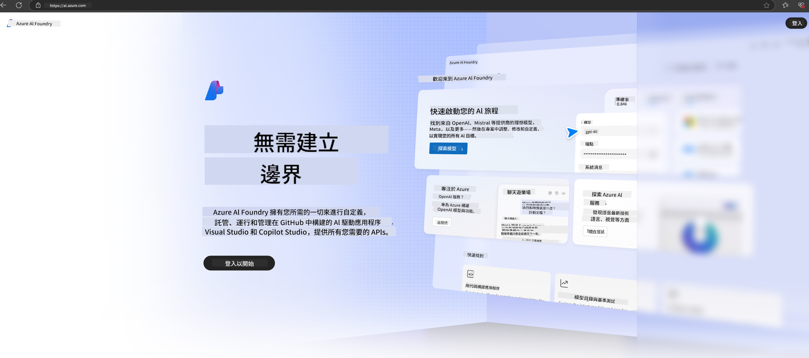

<!--
CO_OP_TRANSLATOR_METADATA:
{
  "original_hash": "6525689374197af33b41a93811e473a2",
  "translation_date": "2025-04-04T18:45:36+00:00",
  "source_file": "md\\02.QuickStart\\AzureAIFoundry_QuickStart.md",
  "language_code": "hk"
}
-->
# **在 Azure AI Foundry 中使用 Phi-3**

隨著生成式 AI 的發展，我們希望使用統一的平台來管理不同的 LLM 和 SLM，企業數據整合，微調/RAG 操作，以及在整合 LLM 和 SLM 後對不同企業業務的評估等，從而更好地實現生成式 AI 的智能應用。[Azure AI Foundry](https://ai.azure.com) 是一個企業級生成式 AI 應用平台。

通過 Azure AI Foundry，你可以評估大型語言模型（LLM）的響應，並通過 Prompt Flow 編排 Prompt 應用組件以獲得更好的性能。該平台支持從概念驗證到全面投產的輕鬆擴展。持續的監控和調整則為長期成功提供支持。

我們可以通過簡單步驟快速在 Azure AI Foundry 上部署 Phi-3 模型，然後利用 Azure AI Foundry 完成 Phi-3 相關的 Playground/Chat、微調、評估等相關工作。

## **1. 準備工作**

如果你的設備上已安裝 [Azure Developer CLI](https://learn.microsoft.com/azure/developer/azure-developer-cli/overview?WT.mc_id=aiml-138114-kinfeylo)，使用這個模板只需在新目錄中運行以下命令即可。

## 手動創建

創建一個 Microsoft Azure AI Foundry 項目和 Hub 是組織和管理你的 AI 工作的好方法。以下是逐步指導：

### 在 Azure AI Foundry 中創建項目

1. **進入 Azure AI Foundry**：登錄 Azure AI Foundry 門戶。
2. **創建項目**：
   - 如果你已在某個項目中，點擊頁面左上角的“Azure AI Foundry”，進入主頁。
   - 點擊“+ 創建項目”。
   - 輸入項目名稱。
   - 如果你已有 Hub，默認會選中該 Hub。如果你有多個 Hub 的訪問權限，可以從下拉菜單中選擇其他 Hub。如果你想創建新的 Hub，點擊“創建新 Hub”，並輸入名稱。
   - 點擊“創建”。

### 在 Azure AI Foundry 中創建 Hub

1. **進入 Azure AI Foundry**：使用你的 Azure 賬戶登錄。
2. **創建 Hub**：
   - 從左側菜單中選擇管理中心。
   - 點擊“所有資源”，然後點擊“+ 新項目”旁的下拉箭頭，選擇“+ 新 Hub”。
   - 在“創建新 Hub”對話框中，輸入 Hub 的名稱（例如 contoso-hub），並根據需要修改其他字段。
   - 點擊“下一步”，檢查信息，然後點擊“創建”。

更多詳細指導，請參考官方 [Microsoft 文檔](https://learn.microsoft.com/azure/ai-studio/how-to/create-projects)。

創建成功後，你可以通過 [ai.azure.com](https://ai.azure.com/) 訪問你創建的工作室。

一個 AI Foundry 可以包含多個項目。在 AI Foundry 中創建項目以做好準備。

創建 Azure AI Foundry [快速入門](https://learn.microsoft.com/azure/ai-studio/quickstarts/get-started-code)

## **2. 在 Azure AI Foundry 中部署 Phi 模型**

點擊項目中的 Explore 選項，進入模型目錄並選擇 Phi-3

選擇 Phi-3-mini-4k-instruct

點擊“部署”，以部署 Phi-3-mini-4k-instruct 模型

> [!NOTE]
>
> 部署時可選擇計算能力

## **3. 在 Azure AI Foundry 中使用 Playground 聊天 Phi**

進入部署頁面，選擇 Playground，與 Azure AI Foundry 的 Phi-3 進行聊天

## **4. 從 Azure AI Foundry 部署模型**

要從 Azure 模型目錄中部署模型，可以按照以下步驟：

- 登錄 Azure AI Foundry。
- 從 Azure AI Foundry 模型目錄中選擇你要部署的模型。
- 在模型的詳細信息頁面中，選擇部署，然後選擇帶有 Azure AI Content Safety 的無服務 API。
- 選擇你希望部署模型的項目。要使用無服務 API，工作區必須位於 East US 2 或 Sweden Central 地區。你可以自定義部署名稱。
- 在部署向導中，選擇定價和條款以了解定價和使用條款。
- 點擊部署。等待部署完成，並跳轉到部署頁面。
- 點擊“在 Playground 中打開”開始與模型交互。
- 你可以返回部署頁面，選擇部署，並記錄端點的目標 URL 和密鑰，用於調用部署並生成完成。
- 你可以隨時通過導航到 Build 標籤，並從組件部分選擇 Deployments，找到端點的詳細信息、URL 和訪問密鑰。

> [!NOTE]
> 請注意，執行這些步驟需要你的賬戶具有資源組上的 Azure AI Developer 角色權限。

## **5. 在 Azure AI Foundry 中使用 Phi API**

你可以通過 Postman 的 GET 請求訪問 https://{Your project name}.region.inference.ml.azure.com/swagger.json，並結合密鑰來了解提供的接口

你可以非常方便地獲取請求參數以及響應參數。

**免責聲明**：  
本文件已使用AI翻譯服務 [Co-op Translator](https://github.com/Azure/co-op-translator) 翻譯。我們致力於提供準確的翻譯，但請注意，自動翻譯可能包含錯誤或不準確之處。應以原語言版本的文件作為權威來源。對於關鍵信息，建議尋求專業人工翻譯。我們對因使用此翻譯而引起的任何誤解或誤讀概不負責。