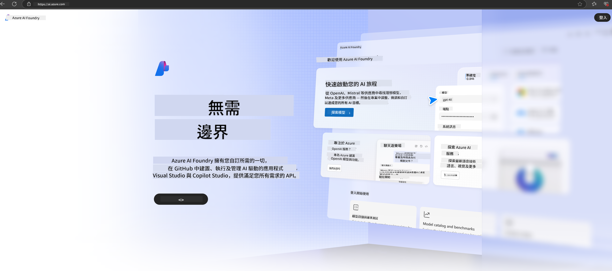

<!--
CO_OP_TRANSLATOR_METADATA:
{
  "original_hash": "3a1e48b628022485aac989c9f733e792",
  "translation_date": "2025-05-08T04:59:38+00:00",
  "source_file": "md/02.QuickStart/AzureAIFoundry_QuickStart.md",
  "language_code": "hk"
}
-->
# **喺 Azure AI Foundry 使用 Phi-3**

隨住生成式 AI 嘅發展，我哋希望用一個統一平台去管理唔同嘅 LLM 同 SLM、企業數據整合、微調/RAG 操作，仲有整合 LLM 同 SLM 後評估唔同企業業務，等生成式 AI 可以更智能咁應用喺實際場景。[Azure AI Foundry](https://ai.azure.com) 係一個企業級嘅生成式 AI 應用平台。

用 Azure AI Foundry，可以評估大型語言模型（LLM）嘅回應，仲可以用 prompt flow 去編排提示應用組件，提升表現。平台方便擴展，輕鬆將概念驗證轉成完整生產系統。持續監控同優化支援長遠成功。

我哋可以透過簡單步驟喺 Azure AI Foundry 快速部署 Phi-3 模型，之後用 Azure AI Foundry 完成 Phi-3 相關嘅 Playground/Chat、微調、評估等工作。

## **1. 準備工作**

如果你已經喺機器安裝咗 [Azure Developer CLI](https://learn.microsoft.com/azure/developer/azure-developer-cli/overview?WT.mc_id=aiml-138114-kinfeylo)，用呢個模板只需要喺新目錄執行呢個指令就得。

## 手動建立

建立 Microsoft Azure AI Foundry 項目同 hub 係組織同管理 AI 工作嘅好方法。以下係逐步指引幫你開始：

### 喺 Azure AI Foundry 建立項目

1. **登入 Azure AI Foundry**：登入 Azure AI Foundry 入口網站。
2. **建立項目**：
   - 如果你已經喺某個項目，喺頁面左上角揀「Azure AI Foundry」返回主頁。
   - 揀「+ Create project」。
   - 輸入項目名稱。
   - 如果你有 hub，會自動選擇。如果你有多於一個 hub，可以喺下拉選單揀另一個。如果想建立新 hub，揀「Create new hub」並輸入名稱。
   - 揀「Create」。

### 喺 Azure AI Foundry 建立 Hub

1. **登入 Azure AI Foundry**：用你嘅 Azure 帳戶登入。
2. **建立 Hub**：
   - 喺左側選單揀「Management center」。
   - 揀「All resources」，跟住喺「+ New project」旁嘅下拉箭頭揀「+ New hub」。
   - 喺「Create a new hub」對話框入面，輸入 hub 名稱（例如 contoso-hub），同埋根據需要修改其他欄位。
   - 揀「Next」，檢查資料，然後揀「Create」。

想了解更詳細指引，可以參考官方嘅 [Microsoft 文件](https://learn.microsoft.com/azure/ai-studio/how-to/create-projects)。

建立成功後，可以透過 [ai.azure.com](https://ai.azure.com/) 進入你建立嘅 studio。

一個 AI Foundry 可以有多個項目。先喺 AI Foundry 建立項目作準備。

建立 Azure AI Foundry [QuickStarts](https://learn.microsoft.com/azure/ai-studio/quickstarts/get-started-code)

## **2. 喺 Azure AI Foundry 部署 Phi 模型**

喺項目入面揀 Explore，進入 Model Catalog，揀 Phi-3。

揀 Phi-3-mini-4k-instruct。

點擊「Deploy」部署 Phi-3-mini-4k-instruct 模型。

> [!NOTE]
>
> 部署時可以揀計算資源。

## **3. 喺 Azure AI Foundry Playground Chat Phi**

去部署頁面，揀 Playground，同 Azure AI Foundry 嘅 Phi-3 聊天。

## **4. 喺 Azure AI Foundry 部署模型**

要喺 Azure Model Catalog 部署模型，可以跟住以下步驟：

- 登入 Azure AI Foundry。
- 喺 Azure AI Foundry 模型目錄揀你想部署嘅模型。
- 喺模型嘅詳細頁面，揀 Deploy，然後揀 Serverless API with Azure AI Content Safety。
- 揀你想部署模型嘅項目。要用 Serverless API，你嘅工作區必須喺 East US 2 或 Sweden Central 區域。你可以自訂部署名稱。
- 喺部署嚮導，揀 Pricing and terms 了解價格同使用條款。
- 揀 Deploy。等部署完成，會跳轉去 Deployments 頁面。
- 揀 Open in playground 開始同模型互動。
- 你可以返回 Deployments 頁面，揀部署，留意 endpoint 嘅 Target URL 同 Secret Key，用嚟調用部署同生成回應。
- 你隨時可以喺 Build 標籤底下，喺 Components 區揀 Deployments，搵到 endpoint 詳情、URL 同存取金鑰。

> [!NOTE]
> 請注意，你嘅帳戶必須喺資源組擁有 Azure AI Developer 角色權限先可以執行以上步驟。

## **5. 喺 Azure AI Foundry 使用 Phi API**

你可以透過 Postman 用 GET 方法訪問 https://{Your project name}.region.inference.ml.azure.com/swagger.json，配合 Key 了解提供嘅接口。

你可以好方便咁攞到請求參數，同埋回應參數。

**免責聲明**：  
本文件使用 AI 翻譯服務 [Co-op Translator](https://github.com/Azure/co-op-translator) 進行翻譯。雖然我們致力於提供準確的翻譯，但請注意自動翻譯可能包含錯誤或不準確之處。原始文件的母語版本應被視為權威來源。對於重要資訊，建議採用專業人工翻譯。我們不對因使用此翻譯而引起的任何誤解或誤釋負責。