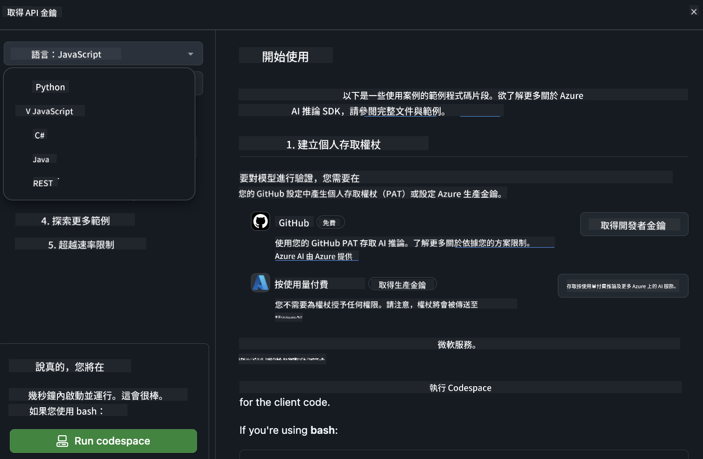

<!--
CO_OP_TRANSLATOR_METADATA:
{
  "original_hash": "5113634b77370af6790f9697d5d7de90",
  "translation_date": "2025-05-08T05:00:37+00:00",
  "source_file": "md/02.QuickStart/GitHubModel_QuickStart.md",
  "language_code": "hk"
}
-->
## GitHub Models - 限量公開測試版

歡迎使用 [GitHub Models](https://github.com/marketplace/models)！我哋已經準備好，等你探索喺 Azure AI 上托管嘅 AI 模型。


想了解更多關於 GitHub Models 提供嘅模型，可以參考 [GitHub Model Marketplace](https://github.com/marketplace/models)

## 可用模型

每個模型都有專屬嘅 playground 同示範代碼


### GitHub Model Catalog 入面嘅 Phi-3 模型

[Phi-3-Medium-128k-Instruct](https://github.com/marketplace/models/azureml/Phi-3-medium-128k-instruct)

[Phi-3-medium-4k-instruct](https://github.com/marketplace/models/azureml/Phi-3-medium-4k-instruct)

[Phi-3-mini-128k-instruct](https://github.com/marketplace/models/azureml/Phi-3-mini-128k-instruct)

[Phi-3-mini-4k-instruct](https://github.com/marketplace/models/azureml/Phi-3-mini-4k-instruct)

[Phi-3-small-128k-instruct](https://github.com/marketplace/models/azureml/Phi-3-small-128k-instruct)

[Phi-3-small-8k-instruct](https://github.com/marketplace/models/azureml/Phi-3-small-8k-instruct)

## 快速開始

有啲基本示範準備好畀你即刻用，你可以喺 samples 目錄搵到。如果想直接跳去你鍾意嘅語言，可以喺以下語言入面搵示範：

- Python
- JavaScript
- cURL

仲有專用嘅 Codespaces 環境，方便你運行示範同模型。



## 示範代碼

以下係幾個用例嘅示範代碼片段。想了解更多關於 Azure AI Inference SDK，可以睇完整文件同示範。

## 設定

1. 建立個人訪問令牌  
唔需要畀任何權限畀令牌。請留意，呢個令牌會發送到 Microsoft 嘅服務。

要用下面嘅代碼片段，請建立環境變量，將你嘅令牌設為客戶端代碼嘅金鑰。

如果你用 bash：  
```
export GITHUB_TOKEN="<your-github-token-goes-here>"
```  
如果你用 powershell：  

```
$Env:GITHUB_TOKEN="<your-github-token-goes-here>"
```  

如果你用 Windows 命令提示字元：  

```
set GITHUB_TOKEN=<your-github-token-goes-here>
```  

## Python 示範

### 安裝依賴  
用 pip 安裝 Azure AI Inference SDK（需要 Python >=3.8）：  

```
pip install azure-ai-inference
```  
### 運行基本示範代碼

呢個示範展示點樣用 chat completion API。佢會用 GitHub AI 模型推理端點同你嘅 GitHub 令牌。呢個調用係同步嘅。

```
import os
from azure.ai.inference import ChatCompletionsClient
from azure.ai.inference.models import SystemMessage, UserMessage
from azure.core.credentials import AzureKeyCredential

endpoint = "https://models.inference.ai.azure.com"
# Replace Model_Name 
model_name = "Phi-3-small-8k-instruct"
token = os.environ["GITHUB_TOKEN"]

client = ChatCompletionsClient(
    endpoint=endpoint,
    credential=AzureKeyCredential(token),
)

response = client.complete(
    messages=[
        SystemMessage(content="You are a helpful assistant."),
        UserMessage(content="What is the capital of France?"),
    ],
    model=model_name,
    temperature=1.,
    max_tokens=1000,
    top_p=1.
)

print(response.choices[0].message.content)
```

### 運行多輪對話

呢個示範展示點樣用 chat completion API 進行多輪對話。用模型做聊天應用時，你要管理對話歷史，並將最新訊息發送畀模型。

```
import os
from azure.ai.inference import ChatCompletionsClient
from azure.ai.inference.models import AssistantMessage, SystemMessage, UserMessage
from azure.core.credentials import AzureKeyCredential

token = os.environ["GITHUB_TOKEN"]
endpoint = "https://models.inference.ai.azure.com"
# Replace Model_Name
model_name = "Phi-3-small-8k-instruct"

client = ChatCompletionsClient(
    endpoint=endpoint,
    credential=AzureKeyCredential(token),
)

messages = [
    SystemMessage(content="You are a helpful assistant."),
    UserMessage(content="What is the capital of France?"),
    AssistantMessage(content="The capital of France is Paris."),
    UserMessage(content="What about Spain?"),
]

response = client.complete(messages=messages, model=model_name)

print(response.choices[0].message.content)
```

### 串流輸出

為咗提升用戶體驗，你會想串流模型嘅回應，咁第一個 token 就可以早啲出現，避免等太耐。

```
import os
from azure.ai.inference import ChatCompletionsClient
from azure.ai.inference.models import SystemMessage, UserMessage
from azure.core.credentials import AzureKeyCredential

token = os.environ["GITHUB_TOKEN"]
endpoint = "https://models.inference.ai.azure.com"
# Replace Model_Name
model_name = "Phi-3-small-8k-instruct"

client = ChatCompletionsClient(
    endpoint=endpoint,
    credential=AzureKeyCredential(token),
)

response = client.complete(
    stream=True,
    messages=[
        SystemMessage(content="You are a helpful assistant."),
        UserMessage(content="Give me 5 good reasons why I should exercise every day."),
    ],
    model=model_name,
)

for update in response:
    if update.choices:
        print(update.choices[0].delta.content or "", end="")

client.close()
```

## JavaScript

### 安裝依賴

安裝 Node.js。

複製以下文字，儲存成 package.json 檔案喺你嘅資料夾。

```
{
  "type": "module",
  "dependencies": {
    "@azure-rest/ai-inference": "latest",
    "@azure/core-auth": "latest",
    "@azure/core-sse": "latest"
  }
}
```

注意：@azure/core-sse 只係喺你串流 chat completion 回應時先需要。

喺呢個資料夾開終端機，執行 npm install。

以下代碼片段，複製內容到 sample.js，再用 node sample.js 運行。

### 運行基本示範代碼

呢個示範展示點樣用 chat completion API。佢會用 GitHub AI 模型推理端點同你嘅 GitHub 令牌。調用係同步嘅。

```
import ModelClient from "@azure-rest/ai-inference";
import { AzureKeyCredential } from "@azure/core-auth";

const token = process.env["GITHUB_TOKEN"];
const endpoint = "https://models.inference.ai.azure.com";
// Update your modelname
const modelName = "Phi-3-small-8k-instruct";

export async function main() {

  const client = new ModelClient(endpoint, new AzureKeyCredential(token));

  const response = await client.path("/chat/completions").post({
    body: {
      messages: [
        { role:"system", content: "You are a helpful assistant." },
        { role:"user", content: "What is the capital of France?" }
      ],
      model: modelName,
      temperature: 1.,
      max_tokens: 1000,
      top_p: 1.
    }
  });

  if (response.status !== "200") {
    throw response.body.error;
  }
  console.log(response.body.choices[0].message.content);
}

main().catch((err) => {
  console.error("The sample encountered an error:", err);
});
```

### 運行多輪對話

呢個示範展示點樣用 chat completion API 進行多輪對話。用模型做聊天應用時，你要管理對話歷史，並將最新訊息發送畀模型。

```
import ModelClient from "@azure-rest/ai-inference";
import { AzureKeyCredential } from "@azure/core-auth";

const token = process.env["GITHUB_TOKEN"];
const endpoint = "https://models.inference.ai.azure.com";
// Update your modelname
const modelName = "Phi-3-small-8k-instruct";

export async function main() {

  const client = new ModelClient(endpoint, new AzureKeyCredential(token));

  const response = await client.path("/chat/completions").post({
    body: {
      messages: [
        { role: "system", content: "You are a helpful assistant." },
        { role: "user", content: "What is the capital of France?" },
        { role: "assistant", content: "The capital of France is Paris." },
        { role: "user", content: "What about Spain?" },
      ],
      model: modelName,
    }
  });

  if (response.status !== "200") {
    throw response.body.error;
  }

  for (const choice of response.body.choices) {
    console.log(choice.message.content);
  }
}

main().catch((err) => {
  console.error("The sample encountered an error:", err);
});
```

### 串流輸出

為咗提升用戶體驗，你會想串流模型嘅回應，咁第一個 token 就可以早啲出現，避免等太耐。

```
import ModelClient from "@azure-rest/ai-inference";
import { AzureKeyCredential } from "@azure/core-auth";
import { createSseStream } from "@azure/core-sse";

const token = process.env["GITHUB_TOKEN"];
const endpoint = "https://models.inference.ai.azure.com";
// Update your modelname
const modelName = "Phi-3-small-8k-instruct";

export async function main() {

  const client = new ModelClient(endpoint, new AzureKeyCredential(token));

  const response = await client.path("/chat/completions").post({
    body: {
      messages: [
        { role: "system", content: "You are a helpful assistant." },
        { role: "user", content: "Give me 5 good reasons why I should exercise every day." },
      ],
      model: modelName,
      stream: true
    }
  }).asNodeStream();

  const stream = response.body;
  if (!stream) {
    throw new Error("The response stream is undefined");
  }

  if (response.status !== "200") {
    stream.destroy();
    throw new Error(`Failed to get chat completions, http operation failed with ${response.status} code`);
  }

  const sseStream = createSseStream(stream);

  for await (const event of sseStream) {
    if (event.data === "[DONE]") {
      return;
    }
    for (const choice of (JSON.parse(event.data)).choices) {
        process.stdout.write(choice.delta?.content ?? ``);
    }
  }
}

main().catch((err) => {
  console.error("The sample encountered an error:", err);
});
```

## REST

### 運行基本示範代碼

將以下內容貼入 shell：

```
curl -X POST "https://models.inference.ai.azure.com/chat/completions" \
    -H "Content-Type: application/json" \
    -H "Authorization: Bearer $GITHUB_TOKEN" \
    -d '{
        "messages": [
            {
                "role": "system",
                "content": "You are a helpful assistant."
            },
            {
                "role": "user",
                "content": "What is the capital of France?"
            }
        ],
        "model": "Phi-3-small-8k-instruct"
    }'
```

### 運行多輪對話

調用 chat completion API，並傳送聊天歷史：

```
curl -X POST "https://models.inference.ai.azure.com/chat/completions" \
    -H "Content-Type: application/json" \
    -H "Authorization: Bearer $GITHUB_TOKEN" \
    -d '{
        "messages": [
            {
                "role": "system",
                "content": "You are a helpful assistant."
            },
            {
                "role": "user",
                "content": "What is the capital of France?"
            },
            {
                "role": "assistant",
                "content": "The capital of France is Paris."
            },
            {
                "role": "user",
                "content": "What about Spain?"
            }
        ],
        "model": "Phi-3-small-8k-instruct"
    }'
```

### 串流輸出

呢個係調用端點並串流回應嘅範例。

```
curl -X POST "https://models.inference.ai.azure.com/chat/completions" \
    -H "Content-Type: application/json" \
    -H "Authorization: Bearer $GITHUB_TOKEN" \
    -d '{
        "messages": [
            {
                "role": "system",
                "content": "You are a helpful assistant."
            },
            {
                "role": "user",
                "content": "Give me 5 good reasons why I should exercise every day."
            }
        ],
        "stream": true,
        "model": "Phi-3-small-8k-instruct"
    }'
```

## GitHub Models 免費使用及速率限制


[playground 同免費 API 使用嘅速率限制](https://docs.github.com/en/github-models/prototyping-with-ai-models#rate-limits) 係為咗幫你試驗模型同快速開發 AI 應用。超出呢啲限制，要將資源喺 Azure 帳戶開通，並用 Azure 認證取代 GitHub 個人訪問令牌。代碼唔使改動。用呢條鏈接了解點樣突破 Azure AI 免費層限制。

### 免責聲明

記住，與模型互動係屬於 AI 實驗，內容有可能出錯。

呢個功能有唔同限制（包括每分鐘請求數、每日請求數、每次請求 token 數、同時請求數），唔適合用喺生產環境。

GitHub Models 使用 Azure AI Content Safety。呢啲過濾器係 GitHub Models 體驗嘅一部分，唔可以關閉。如果你用付費服務嘅模型，請自行配置內容過濾器以符合你嘅需求。

呢項服務受 GitHub 預發布條款約束。

**免責聲明**：  
本文件係使用 AI 翻譯服務 [Co-op Translator](https://github.com/Azure/co-op-translator) 翻譯而成。雖然我哋致力確保準確性，但請注意自動翻譯可能包含錯誤或不準確之處。原始文件嘅母語版本應被視為權威來源。對於重要資料，建議使用專業人工翻譯。我哋對因使用此翻譯而引致嘅任何誤解或誤釋概不負責。