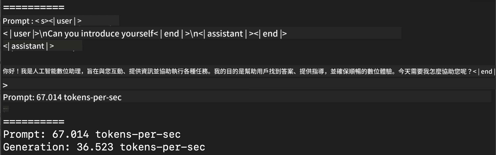
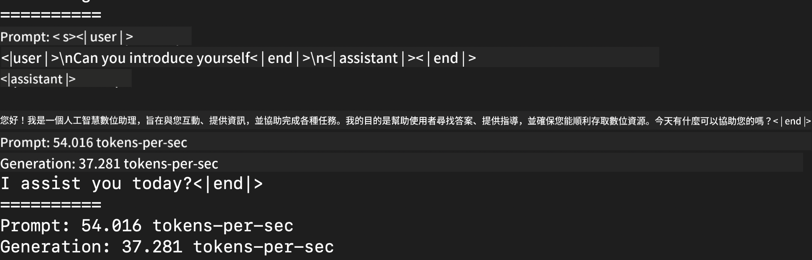
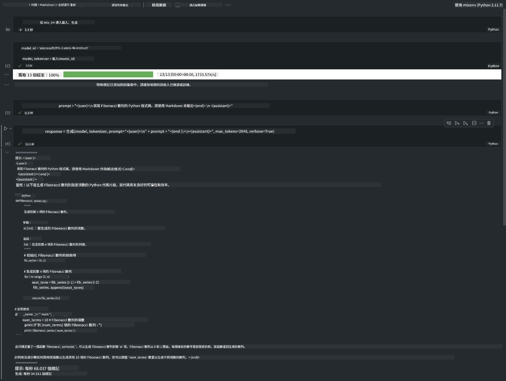

<!--
CO_OP_TRANSLATOR_METADATA:
{
  "original_hash": "700b9a537ce4426de5a7ccfa8e96e581",
  "translation_date": "2025-04-04T19:11:27+00:00",
  "source_file": "md\\03.FineTuning\\03.Inference\\MLX_Inference.md",
  "language_code": "hk"
}
-->
# **用 Apple MLX Framework 推論 Phi-3**

## **咩係 MLX Framework**

MLX 係一個專為 Apple Silicon 開發嘅機器學習研究框架，由 Apple 嘅機器學習團隊推出。

MLX 係專為機器學習研究員設計，目標係易用之餘，仲可以高效訓練同部署模型。呢個框架嘅設計概念非常簡單，方便研究人員快速擴展同改進 MLX，以便探索新嘅想法。

透過 MLX，可以喺 Apple Silicon 設備上加速 LLMs，並且可以非常方便咁本地運行模型。

## **用 MLX 推論 Phi-3-mini**

### **1. 設置 MLX 環境**

1. Python 3.11.x  
2. 安裝 MLX Library  

```bash

pip install mlx-lm

```

### **2. 用 MLX 喺 Terminal 運行 Phi-3-mini**

```bash

python -m mlx_lm.generate --model microsoft/Phi-3-mini-4k-instruct --max-token 2048 --prompt  "<|user|>\nCan you introduce yourself<|end|>\n<|assistant|>"

```

結果（我嘅環境係 Apple M1 Max, 64GB）如下：



### **3. 用 MLX 喺 Terminal 量化 Phi-3-mini**

```bash

python -m mlx_lm.convert --hf-path microsoft/Phi-3-mini-4k-instruct

```

***注意：*** 可以透過 mlx_lm.convert 量化模型，默認量化係 INT4。呢個例子係將 Phi-3-mini 量化到 INT4。

模型可以透過 mlx_lm.convert 進行量化，默認係 INT4。呢個例子係將 Phi-3-mini 量化到 INT4。量化完成之後，模型會存喺默認目錄 ./mlx_model。

我哋可以喺 Terminal 測試經 MLX 量化嘅模型：

```bash

python -m mlx_lm.generate --model ./mlx_model/ --max-token 2048 --prompt  "<|user|>\nCan you introduce yourself<|end|>\n<|assistant|>"

```

結果如下：



### **4. 用 MLX 喺 Jupyter Notebook 運行 Phi-3-mini**



***注意：*** 請參考呢個範例 [點擊呢度](../../../../../code/03.Inference/MLX/MLX_DEMO.ipynb)

## **資源**

1. 了解 Apple MLX Framework [https://ml-explore.github.io](https://ml-explore.github.io/mlx/build/html/index.html)

2. Apple MLX GitHub Repo [https://github.com/ml-explore](https://github.com/ml-explore)

**免責聲明**：  
本文件使用人工智能翻譯服務 [Co-op Translator](https://github.com/Azure/co-op-translator) 進行翻譯。雖然我們努力確保翻譯的準確性，但請注意，自動翻譯可能包含錯誤或不準確之處。原始語言的文件應被視為權威來源。對於重要信息，建議使用專業的人類翻譯。我們對因使用此翻譯而產生的任何誤解或錯誤解釋不承擔責任。