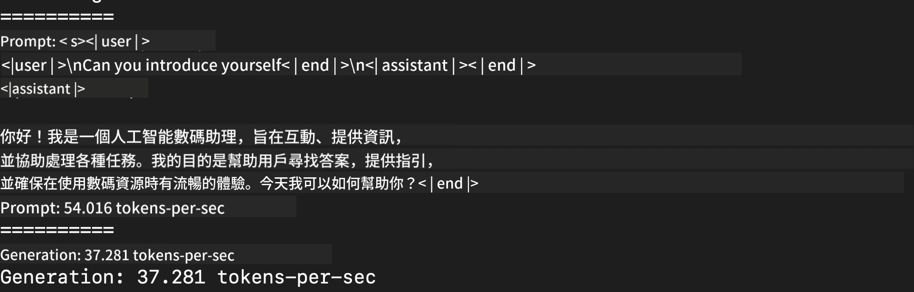
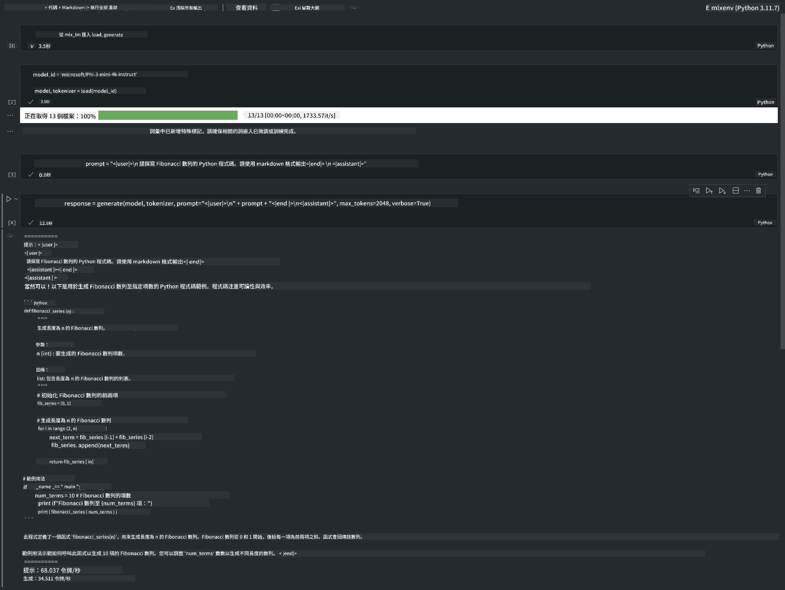

<!--
CO_OP_TRANSLATOR_METADATA:
{
  "original_hash": "dcb656f3d206fc4968e236deec5d4384",
  "translation_date": "2025-05-08T05:24:48+00:00",
  "source_file": "md/03.FineTuning/03.Inference/MLX_Inference.md",
  "language_code": "hk"
}
-->
# **用 Apple MLX Framework 推論 Phi-3**

## **咩係 MLX Framework**

MLX 係一個針對 Apple silicon 嘅機器學習研究陣列框架，由 Apple 機器學習研究團隊開發。

MLX 係由機器學習研究員為機器學習研究員設計。呢個框架目標係方便用戶使用，同時又有效率去訓練同部署模型。框架本身嘅設計概念都好簡單。我哋希望研究員可以輕鬆擴展同改進 MLX，快速探索新嘅想法。

喺 Apple Silicon 裝置上，透過 MLX 可以加速大型語言模型（LLMs），而且可以好方便喺本地運行模型。

## **用 MLX 推論 Phi-3-mini**

### **1. 設定你嘅 MLX 環境**

1. Python 3.11.x  
2. 安裝 MLX Library  


```bash

pip install mlx-lm

```

### **2. 喺 Terminal 用 MLX 運行 Phi-3-mini**

```bash

python -m mlx_lm.generate --model microsoft/Phi-3-mini-4k-instruct --max-token 2048 --prompt  "<|user|>\nCan you introduce yourself<|end|>\n<|assistant|>"

```

結果（我用緊 Apple M1 Max，64GB）係


### **3. 喺 Terminal 用 MLX 量化 Phi-3-mini**

```bash

python -m mlx_lm.convert --hf-path microsoft/Phi-3-mini-4k-instruct

```

***Note：*** 模型可以用 mlx_lm.convert 量化，預設量化係 INT4。呢個例子係將 Phi-3-mini 量化成 INT4。

模型可以用 mlx_lm.convert 量化，預設係 INT4。呢個例子係將 Phi-3-mini 量化成 INT4。量化完成後會儲存在預設資料夾 ./mlx_model。

我哋可以喺 terminal 測試用 MLX 量化嘅模型。

```bash

python -m mlx_lm.generate --model ./mlx_model/ --max-token 2048 --prompt  "<|user|>\nCan you introduce yourself<|end|>\n<|assistant|>"

```

結果係



### **4. 喺 Jupyter Notebook 用 MLX 運行 Phi-3-mini**



***Note:*** 請閱讀呢個範例 [click this link](../../../../../code/03.Inference/MLX/MLX_DEMO.ipynb)

## **資源**

1. 了解 Apple MLX Framework [https://ml-explore.github.io](https://ml-explore.github.io/mlx/build/html/index.html)

2. Apple MLX GitHub Repo [https://github.com/ml-explore](https://github.com/ml-explore)

**免責聲明**：  
本文件係使用 AI 翻譯服務 [Co-op Translator](https://github.com/Azure/co-op-translator) 進行翻譯。雖然我哋致力保持準確，但請注意自動翻譯可能包含錯誤或不準確之處。原始文件嘅母語版本應視為權威來源。對於重要資訊，建議採用專業人工翻譯。我哋對因使用此翻譯而引致嘅任何誤解或誤釋概不負責。