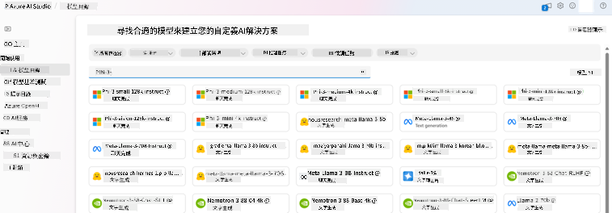
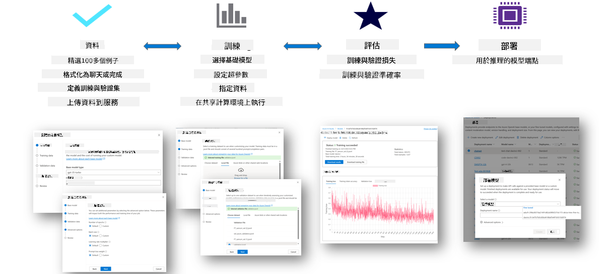
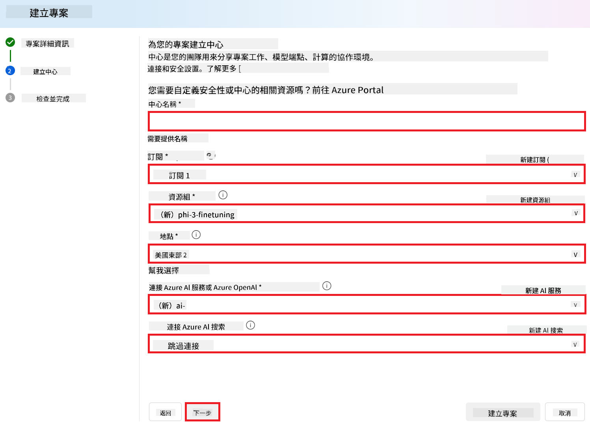
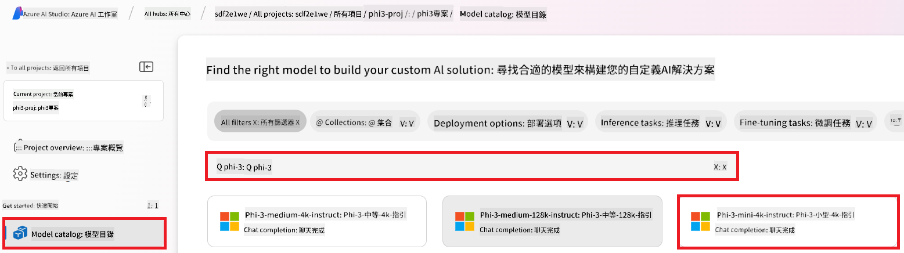
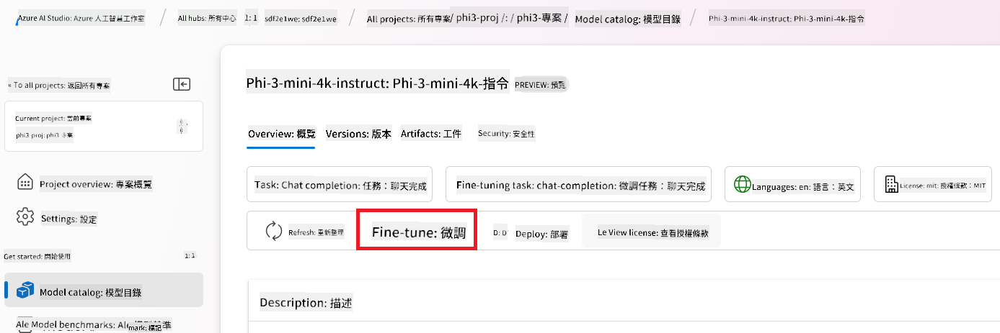
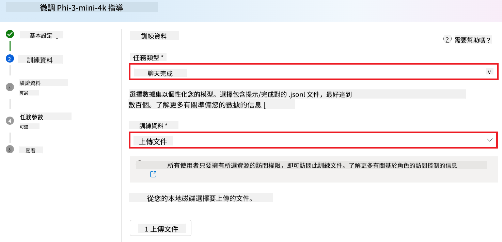
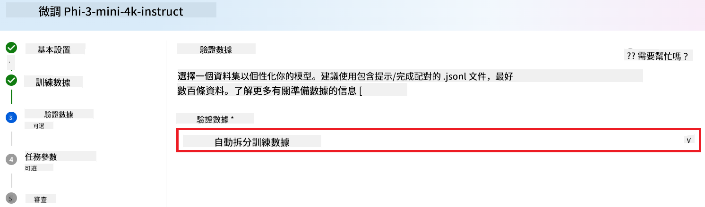
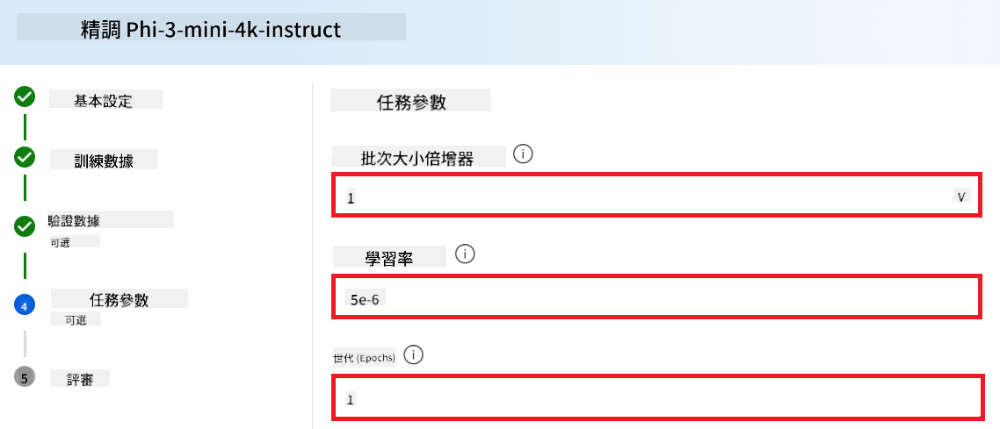
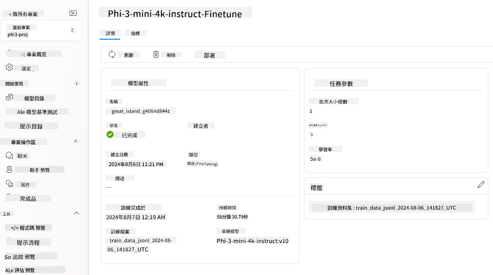

<!--
CO_OP_TRANSLATOR_METADATA:
{
  "original_hash": "94e7d7ab455720bab75ead5c28521c97",
  "translation_date": "2025-04-04T18:48:38+00:00",
  "source_file": "md\\03.FineTuning\\FineTuning_AIFoundry.md",
  "language_code": "hk"
}
-->
# 微調 Phi-3 與 Azure AI Foundry

讓我們探索如何使用 Azure AI Foundry 微調 Microsoft 的 Phi-3 Mini 語言模型。微調能讓 Phi-3 Mini 適應特定任務，使其更強大且更具上下文意識。

## 考量事項

- **能力:** 哪些模型可以進行微調？基礎模型能透過微調完成哪些任務？
- **成本:** 微調的定價模式是什麼？
- **自訂性:** 我能以什麼方式修改基礎模型？能修改多少？
- **便利性:** 微調的實際操作是什麼樣的？我需要撰寫自訂程式碼嗎？需要自備運算資源嗎？
- **安全性:** 微調過的模型已知可能存在安全風險——是否有任何防護措施以避免意外的危害？



## 微調前的準備

### 先決條件

> [!NOTE]  
> 對於 Phi-3 系列模型，依用量付費的微調服務僅適用於 **East US 2** 地區所建立的 Hub。

- 一個 Azure 訂閱。如果您尚未擁有 Azure 訂閱，請建立 [付費 Azure 帳戶](https://azure.microsoft.com/pricing/purchase-options/pay-as-you-go) 以開始使用。

- 一個 [AI Foundry 專案](https://ai.azure.com?WT.mc_id=aiml-138114-kinfeylo)。  
- Azure 基於角色的存取控制 (Azure RBAC) 用於授予 Azure AI Foundry 中的操作權限。若要執行本文的步驟，您的使用者帳戶必須被指派為資源群組中的 __Azure AI Developer 角色__。

### 訂閱提供者註冊

確認您的訂閱已註冊至 `Microsoft.Network` 資源提供者。

1. 登入 [Azure 入口網站](https://portal.azure.com)。  
1. 從左側選單選擇 **訂閱**。  
1. 選擇您要使用的訂閱。  
1. 從左側選單選擇 **AI 專案設定** > **資源提供者**。  
1. 確認 **Microsoft.Network** 在資源提供者列表中。若不在，則將其新增。

### 資料準備

準備好您的訓練和驗證資料以微調模型。您的訓練資料與驗證資料集應包含模型預期執行方式的輸入與輸出範例。

確保所有訓練範例符合推理所需的格式。為了有效地微調模型，請確保資料集的平衡與多樣性。

這包括保持資料平衡、涵蓋多種情境，並定期優化訓練資料以符合現實世界需求，最終使模型回應更準確且均衡。

不同模型類型需要不同格式的訓練資料。

### 聊天完成

您使用的訓練與驗證資料 **必須** 格式化為 JSON Lines (JSONL) 文件。對於 `Phi-3-mini-128k-instruct`，微調資料集必須使用與聊天完成 API 相同的對話格式。

### 範例文件格式

```json
    {"messages": [{"role": "system", "content": "You are an Xbox customer support agent whose primary goal is to help users with issues they are experiencing with their Xbox devices. You are friendly and concise. You only provide factual answers to queries, and do not provide answers that are not related to Xbox."}, {"role": "user", "content": "Is Xbox better than PlayStation?"}, {"role": "assistant", "content": "I apologize, but I cannot provide personal opinions. My primary job is to assist you with any issues related to your Xbox device. Do you have any Xbox-related issues that need addressing?"}]}
    {"messages": [{"role": "system", "content": "You are an Xbox customer support agent whose primary goal is to help users with issues they are experiencing with their Xbox devices. You are friendly and concise. You only provide factual answers to queries, and do not provide answers that are not related to Xbox."}, {"role": "user", "content": "Can I play PC games on my Xbox?"}, {"role": "assistant", "content": "While Xbox consoles don't natively support PC games, they can play an array of Xbox games, many of which are also available on PC. Can I assist you with finding games compatible with your Xbox device?"}]}
    {"messages": [{"role": "system", "content": "You are an Xbox customer support agent whose primary goal is to help users with issues they are experiencing with their Xbox devices. You are friendly and concise. You only provide factual answers to queries, and do not provide answers that are not related to Xbox."}, {"role": "user", "content": "I'm having trouble connecting my Xbox to the Wi-Fi."}, {"role": "assistant", "content": "No worries, let's go through the network settings on your Xbox. Can you please tell me what happens when you try to connect it to the Wi-Fi?"}]}
```

支援的文件類型為 JSON Lines。文件會上傳至預設資料存儲並在您的專案中可用。

## 使用 Azure AI Foundry 微調 Phi-3

Azure AI Foundry 讓您能透過微調的方式，根據自己的資料集量身打造大型語言模型。微調能為特定任務與應用帶來客製化與最佳化的重大價值。這可提升性能、降低成本、減少延遲並產生更符合需求的輸出。



### 建立新專案

1. 登入 [Azure AI Foundry](https://ai.azure.com)。  

1. 選擇 **+新專案** 以在 Azure AI Foundry 中建立新專案。  

    

1. 執行以下任務：  

    - 專案 **Hub 名稱**。必須是唯一值。  
    - 選擇要使用的 **Hub** (如果需要可建立新的)。  

    

1. 執行以下任務以建立新的 Hub：  

    - 輸入 **Hub 名稱**。必須是唯一值。  
    - 選擇您的 Azure **訂閱**。  
    - 選擇要使用的 **資源群組** (如果需要可建立新的)。  
    - 選擇您希望使用的 **位置**。  
    - 選擇要使用的 **連接 Azure AI 服務** (如果需要可建立新的)。  
    - 選擇 **連接 Azure AI 搜索** 至 **略過連接**。  

    

1. 選擇 **下一步**。  
1. 選擇 **建立專案**。  

### 資料準備

在微調之前，收集或建立與任務相關的資料集，例如聊天指令、問答對或其他相關文本資料。清理並預處理這些資料，移除噪音、處理缺失值並進行文本分詞。

### 在 Azure AI Foundry 中微調 Phi-3 模型

> [!NOTE]  
> Phi-3 模型的微調目前僅支援位於 East US 2 的專案。

1. 從左側選項卡選擇 **模型目錄**。  

1. 在 **搜尋列** 中輸入 *phi-3*，並選擇您希望使用的 phi-3 模型。  

    

1. 選擇 **微調**。  

    

1. 輸入 **微調後模型名稱**。  

    

1. 選擇 **下一步**。  

1. 執行以下任務：  

    - 將 **任務類型** 設定為 **聊天完成**。  
    - 選擇您希望使用的 **訓練資料**。您可以透過 Azure AI Foundry 的資料或從本地環境上傳。  

    

1. 選擇 **下一步**。  

1. 上傳您希望使用的 **驗證資料**，或者選擇 **自動分割訓練資料**。  

    

1. 選擇 **下一步**。  

1. 執行以下任務：  

    - 選擇您希望使用的 **批次大小倍數**。  
    - 選擇您希望使用的 **學習率**。  
    - 選擇您希望使用的 **訓練週期數**。  

    

1. 選擇 **提交** 以開始微調流程。  

    

1. 一旦您的模型完成微調，狀態將顯示為 **已完成**，如圖所示。現在您可以部署模型並在自己的應用程式中使用，也可以在 Playground 或 Prompt Flow 中使用。更多資訊請參閱 [如何使用 Azure AI Foundry 部署 Phi-3 系列的小型語言模型](https://learn.microsoft.com/azure/ai-studio/how-to/deploy-models-phi-3?tabs=phi-3-5&pivots=programming-language-python)。  

    

> [!NOTE]  
> 如需 Phi-3 微調的更多詳細資訊，請參訪 [在 Azure AI Foundry 中微調 Phi-3 模型](https://learn.microsoft.com/azure/ai-studio/how-to/fine-tune-phi-3?tabs=phi-3-mini)。

## 清理微調後的模型

您可以從 [Azure AI Foundry](https://ai.azure.com) 的微調模型列表或模型詳細資訊頁面中刪除微調後的模型。從微調頁面選擇要刪除的微調後模型，然後選擇刪除按鈕以刪除模型。

> [!NOTE]  
> 如果自訂模型有現有部署，您無法刪除該模型。必須先刪除模型部署才能刪除自訂模型。

## 成本與配額

### Phi-3 模型微調服務的成本與配額考量

Phi 模型微調服務由 Microsoft 提供並與 Azure AI Foundry 整合使用。您可以在 [部署](https://learn.microsoft.com/azure/ai-studio/how-to/deploy-models-phi-3?tabs=phi-3-5&pivots=programming-language-python) 或微調模型時，於部署精靈中的定價與條款標籤下找到定價資訊。

## 內容過濾

依用量付費部署的模型受到 Azure AI 內容安全保護。當部署至即時端點時，您可以選擇退出此功能。啟用 Azure AI 內容安全時，提示與完成內容均會通過一組分類模型以檢測並防止生成有害內容。內容過濾系統會檢測並對輸入提示與完成內容中的特定類別的潛在有害內容採取行動。了解更多 [Azure AI 內容安全](https://learn.microsoft.com/azure/ai-studio/concepts/content-filtering)。

**微調配置**

超參數：定義學習率、批次大小及訓練週期數等超參數。

**損失函數**

選擇適合任務的損失函數（例如交叉熵）。

**優化器**

選擇優化器（例如 Adam）以在訓練過程中進行梯度更新。

**微調流程**

- 加載預訓練模型：加載 Phi-3 Mini 檢查點。  
- 添加自訂層：添加任務專用層（例如聊天指令的分類頭）。  

**訓練模型**  
使用準備好的資料集微調模型。監控訓練進度並根據需要調整超參數。

**評估與驗證**

驗證集：將資料分割為訓練集與驗證集。

**評估性能**

使用準確率、F1 分數或困惑度等指標評估模型性能。

## 保存微調後的模型

**檢查點**  
保存微調後的模型檢查點以供未來使用。

## 部署

- 部署為網路服務：將微調後的模型部署為 Azure AI Foundry 中的網路服務。  
- 測試端點：向已部署的端點發送測試查詢以驗證其功能。

## 迭代與改進

迭代：如果性能不滿意，請透過調整超參數、添加更多資料或進行額外訓練週期來進行迭代。

## 監控與優化

持續監控模型行為並根據需要進行優化。

## 自訂與擴展

自訂任務：Phi-3 Mini 不僅能微調於聊天指令，還可用於其他各種任務。探索其他使用案例！  
實驗：嘗試不同架構、層組合及技術以提升性能。

> [!NOTE]  
> 微調是一個反覆的過程。實驗、學習並調整您的模型以達到特定任務的最佳結果！

**免責聲明**:  
此文件已使用 AI 翻譯服務 [Co-op Translator](https://github.com/Azure/co-op-translator) 進行翻譯。我們致力於提供準確的翻譯，但請注意，自動翻譯可能包含錯誤或不準確之處。應以原始語言的文件作為權威來源。對於關鍵資訊，建議尋求專業人工翻譯。我們對因使用此翻譯而引起的任何誤解或錯誤解釋概不負責。