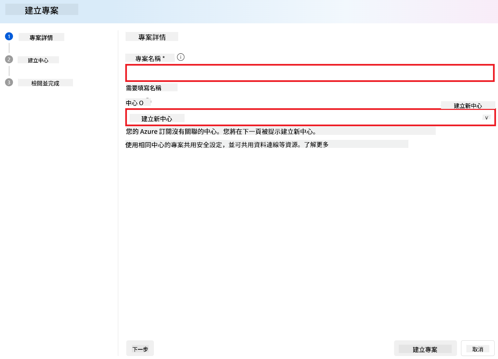
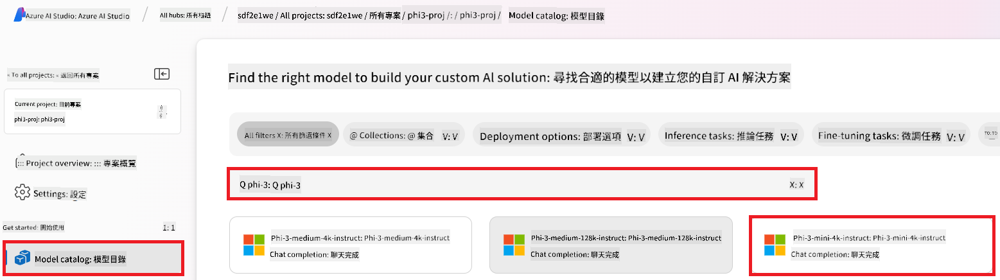
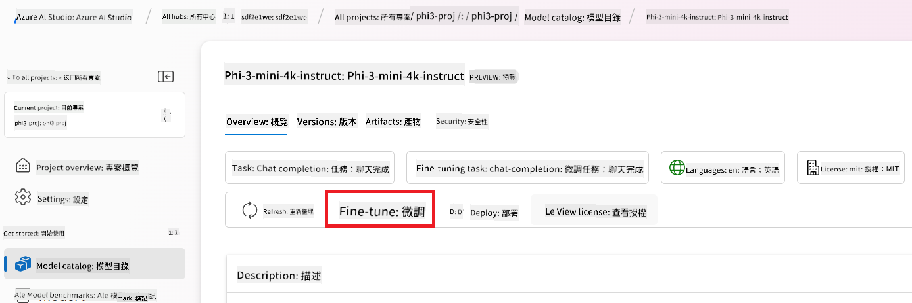
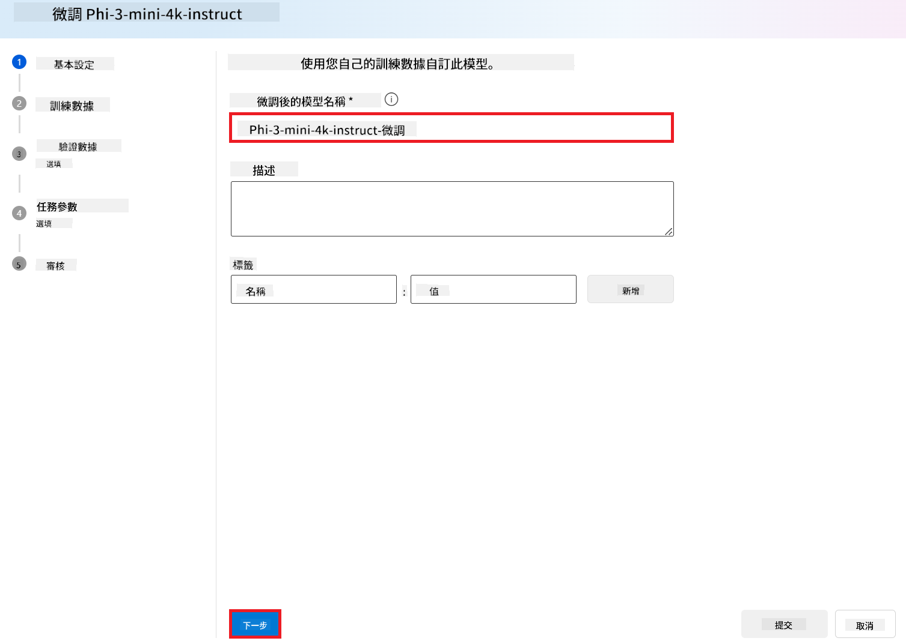
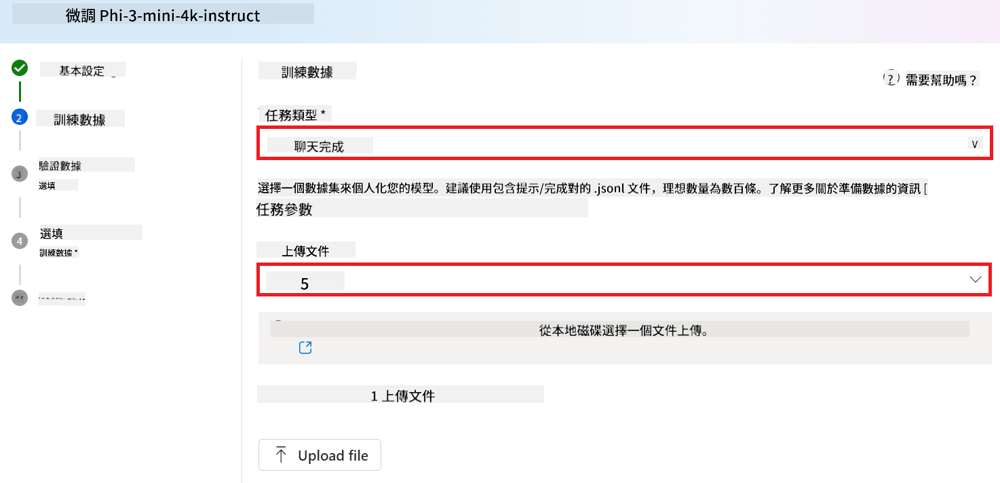
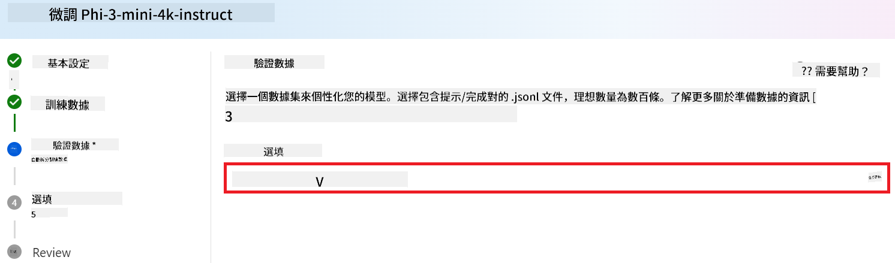
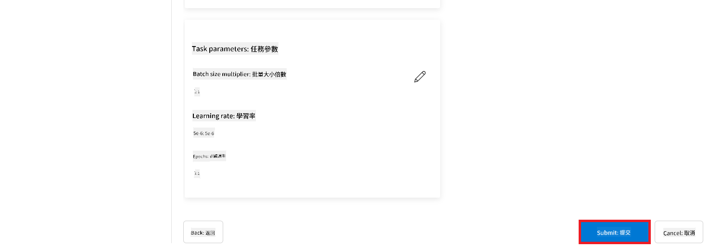

<!--
CO_OP_TRANSLATOR_METADATA:
{
  "original_hash": "c1559c5af6caccf6f623fd43a6b3a9a3",
  "translation_date": "2025-05-08T05:02:23+00:00",
  "source_file": "md/03.FineTuning/FineTuning_AIFoundry.md",
  "language_code": "hk"
}
-->
# 用 Azure AI Foundry 微調 Phi-3

我哋一齊睇下點用 Azure AI Foundry 微調 Microsoft 嘅 Phi-3 Mini 語言模型。微調可以令 Phi-3 Mini 適應特定任務，變得更強大同更懂得根據上下文回應。

## 注意事項

- **功能:** 邊啲模型可以微調？基本模型可以微調到做啲乜？
- **成本:** 微調嘅收費模式係點？
- **可定制性:** 我可以點樣修改基本模型？可以修改幾多？
- **方便性:** 微調係點進行？我需要寫自訂代碼？需要自備運算資源？
- **安全性:** 微調後嘅模型有安全風險？有冇設置保護措施防止意外傷害？


## 微調前嘅準備

### 前置條件

> [!NOTE]
> 對於 Phi-3 系列模型，按用量付費嘅微調服務只喺 **East US 2** 地區建立嘅 hubs 可用。

- 你需要有 Azure 訂閱。如果冇，可以建立一個[付費 Azure 帳戶](https://azure.microsoft.com/pricing/purchase-options/pay-as-you-go)開始。

- 一個 [AI Foundry 項目](https://ai.azure.com?WT.mc_id=aiml-138114-kinfeylo)。
- Azure 角色基礎存取控制（Azure RBAC）用嚟授權 Azure AI Foundry 嘅操作。要跟住本文步驟，你嘅用戶帳戶必須係資源組嘅 __Azure AI Developer 角色__。

### 訂閱提供者註冊

確認訂閱已註冊 `Microsoft.Network` 資源提供者。

1. 登入 [Azure 入口網站](https://portal.azure.com)。
1. 從左側選單揀 **Subscriptions**。
1. 選擇你想用嘅訂閱。
1. 從左側選單揀 **AI project settings** > **Resource providers**。
1. 確認列表有 **Microsoft.Network**，如果冇就加返。

### 數據準備

準備好用嚟微調模型嘅訓練同驗證數據。訓練同驗證數據集包括輸入同輸出嘅範例，示範你想模型點樣運作。

確保所有訓練範例符合預期嘅推理格式。為咗有效微調模型，要保持數據平衡同多元化。

呢啲包括保持數據平衡、涵蓋唔同場景，並定期優化訓練數據，令模型回應更準確同均衡。

唔同類型模型需要唔同格式嘅訓練數據。

### Chat Completion

你用嘅訓練同驗證數據**必須**係 JSON Lines（JSONL）格式。對於 `Phi-3-mini-128k-instruct`，微調數據集要用 Chat completions API 用嘅對話格式。

### 範例文件格式

```json
    {"messages": [{"role": "system", "content": "You are an Xbox customer support agent whose primary goal is to help users with issues they are experiencing with their Xbox devices. You are friendly and concise. You only provide factual answers to queries, and do not provide answers that are not related to Xbox."}, {"role": "user", "content": "Is Xbox better than PlayStation?"}, {"role": "assistant", "content": "I apologize, but I cannot provide personal opinions. My primary job is to assist you with any issues related to your Xbox device. Do you have any Xbox-related issues that need addressing?"}]}
    {"messages": [{"role": "system", "content": "You are an Xbox customer support agent whose primary goal is to help users with issues they are experiencing with their Xbox devices. You are friendly and concise. You only provide factual answers to queries, and do not provide answers that are not related to Xbox."}, {"role": "user", "content": "Can I play PC games on my Xbox?"}, {"role": "assistant", "content": "While Xbox consoles don't natively support PC games, they can play an array of Xbox games, many of which are also available on PC. Can I assist you with finding games compatible with your Xbox device?"}]}
    {"messages": [{"role": "system", "content": "You are an Xbox customer support agent whose primary goal is to help users with issues they are experiencing with their Xbox devices. You are friendly and concise. You only provide factual answers to queries, and do not provide answers that are not related to Xbox."}, {"role": "user", "content": "I'm having trouble connecting my Xbox to the Wi-Fi."}, {"role": "assistant", "content": "No worries, let's go through the network settings on your Xbox. Can you please tell me what happens when you try to connect it to the Wi-Fi?"}]}
```

支援嘅文件類型係 JSON Lines。文件會上傳到預設嘅資料存儲，並喺你嘅項目中可用。

## 用 Azure AI Foundry 微調 Phi-3

Azure AI Foundry 讓你用微調呢個過程，將大型語言模型根據你嘅數據集度身訂造。微調令模型可以針對特定任務同應用做優化同自訂，大大提升表現、節省成本、降低延遲，並產出更貼合需求嘅結果。


### 建立新項目

1. 登入 [Azure AI Foundry](https://ai.azure.com)。

1. 揀 **+New project** 喺 Azure AI Foundry 建立新項目。

    

1. 跟住做以下嘢：

    - 項目嘅 **Hub name**，要係獨一無二嘅名稱。
    - 揀用邊個 **Hub**（需要就新建一個）。

    

1. 跟住做以下嘢建立新 Hub：

    - 輸入 **Hub name**，要獨特。
    - 揀你嘅 Azure **Subscription**。
    - 揀用邊個 **Resource group**（需要就新建一個）。
    - 揀你想用嘅 **Location**。
    - 揀用邊個 **Connect Azure AI Services**（需要就新建一個）。
    - 揀 **Connect Azure AI Search**，揀 **Skip connecting**。

    

1. 揀 **Next**。
1. 揀 **Create a project**。

### 數據準備

微調前，收集或建立同你任務相關嘅數據集，例如對話指令、問答對，或者其他相關文本數據。清理同預處理數據，去除雜訊、處理缺失值，並做文本分詞。

### 喺 Azure AI Foundry 微調 Phi-3 模型

> [!NOTE]
> Phi-3 模型嘅微調目前只支援位於 East US 2 嘅項目。

1. 從左側標籤揀 **Model catalog**。

1. 喺 **search bar** 輸入 *phi-3*，揀你想用嘅 phi-3 模型。

    

1. 揀 **Fine-tune**。

    

1. 輸入 **Fine-tuned model name**。

    

1. 揀 **Next**。

1. 跟住做以下嘢：

    - 揀 **task type** 為 **Chat completion**。
    - 選擇你想用嘅 **Training data**，可以喺 Azure AI Foundry 上傳，或者由本地環境上傳。

    

1. 揀 **Next**。

1. 上傳你想用嘅 **Validation data**，或者揀 **Automatic split of training data**。

    

1. 揀 **Next**。

1. 跟住做以下嘢：

    - 揀用嘅 **Batch size multiplier**。
    - 揀用嘅 **Learning rate**。
    - 揀用嘅 **Epochs**。

    

1. 揀 **Submit** 開始微調。

    

1. 微調完成後，狀態會顯示為 **Completed**，如下圖。你可以部署模型，喺自己嘅應用、playground 或 prompt flow 使用。詳情請參考 [如何用 Azure AI Foundry 部署 Phi-3 系列小型語言模型](https://learn.microsoft.com/azure/ai-studio/how-to/deploy-models-phi-3?tabs=phi-3-5&pivots=programming-language-python)。

    

> [!NOTE]
> 想了解更詳細嘅 Phi-3 微調資訊，請參考 [Fine-tune Phi-3 models in Azure AI Foundry](https://learn.microsoft.com/azure/ai-studio/how-to/fine-tune-phi-3?tabs=phi-3-mini)。

## 清理你嘅微調模型

你可以喺 [Azure AI Foundry](https://ai.azure.com) 嘅微調模型列表或模型詳情頁面刪除微調模型。喺微調頁面揀要刪除嘅模型，然後按刪除按鈕。

> [!NOTE]
> 如果自訂模型有現有部署，係唔可以刪除嘅。你要先刪除模型部署，先至可以刪除自訂模型。

## 成本同配額

### Phi-3 模型作為服務微調嘅成本同配額考量

Phi 模型嘅微調服務由 Microsoft 提供，並整合喺 Azure AI Foundry 使用。你可以喺[部署](https://learn.microsoft.com/azure/ai-studio/how-to/deploy-models-phi-3?tabs=phi-3-5&pivots=programming-language-python)或微調模型時，喺部署嚮導嘅定價同條款頁面睇到收費。

## 內容過濾

按用量付費嘅服務部署模型時，會受 Azure AI Content Safety 保護。部署到實時端點時，可以選擇關閉呢個功能。啟用 Azure AI Content Safety 後，輸入嘅 prompt 同輸出嘅回應都會經過多個分類模型，檢測同防止有害內容產生。內容過濾系統會偵測並處理輸入同輸出中可能有害嘅特定類別內容。詳情請參考 [Azure AI Content Safety](https://learn.microsoft.com/azure/ai-studio/concepts/content-filtering)。

**微調配置**

超參數：設定學習率、批量大小、訓練輪數等超參數。

**損失函數**

根據任務揀合適嘅損失函數（例如 cross-entropy）。

**優化器**

揀用優化器（例如 Adam）進行梯度更新。

**微調流程**

- 載入預訓練模型：載入 Phi-3 Mini 檢查點。
- 加入自訂層：加入針對任務嘅層（例如對話指令嘅分類頭）。

**訓練模型**

用準備好嘅數據集微調模型。監控訓練進度，按需要調整超參數。

**評估同驗證**

驗證集：將數據分成訓練同驗證集。

**評估表現**

用準確率、F1 分數或困惑度等指標評估模型表現。

## 儲存微調模型

**檢查點**

儲存微調後嘅模型檢查點，方便日後使用。

## 部署

- 作為網絡服務部署：喺 Azure AI Foundry 將微調模型部署成網絡服務。
- 測試端點：向部署好嘅端點發送測試查詢，確保功能正常。

## 反覆優化

反覆調整：如果表現唔理想，可以調整超參數、加多啲數據，或者微調更多輪。

## 監控同優化

持續監控模型行為，按需要優化。

## 自訂同擴展

自訂任務：Phi-3 Mini 可以微調做唔同任務，唔只係對話指令。試下其他用例！
實驗：試唔同架構、層組合同技術，提升表現。

> [!NOTE]
> 微調係一個反覆嘅過程。多做實驗、多學習、調整模型，先可以達到你任務嘅最佳效果！

**免責聲明**：  
本文件係使用 AI 翻譯服務 [Co-op Translator](https://github.com/Azure/co-op-translator) 翻譯。雖然我哋盡力確保準確性，但請注意，自動翻譯可能包含錯誤或不準確之處。原始文件嘅母語版本應被視為權威來源。對於重要資訊，建議使用專業人工翻譯。對因使用本翻譯而引致嘅任何誤解或誤譯，我哋概不負責。