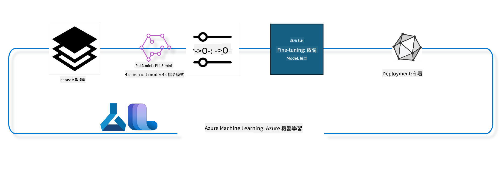

<!--
CO_OP_TRANSLATOR_METADATA:
{
  "original_hash": "944949f040e61b2ea25b3460f7394fd4",
  "translation_date": "2025-05-08T05:06:34+00:00",
  "source_file": "md/03.FineTuning/FineTuning_MLSDK.md",
  "language_code": "hk"
}
-->
## 點樣用 Azure ML system registry 嘅 chat-completion component 去微調模型

呢個例子會示範點樣用 ultrachat_200k dataset 去微調 Phi-3-mini-4k-instruct 模型，完成兩個人之間嘅對話。



呢個例子會教你點用 Azure ML SDK 同 Python 去做微調，然後將微調後嘅模型部署到線上端點，實時推理。

### 訓練數據

我哋會用 ultrachat_200k dataset。呢個係 UltraChat dataset 嘅深度過濾版本，用嚟訓練 Zephyr-7B-β，一個頂尖嘅 7b 聊天模型。

### 模型

我哋會用 Phi-3-mini-4k-instruct 模型，示範用戶點樣微調模型做 chat-completion 嘅任務。如果你係由特定模型卡開呢個 notebook，記得換返你嘅模型名。

### 任務

- 揀一個模型去微調。
- 揀同探索訓練數據。
- 配置微調工作。
- 執行微調工作。
- 檢視訓練同評估指標。
- 註冊微調後嘅模型。
- 部署微調後嘅模型做實時推理。
- 清理資源。

## 1. 設定先決條件

- 安裝依賴套件
- 連接 AzureML Workspace。詳情請參考 set up SDK authentication。下面要替換 <WORKSPACE_NAME>、<RESOURCE_GROUP> 同 <SUBSCRIPTION_ID>。
- 連接 azureml system registry
- 設定一個可選嘅實驗名稱
- 檢查或建立計算資源。

> [!NOTE]
> 要求係一個 GPU 節點可以有多張 GPU 卡。例如 Standard_NC24rs_v3 節點有 4 張 NVIDIA V100 GPU，而 Standard_NC12s_v3 有 2 張 NVIDIA V100 GPU。相關資料請參考文件。每個節點嘅 GPU 卡數量係由下面嘅參數 gpus_per_node 設定。正確設定呢個數值可以確保用晒節點所有 GPU。建議嘅 GPU 計算 SKU 可以喺呢度同呢度搵到。

### Python 函式庫

執行下面嘅 cell 安裝依賴。呢個步驟喺新環境入面唔係可選。

```bash
pip install azure-ai-ml
pip install azure-identity
pip install datasets==2.9.0
pip install mlflow
pip install azureml-mlflow
```

### 同 Azure ML 互動

1. 呢個 Python 腳本用嚟同 Azure Machine Learning (Azure ML) 服務互動。以下係佢嘅功能概述：

    - 從 azure.ai.ml、azure.identity 同 azure.ai.ml.entities 套件引入所需模組，亦引入 time 模組。

    - 嘗試用 DefaultAzureCredential() 進行認證，呢個方法簡化認證流程，方便喺 Azure 雲端快速開發應用。如果失敗，會退回用 InteractiveBrowserCredential()，提供互動式登入提示。

    - 然後嘗試用 from_config 方法建立 MLClient 實例，從預設配置檔 (config.json) 讀取設定。如果失敗，會手動提供 subscription_id、resource_group_name 同 workspace_name 建立 MLClient。

    - 再建立一個 MLClient 實例，針對名為 "azureml" 嘅 Azure ML registry，呢個 registry 用嚟儲存模型、微調流水線同環境。

    - 設定 experiment_name 為 "chat_completion_Phi-3-mini-4k-instruct"。

    - 產生一個獨特嘅時間戳，透過將當前時間（自 epoch 起嘅秒數，浮點數）轉成整數再轉成字串。呢個時間戳可用嚟創造唯一嘅名稱同版本。

    ```python
    # Import necessary modules from Azure ML and Azure Identity
    from azure.ai.ml import MLClient
    from azure.identity import (
        DefaultAzureCredential,
        InteractiveBrowserCredential,
    )
    from azure.ai.ml.entities import AmlCompute
    import time  # Import time module
    
    # Try to authenticate using DefaultAzureCredential
    try:
        credential = DefaultAzureCredential()
        credential.get_token("https://management.azure.com/.default")
    except Exception as ex:  # If DefaultAzureCredential fails, use InteractiveBrowserCredential
        credential = InteractiveBrowserCredential()
    
    # Try to create an MLClient instance using the default config file
    try:
        workspace_ml_client = MLClient.from_config(credential=credential)
    except:  # If that fails, create an MLClient instance by manually providing the details
        workspace_ml_client = MLClient(
            credential,
            subscription_id="<SUBSCRIPTION_ID>",
            resource_group_name="<RESOURCE_GROUP>",
            workspace_name="<WORKSPACE_NAME>",
        )
    
    # Create another MLClient instance for the Azure ML registry named "azureml"
    # This registry is where models, fine-tuning pipelines, and environments are stored
    registry_ml_client = MLClient(credential, registry_name="azureml")
    
    # Set the experiment name
    experiment_name = "chat_completion_Phi-3-mini-4k-instruct"
    
    # Generate a unique timestamp that can be used for names and versions that need to be unique
    timestamp = str(int(time.time()))
    ```

## 2. 揀一個基礎模型去微調

1. Phi-3-mini-4k-instruct 係一個 3.8B 參數嘅輕量級先進開源模型，基於 Phi-2 嘅數據集建構。呢個模型屬於 Phi-3 系列，Mini 版本有兩個變體 4K 同 128K，代表佢支援嘅上下文長度（token 數）。我哋需要微調模型，先可以用喺我哋嘅具體用途。你可以喺 AzureML Studio 嘅 Model Catalog 入面瀏覽呢啲模型，用 chat-completion 任務做篩選。呢個例子用嘅係 Phi-3-mini-4k-instruct。如果你係用其他模型開呢個 notebook，記得換返模型名同版本。

    > [!NOTE]
    > 呢個係模型嘅 id 屬性，會用作微調工作嘅輸入。喺 AzureML Studio Model Catalog 嘅模型詳情頁面都有呢個 Asset ID 欄位。

2. 呢個 Python 腳本用嚟同 Azure Machine Learning (Azure ML) 服務互動。以下係佢嘅功能概述：

    - 設定 model_name 為 "Phi-3-mini-4k-instruct"。

    - 用 registry_ml_client 物件嘅 models 屬性嘅 get 方法，從 Azure ML registry 取得指定名稱嘅模型最新版本。get 方法有兩個參數：模型名同標籤，標籤指定要攞最新版本。

    - 喺控制台打印一條訊息，顯示將用嚟微調嘅模型名稱、版本同 id。用 format 方法將 foundation_model 物件嘅 name、version 同 id 屬性插入訊息。

    ```python
    # Set the model name
    model_name = "Phi-3-mini-4k-instruct"
    
    # Get the latest version of the model from the Azure ML registry
    foundation_model = registry_ml_client.models.get(model_name, label="latest")
    
    # Print the model name, version, and id
    # This information is useful for tracking and debugging
    print(
        "\n\nUsing model name: {0}, version: {1}, id: {2} for fine tuning".format(
            foundation_model.name, foundation_model.version, foundation_model.id
        )
    )
    ```

## 3. 建立用於工作嘅計算資源

微調工作只支援 GPU 計算資源。計算資源嘅大小視乎模型大小，好多時難以識別適合嘅計算資源。呢個 cell 會指引用戶揀啱嘅計算資源。

> [!NOTE]
> 以下列出嘅計算資源都係用最優化配置。任何配置改動可能會導致 Cuda Out Of Memory 錯誤。遇到呢啲情況，試下升級計算資源到更大規格。

> [!NOTE]
> 揀 compute_cluster_size 時，記住確保計算資源喺你嘅資源組可用。如果冇，記得申請取得計算資源權限。

### 檢查模型支援微調嘅計算資源

1. 呢個 Python 腳本用嚟同 Azure Machine Learning (Azure ML) 模型互動。以下係佢嘅功能概述：

    - 引入 ast 模組，提供處理 Python 抽象語法樹嘅功能。

    - 檢查 foundation_model 物件（代表 Azure ML 嘅模型）有冇叫 finetune_compute_allow_list 嘅 tag。Azure ML 嘅 tag 係 key-value 配對，可以用嚟篩選同排序模型。

    - 如果有 finetune_compute_allow_list tag，就用 ast.literal_eval 安全解析 tag 嘅字串值成 Python list，並賦值畀 computes_allow_list。然後打印訊息話要喺呢個列表中建立計算資源。

    - 如果冇呢個 tag，就設 computes_allow_list 為 None，並打印訊息話模型冇呢個 tag。

    - 總結：呢個腳本係檢查模型 metadata 入面有冇指定 tag，將值轉成列表（如果有），並回饋用戶。

    ```python
    # Import the ast module, which provides functions to process trees of the Python abstract syntax grammar
    import ast
    
    # Check if the 'finetune_compute_allow_list' tag is present in the model's tags
    if "finetune_compute_allow_list" in foundation_model.tags:
        # If the tag is present, use ast.literal_eval to safely parse the tag's value (a string) into a Python list
        computes_allow_list = ast.literal_eval(
            foundation_model.tags["finetune_compute_allow_list"]
        )  # convert string to python list
        # Print a message indicating that a compute should be created from the list
        print(f"Please create a compute from the above list - {computes_allow_list}")
    else:
        # If the tag is not present, set computes_allow_list to None
        computes_allow_list = None
        # Print a message indicating that the 'finetune_compute_allow_list' tag is not part of the model's tags
        print("`finetune_compute_allow_list` is not part of model tags")
    ```

### 檢查計算資源實例

1. 呢個 Python 腳本用嚟同 Azure Machine Learning (Azure ML) 服務互動，並對計算資源實例做多項檢查。以下係佢嘅功能概述：

    - 嘗試喺 Azure ML workspace 搵名為 compute_cluster 嘅計算資源實例。如果呢個實例嘅 provisioning state 係 "failed"，就會拋出 ValueError。

    - 如果 computes_allow_list 唔係 None，將列表中所有計算資源大小轉成小寫，檢查目前計算資源大小係唔係喺列表入面。唔係就拋出 ValueError。

    - 如果 computes_allow_list 係 None，就檢查計算資源大小係唔係喺唔支援嘅 GPU VM size 列表入面。如果係，就拋出 ValueError。

    - 取得 workspace 中所有可用嘅計算資源大小，遍歷呢個列表，搵同目前計算資源大小相符嘅，然後取得該計算資源嘅 GPU 數量，並設 gpu_count_found 為 True。

    - 如果 gpu_count_found 係 True，就打印計算資源嘅 GPU 數量；如果唔係，就拋出 ValueError。

    - 總結：呢個腳本對 Azure ML workspace 入面嘅計算資源實例做多重檢查，包括 provisioning 狀態、大小係唔係允許列表或拒絕列表、同 GPU 數量。

    ```python
    # Print the exception message
    print(e)
    # Raise a ValueError if the compute size is not available in the workspace
    raise ValueError(
        f"WARNING! Compute size {compute_cluster_size} not available in workspace"
    )
    
    # Retrieve the compute instance from the Azure ML workspace
    compute = workspace_ml_client.compute.get(compute_cluster)
    # Check if the provisioning state of the compute instance is "failed"
    if compute.provisioning_state.lower() == "failed":
        # Raise a ValueError if the provisioning state is "failed"
        raise ValueError(
            f"Provisioning failed, Compute '{compute_cluster}' is in failed state. "
            f"please try creating a different compute"
        )
    
    # Check if computes_allow_list is not None
    if computes_allow_list is not None:
        # Convert all compute sizes in computes_allow_list to lowercase
        computes_allow_list_lower_case = [x.lower() for x in computes_allow_list]
        # Check if the size of the compute instance is in computes_allow_list_lower_case
        if compute.size.lower() not in computes_allow_list_lower_case:
            # Raise a ValueError if the size of the compute instance is not in computes_allow_list_lower_case
            raise ValueError(
                f"VM size {compute.size} is not in the allow-listed computes for finetuning"
            )
    else:
        # Define a list of unsupported GPU VM sizes
        unsupported_gpu_vm_list = [
            "standard_nc6",
            "standard_nc12",
            "standard_nc24",
            "standard_nc24r",
        ]
        # Check if the size of the compute instance is in unsupported_gpu_vm_list
        if compute.size.lower() in unsupported_gpu_vm_list:
            # Raise a ValueError if the size of the compute instance is in unsupported_gpu_vm_list
            raise ValueError(
                f"VM size {compute.size} is currently not supported for finetuning"
            )
    
    # Initialize a flag to check if the number of GPUs in the compute instance has been found
    gpu_count_found = False
    # Retrieve a list of all available compute sizes in the workspace
    workspace_compute_sku_list = workspace_ml_client.compute.list_sizes()
    available_sku_sizes = []
    # Iterate over the list of available compute sizes
    for compute_sku in workspace_compute_sku_list:
        available_sku_sizes.append(compute_sku.name)
        # Check if the name of the compute size matches the size of the compute instance
        if compute_sku.name.lower() == compute.size.lower():
            # If it does, retrieve the number of GPUs for that compute size and set gpu_count_found to True
            gpus_per_node = compute_sku.gpus
            gpu_count_found = True
    # If gpu_count_found is True, print the number of GPUs in the compute instance
    if gpu_count_found:
        print(f"Number of GPU's in compute {compute.size}: {gpus_per_node}")
    else:
        # If gpu_count_found is False, raise a ValueError
        raise ValueError(
            f"Number of GPU's in compute {compute.size} not found. Available skus are: {available_sku_sizes}."
            f"This should not happen. Please check the selected compute cluster: {compute_cluster} and try again."
        )
    ```

## 4. 揀微調模型用嘅數據集

1. 我哋用 ultrachat_200k dataset。呢個數據集有四個拆分，適合做監督式微調 (sft)。Generation ranking (gen)。每個拆分嘅示例數如下：

    ```bash
    train_sft test_sft  train_gen  test_gen
    207865  23110  256032  28304
    ```

1. 接落嚟嘅幾個 cell 示範微調嘅基本數據準備：

### 視覺化部分數據列

我哋想令呢個範例快啲跑，所以會儲存 train_sft、test_sft 文件，只包含已裁剪行數嘅 5%。即係話微調後嘅模型準確度會較低，唔建議用喺真實世界。

download-dataset.py 用嚟下載 ultrachat_200k dataset，同將數據轉成微調流水線組件可用格式。由於數據集好大，呢度只用咗部分數據。

1. 執行下面嘅腳本只會下載 5% 嘅數據。你可以透過改 dataset_split_pc 參數去調整百分比。

    > [!NOTE]
    > 有啲語言模型用唔同語言代碼，數據集入面嘅欄位名應該反映呢啲差異。

1. 呢度係數據應該係點嘅範例
chat-completion 數據集用 parquet 格式儲存，每條目用以下結構：

    - 呢個係 JSON（JavaScript 物件表示法）文件，一種流行嘅數據交換格式。唔係可執行代碼，而係用嚟存儲同傳輸數據。結構如下：

    - "prompt": 呢個 key 存住一條字串，代表交畀 AI 助手嘅任務或問題。

    - "messages": 呢個 key 存住一個物件陣列。每個物件代表用戶同 AI 助手之間嘅一段對話。每條消息物件有兩個 key：

    - "content": 消息內容嘅字串。
    - "role": 發送消息嘅角色，可能係 "user" 或 "assistant"。
    - "prompt_id": 唯一標識呢個 prompt 嘅字串。

1. 呢份 JSON 文件入面，對話係用嚟描述用戶叫 AI 助手創作一個反烏托邦故事嘅主角。助手回應後，用戶再問多啲細節。助手同意提供更多資料。整段對話同一個特定嘅 prompt id 相關聯。

    ```python
    {
        // The task or question posed to an AI assistant
        "prompt": "Create a fully-developed protagonist who is challenged to survive within a dystopian society under the rule of a tyrant. ...",
        
        // An array of objects, each representing a message in a conversation between a user and an AI assistant
        "messages":[
            {
                // The content of the user's message
                "content": "Create a fully-developed protagonist who is challenged to survive within a dystopian society under the rule of a tyrant. ...",
                // The role of the entity that sent the message
                "role": "user"
            },
            {
                // The content of the assistant's message
                "content": "Name: Ava\n\n Ava was just 16 years old when the world as she knew it came crashing down. The government had collapsed, leaving behind a chaotic and lawless society. ...",
                // The role of the entity that sent the message
                "role": "assistant"
            },
            {
                // The content of the user's message
                "content": "Wow, Ava's story is so intense and inspiring! Can you provide me with more details.  ...",
                // The role of the entity that sent the message
                "role": "user"
            }, 
            {
                // The content of the assistant's message
                "content": "Certainly! ....",
                // The role of the entity that sent the message
                "role": "assistant"
            }
        ],
        
        // A unique identifier for the prompt
        "prompt_id": "d938b65dfe31f05f80eb8572964c6673eddbd68eff3db6bd234d7f1e3b86c2af"
    }
    ```

### 下載數據

1. 呢個 Python 腳本用嚟用一個叫 download-dataset.py 嘅輔助腳本下載數據集。功能概述：

    - 引入 os 模組，提供跨平台操作系統功能。

    - 用 os.system 喺 shell 執行 download-dataset.py，指定下載 HuggingFaceH4/ultrachat_200k 數據集，下載到 ultrachat_200k_dataset 目錄，並設置拆分百分比為 5。os.system 返回執行狀態，存喺 exit_status。

    - 檢查 exit_status 唔係 0，表示執行失敗，會拋出 Exception，提示下載數據集出錯。

    - 總結：腳本係用輔助腳本下載數據集，失敗時會拋錯。

    ```python
    # Import the os module, which provides a way of using operating system dependent functionality
    import os
    
    # Use the os.system function to run the download-dataset.py script in the shell with specific command-line arguments
    # The arguments specify the dataset to download (HuggingFaceH4/ultrachat_200k), the directory to download it to (ultrachat_200k_dataset), and the percentage of the dataset to split (5)
    # The os.system function returns the exit status of the command it executed; this status is stored in the exit_status variable
    exit_status = os.system(
        "python ./download-dataset.py --dataset HuggingFaceH4/ultrachat_200k --download_dir ultrachat_200k_dataset --dataset_split_pc 5"
    )
    
    # Check if exit_status is not 0
    # In Unix-like operating systems, an exit status of 0 usually indicates that a command has succeeded, while any other number indicates an error
    # If exit_status is not 0, raise an Exception with a message indicating that there was an error downloading the dataset
    if exit_status != 0:
        raise Exception("Error downloading dataset")
    ```

### 將數據載入 DataFrame

1. 呢個 Python 腳本用嚟將 JSON Lines 格式嘅文件載入 pandas DataFrame，並顯示前 5 行。功能概述：

    - 引入 pandas 庫，一個強大嘅數據處理同分析工具。

    - 設定 pandas 顯示選項，最大欄寬為 0，代表顯示欄位全部文字唔截斷。

    - 用 pd.read_json 讀入 ultrachat_200k_dataset 目錄下嘅 train_sft.jsonl 文件，lines=True 表示 JSON Lines 格式，每行係獨立 JSON 物件。

    - 用 head 方法顯示前 5 行，少於 5 行就顯示全部。

    - 總結：腳本將 JSON Lines 文件讀入 DataFrame，並完整顯示前 5 行欄位文字。

    ```python
    # Import the pandas library, which is a powerful data manipulation and analysis library
    import pandas as pd
    
    # Set the maximum column width for pandas' display options to 0
    # This means that the full text of each column will be displayed without truncation when the DataFrame is printed
    pd.set_option("display.max_colwidth", 0)
    
    # Use the pd.read_json function to load the train_sft.jsonl file from the ultrachat_200k_dataset directory into a DataFrame
    # The lines=True argument indicates that the file is in JSON Lines format, where each line is a separate JSON object
    df = pd.read_json("./ultrachat_200k_dataset/train_sft.jsonl", lines=True)
    
    # Use the head method to display the first 5 rows of the DataFrame
    # If the DataFrame has less than 5 rows, it will display all of them
    df.head()
    ```

## 5. 用模型同數據作為輸入提交微調工作

建立一個用 chat-completion pipeline component 嘅工作。了解微調支持嘅所有參數。

### 定義微調參數

1. 微調參數可分兩大類 — 訓練參數同優化參數

1. 訓練參數定義訓練方面，例如：

    - 用邊個 optimizer、scheduler
    - 用邊個指標去優化微調
    - 訓練步數同批量大小等
    - 優化參數有助優化 GPU 記憶體同有效利用計算資源。

1. 以下係屬於優化參數嘅部分。優化參數因模型而異，會包裝喺模型內以處理差異。

    - 啟用 deepspeed 同 LoRA
    - 啟用混合精度訓練
    - 啟用多節點訓練

> [!NOTE]
> 監督式微調可能導致對齊喪失或嚴重遺忘。建議微調後檢查呢個問題，並執行對齊階段。

### 微調參數

1. 呢個 Python 腳本用嚟設定微調機器學習模型嘅參數。功能概述：

    - 設定預設訓練參數，如訓練 epoch 數、訓練同評估批量大小、學習率、學習率調度器類型。

    - 設定預設優化參數，例如是否啟用 LoRa、DeepSpeed 同 DeepSpeed 階段。

    - 將訓練參數同優化參數合併成一個字典 finetune_parameters。

    - 檢查 foundation_model 有冇模型特定嘅預設參數。如果有，打印警告訊息，並用 ast.literal_eval 將字串轉成 Python 字典，更新 finetune_parameters。

    - 打印最終微調參數集合。

    - 總結：腳本設定並顯示微調參數，並可以用模型特定參數覆蓋預設值。

    ```python
    # Set up default training parameters such as the number of training epochs, batch sizes for training and evaluation, learning rate, and learning rate scheduler type
    training_parameters = dict(
        num_train_epochs=3,
        per_device_train_batch_size=1,
        per_device_eval_batch_size=1,
        learning_rate=5e-6,
        lr_scheduler_type="cosine",
    )
    
    # Set up default optimization parameters such as whether to apply Layer-wise Relevance Propagation (LoRa) and DeepSpeed, and the DeepSpeed stage
    optimization_parameters = dict(
        apply_lora="true",
        apply_deepspeed="true",
        deepspeed_stage=2,
    )
    
    # Combine the training and optimization parameters into a single dictionary called finetune_parameters
    finetune_parameters = {**training_parameters, **optimization_parameters}
    
    # Check if the foundation_model has any model-specific default parameters
    # If it does, print a warning message and update the finetune_parameters dictionary with these model-specific defaults
    # The ast.literal_eval function is used to convert the model-specific defaults from a string to a Python dictionary
    if "model_specific_defaults" in foundation_model.tags:
        print("Warning! Model specific defaults exist. The defaults could be overridden.")
        finetune_parameters.update(
            ast.literal_eval(  # convert string to python dict
                foundation_model.tags["model_specific_defaults"]
            )
        )
    
    # Print the final set of fine-tuning parameters that will be used for the run
    print(
        f"The following finetune parameters are going to be set for the run: {finetune_parameters}"
    )
    ```

### 訓練流水線

1. 呢個 Python 腳本定義咗一個函數，用嚟生成機器學習訓練流水線嘅顯示名稱，然後調用該函數生成同打印顯示名稱。功能概述：

    1. 定義 get_pipeline_display_name 函數，根據訓練流水線相關嘅多個參數生成顯示名稱。

    1. 函數內計算總批量大小，方法係將每設備批量大小、梯度累積步數、每節點 GPU 數量同微調節點數相乘。

    1. 取得其他參數，如學習率調度器類型、有冇用 DeepSpeed、DeepSpeed 階段、有冇用 LoRa、保留模型檢查點數量限制、最大序列長度。

    1. 組合一條字串，包括以上所有參數，以連字符分隔。如果有用 DeepSpeed 或 LoRa，字串會包含 "ds" 加上 DeepSpeed 階段，或 "lora"；冇用就會包含 "nods" 或 "nolora"。

    1. 函數返回呢條字串，作為訓練流水線嘅顯示名稱。

    1. 定義完函數後，調用佢生成顯示名稱，並打印出嚟。

    1. 總結：腳本用嚟生成機器學習訓練流水線
training pipeline 根據不同參數設定，然後打印呢個顯示名稱。```python
    # Define a function to generate a display name for the training pipeline
    def get_pipeline_display_name():
        # Calculate the total batch size by multiplying the per-device batch size, the number of gradient accumulation steps, the number of GPUs per node, and the number of nodes used for fine-tuning
        batch_size = (
            int(finetune_parameters.get("per_device_train_batch_size", 1))
            * int(finetune_parameters.get("gradient_accumulation_steps", 1))
            * int(gpus_per_node)
            * int(finetune_parameters.get("num_nodes_finetune", 1))
        )
        # Retrieve the learning rate scheduler type
        scheduler = finetune_parameters.get("lr_scheduler_type", "linear")
        # Retrieve whether DeepSpeed is applied
        deepspeed = finetune_parameters.get("apply_deepspeed", "false")
        # Retrieve the DeepSpeed stage
        ds_stage = finetune_parameters.get("deepspeed_stage", "2")
        # If DeepSpeed is applied, include "ds" followed by the DeepSpeed stage in the display name; if not, include "nods"
        if deepspeed == "true":
            ds_string = f"ds{ds_stage}"
        else:
            ds_string = "nods"
        # Retrieve whether Layer-wise Relevance Propagation (LoRa) is applied
        lora = finetune_parameters.get("apply_lora", "false")
        # If LoRa is applied, include "lora" in the display name; if not, include "nolora"
        if lora == "true":
            lora_string = "lora"
        else:
            lora_string = "nolora"
        # Retrieve the limit on the number of model checkpoints to keep
        save_limit = finetune_parameters.get("save_total_limit", -1)
        # Retrieve the maximum sequence length
        seq_len = finetune_parameters.get("max_seq_length", -1)
        # Construct the display name by concatenating all these parameters, separated by hyphens
        return (
            model_name
            + "-"
            + "ultrachat"
            + "-"
            + f"bs{batch_size}"
            + "-"
            + f"{scheduler}"
            + "-"
            + ds_string
            + "-"
            + lora_string
            + f"-save_limit{save_limit}"
            + f"-seqlen{seq_len}"
        )
    
    # Call the function to generate the display name
    pipeline_display_name = get_pipeline_display_name()
    # Print the display name
    print(f"Display name used for the run: {pipeline_display_name}")
    ```

### 配置 Pipeline

呢個 Python 腳本用 Azure Machine Learning SDK 定義同配置一個機器學習 pipeline。內容大致如下：

1. 從 Azure AI ML SDK 匯入所需模組。
2. 從 registry 拿取一個叫做 "chat_completion_pipeline" 嘅 pipeline component。
3. 用 `@pipeline` decorator and the function `create_pipeline`. The name of the pipeline is set to `pipeline_display_name`.

1. Inside the `create_pipeline` function, it initializes the fetched pipeline component with various parameters, including the model path, compute clusters for different stages, dataset splits for training and testing, the number of GPUs to use for fine-tuning, and other fine-tuning parameters.

1. It maps the output of the fine-tuning job to the output of the pipeline job. This is done so that the fine-tuned model can be easily registered, which is required to deploy the model to an online or batch endpoint.

1. It creates an instance of the pipeline by calling the `create_pipeline` function.

1. It sets the `force_rerun` setting of the pipeline to `True`, meaning that cached results from previous jobs will not be used.

1. It sets the `continue_on_step_failure` setting of the pipeline to `False` 定義一個 pipeline job，即係如果任何步驟失敗，pipeline 就會停止。
4. 總結嚟講，呢個腳本係用 Azure Machine Learning SDK 定義同配置一個用於 chat completion 任務嘅機器學習 pipeline。

```python
    # Import necessary modules from the Azure AI ML SDK
    from azure.ai.ml.dsl import pipeline
    from azure.ai.ml import Input
    
    # Fetch the pipeline component named "chat_completion_pipeline" from the registry
    pipeline_component_func = registry_ml_client.components.get(
        name="chat_completion_pipeline", label="latest"
    )
    
    # Define the pipeline job using the @pipeline decorator and the function create_pipeline
    # The name of the pipeline is set to pipeline_display_name
    @pipeline(name=pipeline_display_name)
    def create_pipeline():
        # Initialize the fetched pipeline component with various parameters
        # These include the model path, compute clusters for different stages, dataset splits for training and testing, the number of GPUs to use for fine-tuning, and other fine-tuning parameters
        chat_completion_pipeline = pipeline_component_func(
            mlflow_model_path=foundation_model.id,
            compute_model_import=compute_cluster,
            compute_preprocess=compute_cluster,
            compute_finetune=compute_cluster,
            compute_model_evaluation=compute_cluster,
            # Map the dataset splits to parameters
            train_file_path=Input(
                type="uri_file", path="./ultrachat_200k_dataset/train_sft.jsonl"
            ),
            test_file_path=Input(
                type="uri_file", path="./ultrachat_200k_dataset/test_sft.jsonl"
            ),
            # Training settings
            number_of_gpu_to_use_finetuning=gpus_per_node,  # Set to the number of GPUs available in the compute
            **finetune_parameters
        )
        return {
            # Map the output of the fine tuning job to the output of pipeline job
            # This is done so that we can easily register the fine tuned model
            # Registering the model is required to deploy the model to an online or batch endpoint
            "trained_model": chat_completion_pipeline.outputs.mlflow_model_folder
        }
    
    # Create an instance of the pipeline by calling the create_pipeline function
    pipeline_object = create_pipeline()
    
    # Don't use cached results from previous jobs
    pipeline_object.settings.force_rerun = True
    
    # Set continue on step failure to False
    # This means that the pipeline will stop if any step fails
    pipeline_object.settings.continue_on_step_failure = False
    ```

### 提交工作

1. 呢個 Python 腳本係向 Azure Machine Learning workspace 提交一個機器學習 pipeline 工作，然後等待工作完成。內容大致如下：

- 用 workspace_ml_client 裡 jobs 嘅 create_or_update 方法提交 pipeline 工作。要執行嘅 pipeline 由 pipeline_object 指定，工作所屬嘅實驗由 experiment_name 指定。
- 用 workspace_ml_client 裡 jobs 嘅 stream 方法等待 pipeline 工作完成。要等待嘅工作係 pipeline_job 嘅 name 屬性指定。
- 總結嚟講，呢個腳本係提交一個機器學習 pipeline 工作到 Azure Machine Learning workspace，然後等待工作完成。

```python
    # Submit the pipeline job to the Azure Machine Learning workspace
    # The pipeline to be run is specified by pipeline_object
    # The experiment under which the job is run is specified by experiment_name
    pipeline_job = workspace_ml_client.jobs.create_or_update(
        pipeline_object, experiment_name=experiment_name
    )
    
    # Wait for the pipeline job to complete
    # The job to wait for is specified by the name attribute of the pipeline_job object
    workspace_ml_client.jobs.stream(pipeline_job.name)
    ```

## 6. 喺 workspace 登記微調後嘅模型

我哋會從微調工作嘅輸出登記模型，咁樣可以追蹤微調模型同微調工作之間嘅關係。微調工作亦會追蹤基礎模型、數據同訓練代碼嘅關係。

### 登記 ML 模型

1. 呢個 Python 腳本係登記一個喺 Azure Machine Learning pipeline 裡訓練出嚟嘅機器學習模型。內容大致如下：

- 從 Azure AI ML SDK 匯入所需模組。
- 透過 workspace_ml_client 裡 jobs 嘅 get 方法，檢查 pipeline 工作嘅輸出 outputs 屬性中有冇 trained_model。
- 用 pipeline 工作名同輸出名稱 ("trained_model") 格式化一個模型路徑。
- 定義微調後模型嘅名稱，喺原模型名後加 "-ultrachat-200k"，並將所有斜線換成連字符。
- 用各種參數建立一個 Model 物件，包括模型路徑、模型類型（MLflow 模型）、模型名稱同版本、同模型描述。
- 用 workspace_ml_client 裡 models 嘅 create_or_update 方法登記模型，傳入 Model 物件。
- 打印已登記嘅模型。

1. 總結嚟講，呢個腳本係登記一個喺 Azure Machine Learning pipeline 裡訓練嘅機器學習模型。

```python
    # Import necessary modules from the Azure AI ML SDK
    from azure.ai.ml.entities import Model
    from azure.ai.ml.constants import AssetTypes
    
    # Check if the `trained_model` output is available from the pipeline job
    print("pipeline job outputs: ", workspace_ml_client.jobs.get(pipeline_job.name).outputs)
    
    # Construct a path to the trained model by formatting a string with the name of the pipeline job and the name of the output ("trained_model")
    model_path_from_job = "azureml://jobs/{0}/outputs/{1}".format(
        pipeline_job.name, "trained_model"
    )
    
    # Define a name for the fine-tuned model by appending "-ultrachat-200k" to the original model name and replacing any slashes with hyphens
    finetuned_model_name = model_name + "-ultrachat-200k"
    finetuned_model_name = finetuned_model_name.replace("/", "-")
    
    print("path to register model: ", model_path_from_job)
    
    # Prepare to register the model by creating a Model object with various parameters
    # These include the path to the model, the type of the model (MLflow model), the name and version of the model, and a description of the model
    prepare_to_register_model = Model(
        path=model_path_from_job,
        type=AssetTypes.MLFLOW_MODEL,
        name=finetuned_model_name,
        version=timestamp,  # Use timestamp as version to avoid version conflict
        description=model_name + " fine tuned model for ultrachat 200k chat-completion",
    )
    
    print("prepare to register model: \n", prepare_to_register_model)
    
    # Register the model by calling the create_or_update method of the models object in the workspace_ml_client with the Model object as the argument
    registered_model = workspace_ml_client.models.create_or_update(
        prepare_to_register_model
    )
    
    # Print the registered model
    print("registered model: \n", registered_model)
    ```

## 7. 部署微調後模型到線上 endpoint

線上 endpoint 提供持久嘅 REST API，可以用嚟同需要用模型嘅應用程式整合。

### 管理 Endpoint

1. 呢個 Python 腳本係喺 Azure Machine Learning 創建一個受管理嘅線上 endpoint，用於已登記嘅模型。內容大致如下：

- 從 Azure AI ML SDK 匯入所需模組。
- 透過加上時間戳記喺 "ultrachat-completion-" 字串後面，定義一個獨特嘅線上 endpoint 名稱。
- 用多個參數建立一個 ManagedOnlineEndpoint 物件，包括 endpoint 名稱、描述同認證模式 ("key")。
- 用 workspace_ml_client 嘅 begin_create_or_update 方法創建線上 endpoint，傳入 ManagedOnlineEndpoint 物件，然後用 wait 方法等創建完成。

1. 總結嚟講，呢個腳本係喺 Azure Machine Learning 創建一個受管理嘅線上 endpoint 用於已登記嘅模型。

```python
    # Import necessary modules from the Azure AI ML SDK
    from azure.ai.ml.entities import (
        ManagedOnlineEndpoint,
        ManagedOnlineDeployment,
        ProbeSettings,
        OnlineRequestSettings,
    )
    
    # Define a unique name for the online endpoint by appending a timestamp to the string "ultrachat-completion-"
    online_endpoint_name = "ultrachat-completion-" + timestamp
    
    # Prepare to create the online endpoint by creating a ManagedOnlineEndpoint object with various parameters
    # These include the name of the endpoint, a description of the endpoint, and the authentication mode ("key")
    endpoint = ManagedOnlineEndpoint(
        name=online_endpoint_name,
        description="Online endpoint for "
        + registered_model.name
        + ", fine tuned model for ultrachat-200k-chat-completion",
        auth_mode="key",
    )
    
    # Create the online endpoint by calling the begin_create_or_update method of the workspace_ml_client with the ManagedOnlineEndpoint object as the argument
    # Then wait for the creation operation to complete by calling the wait method
    workspace_ml_client.begin_create_or_update(endpoint).wait()
    ```

> [!NOTE]
> 呢度可以搵到支援部署嘅 SKU 清單 - [Managed online endpoints SKU list](https://learn.microsoft.com/azure/machine-learning/reference-managed-online-endpoints-vm-sku-list)

### 部署 ML 模型

1. 呢個 Python 腳本係將已登記嘅機器學習模型部署到 Azure Machine Learning 嘅受管理線上 endpoint。內容大致如下：

- 匯入 ast 模組，用嚟處理 Python 抽象語法樹。
- 設定部署實例類型為 "Standard_NC6s_v3"。
- 檢查 foundation model 裡有冇 inference_compute_allow_list 標籤。如果有，將標籤值由字串轉成 Python 列表，賦值比 inference_computes_allow_list；如果冇，就設為 None。
- 檢查指定嘅實例類型係唔係喺允許列表入面。如果唔係，就打印訊息叫用戶揀允許列表入面嘅實例類型。
- 用多個參數建立一個 ManagedOnlineDeployment 物件，包括部署名稱、endpoint 名稱、模型 ID、實例類型同數量、liveness probe 設定同請求設定，準備創建部署。
- 用 workspace_ml_client 嘅 begin_create_or_update 方法創建部署，傳入 ManagedOnlineDeployment 物件，然後用 wait 方法等創建完成。
- 將 endpoint 流量設置為 100% 指向 "demo" 部署。
- 用 workspace_ml_client 嘅 begin_create_or_update 方法更新 endpoint，傳入 endpoint 物件，然後用 result 方法等更新完成。

1. 總結嚟講，呢個腳本係將已登記嘅機器學習模型部署到 Azure Machine Learning 嘅受管理線上 endpoint。

```python
    # Import the ast module, which provides functions to process trees of the Python abstract syntax grammar
    import ast
    
    # Set the instance type for the deployment
    instance_type = "Standard_NC6s_v3"
    
    # Check if the `inference_compute_allow_list` tag is present in the foundation model
    if "inference_compute_allow_list" in foundation_model.tags:
        # If it is, convert the tag value from a string to a Python list and assign it to `inference_computes_allow_list`
        inference_computes_allow_list = ast.literal_eval(
            foundation_model.tags["inference_compute_allow_list"]
        )
        print(f"Please create a compute from the above list - {computes_allow_list}")
    else:
        # If it's not, set `inference_computes_allow_list` to `None`
        inference_computes_allow_list = None
        print("`inference_compute_allow_list` is not part of model tags")
    
    # Check if the specified instance type is in the allow list
    if (
        inference_computes_allow_list is not None
        and instance_type not in inference_computes_allow_list
    ):
        print(
            f"`instance_type` is not in the allow listed compute. Please select a value from {inference_computes_allow_list}"
        )
    
    # Prepare to create the deployment by creating a `ManagedOnlineDeployment` object with various parameters
    demo_deployment = ManagedOnlineDeployment(
        name="demo",
        endpoint_name=online_endpoint_name,
        model=registered_model.id,
        instance_type=instance_type,
        instance_count=1,
        liveness_probe=ProbeSettings(initial_delay=600),
        request_settings=OnlineRequestSettings(request_timeout_ms=90000),
    )
    
    # Create the deployment by calling the `begin_create_or_update` method of the `workspace_ml_client` with the `ManagedOnlineDeployment` object as the argument
    # Then wait for the creation operation to complete by calling the `wait` method
    workspace_ml_client.online_deployments.begin_create_or_update(demo_deployment).wait()
    
    # Set the traffic of the endpoint to direct 100% of the traffic to the "demo" deployment
    endpoint.traffic = {"demo": 100}
    
    # Update the endpoint by calling the `begin_create_or_update` method of the `workspace_ml_client` with the `endpoint` object as the argument
    # Then wait for the update operation to complete by calling the `result` method
    workspace_ml_client.begin_create_or_update(endpoint).result()
    ```

## 8. 用示範數據測試 endpoint

我哋會從測試數據集攞啲示範數據，提交到線上 endpoint 做推論，然後顯示模型預測嘅標籤同真實標籤。

### 讀取結果

1. 呢個 Python 腳本係將 JSON Lines 檔案讀入 pandas DataFrame，隨機抽取一筆樣本，然後重設索引。內容大致如下：

- 讀取 ./ultrachat_200k_dataset/test_gen.jsonl 檔案到 pandas DataFrame。用 read_json 函數並帶 lines=True 參數，因為檔案係 JSON Lines 格式，每行係一個獨立 JSON 物件。
- 從 DataFrame 隨機抽取 1 筆資料，用 sample 函數並帶 n=1 參數指定抽取筆數。
- 重設 DataFrame 索引，用 reset_index 函數並帶 drop=True 參數，捨棄原本索引並用預設整數索引取代。
- 用 head 函數顯示 DataFrame 前 2 行。但因為抽樣後只有 1 行，所以只會顯示嗰一行。

1. 總結嚟講，呢個腳本係將 JSON Lines 檔案讀入 pandas DataFrame，抽取 1 筆隨機樣本，重設索引，並顯示第一筆資料。

```python
    # Import pandas library
    import pandas as pd
    
    # Read the JSON Lines file './ultrachat_200k_dataset/test_gen.jsonl' into a pandas DataFrame
    # The 'lines=True' argument indicates that the file is in JSON Lines format, where each line is a separate JSON object
    test_df = pd.read_json("./ultrachat_200k_dataset/test_gen.jsonl", lines=True)
    
    # Take a random sample of 1 row from the DataFrame
    # The 'n=1' argument specifies the number of random rows to select
    test_df = test_df.sample(n=1)
    
    # Reset the index of the DataFrame
    # The 'drop=True' argument indicates that the original index should be dropped and replaced with a new index of default integer values
    # The 'inplace=True' argument indicates that the DataFrame should be modified in place (without creating a new object)
    test_df.reset_index(drop=True, inplace=True)
    
    # Display the first 2 rows of the DataFrame
    # However, since the DataFrame only contains one row after the sampling, this will only display that one row
    test_df.head(2)
    ```

### 建立 JSON 物件

1. 呢個 Python 腳本係建立一個帶有指定參數嘅 JSON 物件，並保存到檔案。內容大致如下：

- 匯入 json 模組，提供處理 JSON 數據嘅功能。
- 建立一個字典 parameters，鍵值對代表機器學習模型嘅參數，鍵包括 "temperature"、"top_p"、"do_sample" 同 "max_new_tokens"，對應值分別係 0.6、0.9、True 同 200。
- 建立另一個字典 test_json，有兩個鍵："input_data" 同 "params"。"input_data" 嘅值係另一個字典，包括 "input_string" 同 "parameters"。"input_string" 係一個列表，包含 test_df DataFrame 第一筆訊息；"parameters" 就係之前建立嘅 parameters 字典。"params" 係一個空字典。
- 開啟一個叫 sample_score.json 嘅檔案

```python
    # Import the json module, which provides functions to work with JSON data
    import json
    
    # Create a dictionary `parameters` with keys and values that represent parameters for a machine learning model
    # The keys are "temperature", "top_p", "do_sample", and "max_new_tokens", and their corresponding values are 0.6, 0.9, True, and 200 respectively
    parameters = {
        "temperature": 0.6,
        "top_p": 0.9,
        "do_sample": True,
        "max_new_tokens": 200,
    }
    
    # Create another dictionary `test_json` with two keys: "input_data" and "params"
    # The value of "input_data" is another dictionary with keys "input_string" and "parameters"
    # The value of "input_string" is a list containing the first message from the `test_df` DataFrame
    # The value of "parameters" is the `parameters` dictionary created earlier
    # The value of "params" is an empty dictionary
    test_json = {
        "input_data": {
            "input_string": [test_df["messages"][0]],
            "parameters": parameters,
        },
        "params": {},
    }
    
    # Open a file named `sample_score.json` in the `./ultrachat_200k_dataset` directory in write mode
    with open("./ultrachat_200k_dataset/sample_score.json", "w") as f:
        # Write the `test_json` dictionary to the file in JSON format using the `json.dump` function
        json.dump(test_json, f)
    ```

### 調用 Endpoint

1. 呢個 Python 腳本係調用 Azure Machine Learning 裡嘅線上 endpoint，對 JSON 檔案做評分。內容大致如下：

- 用 workspace_ml_client 物件嘅 online_endpoints 屬性嘅 invoke 方法，向線上 endpoint 發送請求並取得回應。
- 用 endpoint_name 同 deployment_name 參數指定 endpoint 名稱同部署名稱。呢度 endpoint 名稱係 online_endpoint_name 變數，部署名稱係 "demo"。
- 用 request_file 參數指定要評分嘅 JSON 檔案路徑，呢度係 ./ultrachat_200k_dataset/sample_score.json。
- 將 endpoint 回應存入 response 變數。
- 打印原始回應。

1. 總結嚟講，呢個腳本係調用 Azure Machine Learning 嘅線上 endpoint，對 JSON 檔案做評分，並打印回應。

```python
    # Invoke the online endpoint in Azure Machine Learning to score the `sample_score.json` file
    # The `invoke` method of the `online_endpoints` property of the `workspace_ml_client` object is used to send a request to an online endpoint and get a response
    # The `endpoint_name` argument specifies the name of the endpoint, which is stored in the `online_endpoint_name` variable
    # The `deployment_name` argument specifies the name of the deployment, which is "demo"
    # The `request_file` argument specifies the path to the JSON file to be scored, which is `./ultrachat_200k_dataset/sample_score.json`
    response = workspace_ml_client.online_endpoints.invoke(
        endpoint_name=online_endpoint_name,
        deployment_name="demo",
        request_file="./ultrachat_200k_dataset/sample_score.json",
    )
    
    # Print the raw response from the endpoint
    print("raw response: \n", response, "\n")
    ```

## 9. 刪除線上 endpoint

1. 唔好忘記刪除線上 endpoint，否則會繼續計算用量收費。呢行 Python 代碼係刪除 Azure Machine Learning 嘅線上 endpoint。內容大致如下：

- 用 workspace_ml_client 物件嘅 online_endpoints 屬性嘅 begin_delete 方法開始刪除線上 endpoint。
- 用 name 參數指定要刪除嘅 endpoint 名稱，呢度係 online_endpoint_name 變數。
- 用 wait 方法等待刪除操作完成。呢個係阻塞操作，即係話會阻止腳本繼續執行，直到刪除完成。
- 總結嚟講，呢行代碼係開始刪除 Azure Machine Learning 嘅線上 endpoint，並等待操作完成。

```python
    # Delete the online endpoint in Azure Machine Learning
    # The `begin_delete` method of the `online_endpoints` property of the `workspace_ml_client` object is used to start the deletion of an online endpoint
    # The `name` argument specifies the name of the endpoint to be deleted, which is stored in the `online_endpoint_name` variable
    # The `wait` method is called to wait for the deletion operation to complete. This is a blocking operation, meaning that it will prevent the script from continuing until the deletion is finished
    workspace_ml_client.online_endpoints.begin_delete(name=online_endpoint_name).wait()
    ```

**免責聲明**：  
本文件使用 AI 翻譯服務 [Co-op Translator](https://github.com/Azure/co-op-translator) 進行翻譯。雖然我們力求準確，但請注意自動翻譯可能包含錯誤或不準確之處。原始文件的母語版本應被視為權威來源。對於重要資訊，建議採用專業人工翻譯。我們不對因使用此翻譯而引起的任何誤解或誤釋承擔責任。