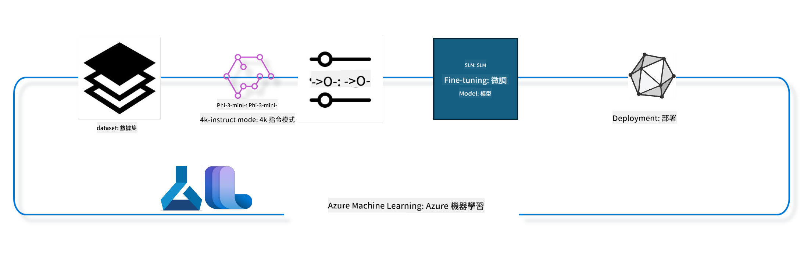

<!--
CO_OP_TRANSLATOR_METADATA:
{
  "original_hash": "ef071f0e903a1a38f8a5f8cbb253a9ca",
  "translation_date": "2025-04-04T18:56:08+00:00",
  "source_file": "md\\03.FineTuning\\FineTuning_MLSDK.md",
  "language_code": "hk"
}
-->
## 如何使用 Azure ML 系統註冊表中的聊天完成元件微調模型

在這個例子中，我們將使用 ultrachat_200k 數據集對 Phi-3-mini-4k-instruct 模型進行微調，以完成兩個人之間的對話。



該例子將展示如何使用 Azure ML SDK 和 Python 進行微調，然後將微調後的模型部署到線上端點以進行實時推斷。

### 訓練數據

我們將使用 ultrachat_200k 數據集。這是一個經過大量篩選的 UltraChat 數據集版本，曾用於訓練 Zephyr-7B-β，一個最先進的 7B 聊天模型。

### 模型

我們將使用 Phi-3-mini-4k-instruct 模型來展示用戶如何為聊天完成任務微調模型。如果您是從特定的模型卡打開此筆記本，請記得替換為具體的模型名稱。

### 任務

- 選擇要微調的模型。
- 選擇並探索訓練數據。
- 配置微調任務。
- 運行微調任務。
- 查看訓練和評估指標。
- 註冊微調後的模型。
- 部署微調後的模型進行實時推斷。
- 清理資源。

## 1. 設置前置條件

- 安裝依賴項
- 連接到 AzureML 工作區。了解更多關於 SDK 身份驗證設置的信息。替換 <WORKSPACE_NAME>, <RESOURCE_GROUP> 和 <SUBSCRIPTION_ID>。
- 連接到 AzureML 系統註冊表
- 設置可選的實驗名稱
- 檢查或創建計算資源。

> [!NOTE]
> 要求單個 GPU 節點可以有多個 GPU 卡。例如，在 Standard_NC24rs_v3 的一個節點中有 4 個 NVIDIA V100 GPU，而在 Standard_NC12s_v3 中有 2 個 NVIDIA V100 GPU。請參考文檔獲取此信息。每個節點的 GPU 卡數量在下面的 gpus_per_node 參數中設置。正確設置此值將確保充分利用節點中的所有 GPU。推薦的 GPU 計算 SKU 可以在此處和此處找到。

### Python 庫

運行下面的單元格以安裝依賴項。如果是在新環境中運行，這步驟不可省略。

```bash
pip install azure-ai-ml
pip install azure-identity
pip install datasets==2.9.0
pip install mlflow
pip install azureml-mlflow
```

### 與 Azure ML 交互

1. 此 Python 腳本用於與 Azure 機器學習 (Azure ML) 服務交互。以下是其作用的概述：

    - 它從 azure.ai.ml、azure.identity 和 azure.ai.ml.entities 包中導入必要的模塊。還導入了 time 模塊。

    - 它嘗試使用 DefaultAzureCredential() 進行身份驗證，該方法提供了一種簡化的身份驗證方式以快速開始開發在 Azure 雲中運行的應用程序。如果失敗，則回退到 InteractiveBrowserCredential()，這會提供交互式登錄提示。

    - 它嘗試使用 from_config 方法創建 MLClient 實例，該方法從默認配置文件（config.json）中讀取配置。如果失敗，則通過手動提供 subscription_id、resource_group_name 和 workspace_name 創建 MLClient 實例。

    - 它為名為 "azureml" 的 Azure ML 註冊表創建另一個 MLClient 實例。該註冊表存儲模型、微調管道和環境。

    - 它將 experiment_name 設置為 "chat_completion_Phi-3-mini-4k-instruct"。

    - 它通過將當前時間（自紀元開始以來的秒數，作為浮點數）轉換為整數，然後轉換為字符串來生成唯一的時間戳。此時間戳可用於創建唯一的名稱和版本。

    ```python
    # Import necessary modules from Azure ML and Azure Identity
    from azure.ai.ml import MLClient
    from azure.identity import (
        DefaultAzureCredential,
        InteractiveBrowserCredential,
    )
    from azure.ai.ml.entities import AmlCompute
    import time  # Import time module
    
    # Try to authenticate using DefaultAzureCredential
    try:
        credential = DefaultAzureCredential()
        credential.get_token("https://management.azure.com/.default")
    except Exception as ex:  # If DefaultAzureCredential fails, use InteractiveBrowserCredential
        credential = InteractiveBrowserCredential()
    
    # Try to create an MLClient instance using the default config file
    try:
        workspace_ml_client = MLClient.from_config(credential=credential)
    except:  # If that fails, create an MLClient instance by manually providing the details
        workspace_ml_client = MLClient(
            credential,
            subscription_id="<SUBSCRIPTION_ID>",
            resource_group_name="<RESOURCE_GROUP>",
            workspace_name="<WORKSPACE_NAME>",
        )
    
    # Create another MLClient instance for the Azure ML registry named "azureml"
    # This registry is where models, fine-tuning pipelines, and environments are stored
    registry_ml_client = MLClient(credential, registry_name="azureml")
    
    # Set the experiment name
    experiment_name = "chat_completion_Phi-3-mini-4k-instruct"
    
    # Generate a unique timestamp that can be used for names and versions that need to be unique
    timestamp = str(int(time.time()))
    ```

## 2. 選擇要微調的基礎模型

1. Phi-3-mini-4k-instruct 是一個擁有 3.8B 參數的輕量級、最先進的開放模型，基於用於 Phi-2 的數據集構建。該模型屬於 Phi-3 模型家族，而 Mini 版本有兩個變體：4K 和 128K，這是其支持的上下文長度（以 tokens 計）。我們需要根據特定目的微調模型才能使用。您可以在 AzureML Studio 的模型目錄中瀏覽這些模型，並通過聊天完成任務進行篩選。在此例子中，我們使用 Phi-3-mini-4k-instruct 模型。如果您為其他模型打開了此筆記本，請相應地替換模型名稱和版本。

    > [!NOTE]
    > 模型的 id 屬性。這將作為輸入傳遞給微調任務。在 AzureML Studio 模型目錄的模型詳細信息頁面中，這也可以作為資產 ID 字段找到。

2. 此 Python 腳本用於與 Azure 機器學習 (Azure ML) 服務交互。以下是其作用的概述：

    - 它將 model_name 設置為 "Phi-3-mini-4k-instruct"。

    - 它使用 registry_ml_client 對象的 models 屬性的 get 方法，從 Azure ML 註冊表中檢索具有指定名稱的模型的最新版本。get 方法接受兩個參數：模型名稱和標籤，指定應檢索模型的最新版本。

    - 它向控制台打印一條消息，指示將用於微調的模型的名稱、版本和 id。使用字符串的 format 方法將模型的名稱、版本和 id 插入到消息中。模型的名稱、版本和 id 作為 foundation_model 對象的屬性訪問。

    ```python
    # Set the model name
    model_name = "Phi-3-mini-4k-instruct"
    
    # Get the latest version of the model from the Azure ML registry
    foundation_model = registry_ml_client.models.get(model_name, label="latest")
    
    # Print the model name, version, and id
    # This information is useful for tracking and debugging
    print(
        "\n\nUsing model name: {0}, version: {1}, id: {2} for fine tuning".format(
            foundation_model.name, foundation_model.version, foundation_model.id
        )
    )
    ```

## 3. 創建用於任務的計算資源

微調任務僅適用於 GPU 計算資源。計算資源的大小取決於模型的大小，在大多數情況下，識別適合任務的計算資源可能會變得棘手。在此單元格中，我們指導用戶選擇適合任務的計算資源。

> [!NOTE]
> 以下列出的計算資源與最優配置配合使用。對配置的任何更改可能導致 Cuda Out Of Memory 錯誤。在這種情況下，嘗試升級計算資源到更大的尺寸。

> [!NOTE]
> 在選擇下面的 compute_cluster_size 時，請確保計算資源在您的資源組中可用。如果某個計算資源不可用，您可以提出請求以獲取該計算資源的訪問權限。

### 檢查模型的微調支持

1. 此 Python 腳本用於與 Azure 機器學習 (Azure ML) 模型交互。以下是其作用的概述：

    - 它導入 ast 模塊，該模塊提供處理 Python 抽象語法樹的函數。

    - 它檢查 foundation_model 對象（表示 Azure ML 中的模型）是否具有名為 finetune_compute_allow_list 的標籤。Azure ML 中的標籤是鍵值對，您可以創建並用於篩選和排序模型。

    - 如果存在 finetune_compute_allow_list 標籤，它使用 ast.literal_eval 函數安全地解析標籤的值（字符串）為 Python 列表。然後將該列表分配給 computes_allow_list 變量。接著打印一條消息，指示應從列表中創建計算資源。

    - 如果不存在 finetune_compute_allow_list 標籤，它將 computes_allow_list 設置為 None，並打印一條消息，指示 finetune_compute_allow_list 標籤不是模型標籤的一部分。

    - 總之，此腳本正在檢查模型元數據中的特定標籤，並在該標籤存在時將其值轉換為列表，並相應地向用戶提供反饋。

    ```python
    # Import the ast module, which provides functions to process trees of the Python abstract syntax grammar
    import ast
    
    # Check if the 'finetune_compute_allow_list' tag is present in the model's tags
    if "finetune_compute_allow_list" in foundation_model.tags:
        # If the tag is present, use ast.literal_eval to safely parse the tag's value (a string) into a Python list
        computes_allow_list = ast.literal_eval(
            foundation_model.tags["finetune_compute_allow_list"]
        )  # convert string to python list
        # Print a message indicating that a compute should be created from the list
        print(f"Please create a compute from the above list - {computes_allow_list}")
    else:
        # If the tag is not present, set computes_allow_list to None
        computes_allow_list = None
        # Print a message indicating that the 'finetune_compute_allow_list' tag is not part of the model's tags
        print("`finetune_compute_allow_list` is not part of model tags")
    ```

### 檢查計算實例

1. 此 Python 腳本用於與 Azure 機器學習 (Azure ML) 服務交互，並對計算實例進行多項檢查。以下是其作用的概述：

    - 它嘗試從 Azure ML 工作區檢索 compute_cluster 中存儲的計算實例。如果計算實例的 provision 狀態為 "failed"，則引發 ValueError。

    - 它檢查 computes_allow_list 是否不為 None。如果不為 None，則將列表中的所有計算尺寸轉換為小寫，並檢查當前計算實例的尺寸是否在列表中。如果不在，則引發 ValueError。

    - 如果 computes_allow_list 為 None，則檢查計算實例的尺寸是否在不支持的 GPU VM 尺寸列表中。如果在，則引發 ValueError。

    - 它檢索工作區中所有可用計算尺寸的列表。然後迭代該列表，對於每個計算尺寸，檢查其名稱是否與當前計算實例的尺寸匹配。如果匹配，則檢索該計算尺寸的 GPU 數量，並將 gpu_count_found 設置為 True。

    - 如果 gpu_count_found 為 True，則打印計算實例中的 GPU 數量。如果 gpu_count_found 為 False，則引發 ValueError。

    - 總之，此腳本對 Azure ML 工作區中的計算實例進行多項檢查，包括檢查其 provision 狀態、尺寸是否符合允許或禁止列表，以及其 GPU 數量。

    ```python
    # Print the exception message
    print(e)
    # Raise a ValueError if the compute size is not available in the workspace
    raise ValueError(
        f"WARNING! Compute size {compute_cluster_size} not available in workspace"
    )
    
    # Retrieve the compute instance from the Azure ML workspace
    compute = workspace_ml_client.compute.get(compute_cluster)
    # Check if the provisioning state of the compute instance is "failed"
    if compute.provisioning_state.lower() == "failed":
        # Raise a ValueError if the provisioning state is "failed"
        raise ValueError(
            f"Provisioning failed, Compute '{compute_cluster}' is in failed state. "
            f"please try creating a different compute"
        )
    
    # Check if computes_allow_list is not None
    if computes_allow_list is not None:
        # Convert all compute sizes in computes_allow_list to lowercase
        computes_allow_list_lower_case = [x.lower() for x in computes_allow_list]
        # Check if the size of the compute instance is in computes_allow_list_lower_case
        if compute.size.lower() not in computes_allow_list_lower_case:
            # Raise a ValueError if the size of the compute instance is not in computes_allow_list_lower_case
            raise ValueError(
                f"VM size {compute.size} is not in the allow-listed computes for finetuning"
            )
    else:
        # Define a list of unsupported GPU VM sizes
        unsupported_gpu_vm_list = [
            "standard_nc6",
            "standard_nc12",
            "standard_nc24",
            "standard_nc24r",
        ]
        # Check if the size of the compute instance is in unsupported_gpu_vm_list
        if compute.size.lower() in unsupported_gpu_vm_list:
            # Raise a ValueError if the size of the compute instance is in unsupported_gpu_vm_list
            raise ValueError(
                f"VM size {compute.size} is currently not supported for finetuning"
            )
    
    # Initialize a flag to check if the number of GPUs in the compute instance has been found
    gpu_count_found = False
    # Retrieve a list of all available compute sizes in the workspace
    workspace_compute_sku_list = workspace_ml_client.compute.list_sizes()
    available_sku_sizes = []
    # Iterate over the list of available compute sizes
    for compute_sku in workspace_compute_sku_list:
        available_sku_sizes.append(compute_sku.name)
        # Check if the name of the compute size matches the size of the compute instance
        if compute_sku.name.lower() == compute.size.lower():
            # If it does, retrieve the number of GPUs for that compute size and set gpu_count_found to True
            gpus_per_node = compute_sku.gpus
            gpu_count_found = True
    # If gpu_count_found is True, print the number of GPUs in the compute instance
    if gpu_count_found:
        print(f"Number of GPU's in compute {compute.size}: {gpus_per_node}")
    else:
        # If gpu_count_found is False, raise a ValueError
        raise ValueError(
            f"Number of GPU's in compute {compute.size} not found. Available skus are: {available_sku_sizes}."
            f"This should not happen. Please check the selected compute cluster: {compute_cluster} and try again."
        )
    ```

## 4. 選擇用於微調模型的數據集

1. 我們使用 ultrachat_200k 數據集。該數據集有四個分割，適合於監督微調 (sft) 和生成排名 (gen)。每個分割的示例數量如下所示：

    ```bash
    train_sft test_sft  train_gen  test_gen
    207865  23110  256032  28304
    ```

1. 接下來的幾個單元格展示了微調的基本數據準備：

### 可視化一些數據行

我們希望此示例能快速運行，因此保存包含已裁剪行 5% 的 train_sft 和 test_sft 文件。這意味著微調後的模型準確性較低，因此不應用於真實世界。

download-dataset.py 用於下載 ultrachat_200k 數據集並將數據集轉換為微調管道元件可消耗的格式。由於數據集較大，因此這裡僅包含部分數據集。

1. 運行下面的腳本僅下載 5% 的數據。可以通過更改 dataset_split_pc 參數到所需百分比來增加。

    > [!NOTE]
    > 一些語言模型有不同的語言代碼，因此數據集中的列名應反映這一點。

1. 以下是數據的示例展示方式：
聊天完成數據集以 parquet 格式存儲，每個條目使用以下架構：

    - 這是一個 JSON（JavaScript Object Notation）文檔，一種流行的數據交換格式。它不是可執行代碼，而是一種存儲和傳輸數據的方式。以下是其結構的概述：

    - "prompt"：此鍵包含一個字符串值，表示給 AI 助手的一個任務或問題。

    - "messages"：此鍵包含一個對象的數組。每個對象表示用戶和 AI 助手之間對話中的一條消息。每個消息對象有兩個鍵：

    - "content"：此鍵包含表示消息內容的字符串值。
    - "role"：此鍵包含表示發送消息的實體角色的字符串值。它可以是 "user" 或 "assistant"。
    - "prompt_id"：此鍵包含表示該提示唯一標識符的字符串值。

1. 在此特定 JSON 文檔中，對話表示為用戶要求 AI 助手創建一個反烏托邦故事的主角。助手回應後，用戶要求更多細節。助手同意提供更多細節。整個對話與特定的 prompt id 關聯。

    ```python
    {
        // The task or question posed to an AI assistant
        "prompt": "Create a fully-developed protagonist who is challenged to survive within a dystopian society under the rule of a tyrant. ...",
        
        // An array of objects, each representing a message in a conversation between a user and an AI assistant
        "messages":[
            {
                // The content of the user's message
                "content": "Create a fully-developed protagonist who is challenged to survive within a dystopian society under the rule of a tyrant. ...",
                // The role of the entity that sent the message
                "role": "user"
            },
            {
                // The content of the assistant's message
                "content": "Name: Ava\n\n Ava was just 16 years old when the world as she knew it came crashing down. The government had collapsed, leaving behind a chaotic and lawless society. ...",
                // The role of the entity that sent the message
                "role": "assistant"
            },
            {
                // The content of the user's message
                "content": "Wow, Ava's story is so intense and inspiring! Can you provide me with more details.  ...",
                // The role of the entity that sent the message
                "role": "user"
            }, 
            {
                // The content of the assistant's message
                "content": "Certainly! ....",
                // The role of the entity that sent the message
                "role": "assistant"
            }
        ],
        
        // A unique identifier for the prompt
        "prompt_id": "d938b65dfe31f05f80eb8572964c6673eddbd68eff3db6bd234d7f1e3b86c2af"
    }
    ```

### 下載數據

1. 此 Python 腳本用於使用名為 download-dataset.py 的輔助腳本下載數據集。以下是其作用的概述：

    - 它導入 os 模塊，該模塊提供操作系統相關功能的便捷方式。

    - 它使用 os.system 函數在 shell 中運行 download-dataset.py 腳本並指定命令行參數。參數指定要下載的數據集 (HuggingFaceH4/ultrachat_200k)、下載目錄 (ultrachat_200k_dataset) 和數據集的分割百分比 (5)。os.system 函數返回其執行的命令的退出狀態；此狀態存儲在 exit_status 變量中。

    - 它檢查 exit_status 是否不為 0。在類 Unix 操作系統中，退出狀態為 0 通常表示命令成功執行，而其他任何數字表示錯誤。如果 exit_status 不為 0，則引發 Exception，並顯示一條消息，指示下載數據集時出現錯誤。

    - 總之，此腳本運行命令以使用輔助腳本下載數據集，如果命令失敗則引發異常。

    ```python
    # Import the os module, which provides a way of using operating system dependent functionality
    import os
    
    # Use the os.system function to run the download-dataset.py script in the shell with specific command-line arguments
    # The arguments specify the dataset to download (HuggingFaceH4/ultrachat_200k), the directory to download it to (ultrachat_200k_dataset), and the percentage of the dataset to split (5)
    # The os.system function returns the exit status of the command it executed; this status is stored in the exit_status variable
    exit_status = os.system(
        "python ./download-dataset.py --dataset HuggingFaceH4/ultrachat_200k --download_dir ultrachat_200k_dataset --dataset_split_pc 5"
    )
    
    # Check if exit_status is not 0
    # In Unix-like operating systems, an exit status of 0 usually indicates that a command has succeeded, while any other number indicates an error
    # If exit_status is not 0, raise an Exception with a message indicating that there was an error downloading the dataset
    if exit_status != 0:
        raise Exception("Error downloading dataset")
    ```

### 將數據加載到 DataFrame

1. 此 Python 腳本將 JSON Lines 文件加載到 pandas DataFrame 中並顯示前 5 行。以下是其作用的概述：

    - 它導入 pandas 庫，該庫是一個功能強大的數據操作和分析工具。

    - 它將 pandas 的顯示選項中的最大列寬設置為 0。這意味著在打印 DataFrame 時，每列的完整文本將不被截斷。

    - 它使用 pd.read_json 函數將 ultrachat_200k_dataset 目錄中的 train_sft.jsonl 文件加載到 DataFrame 中。lines=True 參數表示該文件是 JSON Lines 格式，其中每行是一個單獨的 JSON 對象。

    - 它使用 head 方法顯示 DataFrame 的前 5 行。如果 DataFrame 的行數少於 5，則顯示所有行。

    - 總之，此腳本將 JSON Lines 文件加載到 DataFrame 中並顯示前 5 行，並且顯示完整的列文本。

    ```python
    # Import the pandas library, which is a powerful data manipulation and analysis library
    import pandas as pd
    
    # Set the maximum column width for pandas' display options to 0
    # This means that the full text of each column will be displayed without truncation when the DataFrame is printed
    pd.set_option("display.max_colwidth", 0)
    
    # Use the pd.read_json function to load the train_sft.jsonl file from the ultrachat_200k_dataset directory into a DataFrame
    # The lines=True argument indicates that the file is in JSON Lines format, where each line is a separate JSON object
    df = pd.read_json("./ultrachat_200k_dataset/train_sft.jsonl", lines=True)
    
    # Use the head method to display the first 5 rows of the DataFrame
    # If the DataFrame has less than 5 rows, it will display all of them
    df.head()
    ```

## 5. 使用模型和數據作為輸入提交微調任務

創建使用聊天完成管道元件的任務。了解更多支持微調的所有參數。

### 定義微調參數

1. 微調參數可以分為兩類——訓練參數和優化參數。

1. 訓練參數定義訓練方面，例如：

    - 要使用的優化器和調度器
    - 微調的最佳化指標
    - 訓練步驟數量、批量大小等

1. 優化參數幫助優化 GPU 記憶體並有效利用計算資源。

    - 啟用 DeepSpeed 和 LoRA
    - 啟用混合精度訓練
    - 啟用多節點訓練

> [!NOTE]
> 監督微調可能導致對齊丟失或災難性遺忘。我們建議檢查此問題並在微調後運行對齊階段。

### 微調參數

1. 此 Python 腳本設置微調機器學習模型的參數。以下是其作用的概述：

    - 它設置了默認訓練參數，例如訓練時期數量、訓練和評估的批量大小、學習率和學習率調度器類型。

    - 它設置了默認優化參數，例如是否應用 Layer-wise Relevance Propagation (LoRa) 和 DeepSpeed，以及 DeepSpeed 階段。

    - 它將訓練和優化參數組合到一個名為 finetune_parameters 的字典中。

    - 它檢查 foundation_model 是否具有任何模型特定的默認參數。如果有，它打印一條警告消息，並使用這些模型特定的默認參數更新 finetune_parameters 字典。ast.literal_eval 函數用於將模型特定的默認參數從字符串轉換為 Python 字典。

    - 它打印將用於運行的最終微調參數集。

    - 總之，此腳本設置並顯示微調機器學習模型的參數，並能夠使用模型特定的參數覆蓋默認參數。

    ```python
    # Set up default training parameters such as the number of training epochs, batch sizes for training and evaluation, learning rate, and learning rate scheduler type
    training_parameters = dict(
        num_train_epochs=3,
        per_device_train_batch_size=1,
        per_device_eval_batch_size=1,
        learning_rate=5e-6,
        lr_scheduler_type="cosine",
    )
    
    # Set up default optimization parameters such as whether to apply Layer-wise Relevance Propagation (LoRa) and DeepSpeed, and the DeepSpeed stage
    optimization_parameters = dict(
        apply_lora="true",
        apply_deepspeed="true",
        deepspeed_stage=2,
    )
    
    # Combine the training and optimization parameters into a single dictionary called finetune_parameters
    finetune_parameters = {**training_parameters, **optimization_parameters}
    
    # Check if the foundation_model has any model-specific default parameters
    # If it does, print a warning message and update the finetune_parameters dictionary with these model-specific defaults
    # The ast.literal_eval function is used to convert the model-specific defaults from a string to a Python dictionary
    if "model_specific_defaults" in foundation_model.tags:
        print("Warning! Model specific defaults exist. The defaults could be overridden.")
        finetune_parameters.update(
            ast.literal_eval(  # convert string to python dict
                foundation_model.tags["model_specific_defaults"]
            )
        )
    
    # Print the final set of fine-tuning parameters that will be used for the run
    print(
        f"The following finetune parameters are going to be set for the run: {finetune_parameters}"
    )
    ```

### 訓練管道

1. 此 Python 腳本定義了一個生成機器學習訓練管道顯示名稱
根據不同參數建立訓練管道，然後顯示它的名稱。```python
    # Define a function to generate a display name for the training pipeline
    def get_pipeline_display_name():
        # Calculate the total batch size by multiplying the per-device batch size, the number of gradient accumulation steps, the number of GPUs per node, and the number of nodes used for fine-tuning
        batch_size = (
            int(finetune_parameters.get("per_device_train_batch_size", 1))
            * int(finetune_parameters.get("gradient_accumulation_steps", 1))
            * int(gpus_per_node)
            * int(finetune_parameters.get("num_nodes_finetune", 1))
        )
        # Retrieve the learning rate scheduler type
        scheduler = finetune_parameters.get("lr_scheduler_type", "linear")
        # Retrieve whether DeepSpeed is applied
        deepspeed = finetune_parameters.get("apply_deepspeed", "false")
        # Retrieve the DeepSpeed stage
        ds_stage = finetune_parameters.get("deepspeed_stage", "2")
        # If DeepSpeed is applied, include "ds" followed by the DeepSpeed stage in the display name; if not, include "nods"
        if deepspeed == "true":
            ds_string = f"ds{ds_stage}"
        else:
            ds_string = "nods"
        # Retrieve whether Layer-wise Relevance Propagation (LoRa) is applied
        lora = finetune_parameters.get("apply_lora", "false")
        # If LoRa is applied, include "lora" in the display name; if not, include "nolora"
        if lora == "true":
            lora_string = "lora"
        else:
            lora_string = "nolora"
        # Retrieve the limit on the number of model checkpoints to keep
        save_limit = finetune_parameters.get("save_total_limit", -1)
        # Retrieve the maximum sequence length
        seq_len = finetune_parameters.get("max_seq_length", -1)
        # Construct the display name by concatenating all these parameters, separated by hyphens
        return (
            model_name
            + "-"
            + "ultrachat"
            + "-"
            + f"bs{batch_size}"
            + "-"
            + f"{scheduler}"
            + "-"
            + ds_string
            + "-"
            + lora_string
            + f"-save_limit{save_limit}"
            + f"-seqlen{seq_len}"
        )
    
    # Call the function to generate the display name
    pipeline_display_name = get_pipeline_display_name()
    # Print the display name
    print(f"Display name used for the run: {pipeline_display_name}")
    ```

### 配置管道

這段 Python 腳本使用 Azure Machine Learning SDK 定義並配置機器學習管道。以下是詳細解說：

1. 它從 Azure AI ML SDK 匯入必要模組。
2. 從註冊表中提取名為 "chat_completion_pipeline" 的管道元件。
3. 使用 `@pipeline` decorator and the function `create_pipeline`. The name of the pipeline is set to `pipeline_display_name`.

1. Inside the `create_pipeline` function, it initializes the fetched pipeline component with various parameters, including the model path, compute clusters for different stages, dataset splits for training and testing, the number of GPUs to use for fine-tuning, and other fine-tuning parameters.

1. It maps the output of the fine-tuning job to the output of the pipeline job. This is done so that the fine-tuned model can be easily registered, which is required to deploy the model to an online or batch endpoint.

1. It creates an instance of the pipeline by calling the `create_pipeline` function.

1. It sets the `force_rerun` setting of the pipeline to `True`, meaning that cached results from previous jobs will not be used.

1. It sets the `continue_on_step_failure` setting of the pipeline to `False` 定義管道作業，這意味著如果任一步驟失敗，管道將停止。
4. 總結來說，這段腳本是為聊天完成任務定義並配置機器學習管道，使用 Azure Machine Learning SDK。

```python
    # Import necessary modules from the Azure AI ML SDK
    from azure.ai.ml.dsl import pipeline
    from azure.ai.ml import Input
    
    # Fetch the pipeline component named "chat_completion_pipeline" from the registry
    pipeline_component_func = registry_ml_client.components.get(
        name="chat_completion_pipeline", label="latest"
    )
    
    # Define the pipeline job using the @pipeline decorator and the function create_pipeline
    # The name of the pipeline is set to pipeline_display_name
    @pipeline(name=pipeline_display_name)
    def create_pipeline():
        # Initialize the fetched pipeline component with various parameters
        # These include the model path, compute clusters for different stages, dataset splits for training and testing, the number of GPUs to use for fine-tuning, and other fine-tuning parameters
        chat_completion_pipeline = pipeline_component_func(
            mlflow_model_path=foundation_model.id,
            compute_model_import=compute_cluster,
            compute_preprocess=compute_cluster,
            compute_finetune=compute_cluster,
            compute_model_evaluation=compute_cluster,
            # Map the dataset splits to parameters
            train_file_path=Input(
                type="uri_file", path="./ultrachat_200k_dataset/train_sft.jsonl"
            ),
            test_file_path=Input(
                type="uri_file", path="./ultrachat_200k_dataset/test_sft.jsonl"
            ),
            # Training settings
            number_of_gpu_to_use_finetuning=gpus_per_node,  # Set to the number of GPUs available in the compute
            **finetune_parameters
        )
        return {
            # Map the output of the fine tuning job to the output of pipeline job
            # This is done so that we can easily register the fine tuned model
            # Registering the model is required to deploy the model to an online or batch endpoint
            "trained_model": chat_completion_pipeline.outputs.mlflow_model_folder
        }
    
    # Create an instance of the pipeline by calling the create_pipeline function
    pipeline_object = create_pipeline()
    
    # Don't use cached results from previous jobs
    pipeline_object.settings.force_rerun = True
    
    # Set continue on step failure to False
    # This means that the pipeline will stop if any step fails
    pipeline_object.settings.continue_on_step_failure = False
    ```

### 提交作業

1. 這段 Python 腳本向 Azure Machine Learning 工作區提交機器學習管道作業，並等待作業完成。以下是詳細解說：

   - 它使用 workspace_ml_client 的 jobs 物件的 create_or_update 方法提交管道作業。要運行的管道由 pipeline_object 指定，而作業所屬的實驗由 experiment_name 指定。
   - 然後，它使用 workspace_ml_client 的 jobs 物件的 stream 方法等待管道作業完成。要等待的作業由 pipeline_job 物件的 name 屬性指定。
   - 總結來說，這段腳本向 Azure Machine Learning 工作區提交機器學習管道作業，並等待作業完成。

```python
    # Submit the pipeline job to the Azure Machine Learning workspace
    # The pipeline to be run is specified by pipeline_object
    # The experiment under which the job is run is specified by experiment_name
    pipeline_job = workspace_ml_client.jobs.create_or_update(
        pipeline_object, experiment_name=experiment_name
    )
    
    # Wait for the pipeline job to complete
    # The job to wait for is specified by the name attribute of the pipeline_job object
    workspace_ml_client.jobs.stream(pipeline_job.name)
    ```

## 6. 將微調模型註冊到工作區

我們將從微調作業的輸出中註冊模型。這將追蹤微調模型和微調作業之間的關聯。微調作業進一步追蹤基礎模型、數據和訓練代碼的關聯。

### 註冊機器學習模型

1. 這段 Python 腳本註冊了一個在 Azure Machine Learning 管道中訓練的機器學習模型。以下是詳細解說：

   - 它從 Azure AI ML SDK 匯入必要模組。
   - 它通過調用 workspace_ml_client 的 jobs 物件的 get 方法並訪問其 outputs 屬性，檢查 pipeline 作業是否提供 trained_model 輸出。
   - 它通過格式化字符串構建指向訓練模型的路徑，該字符串包含管道作業的名稱和輸出的名稱 ("trained_model")。
   - 它通過將 "-ultrachat-200k" 附加到原始模型名稱並將任何斜槓替換為連字號來定義微調模型的名稱。
   - 它準備註冊模型，通過創建一個 Model 物件並指定各種參數，包括模型的路徑、模型的類型 (MLflow 模型)、模型的名稱和版本以及模型的描述。
   - 它通過調用 workspace_ml_client 的 models 物件的 create_or_update 方法並將 Model 物件作為參數來註冊模型。
   - 它打印註冊的模型。
   - 總結來說，這段腳本註冊了一個在 Azure Machine Learning 管道中訓練的機器學習模型。

```python
    # Import necessary modules from the Azure AI ML SDK
    from azure.ai.ml.entities import Model
    from azure.ai.ml.constants import AssetTypes
    
    # Check if the `trained_model` output is available from the pipeline job
    print("pipeline job outputs: ", workspace_ml_client.jobs.get(pipeline_job.name).outputs)
    
    # Construct a path to the trained model by formatting a string with the name of the pipeline job and the name of the output ("trained_model")
    model_path_from_job = "azureml://jobs/{0}/outputs/{1}".format(
        pipeline_job.name, "trained_model"
    )
    
    # Define a name for the fine-tuned model by appending "-ultrachat-200k" to the original model name and replacing any slashes with hyphens
    finetuned_model_name = model_name + "-ultrachat-200k"
    finetuned_model_name = finetuned_model_name.replace("/", "-")
    
    print("path to register model: ", model_path_from_job)
    
    # Prepare to register the model by creating a Model object with various parameters
    # These include the path to the model, the type of the model (MLflow model), the name and version of the model, and a description of the model
    prepare_to_register_model = Model(
        path=model_path_from_job,
        type=AssetTypes.MLFLOW_MODEL,
        name=finetuned_model_name,
        version=timestamp,  # Use timestamp as version to avoid version conflict
        description=model_name + " fine tuned model for ultrachat 200k chat-completion",
    )
    
    print("prepare to register model: \n", prepare_to_register_model)
    
    # Register the model by calling the create_or_update method of the models object in the workspace_ml_client with the Model object as the argument
    registered_model = workspace_ml_client.models.create_or_update(
        prepare_to_register_model
    )
    
    # Print the registered model
    print("registered model: \n", registered_model)
    ```

## 7. 部署微調模型到線上端點

線上端點提供一個持久的 REST API，可用於與需要使用模型的應用集成。

### 管理端點

1. 這段 Python 腳本為註冊的模型在 Azure Machine Learning 中創建一個管理的線上端點。以下是詳細解說：

   - 它從 Azure AI ML SDK 匯入必要模組。
   - 它通過將時間戳附加到字符串 "ultrachat-completion-" 定義線上端點的唯一名稱。
   - 它準備創建線上端點，通過創建一個 ManagedOnlineEndpoint 物件並指定各種參數，包括端點的名稱、端點的描述和身份驗證模式 ("key")。
   - 它通過調用 workspace_ml_client 的 begin_create_or_update 方法並將 ManagedOnlineEndpoint 物件作為參數創建線上端點。然後通過調用 wait 方法等待創建操作完成。
   - 總結來說，這段腳本為註冊的模型在 Azure Machine Learning 中創建了一個管理的線上端點。

```python
    # Import necessary modules from the Azure AI ML SDK
    from azure.ai.ml.entities import (
        ManagedOnlineEndpoint,
        ManagedOnlineDeployment,
        ProbeSettings,
        OnlineRequestSettings,
    )
    
    # Define a unique name for the online endpoint by appending a timestamp to the string "ultrachat-completion-"
    online_endpoint_name = "ultrachat-completion-" + timestamp
    
    # Prepare to create the online endpoint by creating a ManagedOnlineEndpoint object with various parameters
    # These include the name of the endpoint, a description of the endpoint, and the authentication mode ("key")
    endpoint = ManagedOnlineEndpoint(
        name=online_endpoint_name,
        description="Online endpoint for "
        + registered_model.name
        + ", fine tuned model for ultrachat-200k-chat-completion",
        auth_mode="key",
    )
    
    # Create the online endpoint by calling the begin_create_or_update method of the workspace_ml_client with the ManagedOnlineEndpoint object as the argument
    # Then wait for the creation operation to complete by calling the wait method
    workspace_ml_client.begin_create_or_update(endpoint).wait()
    ```

> [!NOTE]  
> 您可以在此處找到支持部署的 SKU 列表 - [Managed online endpoints SKU list](https://learn.microsoft.com/azure/machine-learning/reference-managed-online-endpoints-vm-sku-list)

### 部署機器學習模型

1. 這段 Python 腳本將註冊的機器學習模型部署到 Azure Machine Learning 的管理線上端點。以下是詳細解說：

   - 它匯入 ast 模組，該模組提供處理 Python 抽象語法樹的函數。
   - 它將部署的實例類型設置為 "Standard_NC6s_v3"。
   - 它檢查基礎模型是否存在 inference_compute_allow_list 標籤。如果存在，則將標籤值從字符串轉換為 Python 列表並分配給 inference_computes_allow_list。如果不存在，則將 inference_computes_allow_list 設置為 None。
   - 它檢查指定的實例類型是否在允許列表中。如果不在，則打印消息要求用戶從允許列表中選擇實例類型。
   - 它準備創建部署，通過創建一個 ManagedOnlineDeployment 物件並指定各種參數，包括部署的名稱、端點的名稱、模型的 ID、實例類型和數量、存活探測設置以及請求設置。
   - 它通過調用 workspace_ml_client 的 begin_create_or_update 方法並將 ManagedOnlineDeployment 物件作為參數創建部署。然後通過調用 wait 方法等待創建操作完成。
   - 它將端點的流量設置為全部指向 "demo" 部署。
   - 它通過調用 workspace_ml_client 的 begin_create_or_update 方法並將端點物件作為參數更新端點。然後通過調用 result 方法等待更新操作完成。
   - 總結來說，這段腳本將註冊的機器學習模型部署到 Azure Machine Learning 的管理線上端點。

```python
    # Import the ast module, which provides functions to process trees of the Python abstract syntax grammar
    import ast
    
    # Set the instance type for the deployment
    instance_type = "Standard_NC6s_v3"
    
    # Check if the `inference_compute_allow_list` tag is present in the foundation model
    if "inference_compute_allow_list" in foundation_model.tags:
        # If it is, convert the tag value from a string to a Python list and assign it to `inference_computes_allow_list`
        inference_computes_allow_list = ast.literal_eval(
            foundation_model.tags["inference_compute_allow_list"]
        )
        print(f"Please create a compute from the above list - {computes_allow_list}")
    else:
        # If it's not, set `inference_computes_allow_list` to `None`
        inference_computes_allow_list = None
        print("`inference_compute_allow_list` is not part of model tags")
    
    # Check if the specified instance type is in the allow list
    if (
        inference_computes_allow_list is not None
        and instance_type not in inference_computes_allow_list
    ):
        print(
            f"`instance_type` is not in the allow listed compute. Please select a value from {inference_computes_allow_list}"
        )
    
    # Prepare to create the deployment by creating a `ManagedOnlineDeployment` object with various parameters
    demo_deployment = ManagedOnlineDeployment(
        name="demo",
        endpoint_name=online_endpoint_name,
        model=registered_model.id,
        instance_type=instance_type,
        instance_count=1,
        liveness_probe=ProbeSettings(initial_delay=600),
        request_settings=OnlineRequestSettings(request_timeout_ms=90000),
    )
    
    # Create the deployment by calling the `begin_create_or_update` method of the `workspace_ml_client` with the `ManagedOnlineDeployment` object as the argument
    # Then wait for the creation operation to complete by calling the `wait` method
    workspace_ml_client.online_deployments.begin_create_or_update(demo_deployment).wait()
    
    # Set the traffic of the endpoint to direct 100% of the traffic to the "demo" deployment
    endpoint.traffic = {"demo": 100}
    
    # Update the endpoint by calling the `begin_create_or_update` method of the `workspace_ml_client` with the `endpoint` object as the argument
    # Then wait for the update operation to complete by calling the `result` method
    workspace_ml_client.begin_create_or_update(endpoint).result()
    ```

## 8. 使用樣本數據測試端點

我們將從測試數據集中獲取一些樣本數據並提交到線上端點進行推理。然後顯示分數標籤與真實標籤。

### 讀取結果

1. 這段 Python 腳本將 JSON Lines 文件讀取到 pandas DataFrame 中，隨機抽樣並重置索引。以下是詳細解說：

   - 它使用 read_json 函數讀取文件 ./ultrachat_200k_dataset/test_gen.jsonl 到 pandas DataFrame 中，並指定 lines=True 參數，因為文件是 JSON Lines 格式，每行都是一個獨立的 JSON 對象。
   - 它從 DataFrame 中隨機抽取 1 行樣本。sample 函數使用 n=1 參數指定要選擇的隨機行數。
   - 它重置 DataFrame 的索引。reset_index 函數使用 drop=True 參數丟棄原始索引並用默認整數值的新索引替換。
   - 它使用 head 函數並指定參數 2 顯示 DataFrame 的前 2 行。然而，由於抽樣後 DataFrame 只有一行，因此只會顯示那一行。
   - 總結來說，這段腳本將 JSON Lines 文件讀取到 pandas DataFrame 中，隨機抽取 1 行樣本，重置索引並顯示第一行。

```python
    # Import pandas library
    import pandas as pd
    
    # Read the JSON Lines file './ultrachat_200k_dataset/test_gen.jsonl' into a pandas DataFrame
    # The 'lines=True' argument indicates that the file is in JSON Lines format, where each line is a separate JSON object
    test_df = pd.read_json("./ultrachat_200k_dataset/test_gen.jsonl", lines=True)
    
    # Take a random sample of 1 row from the DataFrame
    # The 'n=1' argument specifies the number of random rows to select
    test_df = test_df.sample(n=1)
    
    # Reset the index of the DataFrame
    # The 'drop=True' argument indicates that the original index should be dropped and replaced with a new index of default integer values
    # The 'inplace=True' argument indicates that the DataFrame should be modified in place (without creating a new object)
    test_df.reset_index(drop=True, inplace=True)
    
    # Display the first 2 rows of the DataFrame
    # However, since the DataFrame only contains one row after the sampling, this will only display that one row
    test_df.head(2)
    ```

### 創建 JSON 對象

1. 這段 Python 腳本創建了一個具有特定參數的 JSON 對象並保存到文件中。以下是詳細解說：

   - 它匯入 json 模組，該模組提供處理 JSON 數據的函數。
   - 它創建了一個字典 parameters，包含鍵和值來表示機器學習模型的參數。鍵包括 "temperature"、"top_p"、"do_sample" 和 "max_new_tokens"，對應的值分別為 0.6、0.9、True 和 200。
   - 它創建了另一個字典 test_json，包含兩個鍵："input_data" 和 "params"。"input_data" 的值是另一個字典，包含鍵 "input_string" 和 "parameters"。"input_string" 的值是一個列表，包含來自 test_df DataFrame 的第一條消息。"parameters" 的值是先前創建的 parameters 字典。"params" 的值是一個空字典。
   - 它打開了一個名為 sample_score.json 的文件。

```python
    # Import the json module, which provides functions to work with JSON data
    import json
    
    # Create a dictionary `parameters` with keys and values that represent parameters for a machine learning model
    # The keys are "temperature", "top_p", "do_sample", and "max_new_tokens", and their corresponding values are 0.6, 0.9, True, and 200 respectively
    parameters = {
        "temperature": 0.6,
        "top_p": 0.9,
        "do_sample": True,
        "max_new_tokens": 200,
    }
    
    # Create another dictionary `test_json` with two keys: "input_data" and "params"
    # The value of "input_data" is another dictionary with keys "input_string" and "parameters"
    # The value of "input_string" is a list containing the first message from the `test_df` DataFrame
    # The value of "parameters" is the `parameters` dictionary created earlier
    # The value of "params" is an empty dictionary
    test_json = {
        "input_data": {
            "input_string": [test_df["messages"][0]],
            "parameters": parameters,
        },
        "params": {},
    }
    
    # Open a file named `sample_score.json` in the `./ultrachat_200k_dataset` directory in write mode
    with open("./ultrachat_200k_dataset/sample_score.json", "w") as f:
        # Write the `test_json` dictionary to the file in JSON format using the `json.dump` function
        json.dump(test_json, f)
    ```

### 調用端點

1. 這段 Python 腳本調用 Azure Machine Learning 的線上端點來對 JSON 文件進行評分。以下是詳細解說：

   - 它調用 workspace_ml_client 物件的 online_endpoints 屬性的 invoke 方法。此方法用於向線上端點發送請求並獲取響應。
   - 它使用 endpoint_name 和 deployment_name 參數指定端點和部署的名稱。在這種情況下，端點名稱存儲在 online_endpoint_name 變量中，部署名稱為 "demo"。
   - 它使用 request_file 參數指定要評分的 JSON 文件的路徑。在這種情況下，文件是 ./ultrachat_200k_dataset/sample_score.json。
   - 它將端點的響應存儲在 response 變量中。
   - 它打印原始響應。
   - 總結來說，這段腳本調用 Azure Machine Learning 的線上端點來對 JSON 文件進行評分並打印響應。

```python
    # Invoke the online endpoint in Azure Machine Learning to score the `sample_score.json` file
    # The `invoke` method of the `online_endpoints` property of the `workspace_ml_client` object is used to send a request to an online endpoint and get a response
    # The `endpoint_name` argument specifies the name of the endpoint, which is stored in the `online_endpoint_name` variable
    # The `deployment_name` argument specifies the name of the deployment, which is "demo"
    # The `request_file` argument specifies the path to the JSON file to be scored, which is `./ultrachat_200k_dataset/sample_score.json`
    response = workspace_ml_client.online_endpoints.invoke(
        endpoint_name=online_endpoint_name,
        deployment_name="demo",
        request_file="./ultrachat_200k_dataset/sample_score.json",
    )
    
    # Print the raw response from the endpoint
    print("raw response: \n", response, "\n")
    ```

## 9. 刪除線上端點

1. 別忘了刪除線上端點，否則計算使用的計費將繼續運行。這行 Python 代碼用於刪除 Azure Machine Learning 的線上端點。以下是詳細解說：

   - 它調用 workspace_ml_client 物件的 online_endpoints 屬性的 begin_delete 方法。此方法用於開始刪除線上端點。
   - 它使用 name 參數指定要刪除的端點名稱。在這種情況下，端點名稱存儲在 online_endpoint_name 變量中。
   - 它調用 wait 方法等待刪除操作完成。這是一個阻塞操作，意味著它會阻止腳本繼續運行直到刪除完成。
   - 總結來說，這行代碼開始刪除 Azure Machine Learning 的線上端點並等待操作完成。

```python
    # Delete the online endpoint in Azure Machine Learning
    # The `begin_delete` method of the `online_endpoints` property of the `workspace_ml_client` object is used to start the deletion of an online endpoint
    # The `name` argument specifies the name of the endpoint to be deleted, which is stored in the `online_endpoint_name` variable
    # The `wait` method is called to wait for the deletion operation to complete. This is a blocking operation, meaning that it will prevent the script from continuing until the deletion is finished
    workspace_ml_client.online_endpoints.begin_delete(name=online_endpoint_name).wait()
    ```

**免責聲明**：  
此文件使用人工智能翻譯服務 [Co-op Translator](https://github.com/Azure/co-op-translator) 進行翻譯。雖然我們致力於提供準確的翻譯，但請注意，自動翻譯可能包含錯誤或不準確之處。原始文件的母語版本應被視為具有權威性的來源。對於關鍵資訊，建議使用專業的人力翻譯。我們對因使用此翻譯而引起的任何誤解或錯誤解釋概不負責。