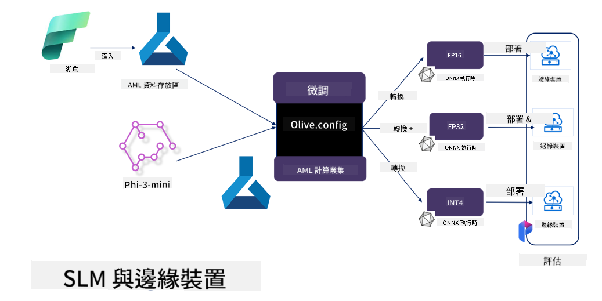

<!--
CO_OP_TRANSLATOR_METADATA:
{
  "original_hash": "5764be88ad2eb4f341e742eb8f14fab1",
  "translation_date": "2025-05-08T05:04:04+00:00",
  "source_file": "md/03.FineTuning/FineTuning_MicrosoftOlive.md",
  "language_code": "hk"
}
-->
# **用 Microsoft Olive 微調 Phi-3**

[Olive](https://github.com/microsoft/OLive?WT.mc_id=aiml-138114-kinfeylo) 是一個簡單易用、支援硬件感知的模型優化工具，集合了業界領先的模型壓縮、優化及編譯技術。

它旨在簡化機器學習模型優化流程，確保模型能最高效地利用特定硬件架構。

無論你是在雲端應用還是邊緣設備上工作，Olive 都能幫助你輕鬆且有效地優化模型。

## 主要特點：
- Olive 集成並自動化針對目標硬件的優化技術。
- 沒有單一優化技術能適用所有情況，Olive 支援擴展性，讓業界專家能插入自己的優化創新。

## 減少工程工作量：
- 開發者通常需要學習並使用多種硬件廠商特定的工具鏈，來準備和優化訓練好的模型以便部署。
- Olive 通過自動化目標硬件的優化技術，簡化了這個過程。

## 即用的端到端優化方案：

透過組合及調整整合技術，Olive 提供一套統一的端到端優化方案。
它會在優化模型時考慮準確度和延遲等限制。

## 使用 Microsoft Olive 進行微調

Microsoft Olive 是一個非常簡單易用的開源模型優化工具，涵蓋生成式人工智能領域的微調和參考流程。只需簡單配置，結合開源小型語言模型及相關運行環境（AzureML / 本地 GPU、CPU、DirectML），即可通過自動優化完成模型的微調或參考，並找到最佳模型部署到雲端或邊緣設備。幫助企業在本地和雲端構建自己的行業垂直模型。


## 用 Microsoft Olive 微調 Phi-3



## Phi-3 Olive 範例程式碼與示例
這個範例中你會使用 Olive：

- 微調 LoRA adapter，將片語分類為 Sad、Joy、Fear、Surprise。
- 將 adapter 權重合併到基礎模型。
- 將模型優化並量化為 int4。

[Sample Code](../../code/03.Finetuning/olive-ort-example/README.md)

### 安裝 Microsoft Olive

Microsoft Olive 安裝非常簡單，支援 CPU、GPU、DirectML 及 Azure ML。

```bash
pip install olive-ai
```

如果想用 CPU 執行 ONNX 模型，可以使用

```bash
pip install olive-ai[cpu]
```

如果想用 GPU 執行 ONNX 模型，可以使用

```python
pip install olive-ai[gpu]
```

如果想用 Azure ML，可以使用

```python
pip install git+https://github.com/microsoft/Olive#egg=olive-ai[azureml]
```

**注意**
作業系統要求：Ubuntu 20.04 / 22.04 

### **Microsoft Olive 的 Config.json**

安裝完成後，可以透過 Config 檔案設定不同模型的專屬參數，包括資料、運算、訓練、部署和模型生成等。

**1. 資料**

Microsoft Olive 支援本地資料及雲端資料的訓練，可在設定中配置。

*本地資料設定*

可簡單設定要用於微調的資料集，通常為 json 格式，並依照資料模板調整。需根據模型需求調整格式（例如，調整為 Microsoft Phi-3-mini 所需格式。若使用其他模型，請參考該模型的微調格式要求）

```json

    "data_configs": [
        {
            "name": "dataset_default_train",
            "type": "HuggingfaceContainer",
            "load_dataset_config": {
                "params": {
                    "data_name": "json", 
                    "data_files":"dataset/dataset-classification.json",
                    "split": "train"
                }
            },
            "pre_process_data_config": {
                "params": {
                    "dataset_type": "corpus",
                    "text_cols": [
                            "phrase",
                            "tone"
                    ],
                    "text_template": "### Text: {phrase}\n### The tone is:\n{tone}",
                    "corpus_strategy": "join",
                    "source_max_len": 2048,
                    "pad_to_max_len": false,
                    "use_attention_mask": false
                }
            }
        }
    ],
```

**雲端資料來源設定**

可透過連結 Azure AI Studio/Azure Machine Learning Service 的資料存儲庫，將雲端資料導入。可利用 Microsoft Fabric 和 Azure Data 從不同資料源導入資料，作為微調的支援。

```json

    "data_configs": [
        {
            "name": "dataset_default_train",
            "type": "HuggingfaceContainer",
            "load_dataset_config": {
                "params": {
                    "data_name": "json", 
                    "data_files": {
                        "type": "azureml_datastore",
                        "config": {
                            "azureml_client": {
                                "subscription_id": "Your Azure Subscrition ID",
                                "resource_group": "Your Azure Resource Group",
                                "workspace_name": "Your Azure ML Workspaces name"
                            },
                            "datastore_name": "workspaceblobstore",
                            "relative_path": "Your train_data.json Azure ML Location"
                        }
                    },
                    "split": "train"
                }
            },
            "pre_process_data_config": {
                "params": {
                    "dataset_type": "corpus",
                    "text_cols": [
                            "Question",
                            "Best Answer"
                    ],
                    "text_template": "<|user|>\n{Question}<|end|>\n<|assistant|>\n{Best Answer}\n<|end|>",
                    "corpus_strategy": "join",
                    "source_max_len": 2048,
                    "pad_to_max_len": false,
                    "use_attention_mask": false
                }
            }
        }
    ],
    
```

**2. 運算配置**

如果使用本地環境，可直接使用本地資源。若使用 Azure AI Studio / Azure Machine Learning Service，則需配置相關 Azure 參數、運算資源名稱等。

```json

    "systems": {
        "aml": {
            "type": "AzureML",
            "config": {
                "accelerators": ["gpu"],
                "hf_token": true,
                "aml_compute": "Your Azure AI Studio / Azure Machine Learning Service Compute Name",
                "aml_docker_config": {
                    "base_image": "Your Azure AI Studio / Azure Machine Learning Service docker",
                    "conda_file_path": "conda.yaml"
                }
            }
        },
        "azure_arc": {
            "type": "AzureML",
            "config": {
                "accelerators": ["gpu"],
                "aml_compute": "Your Azure AI Studio / Azure Machine Learning Service Compute Name",
                "aml_docker_config": {
                    "base_image": "Your Azure AI Studio / Azure Machine Learning Service docker",
                    "conda_file_path": "conda.yaml"
                }
            }
        }
    },
```

***注意***

由於在 Azure AI Studio/Azure Machine Learning Service 上以容器方式執行，需配置所需環境，設定於 conda.yaml 環境檔。

```yaml

name: project_environment
channels:
  - defaults
dependencies:
  - python=3.8.13
  - pip=22.3.1
  - pip:
      - einops
      - accelerate
      - azure-keyvault-secrets
      - azure-identity
      - bitsandbytes
      - datasets
      - huggingface_hub
      - peft
      - scipy
      - sentencepiece
      - torch>=2.2.0
      - transformers
      - git+https://github.com/microsoft/Olive@jiapli/mlflow_loading_fix#egg=olive-ai[gpu]
      - --extra-index-url https://aiinfra.pkgs.visualstudio.com/PublicPackages/_packaging/ORT-Nightly/pypi/simple/ 
      - ort-nightly-gpu==1.18.0.dev20240307004
      - --extra-index-url https://aiinfra.pkgs.visualstudio.com/PublicPackages/_packaging/onnxruntime-genai/pypi/simple/
      - onnxruntime-genai-cuda

    

```

**3. 選擇你的 SLM**

可直接使用 Hugging Face 的模型，或結合 Azure AI Studio / Azure Machine Learning 的模型目錄選擇模型。以下程式碼範例以 Microsoft Phi-3-mini 為例。

若模型已在本地，可用此方法：

```json

    "input_model":{
        "type": "PyTorchModel",
        "config": {
            "hf_config": {
                "model_name": "model-cache/microsoft/phi-3-mini",
                "task": "text-generation",
                "model_loading_args": {
                    "trust_remote_code": true
                }
            }
        }
    },
```

若要使用 Azure AI Studio / Azure Machine Learning Service 的模型，可用此方法：

```json

    "input_model":{
        "type": "PyTorchModel",
        "config": {
            "model_path": {
                "type": "azureml_registry_model",
                "config": {
                    "name": "microsoft/Phi-3-mini-4k-instruct",
                    "registry_name": "azureml-msr",
                    "version": "11"
                }
            },
             "model_file_format": "PyTorch.MLflow",
             "hf_config": {
                "model_name": "microsoft/Phi-3-mini-4k-instruct",
                "task": "text-generation",
                "from_pretrained_args": {
                    "trust_remote_code": true
                }
            }
        }
    },
```

**注意：**
需整合 Azure AI Studio / Azure Machine Learning Service，設定模型時請參考版本號及相關命名。

Azure 上的所有模型需設定為 PyTorch.MLflow。

需有 Hugging Face 帳號，並將金鑰綁定到 Azure AI Studio / Azure Machine Learning 的金鑰值。

**4. 演算法**

Microsoft Olive 封裝了 LoRA 和 QLoRA 微調演算法，只需配置相關參數。此處以 QLoRA 為例。

```json
        "lora": {
            "type": "LoRA",
            "config": {
                "target_modules": [
                    "o_proj",
                    "qkv_proj"
                ],
                "double_quant": true,
                "lora_r": 64,
                "lora_alpha": 64,
                "lora_dropout": 0.1,
                "train_data_config": "dataset_default_train",
                "eval_dataset_size": 0.3,
                "training_args": {
                    "seed": 0,
                    "data_seed": 42,
                    "per_device_train_batch_size": 1,
                    "per_device_eval_batch_size": 1,
                    "gradient_accumulation_steps": 4,
                    "gradient_checkpointing": false,
                    "learning_rate": 0.0001,
                    "num_train_epochs": 3,
                    "max_steps": 10,
                    "logging_steps": 10,
                    "evaluation_strategy": "steps",
                    "eval_steps": 187,
                    "group_by_length": true,
                    "adam_beta2": 0.999,
                    "max_grad_norm": 0.3
                }
            }
        },
```

若要做量化轉換，Microsoft Olive 主分支已支援 onnxruntime-genai 方法，可依需求設定：

1. 將 adapter 權重合併到基礎模型
2. 用 ModelBuilder 轉換模型為指定精度的 onnx 模型

例如轉成量化的 INT4

```json

        "merge_adapter_weights": {
            "type": "MergeAdapterWeights"
        },
        "builder": {
            "type": "ModelBuilder",
            "config": {
                "precision": "int4"
            }
        }
```

**注意**
- 使用 QLoRA 時，目前不支援 ONNXRuntime-genai 的量化轉換。
- 以上步驟可依需求調整，無須全部配置。可直接使用演算法步驟而不微調，最後配置相關引擎即可。

```json

    "engine": {
        "log_severity_level": 0,
        "host": "aml",
        "target": "aml",
        "search_strategy": false,
        "execution_providers": ["CUDAExecutionProvider"],
        "cache_dir": "../model-cache/models/phi3-finetuned/cache",
        "output_dir" : "../model-cache/models/phi3-finetuned"
    }
```

**5. 微調完成**

在 olive-config.json 所在目錄下，於命令行執行：

```bash
olive run --config olive-config.json  
```

**免責聲明**：  
本文件使用 AI 翻譯服務 [Co-op Translator](https://github.com/Azure/co-op-translator) 進行翻譯。雖然我們致力於確保準確性，但請注意自動翻譯可能存在錯誤或不準確之處。原文文件的母語版本應視為權威來源。對於重要資訊，建議採用專業人工翻譯。我們不對因使用本翻譯而引致的任何誤解或誤釋負責。