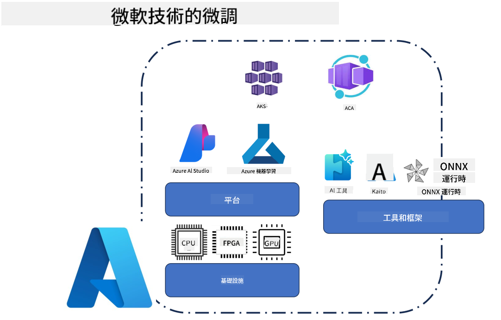
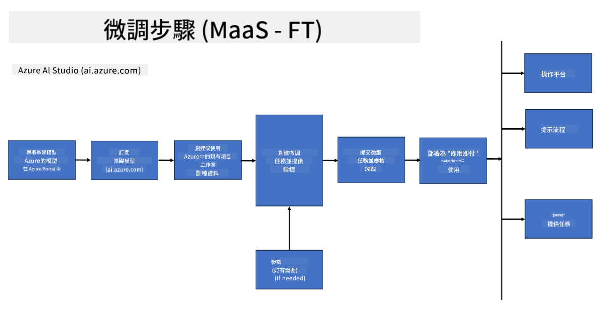
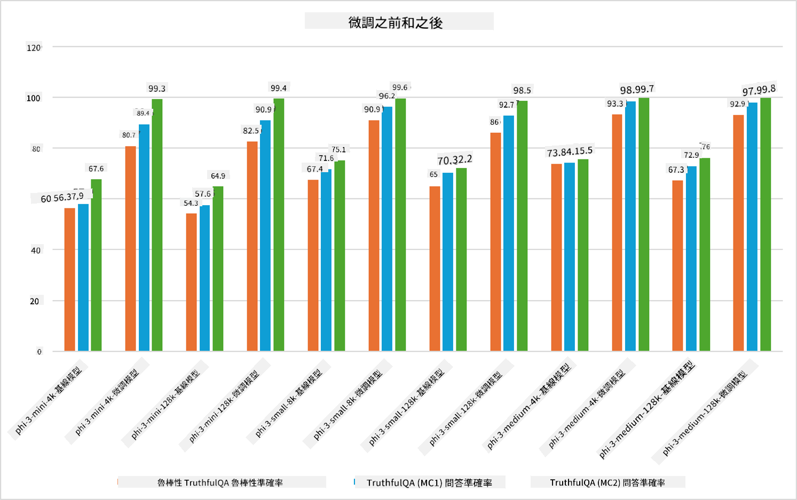

<!--
CO_OP_TRANSLATOR_METADATA:
{
  "original_hash": "cd52a3c9a424a77d2ec0470770c93846",
  "translation_date": "2025-04-04T19:03:38+00:00",
  "source_file": "md\\03.FineTuning\\FineTuning_Scenarios.md",
  "language_code": "hk"
}
-->
## 微調場景

**平台** 包括各種技術，例如 Azure AI Foundry、Azure Machine Learning、AI Tools、Kaito 和 ONNX Runtime。

**基礎設施** 包括 CPU 和 FPGA，這些是微調過程中不可或缺的部分。以下展示每項技術的圖標。

**工具及框架** 包括 ONNX Runtime 和 ONNX Runtime。以下展示每項技術的圖標。
[插入 ONNX Runtime 和 ONNX Runtime 的圖標]

使用 Microsoft 技術進行微調過程涉及多個組件和工具。透過了解並使用這些技術，我們可以有效地微調應用程式並創造更佳的解決方案。

## 模型即服務

利用託管微調功能對模型進行微調，無需自行創建和管理計算資源。

伺服器無需微調功能已適用於 Phi-3-mini 和 Phi-3-medium 模型，使開發者能快速簡便地針對雲端和邊緣場景定制模型，而不需安排計算資源。此外，我們已宣布 Phi-3-small 模型現已通過我們的 Models-as-a-Service 提供，開發者可以快速簡便地開始 AI 開發，而無需管理底層基礎設施。

## 模型即平台

用戶需自行管理計算資源以微調模型。

[微調範例](https://github.com/Azure/azureml-examples/blob/main/sdk/python/foundation-models/system/finetune/chat-completion/chat-completion.ipynb)

## 微調場景

| | | | | | | |
|-|-|-|-|-|-|-|
|場景|LoRA|QLoRA|PEFT|DeepSpeed|ZeRO|DORA|
|將預訓練的 LLM 調整至特定任務或領域|是|是|是|是|是|是|
|針對 NLP 任務（如文本分類、命名實體識別及機器翻譯）進行微調|是|是|是|是|是|是|
|針對 QA 任務進行微調|是|是|是|是|是|是|
|微調以生成類似人類的聊天機器人回應|是|是|是|是|是|是|
|微調以生成音樂、藝術或其他創意形式|是|是|是|是|是|是|
|降低計算及財務成本|是|是|否|是|是|否|
|減少記憶體使用|否|是|否|是|是|是|
|使用較少參數進行高效微調|否|是|是|否|否|是|
|記憶體高效的數據並行形式，允許使用所有 GPU 設備的聚合 GPU 記憶體|否|否|否|是|是|是|

## 微調性能範例

**免責聲明**:  
此文件使用AI翻譯服務 [Co-op Translator](https://github.com/Azure/co-op-translator) 進行翻譯。我們致力於提供準確的翻譯，但請注意，自動翻譯可能包含錯誤或不準確之處。應以原始語言的文件作為權威來源。對於關鍵資訊，建議尋求專業的人類翻譯。我們對因使用此翻譯而產生的任何誤解或誤釋不承擔責任。