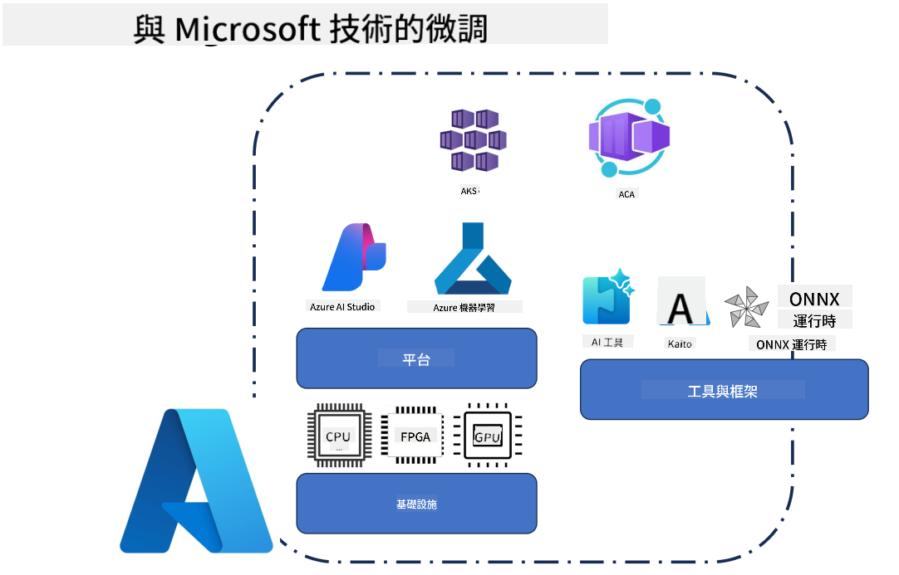
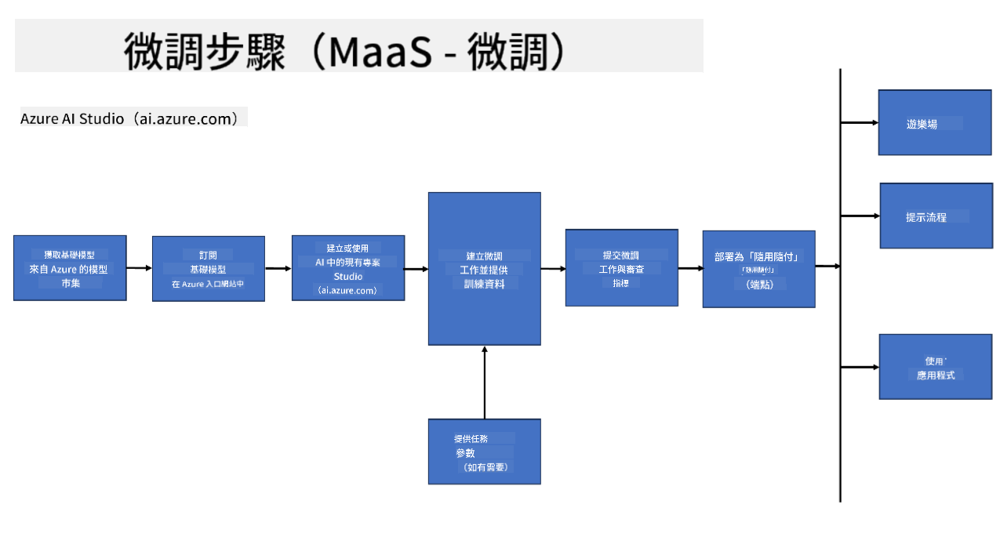
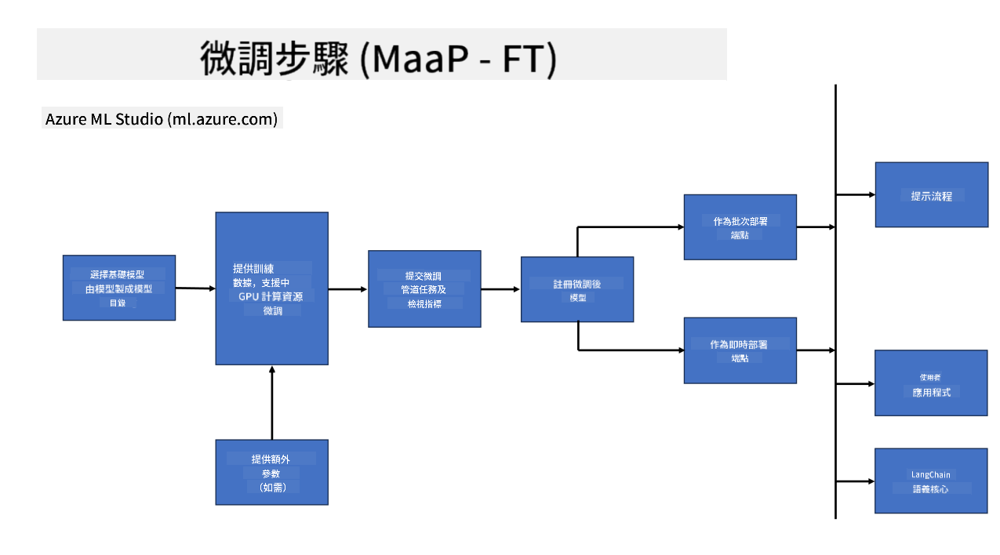
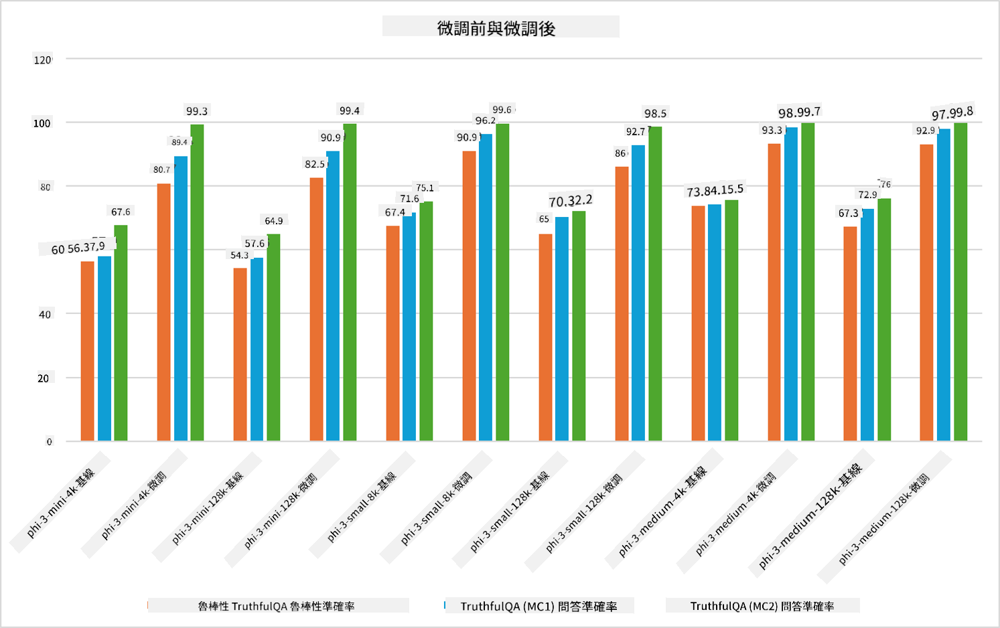

<!--
CO_OP_TRANSLATOR_METADATA:
{
  "original_hash": "cb5648935f63edc17e95ce38f23adc32",
  "translation_date": "2025-05-08T05:22:01+00:00",
  "source_file": "md/03.FineTuning/FineTuning_Scenarios.md",
  "language_code": "hk"
}
-->
## 微調場景

**平台** 包括多種技術，例如 Azure AI Foundry、Azure Machine Learning、AI 工具、Kaito 以及 ONNX Runtime。

**基礎設施** 包括 CPU 和 FPGA，這些都是微調過程中不可或缺的部分。讓我展示這些技術的圖標給你看。

**工具及框架** 包括 ONNX Runtime。讓我展示這些技術的圖標給你看。
[Insert icons for ONNX Runtime and ONNX Runtime]

利用微軟技術進行微調涉及多個組件和工具。透過了解和善用這些技術，我們可以有效地微調應用程式，打造更優秀的解決方案。

## 模型即服務

利用託管的微調功能，無需自行建立及管理運算資源，即可微調模型。

Serverless 微調適用於 Phi-3-mini 和 Phi-3-medium 模型，讓開發者能快速且輕鬆地為雲端及邊緣場景自訂模型，毋須安排運算資源。我們亦宣布 Phi-3-small 已經透過 Models-as-a-Service 方案提供，讓開發者能夠迅速啟動 AI 開發，而無需管理底層基礎設施。

## 模型即平台

用戶自行管理運算資源，以微調他們的模型。

[Fine Tuning Sample](https://github.com/Azure/azureml-examples/blob/main/sdk/python/foundation-models/system/finetune/chat-completion/chat-completion.ipynb)

## 微調場景

| | | | | | | |
|-|-|-|-|-|-|-|
|場景|LoRA|QLoRA|PEFT|DeepSpeed|ZeRO|DORA|
|將預訓練大型語言模型調整至特定任務或領域|是|是|是|是|是|是|
|針對自然語言處理任務如文本分類、命名實體識別及機器翻譯進行微調|是|是|是|是|是|是|
|針對問答任務進行微調|是|是|是|是|是|是|
|微調以產生類人回應於聊天機器人|是|是|是|是|是|是|
|微調以產生音樂、藝術或其他創意形式|是|是|是|是|是|是|
|降低計算和成本支出|是|是|否|是|是|否|
|減少記憶體使用量|否|是|否|是|是|是|
|使用較少參數以達致高效微調|否|是|是|否|否|是|
|記憶體高效的資料平行方式，可使用所有 GPU 裝置的合併 GPU 記憶體|否|否|否|是|是|是|

## 微調效能範例

**免責聲明**：  
本文件係使用 AI 翻譯服務 [Co-op Translator](https://github.com/Azure/co-op-translator) 翻譯而成。雖然我哋致力確保準確性，但請注意自動翻譯可能包含錯誤或不準確之處。原文文件嘅母語版本應視為權威來源。對於重要資訊，建議採用專業人工翻譯。我哋對因使用本翻譯而引致嘅任何誤解或誤釋概不負責。