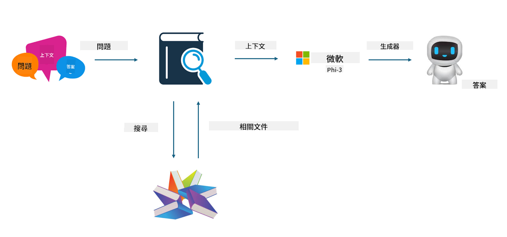

<!--
CO_OP_TRANSLATOR_METADATA:
{
  "original_hash": "e4e010400c2918557b36bb932a14004c",
  "translation_date": "2025-07-17T09:27:22+00:00",
  "source_file": "md/03.FineTuning/FineTuning_vs_RAG.md",
  "language_code": "hk"
}
-->
## 微調與 RAG

## Retrieval Augmented Generation

RAG 是資料檢索加上文本生成。企業的結構化資料和非結構化資料會存放在向量資料庫中。當搜尋相關內容時，會找到相關的摘要和內容組成上下文，並結合 LLM/SLM 的文本補全能力來生成內容。

## RAG 流程

## 微調
微調是基於某個模型的改進，不需要從模型演算法開始，但需要持續累積資料。如果你想在產業應用中有更精準的術語和語言表達，微調會是較好的選擇。但如果你的資料經常變動，微調可能會變得複雜。

## 如何選擇
如果我們的答案需要引入外部資料，RAG 是最佳選擇。

如果你需要輸出穩定且精確的產業知識，微調會是好選擇。RAG 優先拉取相關內容，但可能無法完全掌握專業細節。

微調需要高品質的資料集，如果資料範圍很小，效果不會太明顯。RAG 則較為靈活。  
微調像是一個黑盒子，有點玄學，內部機制難以理解。但 RAG 可以更容易找到資料來源，從而有效調整幻覺或內容錯誤，並提供更好的透明度。

**免責聲明**：  
本文件由 AI 翻譯服務 [Co-op Translator](https://github.com/Azure/co-op-translator) 進行翻譯。雖然我們致力於確保準確性，但請注意，自動翻譯可能包含錯誤或不準確之處。原始文件的母語版本應被視為權威來源。對於重要資訊，建議採用專業人工翻譯。我們不對因使用本翻譯而引起的任何誤解或誤釋承擔責任。