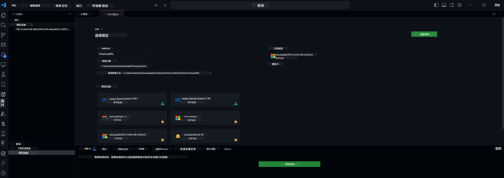

<!--
CO_OP_TRANSLATOR_METADATA:
{
  "original_hash": "c2bc0950f44919ac75a88c1a871680c2",
  "translation_date": "2025-07-17T09:03:54+00:00",
  "source_file": "md/03.FineTuning/Finetuning_VSCodeaitoolkit.md",
  "language_code": "hk"
}
-->
## 歡迎使用 VS Code 的 AI Toolkit

[AI Toolkit for VS Code](https://github.com/microsoft/vscode-ai-toolkit/tree/main) 集合了來自 Azure AI Studio Catalog 及其他目錄如 Hugging Face 的多種模型。此工具包簡化了使用生成式 AI 工具和模型構建 AI 應用的常見開發任務，功能包括：
- 快速開始模型探索和遊樂場。
- 使用本地計算資源進行模型微調和推理。
- 使用 Azure 資源進行遠端微調和推理。

[安裝 AI Toolkit for VSCode](https://marketplace.visualstudio.com/items?itemName=ms-windows-ai-studio.windows-ai-studio)



**[Private Preview]** 一鍵配置 Azure Container Apps，在雲端運行模型微調和推理。

現在讓我們開始你的 AI 應用開發：

- [歡迎使用 VS Code 的 AI Toolkit](../../../../md/03.FineTuning)
- [本地開發](../../../../md/03.FineTuning)
  - [準備工作](../../../../md/03.FineTuning)
  - [啟動 Conda](../../../../md/03.FineTuning)
  - [僅微調基礎模型](../../../../md/03.FineTuning)
  - [模型微調與推理](../../../../md/03.FineTuning)
  - [模型微調](../../../../md/03.FineTuning)
  - [Microsoft Olive](../../../../md/03.FineTuning)
  - [微調範例與資源](../../../../md/03.FineTuning)
- [**\[Private Preview\]** 遠端開發](../../../../md/03.FineTuning)
  - [先決條件](../../../../md/03.FineTuning)
  - [設定遠端開發專案](../../../../md/03.FineTuning)
  - [配置 Azure 資源](../../../../md/03.FineTuning)
  - [\[選用\] 將 Huggingface Token 新增至 Azure Container App Secret](../../../../md/03.FineTuning)
  - [執行微調](../../../../md/03.FineTuning)
  - [配置推理端點](../../../../md/03.FineTuning)
  - [部署推理端點](../../../../md/03.FineTuning)
  - [進階用法](../../../../md/03.FineTuning)

## 本地開發
### 準備工作

1. 確認主機已安裝 NVIDIA 驅動程式。
2. 如果使用 HF 來利用資料集，請執行 `huggingface-cli login`。
3. `Olive` 的關鍵設定說明，涉及任何會修改記憶體使用的項目。

### 啟動 Conda
由於我們使用的是 WSL 環境且為共用環境，需手動啟動 conda 環境。完成此步驟後，即可執行微調或推理。

```bash
conda activate [conda-env-name] 
```

### 僅微調基礎模型
若只想嘗試基礎模型而不進行微調，啟動 conda 後可執行以下指令。

```bash
cd inference

# Web browser interface allows to adjust a few parameters like max new token length, temperature and so on.
# User has to manually open the link (e.g. http://0.0.0.0:7860) in a browser after gradio initiates the connections.
python gradio_chat.py --baseonly
```

### 模型微調與推理

當工作區在開發容器中開啟後，打開終端機（預設路徑為專案根目錄），執行以下指令以在選定資料集上微調大型語言模型。

```bash
python finetuning/invoke_olive.py 
```

檢查點與最終模型將會保存在 `models` 資料夾中。

接著可透過 `console`、`web browser` 或 `prompt flow` 使用微調後的模型進行推理。

```bash
cd inference

# Console interface.
python console_chat.py

# Web browser interface allows to adjust a few parameters like max new token length, temperature and so on.
# User has to manually open the link (e.g. http://127.0.0.1:7860) in a browser after gradio initiates the connections.
python gradio_chat.py
```

若要在 VS Code 中使用 `prompt flow`，請參考此 [快速入門](https://microsoft.github.io/promptflow/how-to-guides/quick-start.html)。

### 模型微調

接著，根據你設備上 GPU 的可用性，下載以下模型。

要啟動使用 QLoRA 的本地微調會話，請從我們的目錄中選擇想要微調的模型。
| 平台 | 是否有 GPU | 模型名稱 | 大小 (GB) |
|---------|---------|--------|--------|
| Windows | 有 | Phi-3-mini-4k-**directml**-int4-awq-block-128-onnx | 2.13GB |
| Linux | 有 | Phi-3-mini-4k-**cuda**-int4-onnx | 2.30GB |
| Windows<br>Linux | 無 | Phi-3-mini-4k-**cpu**-int4-rtn-block-32-acc-level-4-onnx | 2.72GB |

**_注意_** 下載模型不需要 Azure 帳號。

Phi3-mini (int4) 模型大小約為 2GB-3GB，視網路速度可能需花費幾分鐘下載。

先選擇專案名稱與位置。
接著從模型目錄中選擇模型，系統會提示下載專案範本。然後點擊「Configure Project」調整各項設定。

### Microsoft Olive

我們使用 [Olive](https://microsoft.github.io/Olive/why-olive.html) 在我們的目錄中對 PyTorch 模型執行 QLoRA 微調。所有設定均預設為最佳化本地微調過程的記憶體使用，但可依需求調整。

### 微調範例與資源

- [微調入門指南](https://learn.microsoft.com/windows/ai/toolkit/toolkit-fine-tune)
- [使用 HuggingFace 資料集進行微調](https://github.com/microsoft/vscode-ai-toolkit/blob/main/archive/walkthrough-hf-dataset.md)
- [使用簡易資料集進行微調](https://github.com/microsoft/vscode-ai-toolkit/blob/main/archive/walkthrough-simple-dataset.md)

## **[Private Preview]** 遠端開發

### 先決條件

1. 若要在遠端 Azure Container App 環境中執行模型微調，請確保你的訂閱有足夠的 GPU 容量。可提交 [支援單](https://azure.microsoft.com/support/create-ticket/) 申請所需容量。 [了解更多 GPU 容量資訊](https://learn.microsoft.com/azure/container-apps/workload-profiles-overview)
2. 若使用 HuggingFace 私有資料集，請確保你擁有 [HuggingFace 帳號](https://huggingface.co/?WT.mc_id=aiml-137032-kinfeylo) 並 [產生存取權杖](https://huggingface.co/docs/hub/security-tokens?WT.mc_id=aiml-137032-kinfeylo)
3. 在 AI Toolkit for VS Code 中啟用遠端微調與推理功能旗標
   1. 開啟 VS Code 設定，選擇 *File -> Preferences -> Settings*。
   2. 導覽至 *Extensions*，選擇 *AI Toolkit*。
   3. 啟用 *"Enable Remote Fine-tuning And Inference"* 選項。
   4. 重新載入 VS Code 以生效。

- [遠端微調](https://github.com/microsoft/vscode-ai-toolkit/blob/main/archive/remote-finetuning.md)

### 設定遠端開發專案
1. 執行命令面板 `AI Toolkit: Focus on Resource View`。
2. 導覽至 *Model Fine-tuning* 以存取模型目錄。為專案命名並選擇本機位置，然後點擊 *"Configure Project"*。
3. 專案設定
    1. 避免啟用 *"Fine-tune locally"* 選項。
    2. Olive 配置設定會顯示預設值，請依需求調整並填寫。
    3. 繼續點擊 *Generate Project*。此階段會使用 WSL 並建立新的 Conda 環境，為未來包含 Dev Containers 的更新做準備。
4. 點擊 *"Relaunch Window In Workspace"* 以開啟遠端開發專案。

> **注意：** 專案目前只能在 AI Toolkit for VS Code 中本地或遠端運作。若專案建立時選擇 *"Fine-tune locally"*，將僅在 WSL 中運行，無遠端開發功能。若未啟用 *"Fine-tune locally"*，專案則限制於遠端 Azure Container App 環境。

### 配置 Azure 資源
開始前，需為遠端微調配置 Azure 資源。可透過命令面板執行 `AI Toolkit: Provision Azure Container Apps job for fine-tuning`。

可在輸出頻道中點擊顯示的連結監控配置進度。

### [選用] 將 Huggingface Token 新增至 Azure Container App Secret
若使用私有 HuggingFace 資料集，請將 HuggingFace token 設為環境變數，避免每次手動登入 Hugging Face Hub。
可使用 `AI Toolkit: Add Azure Container Apps Job secret for fine-tuning` 指令，將秘密名稱設為 [`HF_TOKEN`](https://huggingface.co/docs/huggingface_hub/package_reference/environment_variables#hftoken)，並使用你的 Hugging Face token 作為秘密值。

### 執行微調
執行 `AI Toolkit: Run fine-tuning` 指令開始遠端微調工作。

要查看系統與終端機日誌，可透過輸出面板中的連結前往 Azure 入口網站（更多步驟請參考 [在 Azure 上查看與查詢日誌](https://aka.ms/ai-toolkit/remote-provision#view-and-query-logs-on-azure)）。或者，執行 `AI Toolkit: Show the running fine-tuning job streaming logs` 指令，直接在 VSCode 輸出面板查看終端機日誌。
> **注意：** 若資源不足，工作可能會排隊。若日誌未顯示，請執行 `AI Toolkit: Show the running fine-tuning job streaming logs` 指令，稍待片刻後再執行一次以重新連接串流日誌。

此過程中會使用 QLoRA 進行微調，並為模型建立 LoRA 適配器以供推理使用。
微調結果將儲存在 Azure Files。

### 配置推理端點
在遠端環境訓練完適配器後，使用簡易的 Gradio 應用與模型互動。
與微調過程類似，需執行命令面板中的 `AI Toolkit: Provision Azure Container Apps for inference` 來設定遠端推理的 Azure 資源。

預設情況下，推理所用的訂閱與資源群組應與微調時相同。推理將使用相同的 Azure Container App 環境，並存取微調階段產生並儲存在 Azure Files 的模型及模型適配器。

### 部署推理端點
若想修改推理程式碼或重新載入推理模型，請執行 `AI Toolkit: Deploy for inference` 指令。此操作會將最新程式碼同步至 Azure Container App 並重新啟動副本。

部署成功後，可點擊 VSCode 通知中顯示的「*Go to Inference Endpoint*」按鈕存取推理 API。或在 `./infra/inference.config.json` 的 `ACA_APP_ENDPOINT` 以及輸出面板中找到 Web API 端點。你現在可以使用此端點評估模型。

### 進階用法
欲了解更多關於 AI Toolkit 遠端開發的資訊，請參考 [遠端微調模型](https://aka.ms/ai-toolkit/remote-provision) 及 [使用微調模型進行推理](https://aka.ms/ai-toolkit/remote-inference) 文件。

**免責聲明**：  
本文件乃使用 AI 翻譯服務 [Co-op Translator](https://github.com/Azure/co-op-translator) 進行翻譯。雖然我們致力於確保準確性，但請注意，自動翻譯可能包含錯誤或不準確之處。原始文件的母語版本應被視為權威來源。對於重要資訊，建議採用專業人工翻譯。我們不對因使用本翻譯而引致的任何誤解或誤釋承擔責任。