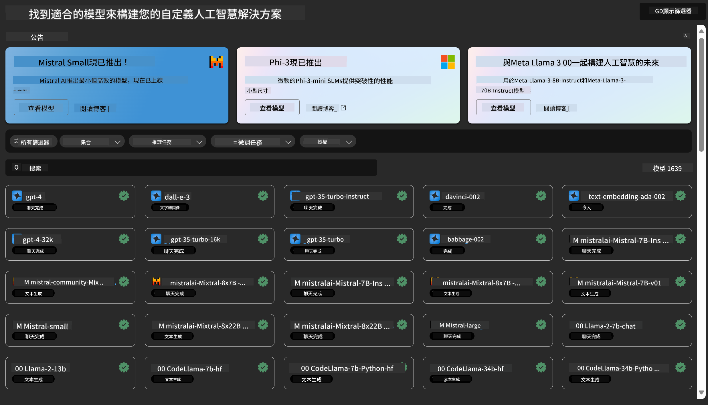
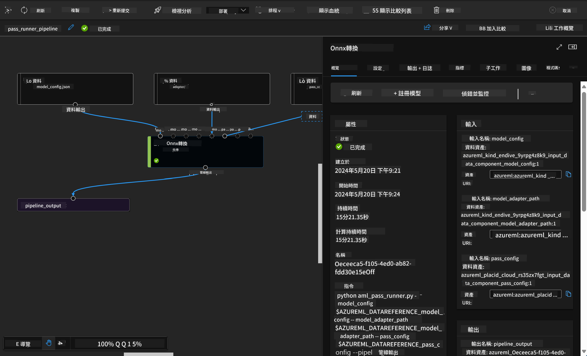

<!--
CO_OP_TRANSLATOR_METADATA:
{
  "original_hash": "315566447513c4c6215ea5a004315e4f",
  "translation_date": "2025-04-04T19:08:26+00:00",
  "source_file": "md\\03.FineTuning\\Introduce_AzureML.md",
  "language_code": "hk"
}
-->
# **介紹 Azure Machine Learning 服務**

[Azure Machine Learning](https://ml.azure.com?WT.mc_id=aiml-138114-kinfeylo) 是一個雲端服務，用於加速和管理機器學習（ML）專案的生命週期。

ML 專業人士、數據科學家和工程師可以在日常工作流程中使用它來：

- 訓練和部署模型。
- 管理機器學習操作（MLOps）。
- 你可以在 Azure Machine Learning 中建立模型，或使用基於開源平台（例如 PyTorch、TensorFlow 或 scikit-learn）建構的模型。
- MLOps 工具幫助你監控、重新訓練和重新部署模型。

## Azure Machine Learning 適合誰？

**數據科學家和 ML 工程師**

他們可以使用工具來加速和自動化日常工作流程。
Azure ML 提供公平性、可解釋性、追蹤性和可審計性等功能。

**應用程式開發者**

他們可以無縫地將模型整合到應用程式或服務中。

**平台開發者**

他們可以使用一套強大的工具，這些工具由可靠的 Azure Resource Manager API 支援。
這些工具可用於建構高級 ML 工具。

**企業**

在 Microsoft Azure 雲端中運作的企業能夠受益於熟悉的安全性和基於角色的訪問控制。
設置專案以控制對受保護數據和特定操作的訪問。

## 提升團隊每個人的工作效率
ML 專案通常需要具備多樣技能的團隊來建構和維護。

Azure ML 提供的工具可以幫助你：
- 與團隊合作，使用共享的筆記本、計算資源、無伺服器計算、數據和環境。
- 開發具有公平性、可解釋性、追蹤性和可審計性的模型，以滿足譜系和審計合規性要求。
- 快速且輕鬆地大規模部署 ML 模型，並通過 MLOps 高效地管理和治理它們。
- 在任何地方運行機器學習工作負載，並內建治理、安全性和合規性。

## 跨平台兼容的工具

ML 團隊中的任何人都可以使用自己偏好的工具完成工作。
無論你是在進行快速實驗、超參數調整、建構管道，還是管理推斷，你都可以使用熟悉的介面，包括：
- Azure Machine Learning Studio
- Python SDK (v2)
- Azure CLI (v2)
- Azure Resource Manager REST APIs

在模型優化和開發週期中進行協作時，你可以在 Azure Machine Learning studio 的 UI 中分享和查找資產、資源和指標。

## **Azure ML 中的 LLM/SLM**

Azure ML 增加了許多與 LLM/SLM 相關的功能，結合 LLMOps 和 SLMOps，打造企業級生成式人工智能技術平台。

### **模型目錄**

企業用戶可以通過模型目錄根據不同業務場景部署不同模型，並以模型即服務（Model as Service）的形式提供服務，供企業開發者或用戶訪問。

Azure Machine Learning studio 中的模型目錄是發現和使用各種模型的中心，幫助你構建生成式 AI 應用程式。模型目錄包含數百個模型，涵蓋 Azure OpenAI service、Mistral、Meta、Cohere、Nvidia、Hugging Face 等模型提供者，以及由 Microsoft 訓練的模型。Microsoft 以外的提供者提供的模型屬於非 Microsoft 產品，依據 Microsoft 的產品條款，並受模型附帶條款的約束。

### **作業管道**

機器學習管道的核心是將完整的機器學習任務拆分為多步驟的工作流程。每個步驟都是可管理的元件，可以單獨開發、優化、配置和自動化。步驟之間通過明確定義的介面連接。Azure Machine Learning 管道服務自動協調管道步驟之間的所有依賴關係。

在微調 SLM / LLM 時，我們可以通過管道管理數據、訓練和生成過程。

### **Prompt flow**

使用 Azure Machine Learning prompt flow 的好處  
Azure Machine Learning prompt flow 提供了一系列好處，幫助用戶從構思過渡到實驗，最終構建出具備生產準備的基於 LLM 的應用程式：

**Prompt 工程的靈活性**

互動式編輯體驗：Azure Machine Learning prompt flow 提供了流結構的視覺化表示，讓用戶能夠輕鬆理解並導航其專案。它還提供類似筆記本的編碼體驗，以便高效開發和調試流。
Prompt 調整的變體：用戶可以創建和比較多個 prompt 變體，促進迭代改進過程。

評估：內建評估流幫助用戶評估 prompt 和流的質量及有效性。

全面資源：Azure Machine Learning prompt flow 包括一個內建工具、範例和模板的庫，為開發提供起點，激發創造力並加速過程。

**企業級的基於 LLM 的應用程式**

協作：Azure Machine Learning prompt flow 支援團隊協作，允許多個用戶共同參與 prompt 工程專案，分享知識並維護版本控制。

一站式平台：Azure Machine Learning prompt flow 簡化了整個 prompt 工程過程，從開發和評估到部署和監控。用戶可以輕鬆將其流部署為 Azure Machine Learning 端點，並實時監控其性能，確保最佳運行和持續改進。

Azure Machine Learning 企業級解決方案：Prompt flow 利用 Azure Machine Learning 的強大企業級解決方案，為流的開發、實驗和部署提供安全、可擴展且可靠的基礎。

通過 Azure Machine Learning prompt flow，用戶可以發揮 prompt 工程的靈活性，有效協作，並利用企業級解決方案成功開發和部署基於 LLM 的應用程式。

結合 Azure ML 的計算能力、數據及不同元件，企業開發者可以輕鬆構建自己的人工智能應用程式。

**免責聲明**：  
此文件使用人工智能翻譯服務 [Co-op Translator](https://github.com/Azure/co-op-translator) 進行翻譯。我們致力於提供準確的翻譯，但請注意，自動翻譯可能包含錯誤或不準確之處。原文檔的母語版本應被視為權威來源。對於關鍵信息，建議使用專業人工翻譯。我們不對因使用此翻譯而產生的任何誤解或錯誤解釋承擔責任。