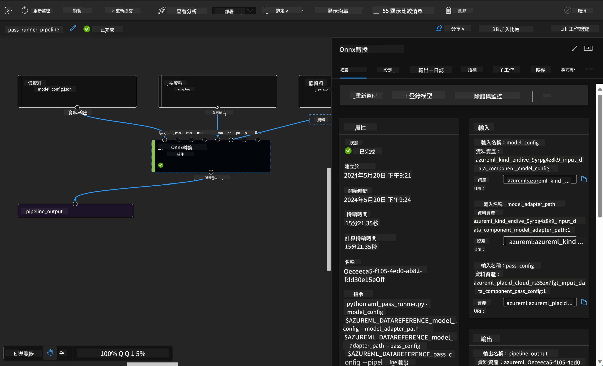

<!--
CO_OP_TRANSLATOR_METADATA:
{
  "original_hash": "7fe541373802e33568e94e13226d463c",
  "translation_date": "2025-07-17T09:35:57+00:00",
  "source_file": "md/03.FineTuning/Introduce_AzureML.md",
  "language_code": "hk"
}
-->
# **介紹 Azure Machine Learning 服務**

[Azure Machine Learning](https://ml.azure.com?WT.mc_id=aiml-138114-kinfeylo) 是一項雲端服務，用於加速及管理機器學習（ML）專案的整個生命週期。

機器學習專業人士、數據科學家及工程師可以在日常工作流程中使用它來：

- 訓練及部署模型。
- 管理機器學習運營（MLOps）。
- 你可以在 Azure Machine Learning 中建立模型，或使用來自開源平台（如 PyTorch、TensorFlow 或 scikit-learn）所建構的模型。
- MLOps 工具幫助你監控、重新訓練及重新部署模型。

## Azure Machine Learning 適合誰？

**數據科學家及機器學習工程師**

他們可以使用工具來加速及自動化日常工作流程。  
Azure ML 提供公平性、可解釋性、追蹤及審計功能。

**應用程式開發者**

他們可以無縫地將模型整合到應用程式或服務中。

**平台開發者**

他們可使用由穩健的 Azure Resource Manager API 支援的一套強大工具，  
這些工具允許構建先進的機器學習工具。

**企業**

在 Microsoft Azure 雲端環境中運作，企業可享有熟悉的安全性及基於角色的存取控制。  
可設定專案以控制對受保護資料及特定操作的存取權限。

## 團隊每個成員的生產力

機器學習專案通常需要具備多元技能的團隊來建置及維護。

Azure ML 提供工具讓你能夠：

- 透過共用筆記本、運算資源、無伺服器運算、資料及環境與團隊協作。
- 開發具公平性、可解釋性、追蹤及審計功能的模型，以符合血統及審計合規要求。
- 快速且輕鬆地大規模部署機器學習模型，並透過 MLOps 有效管理及治理它們。
- 在任何地方執行機器學習工作負載，並內建治理、安全及合規性。

## 跨平台相容工具

機器學習團隊中的任何人都可以使用自己偏好的工具完成工作。  
無論是快速實驗、超參數調整、建置管線，或管理推論，都可以使用熟悉的介面，包括：

- Azure Machine Learning Studio  
- Python SDK (v2)  
- Azure CLI (v2)  
- Azure Resource Manager REST APIs  

在模型優化及整個開發週期中協作時，你可以在 Azure Machine Learning Studio UI 中分享及尋找資產、資源及指標。

## **Azure ML 中的 LLM/SLM**

Azure ML 新增了許多與 LLM/SLM 相關的功能，結合 LLMOps 與 SLMOps，打造企業級的生成式人工智能技術平台。

### **模型目錄**

企業用戶可透過模型目錄根據不同業務場景部署不同模型，並以「模型即服務」的方式提供給企業開發者或用戶存取。

Azure Machine Learning Studio 中的模型目錄是發現及使用各種模型的中心，幫助你建構生成式 AI 應用。模型目錄涵蓋數百款模型，來自 Azure OpenAI 服務、Mistral、Meta、Cohere、Nvidia、Hugging Face 等模型供應商，包含微軟訓練的模型。非微軟供應商的模型屬於非微軟產品，依據微軟產品條款定義，並受模型附帶條款約束。

### **工作管線**

機器學習管線的核心是將完整的機器學習任務拆分成多步驟工作流程。每個步驟都是可管理的元件，可獨立開發、優化、配置及自動化。步驟間透過明確定義的介面連接。Azure Machine Learning 管線服務會自動協調所有步驟間的依賴關係。

在微調 SLM / LLM 時，我們可以透過管線管理資料、訓練及生成流程。

### **Prompt flow**

使用 Azure Machine Learning prompt flow 的好處  
Azure Machine Learning prompt flow 提供多項優勢，幫助用戶從構思到實驗，最終打造可投入生產的基於 LLM 的應用：

**Prompt 工程的靈活性**

互動式創作體驗：Azure Machine Learning prompt flow 以視覺化方式呈現流程結構，讓用戶輕鬆理解及瀏覽專案，並提供類似筆記本的編碼體驗，提升流程開發及除錯效率。  
Prompt 調整變體：用戶可建立並比較多個 prompt 變體，促進反覆優化。

評估：內建評估流程，讓用戶能評估 prompt 及流程的品質與效能。

豐富資源：Azure Machine Learning prompt flow 包含內建工具庫、範例及範本，作為開發起點，激發創意並加速流程。

**基於 LLM 應用的企業準備度**

協作：Azure Machine Learning prompt flow 支援團隊協作，允許多位用戶共同進行 prompt 工程專案，分享知識並維護版本控制。

一站式平台：Azure Machine Learning prompt flow 簡化整個 prompt 工程流程，從開發、評估到部署及監控。用戶可輕鬆將流程部署為 Azure Machine Learning 端點，並即時監控效能，確保最佳運作及持續改進。

Azure Machine Learning 企業準備解決方案：Prompt flow 利用 Azure Machine Learning 強大的企業準備解決方案，提供安全、可擴展且可靠的基礎，支援流程的開發、實驗及部署。

透過 Azure Machine Learning prompt flow，用戶能釋放 prompt 工程的靈活性，有效協作，並利用企業級解決方案，成功開發及部署基於 LLM 的應用。

結合 Azure ML 的運算能力、資料及不同元件，企業開發者能輕鬆打造自己的人工智能應用。

**免責聲明**：  
本文件乃使用 AI 翻譯服務 [Co-op Translator](https://github.com/Azure/co-op-translator) 進行翻譯。雖然我們致力於確保準確性，但請注意，自動翻譯可能包含錯誤或不準確之處。原始文件的母語版本應被視為權威來源。對於重要資訊，建議採用專業人工翻譯。我們不對因使用本翻譯而引起的任何誤解或誤釋承擔責任。