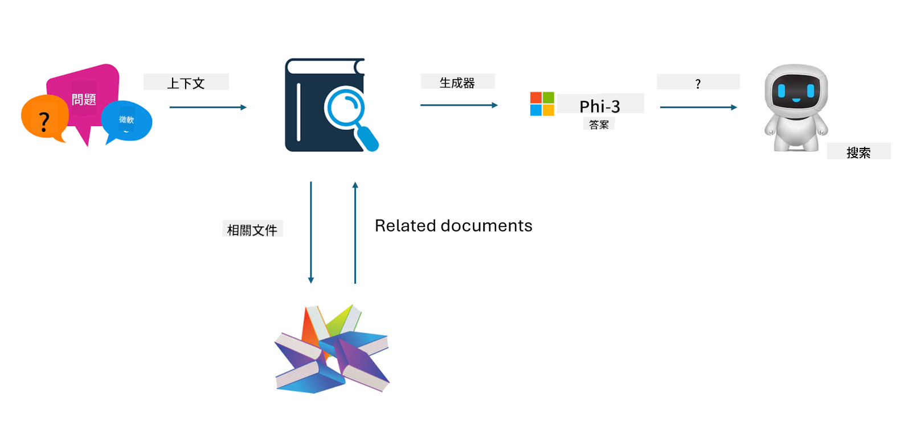

<!--
CO_OP_TRANSLATOR_METADATA:
{
  "original_hash": "ef0e3b9f4e65cc05e80efb30723aed40",
  "translation_date": "2025-04-04T19:10:27+00:00",
  "source_file": "md\\03.FineTuning\\LetPhi3gotoIndustriy.md",
  "language_code": "hk"
}
-->
# **讓 Phi-3 成為行業專家**

要將 Phi-3 模型應用到某個行業，需要將行業業務數據加入 Phi-3 模型。我們有兩種不同的選擇，第一是 RAG（檢索增強生成），第二是微調。

## **RAG 與微調的比較**

### **檢索增強生成（RAG）**

RAG 是數據檢索加上文本生成。企業的結構化數據和非結構化數據存儲在向量數據庫中。當搜索相關內容時，會找到相關摘要和內容形成上下文，結合 LLM/SLM 的文本完成能力生成內容。

### **微調**

微調是基於現有模型的改進。它不需要從模型算法開始，但需要不斷累積數據。如果希望在行業應用中使用更精確的術語和語言表達，微調是更好的選擇。但如果數據頻繁變化，微調可能會變得複雜。

### **如何選擇**

1. 如果我們的回答需要引入外部數據，RAG 是最佳選擇

2. 如果需要輸出穩定且精確的行業知識，微調會是一個好的選擇。RAG 優先拉取相關內容，但可能無法完全掌握專業細節。

3. 微調需要高質量的數據集，如果只是小範圍的數據，效果不會有太大差異。RAG 更靈活

4. 微調是個黑箱，帶有一定的神秘性，很難理解內部機制。但 RAG 可以更容易找到數據來源，從而有效調整幻覺或內容錯誤，並提供更好的透明度。

### **應用場景**

1. 垂直行業需要特定的專業詞彙和表達，***微調*** 是最佳選擇

2. 問答系統，涉及不同知識點的綜合，***RAG*** 是最佳選擇

3. 與自動化業務流程結合，***RAG + 微調*** 是最佳選擇

## **如何使用 RAG**

向量數據庫是一種以數學形式存儲數據的集合。向量數據庫讓機器學習模型更容易記住以前的輸入，從而支持搜索、推薦和文本生成等用例。數據可以基於相似度指標進行識別，而不是精確匹配，讓計算機模型能理解數據的上下文。

向量數據庫是實現 RAG 的關鍵。我們可以通過向量模型（如 text-embedding-3、jina-ai-embedding 等）將數據轉換為向量存儲。

了解更多如何創建 RAG 應用：[https://github.com/microsoft/Phi-3CookBook](https://github.com/microsoft/Phi-3CookBook?WT.mc_id=aiml-138114-kinfeylo)

## **如何使用微調**

微調中常用的算法有 Lora 和 QLora。如何選擇？
- [通過這個範例筆記本了解更多](../../../../code/04.Finetuning/Phi_3_Inference_Finetuning.ipynb)
- [Python 微調範例](../../../../code/04.Finetuning/FineTrainingScript.py)

### **Lora 與 QLora**

LoRA（低秩適配）和 QLoRA（量化低秩適配）都是用於微調大型語言模型（LLMs）的技術，採用參數高效微調（PEFT）。PEFT 技術旨在比傳統方法更高效地訓練模型。

LoRA 是一種獨立的微調技術，通過對權重更新矩陣進行低秩近似來減少內存占用。它提供快速的訓練時間，並保持接近傳統微調方法的性能。

QLoRA 是 LoRA 的擴展版本，結合了量化技術進一步減少內存使用。QLoRA 將預訓練 LLM 的權重參數量化為 4 位精度，比 LoRA 更節省內存。然而，由於額外的量化和反量化步驟，QLoRA 的訓練速度比 LoRA 慢約 30%。

QLoRA 使用 LoRA 作為輔助工具來修正量化過程中引入的錯誤。QLoRA 能夠在相對小型且容易獲得的 GPU 上微調擁有數十億參數的大型模型。例如，QLoRA 可以使用僅 2 塊 GPU 微調需要 36 塊 GPU 的 70B 參數模型。

**免責聲明**：  
此文件已使用AI翻譯服務[Co-op Translator](https://github.com/Azure/co-op-translator)進行翻譯。我們致力於提供準確的翻譯，但請注意，自動翻譯可能包含錯誤或不準確之處。原始文件的母語版本應被視為具有權威性的來源。對於重要信息，建議使用專業人工翻譯。我們對因使用此翻譯而產生的任何誤解或錯誤解釋不承擔責任。