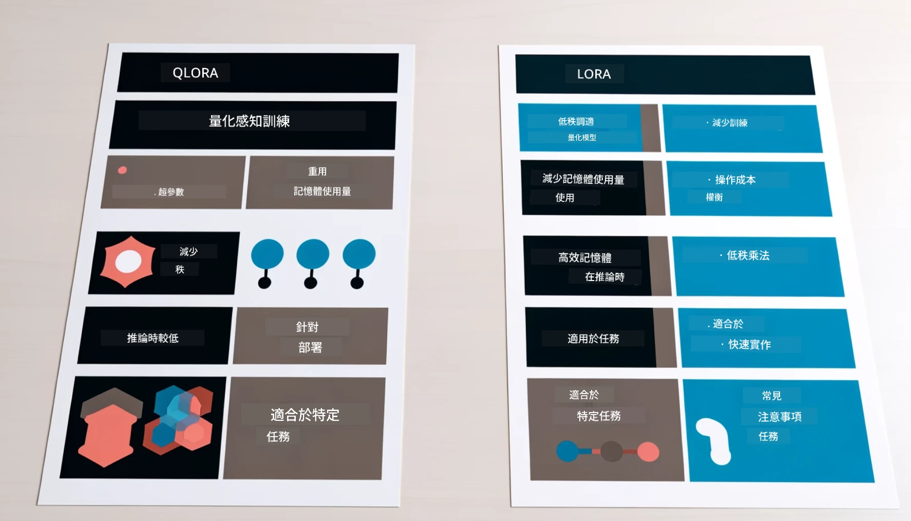

<!--
CO_OP_TRANSLATOR_METADATA:
{
  "original_hash": "743d7e9cb9c4e8ea642d77bee657a7fa",
  "translation_date": "2025-07-17T09:53:00+00:00",
  "source_file": "md/03.FineTuning/LetPhi3gotoIndustriy.md",
  "language_code": "hk"
}
-->
# **讓 Phi-3 成為行業專家**

要將 Phi-3 模型應用到某個行業，您需要將行業業務數據加入到 Phi-3 模型中。我們有兩種不同的選擇，第一是 RAG（檢索增強生成），第二是微調（Fine Tuning）。

## **RAG 與微調的比較**

### **檢索增強生成**

RAG 是資料檢索 + 文字生成。企業的結構化數據和非結構化數據會存儲在向量資料庫中。當搜尋相關內容時，會找到相關的摘要和內容組成上下文，並結合 LLM/SLM 的文本補全能力來生成內容。

### **微調**

微調是基於某個模型的改進。它不需要從模型算法開始，但需要持續累積數據。如果您希望在行業應用中使用更精確的術語和語言表達，微調會是更好的選擇。但如果您的數據經常變動，微調可能會變得複雜。

### **如何選擇**

1. 如果我們的回答需要引入外部數據，RAG 是最佳選擇。

2. 如果您需要輸出穩定且精確的行業知識，微調會是好選擇。RAG 優先拉取相關內容，但可能無法完全掌握專業細節。

3. 微調需要高品質的數據集，如果數據範圍很小，效果不會太明顯。RAG 則更靈活。

4. 微調像是一個黑盒子，較難理解其內部機制；而 RAG 可以更容易找到數據來源，有效調整幻覺或內容錯誤，並提供更好的透明度。

### **應用場景**

1. 垂直行業需要特定專業詞彙和表達，***微調*** 是最佳選擇。

2. 問答系統，涉及不同知識點的綜合，***RAG*** 是最佳選擇。

3. 自動化業務流程結合 ***RAG + 微調*** 是最佳選擇。

## **如何使用 RAG**

向量資料庫是以數學形式存儲資料的集合。向量資料庫讓機器學習模型更容易記住之前的輸入，從而支持搜尋、推薦和文本生成等應用。資料可以根據相似度指標而非精確匹配來識別，讓模型能理解資料的上下文。

向量資料庫是實現 RAG 的關鍵。我們可以通過 text-embedding-3、jina-ai-embedding 等向量模型將數據轉換成向量存儲。

了解更多關於建立 RAG 應用 [https://github.com/microsoft/Phi-3CookBook](https://github.com/microsoft/Phi-3CookBook?WT.mc_id=aiml-138114-kinfeylo)

## **如何使用微調**

微調中常用的算法有 Lora 和 QLora。如何選擇？
- [透過此範例筆記本了解更多](../../../../code/04.Finetuning/Phi_3_Inference_Finetuning.ipynb)
- [Python 微調範例示例](../../../../code/04.Finetuning/FineTrainingScript.py)

### **Lora 與 QLora**

LoRA（低秩適配）和 QLoRA（量化低秩適配）都是用於微調大型語言模型（LLM）的參數高效微調（PEFT）技術。PEFT 技術旨在比傳統方法更有效率地訓練模型。

LoRA 是一種獨立的微調技術，通過對權重更新矩陣進行低秩近似來減少記憶體佔用。它訓練速度快，且性能接近傳統微調方法。

QLoRA 是 LoRA 的擴展版本，結合了量化技術進一步降低記憶體使用。QLoRA 將預訓練 LLM 的權重參數量化到 4 位元精度，比 LoRA 更節省記憶體。但由於額外的量化和反量化步驟，QLoRA 的訓練速度比 LoRA 慢約 30%。

QLoRA 使用 LoRA 作為輔助來修正量化過程中引入的誤差。QLoRA 使得在相對小型且普及的 GPU 上微調擁有數十億參數的超大模型成為可能。例如，QLoRA 可以用 2 張 GPU 微調一個需要 36 張 GPU 的 70B 參數模型。

**免責聲明**：  
本文件由 AI 翻譯服務 [Co-op Translator](https://github.com/Azure/co-op-translator) 進行翻譯。雖然我們致力於確保準確性，但請注意，自動翻譯可能包含錯誤或不準確之處。原始文件的母語版本應被視為權威來源。對於重要資訊，建議採用專業人工翻譯。我們不對因使用本翻譯而引起的任何誤解或誤釋承擔責任。