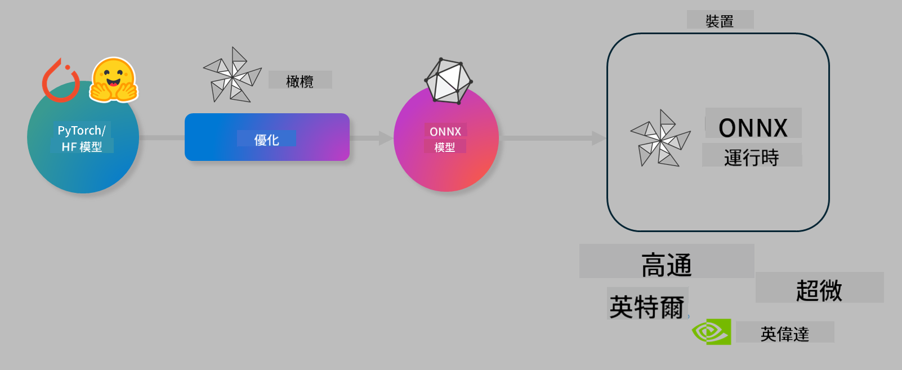

<!--
CO_OP_TRANSLATOR_METADATA:
{
  "original_hash": "6bbe47de3b974df7eea29dfeccf6032b",
  "translation_date": "2025-05-08T05:23:26+00:00",
  "source_file": "md/03.FineTuning/olive-lab/readme.md",
  "language_code": "hk"
}
-->
# Lab. 優化 AI 模型作本地推理

## 簡介

> [!IMPORTANT]  
> 本實驗室需要安裝有 Nvidia A10 或 A100 GPU 及相關驅動程式和 CUDA 工具包（版本 12+）。

> [!NOTE]  
> 這是一個 **35 分鐘** 的實驗室，讓你實際體驗如何使用 OLIVE 進行模型優化，達成本地推理的核心概念。

## 學習目標

完成本實驗室後，你將能夠使用 OLIVE 來：

- 使用 AWQ 量化方法對 AI 模型進行量化。
- 針對特定任務微調 AI 模型。
- 生成 LoRA 適配器（微調後模型），以便在 ONNX Runtime 上高效進行本地推理。

### 什麼是 Olive

Olive (*O*NNX *live*) 是一個模型優化工具包，配有 CLI，讓你能夠為 ONNX runtime +++https://onnxruntime.ai+++ 打包模型，兼顧品質與效能。



Olive 的輸入通常是 PyTorch 或 Hugging Face 模型，輸出則是優化過的 ONNX 模型，會在運行 ONNX runtime 的設備（部署目標）上執行。Olive 會根據部署目標的 AI 加速器（NPU、GPU、CPU），由 Qualcomm、AMD、Nvidia 或 Intel 等硬件廠商提供的設備，來優化模型。

Olive 執行一個 *workflow*，即一連串有序的模型優化任務，稱為 *passes* — 例如模型壓縮、圖捕捉、量化、圖優化等。每個 pass 有一組可調參數，用來達到最佳的指標，例如準確度和延遲，這些會由對應的評估器來評估。Olive 採用搜尋策略，利用搜尋演算法自動調整每個 pass，無論是逐一還是同時調整多個 passes。

#### Olive 的好處

- **減少手動試錯的挫折與時間**，針對圖優化、壓縮和量化等不同技術進行嘗試。設定你的品質和效能限制，讓 Olive 自動找到最佳模型。
- **超過 40 個內建模型優化元件**，涵蓋量化、壓縮、圖優化及微調的先進技術。
- **易用的 CLI**，適用於常見模型優化任務。例如 olive quantize、olive auto-opt、olive finetune。
- 內建模型打包與部署功能。
- 支援生成用於 **Multi LoRA 服務** 的模型。
- 使用 YAML/JSON 建構 workflow，協調模型優化與部署任務。
- 與 **Hugging Face** 及 **Azure AI** 整合。
- 內建 **快取** 機制，幫助 **節省成本**。

## 實驗室指引

> [!NOTE]  
> 請確保你已建立 Azure AI Hub 和 Project，並根據 Lab 1 設定好 A100 計算資源。

### 步驟 0：連接到你的 Azure AI 計算資源

你會用 **VS Code** 的遠端功能連接 Azure AI 計算資源。

1. 開啟你的 **VS Code** 桌面應用程式。  
1. 按 **Shift+Ctrl+P** 開啟 **指令面板**。  
1. 在指令面板中搜尋 **AzureML - remote: Connect to compute instance in New Window**。  
1. 按指示操作，選擇你的 Azure 訂閱、資源群組、專案和 Lab 1 中設定的計算資源名稱。  
1. 連接成功後，Azure ML 計算節點會顯示在 Visual Code 左下角 `><Azure ML: Compute Name`。

### 步驟 1：複製此儲存庫

在 VS Code 中，按 **Ctrl+J** 開啟新終端機，然後複製此儲存庫：

終端機中會出現提示

```
azureuser@computername:~/cloudfiles/code$ 
```  
複製解決方案  

```bash
cd ~/localfiles
git clone https://github.com/microsoft/phi-3cookbook.git
```

### 步驟 2：在 VS Code 中開啟資料夾

在終端機執行以下命令以在相關資料夾中開啟 VS Code 新視窗：

```bash
code phi-3cookbook/code/04.Finetuning/Olive-lab
```

你也可以透過選擇 **File** > **Open Folder** 來開啟資料夾。

### 步驟 3：安裝相依套件

在 VS Code 的 Azure AI 計算實例中開啟終端機（提示：**Ctrl+J**），執行以下指令安裝相依套件：

```bash
conda create -n olive-ai python=3.11 -y
conda activate olive-ai
pip install -r requirements.txt
az extension remove -n azure-cli-ml
az extension add -n ml
```

> [!NOTE]  
> 安裝所有相依套件約需 5 分鐘。

本實驗室會下載並上傳模型到 Azure AI 模型目錄。為了能使用模型目錄，你需要登入 Azure：

```bash
az login
```

> [!NOTE]  
> 登入時會要求選擇訂閱，請確保選擇本實驗室提供的訂閱。

### 步驟 4：執行 Olive 指令

在 VS Code 的 Azure AI 計算實例中開啟終端機（提示：**Ctrl+J**），並確認已啟用 `olive-ai` conda 環境：

```bash
conda activate olive-ai
```

接著，在命令列執行以下 Olive 指令。

1. **檢視資料：** 本範例將微調 Phi-3.5-Mini 模型，使其專門回答旅遊相關問題。以下程式碼會顯示資料集前幾筆紀錄，格式為 JSON lines：

    ```bash
    head data/data_sample_travel.jsonl
    ```

1. **量化模型：** 在訓練前先用以下指令量化模型，採用稱為 Active Aware Quantization (AWQ) +++https://arxiv.org/abs/2306.00978+++ 的技術。AWQ 會根據推理時產生的激活值來量化模型權重，這意味著量化過程會考慮激活的實際資料分布，較傳統權重量化方法更能保留模型準確度。

    ```bash
    olive quantize \
       --model_name_or_path microsoft/Phi-3.5-mini-instruct \
       --trust_remote_code \
       --algorithm awq \
       --output_path models/phi/awq \
       --log_level 1
    ```

    AWQ 量化約需 **8 分鐘**，能將模型大小從約 7.5GB 減少到約 2.5GB。

    本實驗室示範如何從 Hugging Face 輸入模型（例如：`microsoft/Phi-3.5-mini-instruct`). However, Olive also allows you to input models from the Azure AI catalog by updating the `model_name_or_path` argument to an Azure AI asset ID (for example:  `azureml://registries/azureml/models/Phi-3.5-mini-instruct/versions/4`). 

1. **Train the model:** Next, the `olive finetune` 指令微調量化後模型。先量化再微調通常比先微調後量化準確度更佳，因為微調過程可恢復部分量化帶來的準確度損失。

    ```bash
    olive finetune \
        --method lora \
        --model_name_or_path models/phi/awq \
        --data_files "data/data_sample_travel.jsonl" \
        --data_name "json" \
        --text_template "<|user|>\n{prompt}<|end|>\n<|assistant|>\n{response}<|end|>" \
        --max_steps 100 \
        --output_path ./models/phi/ft \
        --log_level 1
    ```

    微調（100 步）約需 **6 分鐘**。

1. **優化模型：** 訓練完成後，使用 Olive 的 `auto-opt` command, which will capture the ONNX graph and automatically perform a number of optimizations to improve the model performance for CPU by compressing the model and doing fusions. It should be noted, that you can also optimize for other devices such as NPU or GPU by just updating the `--device` and `--provider` 參數優化模型，但本實驗室以 CPU 為例。

    ```bash
    olive auto-opt \
       --model_name_or_path models/phi/ft/model \
       --adapter_path models/phi/ft/adapter \
       --device cpu \
       --provider CPUExecutionProvider \
       --use_ort_genai \
       --output_path models/phi/onnx-ao \
       --log_level 1
    ```

    優化約需 **5 分鐘**。

### 步驟 5：模型推理快速測試

為測試模型推理，在資料夾中建立 Python 檔案 **app.py**，並貼上以下程式碼：

```python
import onnxruntime_genai as og
import numpy as np

print("loading model and adapters...", end="", flush=True)
model = og.Model("models/phi/onnx-ao/model")
adapters = og.Adapters(model)
adapters.load("models/phi/onnx-ao/model/adapter_weights.onnx_adapter", "travel")
print("DONE!")

tokenizer = og.Tokenizer(model)
tokenizer_stream = tokenizer.create_stream()

params = og.GeneratorParams(model)
params.set_search_options(max_length=100, past_present_share_buffer=False)
user_input = "what is the best thing to see in chicago"
params.input_ids = tokenizer.encode(f"<|user|>\n{user_input}<|end|>\n<|assistant|>\n")

generator = og.Generator(model, params)

generator.set_active_adapter(adapters, "travel")

print(f"{user_input}")

while not generator.is_done():
    generator.compute_logits()
    generator.generate_next_token()

    new_token = generator.get_next_tokens()[0]
    print(tokenizer_stream.decode(new_token), end='', flush=True)

print("\n")
```

使用以下指令執行程式：

```bash
python app.py
```

### 步驟 6：上傳模型到 Azure AI

將模型上傳到 Azure AI 模型庫，可讓團隊其他成員共用模型，並管理版本控制。執行以下指令上傳模型：

> [!NOTE]  
> 請更新 `{}` placeholders with the name of your resource group and Azure AI Project Name. 

To find your resource group `"resourceGroup"` 及 Azure AI 專案名稱後執行以下指令。

```
az ml workspace show
```

或到 +++ai.azure.com+++，選擇 **management center** > **project** > **overview**

將 `{}` 佔位符更新為你的資源群組名稱及 Azure AI 專案名稱。

```bash
az ml model create \
    --name ft-for-travel \
    --version 1 \
    --path ./models/phi/onnx-ao \
    --resource-group {RESOURCE_GROUP_NAME} \
    --workspace-name {PROJECT_NAME}
```

你即可在 https://ml.azure.com/model/list 查看已上傳模型並進行部署。

**免責聲明**：  
本文件係使用 AI 翻譯服務 [Co-op Translator](https://github.com/Azure/co-op-translator) 進行翻譯。雖然我哋盡力確保準確性，但請注意，自動翻譯可能包含錯誤或不準確之處。原文文件嘅母語版本應視為權威來源。對於重要資訊，建議使用專業人工翻譯。我哋對因使用本翻譯而引致嘅任何誤解或誤釋概不負責。