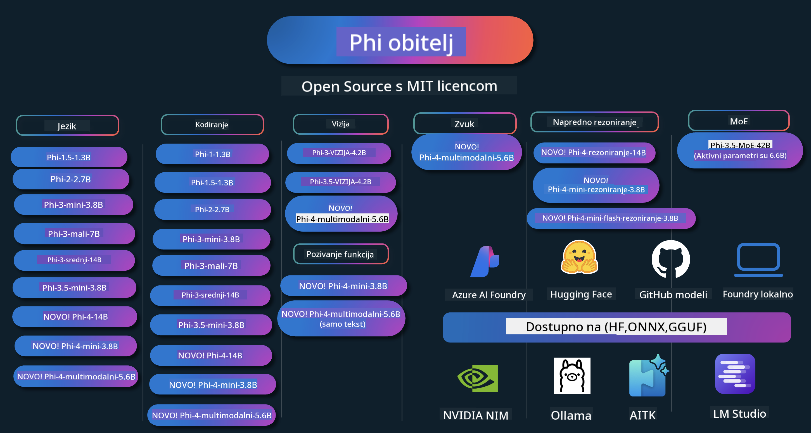

<!--
CO_OP_TRANSLATOR_METADATA:
{
  "original_hash": "c2e4b490f4bd424b095f21e38c6af33b",
  "translation_date": "2026-01-05T15:27:25+00:00",
  "source_file": "README.md",
  "language_code": "hr"
}
-->
# Phi Priručnik: Primjeri za praktičnu upotrebu s Microsoftovim Phi modelima

[](https://codespaces.new/microsoft/phicookbook)
[](https://vscode.dev/redirect?url=vscode://ms-vscode-remote.remote-containers/cloneInVolume?url=https://github.com/microsoft/phicookbook)

[](https://GitHub.com/microsoft/phicookbook/graphs/contributors/?WT.mc_id=aiml-137032-kinfeylo)
[](https://GitHub.com/microsoft/phicookbook/issues/?WT.mc_id=aiml-137032-kinfeylo)
[](https://GitHub.com/microsoft/phicookbook/pulls/?WT.mc_id=aiml-137032-kinfeylo)
[](http://makeapullrequest.com?WT.mc_id=aiml-137032-kinfeylo)

[](https://GitHub.com/microsoft/phicookbook/watchers/?WT.mc_id=aiml-137032-kinfeylo)
[](https://GitHub.com/microsoft/phicookbook/network/?WT.mc_id=aiml-137032-kinfeylo)
[](https://GitHub.com/microsoft/phicookbook/stargazers/?WT.mc_id=aiml-137032-kinfeylo)

[](https://discord.com/invite/ByRwuEEgH4)

Phi je serija modela umjetne inteligencije otvorenog koda koje je razvio Microsoft.

Phi je trenutno najsnažniji i najisplativiji mali jezični model (SLM), s vrlo dobrim rezultatima na testovima za više jezika, rezoniranje, generiranje teksta/razgovora, kodiranje, slike, zvuk i druge scenarije.

Phi možete implementirati u oblak ili na uređaje na rubu mreže, a lako možete izgraditi generativne AI aplikacije s ograničenom računalnom snagom.

Slijedite ove korake da biste počeli koristiti ove resurse:
1. **Forkajte repozitorij**: Kliknite [](https://GitHub.com/microsoft/phicookbook/network/?WT.mc_id=aiml-137032-kinfeylo)
2. **Klona repozitorij**: `git clone https://github.com/microsoft/PhiCookBook.git`
3. [**Pridružite se Microsoft AI Discord zajednici i upoznajte stručnjake i kolege developere**](https://discord.com/invite/ByRwuEEgH4?WT.mc_id=aiml-137032-kinfeylo)



### 🌐 Višejezična podrška

#### Podržano putem GitHub Action (Automatski i uvijek ažurno)

<!-- CO-OP TRANSLATOR LANGUAGES TABLE START -->
[Arapski](../ar/README.md) | [Bengalski](../bn/README.md) | [Bugarski](../bg/README.md) | [Burmanski (Mjanmar)](../my/README.md) | [Kineski (pojednostavljeni)](../zh/README.md) | [Kineski (tradicionalni, Hong Kong)](../hk/README.md) | [Kineski (tradicionalni, Makao)](../mo/README.md) | [Kineski (tradicionalni, Tajvan)](../tw/README.md) | [Hrvatski](./README.md) | [Češki](../cs/README.md) | [Danski](../da/README.md) | [Nizozemski](../nl/README.md) | [Estonski](../et/README.md) | [Finski](../fi/README.md) | [Francuski](../fr/README.md) | [Njemački](../de/README.md) | [Grčki](../el/README.md) | [Hebrejski](../he/README.md) | [Hindi](../hi/README.md) | [Mađarski](../hu/README.md) | [Indonezijski](../id/README.md) | [Talijanski](../it/README.md) | [Japanski](../ja/README.md) | [Kannada](../kn/README.md) | [Korejski](../ko/README.md) | [Litavski](../lt/README.md) | [Malajski](../ms/README.md) | [Malajalamski](../ml/README.md) | [Marati](../mr/README.md) | [Nepalski](../ne/README.md) | [Nigerijski pidžin](../pcm/README.md) | [Norveški](../no/README.md) | [Perzijski (Farsi)](../fa/README.md) | [Poljski](../pl/README.md) | [Portugalski (Brazil)](../br/README.md) | [Portugalski (Portugal)](../pt/README.md) | [Punjabi (Gurmukhi)](../pa/README.md) | [Rumunjski](../ro/README.md) | [Ruski](../ru/README.md) | [Srpski (ćirilica)](../sr/README.md) | [Slovački](../sk/README.md) | [Slovenski](../sl/README.md) | [Španjolski](../es/README.md) | [Svahili](../sw/README.md) | [Švedski](../sv/README.md) | [Tagalog (Filipinski)](../tl/README.md) | [Tamilski](../ta/README.md) | [Telugu](../te/README.md) | [Tajlandski](../th/README.md) | [Turski](../tr/README.md) | [Ukrajinski](../uk/README.md) | [Urdu](../ur/README.md) | [Vijetnamski](../vi/README.md)

> **Radije klonirati lokalno?**

> Ovaj repozitorij uključuje preko 50 prijevoda jezika koji znatno povećavaju veličinu preuzimanja. Za kloniranje bez prijevoda koristite sparse checkout:
> ```bash
> git clone --filter=blob:none --sparse https://github.com/microsoft/PhiCookBook.git
> cd PhiCookBook
> git sparse-checkout set --no-cone '/*' '!translations' '!translated_images'
> ```
> Ovo vam daje sve što vam je potrebno za dovršetak tečaja znatno brže preuzimanje.
<!-- CO-OP TRANSLATOR LANGUAGES TABLE END -->

## Sadržaj

- Uvod
  - [Dobrodošli u Phi obitelj](./md/01.Introduction/01/01.PhiFamily.md)
  - [Postavljanje vašeg okruženja](./md/01.Introduction/01/01.EnvironmentSetup.md)
  - [Razumijevanje ključnih tehnologija](./md/01.Introduction/01/01.Understandingtech.md)
  - [Sigurnost AI za Phi modele](./md/01.Introduction/01/01.AISafety.md)
  - [Podrška za Phi hardver](./md/01.Introduction/01/01.Hardwaresupport.md)
  - [Phi modeli i dostupnost na platformama](./md/01.Introduction/01/01.Edgeandcloud.md)
  - [Korištenje Guidance-ai i Phi](./md/01.Introduction/01/01.Guidance.md)
  - [GitHub Marketplace modeli](https://github.com/marketplace/models)
  - [Azure AI katalog modela](https://ai.azure.com)

- Izvođenje Phi u različitim okruženjima
    -  [Hugging face](./md/01.Introduction/02/01.HF.md)
    -  [GitHub modeli](./md/01.Introduction/02/02.GitHubModel.md)
    -  [Azure AI Foundry katalog modela](./md/01.Introduction/02/03.AzureAIFoundry.md)
    -  [Ollama](./md/01.Introduction/02/04.Ollama.md)
    -  [AI Toolkit VSCode (AITK)](./md/01.Introduction/02/05.AITK.md)
    -  [NVIDIA NIM](./md/01.Introduction/02/06.NVIDIA.md)
    -  [Foundry lokalno](./md/01.Introduction/02/07.FoundryLocal.md)

- Izvođenje Phi obitelji
    - [Izvođenje Phi na iOS](./md/01.Introduction/03/iOS_Inference.md)
    - [Izvođenje Phi na Android](./md/01.Introduction/03/Android_Inference.md)
    - [Izvođenje Phi na Jetson](./md/01.Introduction/03/Jetson_Inference.md)
    - [Izvođenje Phi na AI PC](./md/01.Introduction/03/AIPC_Inference.md)
    - [Izvođenje Phi s Apple MLX frameworkom](./md/01.Introduction/03/MLX_Inference.md)
    - [Izvođenje Phi na lokalnom serveru](./md/01.Introduction/03/Local_Server_Inference.md)
    - [Izvođenje Phi na udaljenom serveru koristeći AI Toolkit](./md/01.Introduction/03/Remote_Interence.md)
    - [Izvođenje Phi s Rust](./md/01.Introduction/03/Rust_Inference.md)
    - [Izvođenje Phi--Vision lokalno](./md/01.Introduction/03/Vision_Inference.md)
    - [Izvođenje Phi s Kaito AKS, Azure Containers (službena podrška)](./md/01.Introduction/03/Kaito_Inference.md)
-  [Kvantificiranje Phi obitelji](./md/01.Introduction/04/QuantifyingPhi.md)
    - [Kvantiziranje Phi-3.5 / 4 pomoću llama.cpp](./md/01.Introduction/04/UsingLlamacppQuantifyingPhi.md)
    - [Kvantiziranje Phi-3.5 / 4 pomoću Generative AI ekstenzija za onnxruntime](./md/01.Introduction/04/UsingORTGenAIQuantifyingPhi.md)
    - [Kvantiziranje Phi-3.5 / 4 pomoću Intel OpenVINO](./md/01.Introduction/04/UsingIntelOpenVINOQuantifyingPhi.md)
    - [Kvantiziranje Phi-3.5 / 4 pomoću Apple MLX frameworka](./md/01.Introduction/04/UsingAppleMLXQuantifyingPhi.md)

-  Procjena Phi
    - [Odgovorni AI](./md/01.Introduction/05/ResponsibleAI.md)
    - [Azure AI Foundry za procjenu](./md/01.Introduction/05/AIFoundry.md)
    - [Korištenje Promptflow za procjenu](./md/01.Introduction/05/Promptflow.md)
 
- RAG s Azure AI pretraživanjem
    - [Kako koristiti Phi-4-mini i Phi-4-multimodal (RAG) sa Azure AI pretraživanjem](https://github.com/microsoft/PhiCookBook/blob/main/code/06.E2E/E2E_Phi-4-RAG-Azure-AI-Search.ipynb)

- Primjeri razvoja Phi aplikacija
  - Tekstualne i chat aplikacije
    - Phi-4 primjeri 🆕
      - [📓] [Razgovor s Phi-4-mini ONNX modelom](./md/02.Application/01.TextAndChat/Phi4/ChatWithPhi4ONNX/README.md)
      - [Razgovor s Phi-4 lokalnim ONNX modelom u .NET](../../md/04.HOL/dotnet/src/LabsPhi4-Chat-01OnnxRuntime)
      - [Razgovor .NET konzolna aplikacija s Phi-4 ONNX koristeći Semantic Kernel](../../md/04.HOL/dotnet/src/LabsPhi4-Chat-02SK)
    - Phi-3 / 3.5 primjeri
      - [Lokalni chatbot u pregledniku koristeći Phi3, ONNX Runtime Web i WebGPU](https://github.com/microsoft/onnxruntime-inference-examples/tree/main/js/chat)
      - [OpenVino razgovor](./md/02.Application/01.TextAndChat/Phi3/E2E_OpenVino_Chat.md)
      - [Višestruki model - Interaktivni Phi-3-mini i OpenAI Whisper](./md/02.Application/01.TextAndChat/Phi3/E2E_Phi-3-mini_with_whisper.md)
      - [MLFlow - Izgradnja omotnice i korištenje Phi-3 s MLFlow](./md//02.Application/01.TextAndChat/Phi3/E2E_Phi-3-MLflow.md)
      - [Optimizacija modela - Kako optimizirati Phi-3-min model za ONNX Runtime Web koristeći Olive](https://github.com/microsoft/Olive/tree/main/examples/phi3)
      - [WinUI3 aplikacija s Phi-3 mini-4k-instruct-onnx](https://github.com/microsoft/Phi3-Chat-WinUI3-Sample/)
      -[WinUI3 Višestruki Model AI Pogonjena Aplikacija za Bilješke Primjer](https://github.com/microsoft/ai-powered-notes-winui3-sample)
      - [Fino podešavanje i integracija prilagođenih Phi-3 modela s Prompt flow](./md/02.Application/01.TextAndChat/Phi3/E2E_Phi-3-FineTuning_PromptFlow_Integration.md)
      - [Fino podešavanje i integracija prilagođenih Phi-3 modela s Prompt flow u Azure AI Foundry](./md/02.Application/01.TextAndChat/Phi3/E2E_Phi-3-FineTuning_PromptFlow_Integration_AIFoundry.md)
      - [Evaluacija fino podešenog Phi-3 / Phi-3.5 modela u Azure AI Foundry s naglaskom na Microsoftova načela odgovornog AI](./md/02.Application/01.TextAndChat/Phi3/E2E_Phi-3-Evaluation_AIFoundry.md)
      - [📓] [Phi-3.5-mini-instruct primjer predviđanja jezika (kineski/engleski)](./md/02.Application/01.TextAndChat/Phi3/phi3-instruct-demo.ipynb)
      - [Phi-3.5-Instruct WebGPU RAG Chatbot](./md/02.Application/01.TextAndChat/Phi3/WebGPUWithPhi35Readme.md)
      - [Korištenje Windows GPU za izradu Prompt flow rješenja s Phi-3.5-Instruct ONNX](./md/02.Application/01.TextAndChat/Phi3/UsingPromptFlowWithONNX.md)
      - [Korištenje Microsoft Phi-3.5 tflite za izradu Android aplikacije](./md/02.Application/01.TextAndChat/Phi3/UsingPhi35TFLiteCreateAndroidApp.md)
      - [Q&A .NET primjer koji koristi lokalni ONNX Phi-3 model koristeći Microsoft.ML.OnnxRuntime](../../md/04.HOL/dotnet/src/LabsPhi301)
      - [Konzolna chat .NET aplikacija sa Semantic Kernel i Phi-3](../../md/04.HOL/dotnet/src/LabsPhi302)

  - Azure AI Inference SDK Primjeri Temeljem Koda
    - Phi-4 Primjeri 🆕
      - [📓] [Generiranje koda projekta koristeći Phi-4-multimodal](./md/02.Application/02.Code/Phi4/GenProjectCode/README.md)
    - Phi-3 / 3.5 Primjeri
      - [Izgradite vlastiti Visual Studio Code GitHub Copilot Chat s Microsoft Phi-3 obitelji](./md/02.Application/02.Code/Phi3/VSCodeExt/README.md)
      - [Kreirajte vlastitog Visual Studio Code Chat Copilot agenta s Phi-3.5 pomoću GitHub modela](/md/02.Application/02.Code/Phi3/CreateVSCodeChatAgentWithGitHubModels.md)

  - Primjeri Naprednog Razmišljanja
    - Phi-4 Primjeri 🆕
      - [📓] [Phi-4-mini-razmišljanje ili Phi-4-razmišljanje Primjeri](./md/02.Application/03.AdvancedReasoning/Phi4/AdvancedResoningPhi4mini/README.md)
      - [📓] [Fino podešavanje Phi-4-mini-razmišljanja s Microsoft Olive](./md/02.Application/03.AdvancedReasoning/Phi4/AdvancedResoningPhi4mini/olive_ft_phi_4_reasoning_with_medicaldata.ipynb)
      - [📓] [Fino podešavanje Phi-4-mini-razmišljanja s Apple MLX](./md/02.Application/03.AdvancedReasoning/Phi4/AdvancedResoningPhi4mini/mlx_ft_phi_4_reasoning_with_medicaldata.ipynb)
      - [📓] [Phi-4-mini-razmišljanje s GitHub modelima](./md/02.Application/02.Code/Phi4r/github_models_inference.ipynb)
      - [📓] [Phi-4-mini-razmišljanje s Azure AI Foundry modelima](./md/02.Application/02.Code/Phi4r/azure_models_inference.ipynb)
  - Demo Primjeri
      - [Phi-4-mini demo primjeri hostani na Hugging Face Spaces](https://huggingface.co/spaces/microsoft/phi-4-mini?WT.mc_id=aiml-137032-kinfeylo)
      - [Phi-4-multimodal demo primjeri hostani na Hugginge Face Spaces](https://huggingface.co/spaces/microsoft/phi-4-multimodal?WT.mc_id=aiml-137032-kinfeylo)
  - Primjeri Vizije
    - Phi-4 Primjeri 🆕
      - [📓] [Korištenje Phi-4-multimodal za čitanje slika i generiranje koda](./md/02.Application/04.Vision/Phi4/CreateFrontend/README.md) 
    - Phi-3 / 3.5 Primjeri
      -  [📓][Phi-3-vision-Slika tekst na tekst](./md/02.Application/04.Vision/Phi3/E2E_Phi-3-vision-image-text-to-text-online-endpoint.ipynb)
      - [Phi-3-vision-ONNX](https://onnxruntime.ai/docs/genai/tutorials/phi3-v.html)
      - [📓][Phi-3-vision CLIP Ugradnja](./md/02.Application/04.Vision/Phi3/E2E_Phi-3-vision-image-text-to-text-online-endpoint.ipynb)
      - [DEMO: Phi-3 Recikliranje](https://github.com/jennifermarsman/PhiRecycling/)
      - [Phi-3-vision - vizualni jezični pomoćnik - s Phi3-Vision i OpenVINO](https://docs.openvino.ai/nightly/notebooks/phi-3-vision-with-output.html)
      - [Phi-3 Vizija Nvidia NIM](./md/02.Application/04.Vision/Phi3/E2E_Nvidia_NIM_Vision.md)
      - [Phi-3 Vizija OpenVino](./md/02.Application/04.Vision/Phi3/E2E_OpenVino_Phi3Vision.md)
      - [📓][Phi-3.5 Vision višeframe ili više slika primjer](./md/02.Application/04.Vision/Phi3/phi3-vision-demo.ipynb)
      - [Phi-3 Vizija Lokalni ONNX model koristeći Microsoft.ML.OnnxRuntime .NET](../../md/04.HOL/dotnet/src/LabsPhi303)
      - [Izbornik baziran Phi-3 Vizija Lokalni ONNX model koristeći Microsoft.ML.OnnxRuntime .NET](../../md/04.HOL/dotnet/src/LabsPhi304)

  - Matematički Primjeri
    -  Phi-4-Mini-Flash-Razmišljanje-Upute Primjeri 🆕 [Matematički demo s Phi-4-Mini-Flash-Razmišljanje-Upute](./md/02.Application/09.Math/MathDemo.ipynb)

  - Audio Primjeri
    - Phi-4 Primjeri 🆕
      - [📓] [Izdvajanje audio transkripata koristeći Phi-4-multimodal](./md/02.Application/05.Audio/Phi4/Transciption/README.md)
      - [📓] [Phi-4-multimodal Audio Primjer](./md/02.Application/05.Audio/Phi4/Siri/demo.ipynb)
      - [📓] [Phi-4-multimodal Primjer prevoda govora](./md/02.Application/05.Audio/Phi4/Translate/demo.ipynb)
      - [.NET konzolna aplikacija koristeći Phi-4-multimodal Audio za analizu audio datoteke i generiranje transkripta](../../md/04.HOL/dotnet/src/LabsPhi4-MultiModal-02Audio)

  - MOE Primjeri
    - Phi-3 / 3.5 Primjeri
      - [📓] [Phi-3.5 Mješavina Eksperata Modeli (MoEs) Primjer društvenih mreža](./md/02.Application/06.MoE/Phi3/phi3_moe_demo.ipynb)
      - [📓] [Izgradnja Retrieval-Augmented Generation (RAG) Pipelejna s NVIDIA NIM Phi-3 MOE, Azure AI Search i LlamaIndex](./md/02.Application/06.MoE/Phi3/azure-ai-search-nvidia-rag.ipynb)
      - 
  - Primjeri Pozivanja Funkcija
    - Phi-4 Primjeri 🆕
      -  [📓] [Korištenje Pozivanja Funkcija s Phi-4-mini](./md/02.Application/07.FunctionCalling/Phi4/FunctionCallingBasic/README.md)
      -  [📓] [Korištenje Pozivanja Funkcija za kreiranje više agenata s Phi-4-mini](./md/02.Application/07.FunctionCalling/Phi4/Multiagents/Phi_4_mini_multiagent.ipynb)
      -  [📓] [Korištenje Pozivanja Funkcija s Ollama](./md/02.Application/07.FunctionCalling/Phi4/Ollama/ollama_functioncalling.ipynb)
      -  [📓] [Korištenje Pozivanja Funkcija s ONNX](./md/02.Application/07.FunctionCalling/Phi4/ONNX/onnx_parallel_functioncalling.ipynb)
  - Primjeri Miješanja Multimodala
    - Phi-4 Primjeri 🆕
      -  [📓] [Korištenje Phi-4-multimodal kao Tehnološki novinar](./md/02.Application/08.Multimodel/Phi4/TechJournalist/phi_4_mm_audio_text_publish_news.ipynb)
      - [.NET konzolna aplikacija koristeći Phi-4-multimodal za analizu slika](../../md/04.HOL/dotnet/src/LabsPhi4-MultiModal-01Images)

- Fino podešavanje Phi Primjera
  - [Scenariji fino podešavanja](./md/03.FineTuning/FineTuning_Scenarios.md)
  - [Fino podešavanje vs RAG](./md/03.FineTuning/FineTuning_vs_RAG.md)
  - [Fino podešavanje Da Phi-3 postane industrijski stručnjak](./md/03.FineTuning/LetPhi3gotoIndustriy.md)
  - [Fino podešavanje Phi-3 s AI toolkitom za VS Code](./md/03.FineTuning/Finetuning_VSCodeaitoolkit.md)
  - [Fino podešavanje Phi-3 s Azure Machine Learning uslugom](./md/03.FineTuning/Introduce_AzureML.md)
  - [Fino podešavanje Phi-3 s Lora](./md/03.FineTuning/FineTuning_Lora.md)
  - [Fino podešavanje Phi-3 s QLora](./md/03.FineTuning/FineTuning_Qlora.md)
  - [Fino podešavanje Phi-3 s Azure AI Foundry](./md/03.FineTuning/FineTuning_AIFoundry.md)
  - [Fino podešavanje Phi-3 s Azure ML CLI/SDK](./md/03.FineTuning/FineTuning_MLSDK.md)
  - [Fino podešavanje s Microsoft Olive](./md/03.FineTuning/FineTuning_MicrosoftOlive.md)
  - [Praktična laboratorija za fino podešavanje s Microsoft Olive](./md/03.FineTuning/olive-lab/readme.md)
  - [Fino podešavanje Phi-3-vision s Weights and Bias](./md/03.FineTuning/FineTuning_Phi-3-visionWandB.md)
  - [Fino podešavanje Phi-3 s Apple MLX Framework](./md/03.FineTuning/FineTuning_MLX.md)
  - [Fino podešavanje Phi-3-vision (službena podrška)](./md/03.FineTuning/FineTuning_Vision.md)
  - [Fino podešavanje Phi-3 s Kaito AKS, Azure Containers (službena podrška)](./md/03.FineTuning/FineTuning_Kaito.md)
  - [Fino podešavanje Phi-3 i 3.5 Vision](https://github.com/2U1/Phi3-Vision-Finetune)

- Praktična laboratorija
  - [Istraživanje najnovijih modela: LLM, SLM, lokalni razvoj i više](https://github.com/microsoft/aitour-exploring-cutting-edge-models)
  - [Otključavanje NLP potencijala: Fino podešavanje s Microsoft Olive](https://github.com/azure/Ignite_FineTuning_workshop)

- Akademski istraživački radovi i publikacije
  - [Udžbenici su sve što vam treba II: phi-1.5 tehnički izvještaj](https://arxiv.org/abs/2309.05463)
  - [Phi-3 tehnički izvještaj: Jezični model visokih sposobnosti lokalno na vašem telefonu](https://arxiv.org/abs/2404.14219)
  - [Phi-4 tehnički izvještaj](https://arxiv.org/abs/2412.08905)
  - [Phi-4-Mini tehnički izvještaj: Kompaktni ali snažni multimodalni jezični modeli putem Mixture-of-LoRAs](https://arxiv.org/abs/2503.01743)
  - [Optimizacija malih jezičnih modela za pozivanje funkcija u vozilu](https://arxiv.org/abs/2501.02342)
  - [(WhyPHI) Fino podešavanje PHI-3 za odgovaranje na pitanja s višestrukim izborom: Metodologija, rezultati i izazovi](https://arxiv.org/abs/2501.01588)
  - [Phi-4-reasoning tehnički izvještaj](https://www.microsoft.com/en-us/research/wp-content/uploads/2025/04/phi_4_reasoning.pdf)
  - [Phi-4-mini-reasoning tehnički izvještaj](https://huggingface.co/microsoft/Phi-4-mini-reasoning/blob/main/Phi-4-Mini-Reasoning.pdf)

## Korištenje Phi modela

### Phi na Azure AI Foundry

Možete naučiti kako koristiti Microsoft Phi i kako izgraditi E2E rješenja na svojim različitim hardverskim uređajima. Da biste iskusili Phi sami, započnite eksperimentirati s modelima i prilagoditi Phi za svoje scenarije koristeći [Azure AI Foundry Azure AI Model Catalog](https://aka.ms/phi3-azure-ai). Više možete saznati u Uvod u [Azure AI Foundry](/md/02.QuickStart/AzureAIFoundry_QuickStart.md)

**Igralište**  
Svaki model ima svoje igralište za testiranje modela [Azure AI Playground](https://aka.ms/try-phi3).

### Phi na GitHub modelima

Možete naučiti kako koristiti Microsoft Phi i kako izgraditi E2E rješenja na svojim različitim hardverskim uređajima. Da biste iskusili Phi sami, započnite igrati se s modelom i prilagoditi Phi za svoje scenarije koristeći [GitHub Model Catalog](https://github.com/marketplace/models?WT.mc_id=aiml-137032-kinfeylo). Više možete saznati u Uvod u [GitHub Model Catalog](/md/02.QuickStart/GitHubModel_QuickStart.md)

**Igralište**  
Svaki model ima posvećeno [igralište za testiranje modela](/md/02.QuickStart/GitHubModel_QuickStart.md).

### Phi na Hugging Face

Model također možete pronaći na [Hugging Face](https://huggingface.co/microsoft)

**Igralište**  
[Hugging Chat igralište](https://huggingface.co/chat/models/microsoft/Phi-3-mini-4k-instruct)

## 🎒 Ostali tečajevi

Naš tim proizvodi i druge tečajeve! Pogledajte:

<!-- CO-OP TRANSLATOR OTHER COURSES START -->
### LangChain  
[](https://aka.ms/langchain4j-for-beginners)  
[](https://aka.ms/langchainjs-for-beginners?WT.mc_id=m365-94501-dwahlin)

---

### Azure / Edge / MCP / Agent  
[](https://github.com/microsoft/AZD-for-beginners?WT.mc_id=academic-105485-koreyst)  
[](https://github.com/microsoft/edgeai-for-beginners?WT.mc_id=academic-105485-koreyst)  
[](https://github.com/microsoft/mcp-for-beginners?WT.mc_id=academic-105485-koreyst)  
[](https://github.com/microsoft/ai-agents-for-beginners?WT.mc_id=academic-105485-koreyst)

---

### Serija Generativnog AI-a  
[](https://github.com/microsoft/generative-ai-for-beginners?WT.mc_id=academic-105485-koreyst)  
[-9333EA?style=for-the-badge&labelColor=E5E7EB&color=9333EA)](https://github.com/microsoft/Generative-AI-for-beginners-dotnet?WT.mc_id=academic-105485-koreyst)  
[-C084FC?style=for-the-badge&labelColor=E5E7EB&color=C084FC)](https://github.com/microsoft/generative-ai-for-beginners-java?WT.mc_id=academic-105485-koreyst)  
[-E879F9?style=for-the-badge&labelColor=E5E7EB&color=E879F9)](https://github.com/microsoft/generative-ai-with-javascript?WT.mc_id=academic-105485-koreyst)

---

### Osnovno učenje  
[](https://aka.ms/ml-beginners?WT.mc_id=academic-105485-koreyst)  
[](https://aka.ms/datascience-beginners?WT.mc_id=academic-105485-koreyst)  
[](https://aka.ms/ai-beginners?WT.mc_id=academic-105485-koreyst)  
[](https://github.com/microsoft/Security-101?WT.mc_id=academic-96948-sayoung)  
[](https://aka.ms/webdev-beginners?WT.mc_id=academic-105485-koreyst)  
[](https://aka.ms/iot-beginners?WT.mc_id=academic-105485-koreyst)  
[](https://github.com/microsoft/xr-development-for-beginners?WT.mc_id=academic-105485-koreyst)

---

### Serija Copilot  
[](https://aka.ms/GitHubCopilotAI?WT.mc_id=academic-105485-koreyst)  
[](https://github.com/microsoft/mastering-github-copilot-for-dotnet-csharp-developers?WT.mc_id=academic-105485-koreyst)  
[](https://github.com/microsoft/CopilotAdventures?WT.mc_id=academic-105485-koreyst)
<!-- CO-OP TRANSLATOR OTHER COURSES END -->

## Odgovorni AI

Microsoft je posvećen pomaganju našim korisnicima da koriste naše AI proizvode na odgovoran način, dijeleći naša iskustva i gradeći partnerstva temeljena na povjerenju kroz alate poput Transparency Notes i Impact Assessments. Mnogi od tih resursa mogu se pronaći na [https://aka.ms/RAI](https://aka.ms/RAI).  
Pristup Microsofta odgovornom AI temelji se na našim AI načelima pravičnosti, pouzdanosti i sigurnosti, privatnosti i sigurnosti, uključenosti, transparentnosti i odgovornosti.

Veliki modeli prirodnog jezika, slika i govora - poput onih korištenih u ovom primjeru - mogu se potencijalno ponašati na nepravedan, nepouzdan ili uvredljiv način, što može uzrokovati štetu. Molimo pogledajte [Azure OpenAI service Transparency note](https://learn.microsoft.com/legal/cognitive-services/openai/transparency-note?tabs=text) kako biste se informirali o rizicima i ograničenjima.

Preporučeni pristup za ublažavanje ovih rizika je uključivanje sigurnosnog sustava u vašu arhitekturu koji može otkriti i spriječiti štetno ponašanje. [Azure AI Content Safety](https://learn.microsoft.com/azure/ai-services/content-safety/overview) pruža neovisni sloj zaštite, sposoban otkriti štetni korisnički i AI generirani sadržaj u aplikacijama i uslugama. Azure AI Content Safety uključuje API-je za tekst i slike koji vam omogućuju otkrivanje štetnog materijala. Unutar Azure AI Foundry, Content Safety usluga vam omogućuje pregled, istraživanje i isprobavanje primjera koda za otkrivanje štetnog sadržaja u različitim modalitetima. Sljedeća [dokumentacija za brzo pokretanje](https://learn.microsoft.com/azure/ai-services/content-safety/quickstart-text?tabs=visual-studio%2Clinux&pivots=programming-language-rest) vodi vas kroz slanje zahtjeva na uslugu.

Drugi aspekt koji treba uzeti u obzir jest ukupna izvedba aplikacije. Kod multimodalnih i višemodelskih aplikacija, izvedba znači da sustav radi kako vi i vaši korisnici očekujete, uključujući negeneriranje štetnih izlaza. Važno je procijeniti izvedbu vaše ukupne aplikacije koristeći [procjenitelje izvedbe i kvalitete te procjenitelje rizika i sigurnosti](https://learn.microsoft.com/azure/ai-studio/concepts/evaluation-metrics-built-in). Također imate mogućnost kreirati i ocjenjivati s [prilagođenim procjeniteljima](https://learn.microsoft.com/azure/ai-studio/how-to/develop/evaluate-sdk#custom-evaluators).
Možete evaluirati svoju AI aplikaciju u svom razvojnom okruženju koristeći [Azure AI Evaluation SDK](https://microsoft.github.io/promptflow/index.html). Bilo pomoću testnog skupa podataka ili cilja, generacije vaše generativne AI aplikacije kvantitativno se mjere ugrađenim evaluatorima ili prilagođenim evaluatorima po vašem izboru. Za početak s azure ai evaluation sdk za evaluaciju vašeg sustava, možete slijediti [quickstart guide](https://learn.microsoft.com/azure/ai-studio/how-to/develop/flow-evaluate-sdk). Nakon što izvršite evaluacijski proces, rezultate možete [vizualizirati u Azure AI Foundry](https://learn.microsoft.com/azure/ai-studio/how-to/evaluate-flow-results). 

## Trademarks

Ovaj projekt može sadržavati zaštitne znakove ili logotipe za projekte, proizvode ili usluge. Ovlaštena uporaba Microsoftovih zaštitnih znakova ili logotipa podliježe i mora slijediti [Microsoftove smjernice za zaštitne znakove i marke](https://www.microsoft.com/legal/intellectualproperty/trademarks/usage/general).
Uporaba Microsoftovih zaštitnih znakova ili logotipa u modificiranim verzijama ovog projekta ne smije biti zbunjujuća niti ukazivati na sponzorstvo Microsofta. Svaka uporaba zaštitnih znakova ili logotipa trećih strana podliježe pravilima tih trećih strana.

## Getting Help

Ako zapnete ili imate bilo kakvih pitanja o izgradnji AI aplikacija, pridružite se:

[](https://aka.ms/foundry/discord)

Ako imate povratne informacije o proizvodu ili greške prilikom izgradnje, posjetite:

[](https://aka.ms/foundry/forum)

---

<!-- CO-OP TRANSLATOR DISCLAIMER START -->
**Odricanje od odgovornosti**:
Ovaj dokument preveden je korištenjem AI usluge za prevođenje [Co-op Translator](https://github.com/Azure/co-op-translator). Iako težimo točnosti, imajte na umu da automatski prijevodi mogu sadržavati pogreške ili netočnosti. Izvorni dokument na izvornom jeziku treba se smatrati autoritativnim izvorom. Za kritične informacije preporučuje se profesionalni ljudski prijevod. Ne snosimo odgovornost za bilo kakva nesporazuma ili kriva tumačenja proizašla iz korištenja ovog prijevoda.
<!-- CO-OP TRANSLATOR DISCLAIMER END -->