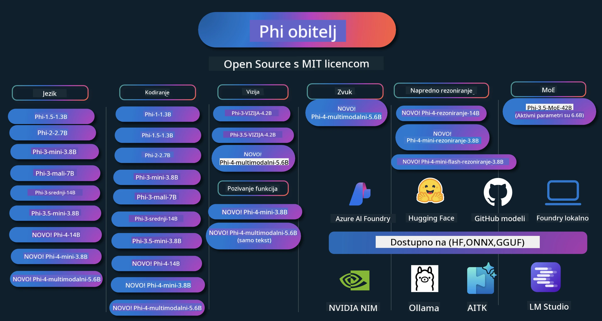

# Phi Ku harica: Primjeri za praktični rad s Microsoftovim Phi modelima

[](https://codespaces.new/microsoft/phicookbook)
[](https://vscode.dev/redirect?url=vscode://ms-vscode-remote.remote-containers/cloneInVolume?url=https://github.com/microsoft/phicookbook)

[](https://GitHub.com/microsoft/phicookbook/graphs/contributors/?WT.mc_id=aiml-137032-kinfeylo)
[](https://GitHub.com/microsoft/phicookbook/issues/?WT.mc_id=aiml-137032-kinfeylo)
[](https://GitHub.com/microsoft/phicookbook/pulls/?WT.mc_id=aiml-137032-kinfeylo)
[](http://makeapullrequest.com?WT.mc_id=aiml-137032-kinfeylo)

[](https://GitHub.com/microsoft/phicookbook/watchers/?WT.mc_id=aiml-137032-kinfeylo)
[](https://GitHub.com/microsoft/phicookbook/network/?WT.mc_id=aiml-137032-kinfeylo)
[](https://GitHub.com/microsoft/phicookbook/stargazers/?WT.mc_id=aiml-137032-kinfeylo)

[](https://discord.com/invite/ByRwuEEgH4)

Phi je serija open source AI modela razvijenih od strane Microsofta.

Phi je trenutno najsnažniji i najisplativiji mali jezični model (SLM), s vrlo dobrim rezultatima u više jezika, rezoniranju, generiranju teksta/razgovora, kodiranju, slikama, zvuku i drugim scenarijima.

Možete implementirati Phi u oblaku ili na edge uređaje i lako izgraditi generativne AI aplikacije uz ograničenu računalnu snagu.

Slijedite ove korake da biste započeli s korištenjem ovog resursa:
1. **Forkajte spremište**: Kliknite [](https://GitHub.com/microsoft/phicookbook/network/?WT.mc_id=aiml-137032-kinfeylo)
2. **Klontajte spremište**: `git clone https://github.com/microsoft/PhiCookBook.git`
3. [**Pridružite se Microsoft AI Discord zajednici i upoznajte stručnjake i kolege programere**](https://discord.com/invite/ByRwuEEgH4?WT.mc_id=aiml-137032-kinfeylo)



### 🌐 Višejezična podrška

#### Podržano putem GitHub Action (Automatski i uvijek ažurirano)

<!-- CO-OP TRANSLATOR LANGUAGES TABLE START -->
[Arabski](../ar/README.md) | [Bengalski](../bn/README.md) | [Bugarski](../bg/README.md) | [Burmanski (Myanmar)](../my/README.md) | [Kineski (pojednostavljeni)](../zh-CN/README.md) | [Kineski (tradicionalni, Hong Kong)](../zh-HK/README.md) | [Kineski (tradicionalni, Makao)](../zh-MO/README.md) | [Kineski (tradicionalni, Tajvan)](../zh-TW/README.md) | [Hrvatski](./README.md) | [Češki](../cs/README.md) | [Danski](../da/README.md) | [Nizozemski](../nl/README.md) | [Estonski](../et/README.md) | [Finski](../fi/README.md) | [Francuski](../fr/README.md) | [Njemački](../de/README.md) | [Grčki](../el/README.md) | [Hebrejski](../he/README.md) | [Hindi](../hi/README.md) | [Mađarski](../hu/README.md) | [Indonezijski](../id/README.md) | [Talijanski](../it/README.md) | [Japanski](../ja/README.md) | [Kannada](../kn/README.md) | [Korejski](../ko/README.md) | [Litvanski](../lt/README.md) | [Malajski](../ms/README.md) | [Malajalamski](../ml/README.md) | [Maratski](../mr/README.md) | [Nepalski](../ne/README.md) | [Nigerijski pidgin](../pcm/README.md) | [Norveški](../no/README.md) | [Perzijski (Farsi)](../fa/README.md) | [Poljski](../pl/README.md) | [Portugalski (Brazil)](../pt-BR/README.md) | [Portugalski (Portugal)](../pt-PT/README.md) | [Punjabi (Gurmukhi)](../pa/README.md) | [Rumunjski](../ro/README.md) | [Ruski](../ru/README.md) | [Srpski (ćirilica)](../sr/README.md) | [Slovački](../sk/README.md) | [Slovenski](../sl/README.md) | [Španjolski](../es/README.md) | [Svahili](../sw/README.md) | [Švedski](../sv/README.md) | [Tagalog (filipinski)](../tl/README.md) | [Tamilski](../ta/README.md) | [Telugu](../te/README.md) | [Tajlandski](../th/README.md) | [Turski](../tr/README.md) | [Ukrajinski](../uk/README.md) | [Urdu](../ur/README.md) | [Vijetnamski](../vi/README.md)

> **Radije klontati lokalno?**
>
> Ovo spremište uključuje 50+ jezičnih prijevoda što značajno povećava veličinu preuzimanja. Za kloniranje bez prijevoda, koristite sparse checkout:
>
> **Bash / macOS / Linux:**
> ```bash
> git clone --filter=blob:none --sparse https://github.com/microsoft/PhiCookBook.git
> cd PhiCookBook
> git sparse-checkout set --no-cone '/*' '!translations' '!translated_images'
> ```
>
> **CMD (Windows):**
> ```cmd
> git clone --filter=blob:none --sparse https://github.com/microsoft/PhiCookBook.git
> cd PhiCookBook
> git sparse-checkout set --no-cone "/*" "!translations" "!translated_images"
> ```
>
> Ovo vam daje sve što vam treba za dovršetak tečaja uz mnogo brže preuzimanje.
<!-- CO-OP TRANSLATOR LANGUAGES TABLE END -->

## Sadržaj

- Uvod
  - [Dobrodošli u Phi obitelj](./md/01.Introduction/01/01.PhiFamily.md)
  - [Postavljanje vašeg okruženja](./md/01.Introduction/01/01.EnvironmentSetup.md)
  - [Razumijevanje ključnih tehnologija](./md/01.Introduction/01/01.Understandingtech.md)
  - [Sigurnost AI za Phi modele](./md/01.Introduction/01/01.AISafety.md)
  - [Podrška za Phi hardver](./md/01.Introduction/01/01.Hardwaresupport.md)
  - [Phi modeli i dostupnost na platformama](./md/01.Introduction/01/01.Edgeandcloud.md)
  - [Korištenje Guidance-ai i Phi](./md/01.Introduction/01/01.Guidance.md)
  - [GitHub Marketplace modeli](https://github.com/marketplace/models)
  - [Azure AI katalog modela](https://ai.azure.com)

- Infernca Phi u različitim okruženjima
    -  [Hugging face](./md/01.Introduction/02/01.HF.md)
    -  [GitHub modeli](./md/01.Introduction/02/02.GitHubModel.md)
    -  [Microsoft Foundry katalog modela](./md/01.Introduction/02/03.AzureAIFoundry.md)
    -  [Ollama](./md/01.Introduction/02/04.Ollama.md)
    -  [AI Toolkit VSCode (AITK)](./md/01.Introduction/02/05.AITK.md)
    -  [NVIDIA NIM](./md/01.Introduction/02/06.NVIDIA.md)
    -  [Foundry lokalno](./md/01.Introduction/02/07.FoundryLocal.md)

- Inferenzija Phi obitelji
    - [Inferenzija Phi na iOS-u](./md/01.Introduction/03/iOS_Inference.md)
    - [Inferenzija Phi na Androidu](./md/01.Introduction/03/Android_Inference.md)
    - [Inferenzija Phi na Jetsonu](./md/01.Introduction/03/Jetson_Inference.md)
    - [Inferenzija Phi na AI PC](./md/01.Introduction/03/AIPC_Inference.md)
    - [Inferenzija Phi s Apple MLX Frameworkom](./md/01.Introduction/03/MLX_Inference.md)
    - [Inferenzija Phi na lokalnom serveru](./md/01.Introduction/03/Local_Server_Inference.md)
    - [Inferenzija Phi na udaljenom serveru koristeći AI Toolkit](./md/01.Introduction/03/Remote_Interence.md)
    - [Inferenzija Phi s Rustom](./md/01.Introduction/03/Rust_Inference.md)
    - [Inferenzija Phi--Vision lokalno](./md/01.Introduction/03/Vision_Inference.md)
    - [Inferenzija Phi s Kaito AKS, Azure kontejnerima (službena podrška)](./md/01.Introduction/03/Kaito_Inference.md)
-  [Kvantificiranje Phi obitelji](./md/01.Introduction/04/QuantifyingPhi.md)
    - [Kvantiziranje Phi-3.5 / 4 koristeći llama.cpp](./md/01.Introduction/04/UsingLlamacppQuantifyingPhi.md)
    - [Kvantiziranje Phi-3.5 / 4 koristeći Generative AI ekstenzije za onnxruntime](./md/01.Introduction/04/UsingORTGenAIQuantifyingPhi.md)
    - [Kvantiziranje Phi-3.5 / 4 koristeći Intel OpenVINO](./md/01.Introduction/04/UsingIntelOpenVINOQuantifyingPhi.md)
    - [Kvantiziranje Phi-3.5 / 4 koristeći Apple MLX Framework](./md/01.Introduction/04/UsingAppleMLXQuantifyingPhi.md)

-  Evaluacija Phi
    - [Odgovorno AI](./md/01.Introduction/05/ResponsibleAI.md)
    - [Microsoft Foundry za evaluaciju](./md/01.Introduction/05/AIFoundry.md)
    - [Korištenje Promptflow za evaluaciju](./md/01.Introduction/05/Promptflow.md)
 
- RAG s Azure AI pretraživanjem
    - [Kako koristiti Phi-4-mini i Phi-4-multimodal(RAG) s Azure AI pretraživanjem](https://github.com/microsoft/PhiCookBook/blob/main/code/06.E2E/E2E_Phi-4-RAG-Azure-AI-Search.ipynb)

- Primjeri razvoja Phi aplikacija
  - Tekstualne i chat aplikacije
    - Phi-4 primjeri 🆕
      - [📓] [Chat s Phi-4-mini ONNX modelom](./md/02.Application/01.TextAndChat/Phi4/ChatWithPhi4ONNX/README.md)
      - [Chat s Phi-4 lokalnim ONNX modelom .NET](../../md/04.HOL/dotnet/src/LabsPhi4-Chat-01OnnxRuntime)
      - [Chat .NET konzolna aplikacija s Phi-4 ONNX koristeći Semantic Kernel](../../md/04.HOL/dotnet/src/LabsPhi4-Chat-02SK)
    - Phi-3 / 3.5 primjeri
      - [Lokalni chatbot u pregledniku koristeći Phi3, ONNX Runtime Web i WebGPU](https://github.com/microsoft/onnxruntime-inference-examples/tree/main/js/chat)
      - [OpenVino Chat](./md/02.Application/01.TextAndChat/Phi3/E2E_OpenVino_Chat.md)
      - [Višestruki model - Interaktivni Phi-3-mini i OpenAI Whisper](./md/02.Application/01.TextAndChat/Phi3/E2E_Phi-3-mini_with_whisper.md)
      - [MLFlow - Izrada omotača i korištenje Phi-3 s MLFlow](./md//02.Application/01.TextAndChat/Phi3/E2E_Phi-3-MLflow.md)
      - [Optimizacija modela - Kako optimizirati Phi-3-min model za ONNX Runtime Web s Olive](https://github.com/microsoft/Olive/tree/main/examples/phi3)
      - [WinUI3 aplikacija s Phi-3 mini-4k-instruct-onnx](https://github.com/microsoft/Phi3-Chat-WinUI3-Sample/)
      -[WinUI3 primjer aplikacije za bilješke pokretan AI više modela](https://github.com/microsoft/ai-powered-notes-winui3-sample)
      - [Fine-tune i integriraj prilagođene Phi-3 modele s Prompt flow](./md/02.Application/01.TextAndChat/Phi3/E2E_Phi-3-FineTuning_PromptFlow_Integration.md)
      - [Fine-tune i integriraj prilagođene Phi-3 modele s Prompt flow u Microsoft Foundry](./md/02.Application/01.TextAndChat/Phi3/E2E_Phi-3-FineTuning_PromptFlow_Integration_AIFoundry.md)
      - [Procijeni fino podešeni Phi-3 / Phi-3.5 model u Microsoft Foundry s fokusom na Microsoftova načela odgovornog AI](./md/02.Application/01.TextAndChat/Phi3/E2E_Phi-3-Evaluation_AIFoundry.md)
      - [📓] [Phi-3.5-mini-instruct uzorak predviđanja jezika (kineski/engleski)](./md/02.Application/01.TextAndChat/Phi3/phi3-instruct-demo.ipynb)
      - [Phi-3.5-Instruct WebGPU RAG Chatbot](./md/02.Application/01.TextAndChat/Phi3/WebGPUWithPhi35Readme.md)
      - [Korištenje Windows GPU-a za stvaranje Prompt flow rješenja s Phi-3.5-Instruct ONNX](./md/02.Application/01.TextAndChat/Phi3/UsingPromptFlowWithONNX.md)
      - [Korištenje Microsoft Phi-3.5 tflite za izradu Android aplikacije](./md/02.Application/01.TextAndChat/Phi3/UsingPhi35TFLiteCreateAndroidApp.md)
      - [Q&A .NET primjer koristeći lokalni ONNX Phi-3 model koristeći Microsoft.ML.OnnxRuntime](../../md/04.HOL/dotnet/src/LabsPhi301)
      - [Konzolna chat .NET aplikacija sa Semantic Kernel i Phi-3](../../md/04.HOL/dotnet/src/LabsPhi302)

  - Azure AI Inference SDK primjeri temeljeni na kodu 
    - Phi-4 primjeri 🆕
      - [📓] [Generiranje koda projekta koristeći Phi-4-multimodal](./md/02.Application/02.Code/Phi4/GenProjectCode/README.md)
    - Phi-3 / 3.5 primjeri
      - [Izgradi vlastiti Visual Studio Code GitHub Copilot Chat s Microsoft Phi-3 obitelji](./md/02.Application/02.Code/Phi3/VSCodeExt/README.md)
      - [Kreiraj vlastitog Visual Studio Code Chat Copilot agenta s Phi-3.5 koristeći GitHub modele](/md/02.Application/02.Code/Phi3/CreateVSCodeChatAgentWithGitHubModels.md)

  - Primjeri naprednog rezoniranja
    - Phi-4 primjeri 🆕
      - [📓] [Phi-4-mini-reasoning ili Phi-4-reasoning primjeri](./md/02.Application/03.AdvancedReasoning/Phi4/AdvancedResoningPhi4mini/README.md)
      - [📓] [Fine-tuning Phi-4-mini-reasoning s Microsoft Olive](./md/02.Application/03.AdvancedReasoning/Phi4/AdvancedResoningPhi4mini/olive_ft_phi_4_reasoning_with_medicaldata.ipynb)
      - [📓] [Fine-tuning Phi-4-mini-reasoning s Apple MLX](./md/02.Application/03.AdvancedReasoning/Phi4/AdvancedResoningPhi4mini/mlx_ft_phi_4_reasoning_with_medicaldata.ipynb)
      - [📓] [Phi-4-mini-reasoning s GitHub modelima](./md/02.Application/02.Code/Phi4r/github_models_inference.ipynb)
      - [📓] [Phi-4-mini-reasoning s Microsoft Foundry modelima](./md/02.Application/02.Code/Phi4r/azure_models_inference.ipynb)
  - Demoi
      - [Phi-4-mini demoi domaćin na Hugging Face Spaces](https://huggingface.co/spaces/microsoft/phi-4-mini?WT.mc_id=aiml-137032-kinfeylo)
      - [Phi-4-multimodal demoi domaćin na Hugginge Face Spaces](https://huggingface.co/spaces/microsoft/phi-4-multimodal?WT.mc_id=aiml-137032-kinfeylo)
  - Primjeri za viziju
    - Phi-4 primjeri 🆕
      - [📓] [Koristi Phi-4-multimodal za čitanje slika i generiranje koda](./md/02.Application/04.Vision/Phi4/CreateFrontend/README.md) 
    - Phi-3 / 3.5 primjeri
      -  [📓][Phi-3-vision-Slika tekst u tekst](./md/02.Application/04.Vision/Phi3/E2E_Phi-3-vision-image-text-to-text-online-endpoint.ipynb)
      - [Phi-3-vision-ONNX](https://onnxruntime.ai/docs/genai/tutorials/phi3-v.html)
      - [📓][Phi-3-vision CLIP ugradnja](./md/02.Application/04.Vision/Phi3/E2E_Phi-3-vision-image-text-to-text-online-endpoint.ipynb)
      - [DEMO: Phi-3 Reciklaža](https://github.com/jennifermarsman/PhiRecycling/)
      - [Phi-3-vision - vizualni jezični asistent - s Phi3-Vision i OpenVINO](https://docs.openvino.ai/nightly/notebooks/phi-3-vision-with-output.html)
      - [Phi-3 Vision Nvidia NIM](./md/02.Application/04.Vision/Phi3/E2E_Nvidia_NIM_Vision.md)
      - [Phi-3 Vision OpenVino](./md/02.Application/04.Vision/Phi3/E2E_OpenVino_Phi3Vision.md)
      - [📓][Phi-3.5 Vision više okvira ili više slika uzorak](./md/02.Application/04.Vision/Phi3/phi3-vision-demo.ipynb)
      - [Phi-3 Vision lokalni ONNX model koristeći Microsoft.ML.OnnxRuntime .NET](../../md/04.HOL/dotnet/src/LabsPhi303)
      - [Izbornik zasnovani Phi-3 Vision lokalni ONNX model koristeći Microsoft.ML.OnnxRuntime .NET](../../md/04.HOL/dotnet/src/LabsPhi304)

  - Matematički Primjeri
    -  Phi-4-Mini-Flash-Reasoning-Instruct Primjeri 🆕 [Matematički Demo s Phi-4-Mini-Flash-Reasoning-Instruct](./md/02.Application/09.Math/MathDemo.ipynb)

  - Audio Primjeri
    - Phi-4 primjeri 🆕
      - [📓] [Izvlačenje audio transkripata koristeći Phi-4-multimodal](./md/02.Application/05.Audio/Phi4/Transciption/README.md)
      - [📓] [Phi-4-multimodal audio uzorak](./md/02.Application/05.Audio/Phi4/Siri/demo.ipynb)
      - [📓] [Phi-4-multimodal primjer govornog prijevoda](./md/02.Application/05.Audio/Phi4/Translate/demo.ipynb)
      - [.NET konzolna aplikacija koristeći Phi-4-multimodal Audio za analizu audio datoteke i generiranje transkripta](../../md/04.HOL/dotnet/src/LabsPhi4-MultiModal-02Audio)

  - MOE Primjeri
    - Phi-3 / 3.5 primjeri
      - [📓] [Phi-3.5 mješavina eksperata modeli (MoEs) primjer društvenih medija](./md/02.Application/06.MoE/Phi3/phi3_moe_demo.ipynb)
      - [📓] [Izgradnja Retrieval-Augmented Generation (RAG) pipelinea sa NVIDIA NIM Phi-3 MOE, Azure AI tražilicom, i LlamaIndex](./md/02.Application/06.MoE/Phi3/azure-ai-search-nvidia-rag.ipynb)
      - 
  - Primjeri poziva funkcija
    - Phi-4 primjeri 🆕
      -  [📓] [Korištenje poziva funkcija s Phi-4-mini](./md/02.Application/07.FunctionCalling/Phi4/FunctionCallingBasic/README.md)
      -  [📓] [Korištenje poziva funkcija za stvaranje multi-agencija s Phi-4-mini](./md/02.Application/07.FunctionCalling/Phi4/Multiagents/Phi_4_mini_multiagent.ipynb)
      -  [📓] [Korištenje poziva funkcija s Ollama](./md/02.Application/07.FunctionCalling/Phi4/Ollama/ollama_functioncalling.ipynb)
      -  [📓] [Korištenje poziva funkcija s ONNX](./md/02.Application/07.FunctionCalling/Phi4/ONNX/onnx_parallel_functioncalling.ipynb)
  - Primjeri miješanja multimodala
    - Phi-4 primjeri 🆕
      -  [📓] [Korištenje Phi-4-multimodal kao tehnološkog novinara](./md/02.Application/08.Multimodel/Phi4/TechJournalist/phi_4_mm_audio_text_publish_news.ipynb)
      - [.NET konzolna aplikacija koristeći Phi-4-multimodal za analizu slika](../../md/04.HOL/dotnet/src/LabsPhi4-MultiModal-01Images)

- Fine-tuning Phi Primjeri
  - [Scenariji fine-tuninga](./md/03.FineTuning/FineTuning_Scenarios.md)
  - [Fine-tuning vs RAG](./md/03.FineTuning/FineTuning_vs_RAG.md)
  - [Fine-tuning neka Phi-3 postane industrijski stručnjak](./md/03.FineTuning/LetPhi3gotoIndustriy.md)
  - [Fine-tuning Phi-3 s AI Toolkitom za VS Code](./md/03.FineTuning/Finetuning_VSCodeaitoolkit.md)
  - [Fine-tuning Phi-3 s Azure Machine Learning Service](./md/03.FineTuning/Introduce_AzureML.md)
  - [Fine-tuning Phi-3 s Lora](./md/03.FineTuning/FineTuning_Lora.md)
  - [Fine-tuning Phi-3 s QLora](./md/03.FineTuning/FineTuning_Qlora.md)
  - [Fine-tuning Phi-3 s Microsoft Foundry](./md/03.FineTuning/FineTuning_AIFoundry.md)
  - [Fine-tuning Phi-3 s Azure ML CLI/SDK](./md/03.FineTuning/FineTuning_MLSDK.md)
  - [Fine-tuning s Microsoft Olive](./md/03.FineTuning/FineTuning_MicrosoftOlive.md)
  - [Hands-On laboratorij za fine-tuning s Microsoft Olive](./md/03.FineTuning/olive-lab/readme.md)
  - [Fine-tuning Phi-3-vision s Weights and Bias](./md/03.FineTuning/FineTuning_Phi-3-visionWandB.md)
  - [Fine-tuning Phi-3 s Apple MLX Framework](./md/03.FineTuning/FineTuning_MLX.md)
  - [Fine-tuning Phi-3-vision (službena podrška)](./md/03.FineTuning/FineTuning_Vision.md)
  - [Fine-tuning Phi-3 s Kaito AKS, Azure kontejnerima (službena podrška)](./md/03.FineTuning/FineTuning_Kaito.md)
  - [Fine-tuning Phi-3 i 3.5 Vision](https://github.com/2U1/Phi3-Vision-Finetune)

- Hands on Lab
  - [Istraživanje najsuvremenijih modela: LLM, SLM, lokalni razvoj i više](https://github.com/microsoft/aitour-exploring-cutting-edge-models)
  - [Otključavanje potencijala NLP-a: Fine-Tuning s Microsoft Olive](https://github.com/azure/Ignite_FineTuning_workshop)
- Akademski istraživački radovi i publikacije
  - [Udžbenici su sve što vam treba II: tehničko izvješće phi-1.5](https://arxiv.org/abs/2309.05463)
  - [Phi-3 tehničko izvješće: Jezični model s velikim mogućnostima lokalno na vašem telefonu](https://arxiv.org/abs/2404.14219)
  - [Phi-4 tehničko izvješće](https://arxiv.org/abs/2412.08905)
  - [Phi-4-Mini tehničko izvješće: Kompaktni, ali moćni multimodalni jezični modeli putem Mixture-of-LoRAs](https://arxiv.org/abs/2503.01743)
  - [Optimizacija malih jezičnih modela za pozivanje funkcija unutar vozila](https://arxiv.org/abs/2501.02342)
  - [(WhyPHI) Fino podešavanje PHI-3 za odgovore na pitanja s višestrukim izborom: metodologija, rezultati i izazovi](https://arxiv.org/abs/2501.01588)
  - [Phi-4-reasoning tehničko izvješće](https://www.microsoft.com/en-us/research/wp-content/uploads/2025/04/phi_4_reasoning.pdf)
  - [Phi-4-mini-reasoning tehničko izvješće](https://huggingface.co/microsoft/Phi-4-mini-reasoning/blob/main/Phi-4-Mini-Reasoning.pdf)

## Korištenje Phi modela

### Phi na Microsoft Foundry

Možete naučiti kako koristiti Microsoft Phi i kako izgraditi E2E rješenja na vašim različitim hardverskim uređajima. Da isprobate Phi sami, započnite igrom s modelima i prilagodbom Phi za vaše scenarije koristeći [Microsoft Foundry Azure AI Model Catalog](https://aka.ms/phi3-azure-ai). Više možete saznati u Uvodnom vodiču za [Microsoft Foundry](/md/02.QuickStart/AzureAIFoundry_QuickStart.md)

**Igralište**
Svaki model ima posebno igralište za testiranje modela [Azure AI Playground](https://aka.ms/try-phi3).

### Phi na GitHub modelima

Možete naučiti kako koristiti Microsoft Phi i kako izgraditi E2E rješenja na vašim različitim hardverskim uređajima. Da isprobate Phi sami, započnite igrom s modelom i prilagodbom Phi za vaše scenarije koristeći [GitHub Model Catalog](https://github.com/marketplace/models?WT.mc_id=aiml-137032-kinfeylo). Više možete saznati u Uvodnom vodiču za [GitHub Model Catalog](/md/02.QuickStart/GitHubModel_QuickStart.md)

**Igralište**
Svaki model ima posebno [igralište za testiranje modela](/md/02.QuickStart/GitHubModel_QuickStart.md).

### Phi na Hugging Face

Model također možete pronaći na [Hugging Face](https://huggingface.co/microsoft)

**Igralište**
 [Hugging Chat igralište](https://huggingface.co/chat/models/microsoft/Phi-3-mini-4k-instruct)

 ## 🎒 Ostali tečajevi

Naš tim proizvodi i druge tečajeve! Pogledajte:

<!-- CO-OP TRANSLATOR OTHER COURSES START -->
### LangChain
[](https://aka.ms/langchain4j-for-beginners)
[](https://aka.ms/langchainjs-for-beginners?WT.mc_id=m365-94501-dwahlin)
[](https://github.com/microsoft/langchain-for-beginners?WT.mc_id=m365-94501-dwahlin)
---

### Azure / Edge / MCP / Agenti
[](https://github.com/microsoft/AZD-for-beginners?WT.mc_id=academic-105485-koreyst)
[](https://github.com/microsoft/edgeai-for-beginners?WT.mc_id=academic-105485-koreyst)
[](https://github.com/microsoft/mcp-for-beginners?WT.mc_id=academic-105485-koreyst)
[](https://github.com/microsoft/ai-agents-for-beginners?WT.mc_id=academic-105485-koreyst)

---
 
### Serija generativne umjetne inteligencije
[](https://github.com/microsoft/generative-ai-for-beginners?WT.mc_id=academic-105485-koreyst)
[-9333EA?style=for-the-badge&labelColor=E5E7EB&color=9333EA)](https://github.com/microsoft/Generative-AI-for-beginners-dotnet?WT.mc_id=academic-105485-koreyst)
[-C084FC?style=for-the-badge&labelColor=E5E7EB&color=C084FC)](https://github.com/microsoft/generative-ai-for-beginners-java?WT.mc_id=academic-105485-koreyst)
[-E879F9?style=for-the-badge&labelColor=E5E7EB&color=E879F9)](https://github.com/microsoft/generative-ai-with-javascript?WT.mc_id=academic-105485-koreyst)

---
 
### Temeljno učenje
[](https://aka.ms/ml-beginners?WT.mc_id=academic-105485-koreyst)
[](https://aka.ms/datascience-beginners?WT.mc_id=academic-105485-koreyst)
[](https://aka.ms/ai-beginners?WT.mc_id=academic-105485-koreyst)
[](https://github.com/microsoft/Security-101?WT.mc_id=academic-96948-sayoung)
[](https://aka.ms/webdev-beginners?WT.mc_id=academic-105485-koreyst)
[](https://aka.ms/iot-beginners?WT.mc_id=academic-105485-koreyst)
[](https://github.com/microsoft/xr-development-for-beginners?WT.mc_id=academic-105485-koreyst)

---
 
### Serija Copilot
[](https://aka.ms/GitHubCopilotAI?WT.mc_id=academic-105485-koreyst)
[](https://github.com/microsoft/mastering-github-copilot-for-dotnet-csharp-developers?WT.mc_id=academic-105485-koreyst)
[](https://github.com/microsoft/CopilotAdventures?WT.mc_id=academic-105485-koreyst)
<!-- CO-OP TRANSLATOR OTHER COURSES END -->

## Odgovorna umjetna inteligencija

Microsoft je predan pomoći našim korisnicima da odgovorno koriste naše AI proizvode, dijeleći svoja iskustva i gradeći partnerske odnose utemeljene na povjerenju kroz alate poput Transparency Notes i Impact Assessments. Mnogi od ovih resursa dostupni su na [https://aka.ms/RAI](https://aka.ms/RAI).
Microsoftov pristup odgovornoj umjetnoj inteligenciji temelji se na našim AI principima poštenja, pouzdanosti i sigurnosti, privatnosti i sigurnosti, uključivosti, transparentnosti i odgovornosti.

Veliki prirodni jezični, slikovni i govornički modeli - poput onih koji se koriste u ovom primjeru - mogu se potencijalno ponašati na načine koji su nepravedni, nepouzdani ili uvredljivi, što može prouzročiti štetu. Molimo konzultirajte [Azure OpenAI uslugu Transparency note](https://learn.microsoft.com/legal/cognitive-services/openai/transparency-note?tabs=text) kako biste se informirali o rizicima i ograničenjima.

Preporučeni pristup za ublažavanje ovih rizika je uključivanje sigurnosnog sustava u vašu arhitekturu koji može otkriti i spriječiti štetno ponašanje. [Azure AI Content Safety](https://learn.microsoft.com/azure/ai-services/content-safety/overview) pruža neovisni sloj zaštite, sposoban otkriti štetne sadržaje generirane od strane korisnika i umjetne inteligencije u aplikacijama i uslugama. Azure AI Content Safety uključuje tekstualne i slikovne API-je koji vam omogućuju detekciju štetnog materijala. Unutar Microsoft Foundry, servis Content Safety omogućuje vam pregled, istraživanje i isprobavanje primjera koda za otkrivanje štetnog sadržaja kroz različite modalitete. Sljedeća [quickstart dokumentacija](https://learn.microsoft.com/azure/ai-services/content-safety/quickstart-text?tabs=visual-studio%2Clinux&pivots=programming-language-rest) vodi vas kroz postupak slanja zahtjeva servisu.
Još jedan aspekt koji treba uzeti u obzir je ukupna izvedba aplikacije. Kod višemodalnih i višemodelskih aplikacija, izvedba se smatra time da sustav radi onako kako vi i vaši korisnici očekuju, uključujući i ne generiranje štetnih rezultata. Važno je procijeniti izvedbu vaše ukupne aplikacije koristeći [Performance and Quality and Risk and Safety evaluators](https://learn.microsoft.com/azure/ai-studio/concepts/evaluation-metrics-built-in). Također imate mogućnost stvaranja i ocjenjivanja uz pomoć [custom evaluators](https://learn.microsoft.com/azure/ai-studio/how-to/develop/evaluate-sdk#custom-evaluators).

Svoju AI aplikaciju možete ocijeniti u svom razvojnom okruženju koristeći [Azure AI Evaluation SDK](https://microsoft.github.io/promptflow/index.html). Bilo da imate testni skup podataka ili cilj, generirane rezultate vaše generativne AI aplikacije kvantitativno se mjere ugrađenim evaluatorima ili evaluatorima po vašem izboru. Za početak rada s azure ai evaluation sdk za ocjenjivanje vašeg sustava, možete slijediti [quickstart guide](https://learn.microsoft.com/azure/ai-studio/how-to/develop/flow-evaluate-sdk). Nakon što izvršite evaluacijsko pokretanje, možete [visualize the results in Microsoft Foundry](https://learn.microsoft.com/azure/ai-studio/how-to/evaluate-flow-results).

## Trademarks

Ovaj projekt može sadržavati trgovačke marke ili logotipe za projekte, proizvode ili usluge. Ovlaštena upotreba Microsoftovih trgovačkih marki ili logotipa podliježe i mora slijediti [Microsoft's Trademark & Brand Guidelines](https://www.microsoft.com/legal/intellectualproperty/trademarks/usage/general).  
Upotreba Microsoftovih trgovačkih marki ili logotipa u modificiranim verzijama ovog projekta ne smije stvarati zabunu niti implicirati sponzorstvo Microsofta. Bilo kakva upotreba trgovačkih marki ili logotipa trećih strana podliježe politikama tih trećih strana.

## Getting Help

Ako zapnete ili imate bilo kakvih pitanja o izradi AI aplikacija, pridružite se:

[](https://aka.ms/foundry/discord)

Ako imate povratne informacije o proizvodu ili se pojave greške tijekom izrade, posjetite:

[](https://aka.ms/foundry/forum)

---

<!-- CO-OP TRANSLATOR DISCLAIMER START -->
**Odricanje od odgovornosti**:
Ovaj dokument preveden je pomoću AI usluge za prevođenje [Co-op Translator](https://github.com/Azure/co-op-translator). Iako nastojimo postići točnost, imajte na umu da automatski prijevodi mogu sadržavati pogreške ili netočnosti. Izvorni dokument na izvornom jeziku treba smatrati autoritativnim izvorom. Za kritične informacije preporučuje se profesionalni ljudski prijevod. Ne snosimo odgovornost za bilo kakve nesporazume ili kriva tumačenja koja proizlaze iz korištenja ovog prijevoda.
<!-- CO-OP TRANSLATOR DISCLAIMER END -->