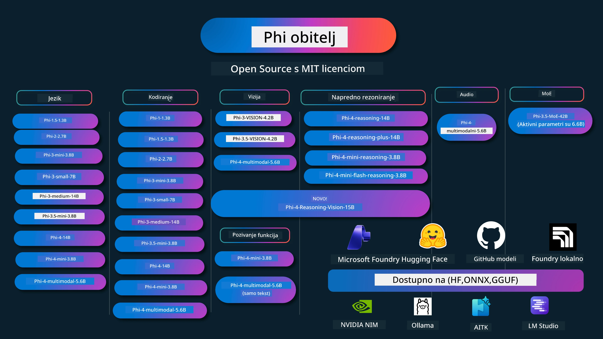

# Phi Cookbook: Praktični primjeri s Phi modelima Microsofta

[](https://codespaces.new/microsoft/phicookbook)
[](https://vscode.dev/redirect?url=vscode://ms-vscode-remote.remote-containers/cloneInVolume?url=https://github.com/microsoft/phicookbook)

[](https://GitHub.com/microsoft/phicookbook/graphs/contributors/?WT.mc_id=aiml-137032-kinfeylo)
[](https://GitHub.com/microsoft/phicookbook/issues/?WT.mc_id=aiml-137032-kinfeylo)
[](https://GitHub.com/microsoft/phicookbook/pulls/?WT.mc_id=aiml-137032-kinfeylo)
[](http://makeapullrequest.com?WT.mc_id=aiml-137032-kinfeylo)

[](https://GitHub.com/microsoft/phicookbook/watchers/?WT.mc_id=aiml-137032-kinfeylo)
[](https://GitHub.com/microsoft/phicookbook/network/?WT.mc_id=aiml-137032-kinfeylo)
[](https://GitHub.com/microsoft/phicookbook/stargazers/?WT.mc_id=aiml-137032-kinfeylo)

[](https://discord.com/invite/ByRwuEEgH4)

Phi je serija open source AI modela koju razvija Microsoft.

Phi je trenutno najsnažniji i najisplativiji mali jezični model (SLM), s vrlo dobrim referentnim vrijednostima u više jezika, zaključivanju, generiranju teksta/chata, kodiranju, slikama, zvuku i ostalim scenarijima.

Možete implementirati Phi u oblak ili na edge uređaje, i lako možete izgraditi generativne AI aplikacije s ograničenom računalnom snagom.

Slijedite ove korake da započnete korištenje ovih resursa:
1. **Forkajte repozitorij**: Kliknite [](https://GitHub.com/microsoft/phicookbook/network/?WT.mc_id=aiml-137032-kinfeylo)
2. **Klonirajte repozitorij**:   `git clone https://github.com/microsoft/PhiCookBook.git`
3. [**Pridružite se Microsoft AI Discord zajednici i upoznajte stručnjake i druge developere**](https://discord.com/invite/ByRwuEEgH4?WT.mc_id=aiml-137032-kinfeylo)



### 🌐 Podrška za više jezika

#### Podržano putem GitHub akcije (Automatski i uvijek ažurno)

<!-- CO-OP TRANSLATOR LANGUAGES TABLE START -->
[Arabic](../ar/README.md) | [Bengali](../bn/README.md) | [Bulgarian](../bg/README.md) | [Burmese (Myanmar)](../my/README.md) | [Chinese (Simplified)](../zh-CN/README.md) | [Chinese (Traditional, Hong Kong)](../zh-HK/README.md) | [Chinese (Traditional, Macau)](../zh-MO/README.md) | [Chinese (Traditional, Taiwan)](../zh-TW/README.md) | [Croatian](./README.md) | [Czech](../cs/README.md) | [Danish](../da/README.md) | [Dutch](../nl/README.md) | [Estonian](../et/README.md) | [Finnish](../fi/README.md) | [French](../fr/README.md) | [German](../de/README.md) | [Greek](../el/README.md) | [Hebrew](../he/README.md) | [Hindi](../hi/README.md) | [Hungarian](../hu/README.md) | [Indonesian](../id/README.md) | [Italian](../it/README.md) | [Japanese](../ja/README.md) | [Kannada](../kn/README.md) | [Khmer](../km/README.md) | [Korean](../ko/README.md) | [Lithuanian](../lt/README.md) | [Malay](../ms/README.md) | [Malayalam](../ml/README.md) | [Marathi](../mr/README.md) | [Nepali](../ne/README.md) | [Nigerian Pidgin](../pcm/README.md) | [Norwegian](../no/README.md) | [Persian (Farsi)](../fa/README.md) | [Polish](../pl/README.md) | [Portuguese (Brazil)](../pt-BR/README.md) | [Portuguese (Portugal)](../pt-PT/README.md) | [Punjabi (Gurmukhi)](../pa/README.md) | [Romanian](../ro/README.md) | [Russian](../ru/README.md) | [Serbian (Cyrillic)](../sr/README.md) | [Slovak](../sk/README.md) | [Slovenian](../sl/README.md) | [Spanish](../es/README.md) | [Swahili](../sw/README.md) | [Swedish](../sv/README.md) | [Tagalog (Filipino)](../tl/README.md) | [Tamil](../ta/README.md) | [Telugu](../te/README.md) | [Thai](../th/README.md) | [Turkish](../tr/README.md) | [Ukrainian](../uk/README.md) | [Urdu](../ur/README.md) | [Vietnamese](../vi/README.md)

> **Radije klonirati lokalno?**
>
> Ovaj repozitorij uključuje 50+ prijevoda na jezike što značajno povećava veličinu preuzimanja. Za kloniranje bez prijevoda, koristite sparse checkout:
>
> **Bash / macOS / Linux:**
> ```bash
> git clone --filter=blob:none --sparse https://github.com/microsoft/PhiCookBook.git
> cd PhiCookBook
> git sparse-checkout set --no-cone '/*' '!translations' '!translated_images'
> ```
>
> **CMD (Windows):**
> ```cmd
> git clone --filter=blob:none --sparse https://github.com/microsoft/PhiCookBook.git
> cd PhiCookBook
> git sparse-checkout set --no-cone "/*" "!translations" "!translated_images"
> ```
>
> Ovo vam daje sve što vam treba za dovršetak tečaja s puno bržim preuzimanjem.
<!-- CO-OP TRANSLATOR LANGUAGES TABLE END -->

## Sadržaj
- Uvod - [Dobrodošli u Phi obitelj](./md/01.Introduction/01/01.PhiFamily.md) - [Postavljanje vašeg okruženja](./md/01.Introduction/01/01.EnvironmentSetup.md) - [Razumijevanje ključnih tehnologija](./md/01.Introduction/01/01.Understandingtech.md) - [Sigurnost AI za Phi modele](./md/01.Introduction/01/01.AISafety.md) - [Podrška za Phi hardver](./md/01.Introduction/01/01.Hardwaresupport.md) - [Phi modeli i dostupnost na platformama](./md/01.Introduction/01/01.Edgeandcloud.md) - [Korištenje Guidance-ai i Phi](./md/01.Introduction/01/01.Guidance.md) - [GitHub Marketplace modeli](https://github.com/marketplace/models) - [Azure AI katalog modela](https://ai.azure.com) - Inference Phi u različitim okruženjima - [Hugging face](./md/01.Introduction/02/01.HF.md) - [GitHub modeli](./md/01.Introduction/02/02.GitHubModel.md) - [Microsoft Foundry katalog modela](./md/01.Introduction/02/03.AzureAIFoundry.md) - [Ollama](./md/01.Introduction/02/04.Ollama.md) - [AI Toolkit VSCode (AITK)](./md/01.Introduction/02/05.AITK.md) - [NVIDIA NIM](./md/01.Introduction/02/06.NVIDIA.md) - [Foundry lokalno](./md/01.Introduction/02/07.FoundryLocal.md) - Inference Phi obitelj - [Inference Phi na iOS-u](./md/01.Introduction/03/iOS_Inference.md) - [Inference Phi na Androidu](./md/01.Introduction/03/Android_Inference.md) - [Inference Phi na Jetsonu](./md/01.Introduction/03/Jetson_Inference.md) - [Inference Phi na AI PC-u](./md/01.Introduction/03/AIPC_Inference.md) - [Inference Phi s Apple MLX okvirom](./md/01.Introduction/03/MLX_Inference.md) - [Inference Phi na lokalnom serveru](./md/01.Introduction/03/Local_Server_Inference.md) - [Inference Phi na udaljenom serveru pomoću AI Toolkit](./md/01.Introduction/03/Remote_Interence.md) - [Inference Phi s Rustom](./md/01.Introduction/03/Rust_Inference.md) - [Inference Phi--Vision lokalno](./md/01.Introduction/03/Vision_Inference.md) - [Inference Phi s Kaito AKS, Azure kontejnerima (službena podrška)](./md/01.Introduction/03/Kaito_Inference.md) - [Kvantifikacija Phi obitelji](./md/01.Introduction/04/QuantifyingPhi.md) - [Kvantizacija Phi-3.5 / 4 pomoću llama.cpp](./md/01.Introduction/04/UsingLlamacppQuantifyingPhi.md) - [Kvantizacija Phi-3.5 / 4 pomoću proširenja generativnog AI za onnxruntime](./md/01.Introduction/04/UsingORTGenAIQuantifyingPhi.md) - [Kvantizacija Phi-3.5 / 4 pomoću Intel OpenVINO](./md/01.Introduction/04/UsingIntelOpenVINOQuantifyingPhi.md) - [Kvantizacija Phi-3.5 / 4 pomoću Apple MLX okvira](./md/01.Introduction/04/UsingAppleMLXQuantifyingPhi.md) - Evaluacija Phi - [Odgovorni AI](./md/01.Introduction/05/ResponsibleAI.md) - [Microsoft Foundry za evaluaciju](./md/01.Introduction/05/AIFoundry.md) - [Korištenje Promptflow za evaluaciju](./md/01.Introduction/05/Promptflow.md) - RAG s Azure AI pretraživanjem - [Kako koristiti Phi-4-mini i Phi-4-multimodal (RAG) s Azure AI pretraživanjem](https://github.com/microsoft/PhiCookBook/blob/main/code/06.E2E/E2E_Phi-4-RAG-Azure-AI-Search.ipynb) - Primjeri razvoja Phi aplikacija - Tekstualne i chat aplikacije - Phi-4 primjeri - [📓] [Chat s Phi-4-mini ONNX modelom](./md/02.Application/01.TextAndChat/Phi4/ChatWithPhi4ONNX/README.md) - [Chat s lokalnim Phi-4 ONNX modelom .NET](../../md/04.HOL/dotnet/src/LabsPhi4-Chat-01OnnxRuntime) - [Chat konzolna .NET aplikacija s Phi-4 ONNX koristeći Semantic Kernel](../../md/04.HOL/dotnet/src/LabsPhi4-Chat-02SK) - Phi-3 / 3.5 primjeri - [Lokalni chatbot u pregledniku koristeći Phi3, ONNX Runtime Web i WebGPU](https://github.com/microsoft/onnxruntime-inference-examples/tree/main/js/chat) - [OpenVino chat](./md/02.Application/01.TextAndChat/Phi3/E2E_OpenVino_Chat.md) - [Višestruki modeli - interaktivni Phi-3-mini i OpenAI Whisper](./md/02.Application/01.TextAndChat/Phi3/E2E_Phi-3-mini_with_whisper.md) - [MLFlow - Izrada omotača i korištenje Phi-3 s MLFlow](./md//02.Application/01.TextAndChat/Phi3/E2E_Phi-3-MLflow.md) - [Optimizacija modela - Kako optimizirati Phi-3-mini model za ONNX Runtime Web s Olive](https://github.com/microsoft/Olive/tree/main/examples/phi3) - [WinUI3 aplikacija s Phi-3 mini-4k-instruct-onnx](https://github.com/microsoft/Phi3-Chat-WinUI3-Sample/) - [WinUI3 višemodelna AI vođena aplikacija za bilješke](https://github.com/microsoft/ai-powered-notes-winui3-sample) - [Fino podešavanje i integracija prilagođenih Phi-3 modela s Prompt flow](./md/02.Application/01.TextAndChat/Phi3/E2E_Phi-3-FineTuning_PromptFlow_Integration.md) - [Fino podešavanje i integracija prilagođenih Phi-3 modela s Prompt flow u Microsoft Foundry](./md/02.Application/01.TextAndChat/Phi3/E2E_Phi-3-FineTuning_PromptFlow_Integration_AIFoundry.md) - [Evaluacija fino podešenog Phi-3 / Phi-3.5 modela u Microsoft Foundry s fokusom na Microsoftove principe odgovornog AI](./md/02.Application/01.TextAndChat/Phi3/E2E_Phi-3-Evaluation_AIFoundry.md) - [📓] [Phi-3.5-mini-instruct uzorak jezične predikcije (kineski/engleski)](./md/02.Application/01.TextAndChat/Phi3/phi3-instruct-demo.ipynb) - [Phi-3.5-Instruct WebGPU RAG chatbot](./md/02.Application/01.TextAndChat/Phi3/WebGPUWithPhi35Readme.md) - [Korištenje Windows GPU za izradu Prompt flow rješenja s Phi-3.5-Instruct ONNX](./md/02.Application/01.TextAndChat/Phi3/UsingPromptFlowWithONNX.md) - [Korištenje Microsoft Phi-3.5 tflite za izradu Android aplikacije](./md/02.Application/01.TextAndChat/Phi3/UsingPhi35TFLiteCreateAndroidApp.md) - [Primjer Pitanja i Odgovora .NET koristeći lokalni ONNX Phi-3 model s Microsoft.ML.OnnxRuntime](../../md/04.HOL/dotnet/src/LabsPhi301) - [Konzolna chat .NET aplikacija sa Semantic Kernel i Phi-3](../../md/04.HOL/dotnet/src/LabsPhi302) - Azure AI Inference SDK primjeri temeljeni na kodu - Phi-4 primjeri - [📓] [Generiranje projekta koda koristeći Phi-4-multimodal](./md/02.Application/02.Code/Phi4/GenProjectCode/README.md) - Phi-3 / 3.5 primjeri - [Izgradite vlastitog Visual Studio Code GitHub Copilot Chat s Microsoft Phi-3 obitelji](./md/02.Application/02.Code/Phi3/VSCodeExt/README.md) - [Izradite vlastitog Visual Studio Code Chat Copilot agenta s Phi-3.5 putem GitHub modela](/md/02.Application/02.Code/Phi3/CreateVSCodeChatAgentWithGitHubModels.md) - Primjeri naprednog rezoniranja - Phi-4 primjeri - [📓] [Phi-4-mini-reasoning ili Phi-4-reasoning primjeri](./md/02.Application/03.AdvancedReasoning/Phi4/AdvancedResoningPhi4mini/README.md) - [📓] [Fino podešavanje Phi-4-mini-reasoning s Microsoft Olive](./md/02.Application/03.AdvancedReasoning/Phi4/AdvancedResoningPhi4mini/olive_ft_phi_4_reasoning_with_medicaldata.ipynb) - [📓] [Fino podešavanje Phi-4-mini-reasoning s Apple MLX](./md/02.Application/03.AdvancedReasoning/Phi4/AdvancedResoningPhi4mini/mlx_ft_phi_4_reasoning_with_medicaldata.ipynb) - [📓] [Phi-4-mini-reasoning s GitHub modelima](./md/02.Application/02.Code/Phi4r/github_models_inference.ipynb) - [📓] [Phi-4-mini-reasoning s Microsoft Foundry modelima](./md/02.Application/02.Code/Phi4r/azure_models_inference.ipynb) -
Demo - [Phi-4-mini demo hostani na Hugging Face Spaces](https://huggingface.co/spaces/microsoft/phi-4-mini?WT.mc_id=aiml-137032-kinfeylo) - [Phi-4-multimodal demo hostani na Hugging Face Spaces](https://huggingface.co/spaces/microsoft/phi-4-multimodal?WT.mc_id=aiml-137032-kinfeylo) - Uzorci za vid - Phi-4 uzorci - [📓] [Koristite Phi-4-multimodal za čitanje slika i generiranje koda](./md/02.Application/04.Vision/Phi4/CreateFrontend/README.md) - Phi-3 / 3.5 Uzorci - [📓][Phi-3-vision-Tekst slike u tekst](./md/02.Application/04.Vision/Phi3/E2E_Phi-3-vision-image-text-to-text-online-endpoint.ipynb) - [Phi-3-vision-ONNX](https://onnxruntime.ai/docs/genai/tutorials/phi3-v.html) - [📓][Phi-3-vision CLIP ugradnja](./md/02.Application/04.Vision/Phi3/E2E_Phi-3-vision-image-text-to-text-online-endpoint.ipynb) - [DEMO: Phi-3 Recikliranje](https://github.com/jennifermarsman/PhiRecycling/) - [Phi-3-vision - Vizualni jezični asistent - s Phi3-Vision i OpenVINO](https://docs.openvino.ai/nightly/notebooks/phi-3-vision-with-output.html) - [Phi-3 Vision Nvidia NIM](./md/02.Application/04.Vision/Phi3/E2E_Nvidia_NIM_Vision.md) - [Phi-3 Vision OpenVino](./md/02.Application/04.Vision/Phi3/E2E_OpenVino_Phi3Vision.md) - [📓][Phi-3.5 Vision uzorak s više okvira ili više slika](./md/02.Application/04.Vision/Phi3/phi3-vision-demo.ipynb) - [Phi-3 Vision lokalni ONNX model koristeći Microsoft.ML.OnnxRuntime .NET](../../md/04.HOL/dotnet/src/LabsPhi303) - [Meni temeljen Phi-3 Vision lokalni ONNX model koristeći Microsoft.ML.OnnxRuntime .NET](../../md/04.HOL/dotnet/src/LabsPhi304) - Uzorci rezoniranja-vida - Phi-4-Reasoning-Vision-15B - [📓] [Korištenje Phi-4-Reasoning-Vision-15B za detekciju prelaska van pješačkog prijelaza](./md/02.Application/10.ReasoningVision/Phi_4_reasoning_vision_15b_Jaywalking.ipynb) - [📓] [Korištenje Phi-4-Reasoning-Vision-15B za matematiku](./md/02.Application/10.ReasoningVision/Phi_4_reasoning_vision_15b_Math.ipynb) - [📓] [Korištenje Phi-4-Reasoning-Vision-15B za detekciju sučelja](./md/02.Application/10.ReasoningVision/Phi_4_reasoning_vision_15b_ui.ipynb) - Matematički uzorci - Phi-4-Mini-Flash-Reasoning-Instruct uzorci [Matematička demo s Phi-4-Mini-Flash-Reasoning-Instruct](./md/02.Application/09.Math/MathDemo.ipynb) - Audio uzorci - Phi-4 uzorci - [📓] [Izdvajanje transkripata zvuka koristeći Phi-4-multimodal](./md/02.Application/05.Audio/Phi4/Transciption/README.md) - [📓] [Phi-4-multimodal Audio uzorak](./md/02.Application/05.Audio/Phi4/Siri/demo.ipynb) - [📓] [Phi-4-multimodal uzorak za prevođenje govora](./md/02.Application/05.Audio/Phi4/Translate/demo.ipynb) - [.NET konzolna aplikacija koristeći Phi-4-multimodal Audio za analizu audio datoteke i generiranje transkripta](../../md/04.HOL/dotnet/src/LabsPhi4-MultiModal-02Audio) - MOE uzorci - Phi-3 / 3.5 uzorci - [📓] [Phi-3.5 modeli mješavine stručnjaka (MoEs) uzorak za društvene mreže](./md/02.Application/06.MoE/Phi3/phi3_moe_demo.ipynb) - [📓] [Izgradnja Retrieval-Augmented Generation (RAG) pipelinea s NVIDIA NIM Phi-3 MOE, Azure AI Search i LlamaIndex](./md/02.Application/06.MoE/Phi3/azure-ai-search-nvidia-rag.ipynb) - - Uzorci poziva funkcija - Phi-4 uzorci 🆕 - [📓] [Korištenje poziva funkcija s Phi-4-mini](./md/02.Application/07.FunctionCalling/Phi4/FunctionCallingBasic/README.md) - [📓] [Korištenje poziva funkcija za stvaranje više agenata s Phi-4-mini](./md/02.Application/07.FunctionCalling/Phi4/Multiagents/Phi_4_mini_multiagent.ipynb) - [📓] [Korištenje poziva funkcija s Ollama](./md/02.Application/07.FunctionCalling/Phi4/Ollama/ollama_functioncalling.ipynb) - [📓] [Korištenje poziva funkcija s ONNX](./md/02.Application/07.FunctionCalling/Phi4/ONNX/onnx_parallel_functioncalling.ipynb) - Uzorci miješanja multimodala - Phi-4 uzorci 🆕 - [📓] [Korištenje Phi-4-multimodala kao tehnološkog novinara](./md/02.Application/08.Multimodel/Phi4/TechJournalist/phi_4_mm_audio_text_publish_news.ipynb) - [.NET konzolna aplikacija koristeći Phi-4-multimodal za analizu slika](../../md/04.HOL/dotnet/src/LabsPhi4-MultiModal-01Images) - Fine-tuning Phi uzoraka - [Scenarioi finog podešavanja](./md/03.FineTuning/FineTuning_Scenarios.md) - [Fino podešavanje vs RAG](./md/03.FineTuning/FineTuning_vs_RAG.md) - [Fino podešavanje - Neka Phi-3 postane industrijski stručnjak](./md/03.FineTuning/LetPhi3gotoIndustriy.md) - [Fino podešavanje Phi-3 s AI Toolkit za VS Code](./md/03.FineTuning/Finetuning_VSCodeaitoolkit.md) - [Fino podešavanje Phi-3 s Azure Machine Learning Service](./md/03.FineTuning/Introduce_AzureML.md) - [Fino podešavanje Phi-3 s Lora](./md/03.FineTuning/FineTuning_Lora.md) - [Fino podešavanje Phi-3 s QLora](./md/03.FineTuning/FineTuning_Qlora.md) - [Fino podešavanje Phi-3 s Microsoft Foundry](./md/03.FineTuning/FineTuning_AIFoundry.md) - [Fino podešavanje Phi-3 s Azure ML CLI/SDK](./md/03.FineTuning/FineTuning_MLSDK.md) - [Fino podešavanje s Microsoft Olive](./md/03.FineTuning/FineTuning_MicrosoftOlive.md) - [Fino podešavanje s Microsoft Olive Hands-On Lab](./md/03.FineTuning/olive-lab/readme.md) - [Fino podešavanje Phi-3-vision s Weights and Bias](./md/03.FineTuning/FineTuning_Phi-3-visionWandB.md) - [Fino podešavanje Phi-3 s Apple MLX Framework](./md/03.FineTuning/FineTuning_MLX.md) - [Fino podešavanje Phi-3-vision (službena podrška)](./md/03.FineTuning/FineTuning_Vision.md) - [Fino podešavanje Phi-3 s Kaito AKS, Azure Containers (službena podrška)](./md/03.FineTuning/FineTuning_Kaito.md) - [Fino podešavanje Phi-3 i 3.5 Vision](https://github.com/2U1/Phi3-Vision-Finetune) - Praktikum - [Istraživanje najnovijih modela: LLMs, SLMs, lokalni razvoj i još mnogo toga](https://github.com/microsoft/aitour-exploring-cutting-edge-models) - [Otključavanje NLP potencijala: Fino podešavanje s Microsoft Olive](https://github.com/azure/Ignite_FineTuning_workshop) - Akademski istraživački radovi i publikacije - [Samo udžbenici su vam potrebni II: phi-1.5 tehnički izvještaj](https://arxiv.org/abs/2309.05463) - [Phi-3 Tehnički izvještaj: Vrlo sposoban jezični model lokalno na vašem telefonu](https://arxiv.org/abs/2404.14219) - [Phi-4 Tehnički izvještaj](https://arxiv.org/abs/2412.08905) - [Phi-4-Mini Tehnički izvještaj: Kompaktni ali moćni multimodalni jezični modeli putem mješavine LoRA-e](https://arxiv.org/abs/2503.01743) - [Optimizacija malih jezičnih modela za pozivanje funkcija u vozilu](https://arxiv.org/abs/2501.02342) - [(WhyPHI) Fino podešavanje PHI-3 za odgovaranje na pitanja s višestrukim izborom: Metodologija, rezultati i izazovi](https://arxiv.org/abs/2501.01588) - [Phi-4-razmišljanje Tehnički izvještaj](https://www.microsoft.com/en-us/research/wp-content/uploads/2025/04/phi_4_reasoning.pdf)
- [Phi-4-mini-razumsko Tehničko izvješće](https://huggingface.co/microsoft/Phi-4-mini-reasoning/blob/main/Phi-4-Mini-Reasoning.pdf)
# Phi CookBook: Primjeri iz prakse s Microsoftovim Phi modelima

[](https://codespaces.new/microsoft/phicookbook)
[](https://vscode.dev/redirect?url=vscode://ms-vscode-remote.remote-containers/cloneInVolume?url=https://github.com/microsoft/phicookbook)

[](https://GitHub.com/microsoft/phicookbook/graphs/contributors/?WT.mc_id=aiml-137032-kinfeylo)
[](https://GitHub.com/microsoft/phicookbook/issues/?WT.mc_id=aiml-137032-kinfeylo)
[](https://GitHub.com/microsoft/phicookbook/pulls/?WT.mc_id=aiml-137032-kinfeylo)
[](http://makeapullrequest.com?WT.mc_id=aiml-137032-kinfeylo)

[](https://GitHub.com/microsoft/phicookbook/watchers/?WT.mc_id=aiml-137032-kinfeylo)
[](https://GitHub.com/microsoft/phicookbook/network/?WT.mc_id=aiml-137032-kinfeylo)
[](https://GitHub.com/microsoft/phicookbook/stargazers/?WT.mc_id=aiml-137032-kinfeylo)

[](https://discord.com/invite/ByRwuEEgH4)

Phi je niz open source AI modela koje je razvio Microsoft.

Phi je trenutno najsnažniji i najisplativiji mali jezični model (SLM), s vrlo dobrim rezultatima u više jezika, rezoniranju, generiranju teksta/razgovora, kodiranju, slikama, zvuku i drugim scenarijima.

Phi možete implementirati u oblaku ili na rubnim uređajima, a jednostavno možete izgraditi generativne AI aplikacije s ograničenom računalnom snagom.

Slijedite ove korake da biste počeli koristiti ove resurse:
1. **Forkajte spremište**: Kliknite [](https://GitHub.com/microsoft/phicookbook/network/?WT.mc_id=aiml-137032-kinfeylo)
2. **Klonirajte spremište**: `git clone https://github.com/microsoft/PhiCookBook.git`
3. [**Pridružite se Microsoft AI Discord zajednici i upoznajte stručnjake i kolege programere**](https://discord.com/invite/ByRwuEEgH4?WT.mc_id=aiml-137032-kinfeylo)


### 🌐 Podrška za više jezika

#### Podržano putem GitHub akcije (automatski i uvijek ažurirano)

<!-- CO-OP TRANSLATOR LANGUAGES TABLE START -->
[Arapski](../ar/README.md) | [Bengalski](../bn/README.md) | [Bugarski](../bg/README.md) | [Burmanski (Mjanmar)](../my/README.md) | [Kineski (pojednostavljeni)](../zh-CN/README.md) | [Kineski (tradicionalni, Hong Kong)](../zh-HK/README.md) | [Kineski (tradicionalni, Makao)](../zh-MO/README.md) | [Kineski (tradicionalni, Tajvan)](../zh-TW/README.md) | [Hrvatski](./README.md) | [Češki](../cs/README.md) | [Danski](../da/README.md) | [Nizozemski](../nl/README.md) | [Estonski](../et/README.md) | [Finski](../fi/README.md) | [Francuski](../fr/README.md) | [Njemački](../de/README.md) | [Grčki](../el/README.md) | [Hebrejski](../he/README.md) | [Hindski](../hi/README.md) | [Mađarski](../hu/README.md) | [Indonezijski](../id/README.md) | [Talijanski](../it/README.md) | [Japanski](../ja/README.md) | [Kannada](../kn/README.md) | [Kmerski](../km/README.md) | [Korejski](../ko/README.md) | [Litvanski](../lt/README.md) | [Malajski](../ms/README.md) | [Malajalamski](../ml/README.md) | [Marathijski](../mr/README.md) | [Nepalski](../ne/README.md) | [Nigerijski pidžin](../pcm/README.md) | [Norveški](../no/README.md) | [Perzijski (Farsi)](../fa/README.md) | [Poljski](../pl/README.md) | [Portugalski (Brazil)](../pt-BR/README.md) | [Portugalski (Portugal)](../pt-PT/README.md) | [Pandžapski (Gurmuki)](../pa/README.md) | [Rumunjski](../ro/README.md) | [Ruski](../ru/README.md) | [Srpski (ćirilica)](../sr/README.md) | [Slovački](../sk/README.md) | [Slovenski](../sl/README.md) | [Španjolski](../es/README.md) | [Svahili](../sw/README.md) | [Švedski](../sv/README.md) | [Tagalog (Filipinski)](../tl/README.md) | [Tamilski](../ta/README.md) | [Telugu](../te/README.md) | [Tajlandski](../th/README.md) | [Turski](../tr/README.md) | [Ukrajinski](../uk/README.md) | [Urdu](../ur/README.md) | [Vijetnamski](../vi/README.md)

> **Radije klonirati lokalno?**
>
> Ovo spremište uključuje prijevode na preko 50 jezika što znatno povećava veličinu preuzimanja. Za kloniranje bez prijevoda, koristite sparse checkout:
>
> **Bash / macOS / Linux:**
> ```bash
> git clone --filter=blob:none --sparse https://github.com/microsoft/PhiCookBook.git
> cd PhiCookBook
> git sparse-checkout set --no-cone '/*' '!translations' '!translated_images'
> ```
>
> **CMD (Windows):**
> ```cmd
> git clone --filter=blob:none --sparse https://github.com/microsoft/PhiCookBook.git
> cd PhiCookBook
> git sparse-checkout set --no-cone "/*" "!translations" "!translated_images"
> ```
>
> Ovo vam daje sve što vam je potrebno za dovršetak tečaja uz znatno brže preuzimanje.
<!-- CO-OP TRANSLATOR LANGUAGES TABLE END -->

## Sadržaj

## Korištenje Phi modela

### Phi na Microsoft Foundry

Možete naučiti kako koristiti Microsoft Phi i kako graditi E2E rješenja na različitim hardverskim uređajima. Za vlastito iskustvo s Phi, započnite s isprobavanjem modela i prilagođavanjem Phi za vaše scenarije koristeći [Microsoft Foundry Azure AI Model Catalog](https://aka.ms/phi3-azure-ai). Više možete saznati u Uputama za početak rada s [Microsoft Foundry](/md/02.QuickStart/AzureAIFoundry_QuickStart.md)

**Igralište**
Svaki model ima posebno igralište za testiranje modela [Azure AI Playground](https://aka.ms/try-phi3).

### Phi na GitHub modelima

Možete naučiti kako koristiti Microsoft Phi i kako graditi E2E rješenja na različitim hardverskim uređajima. Za vlastito iskustvo s Phi, započnite s isprobavanjem modela i prilagođavanjem Phi za vaše scenarije koristeći [GitHub Model Catalog](https://github.com/marketplace/models?WT.mc_id=aiml-137032-kinfeylo). Više možete saznati u Uputama za početak rada s [GitHub Model Catalog](/md/02.QuickStart/GitHubModel_QuickStart.md)

**Igralište**
Svaki model ima posebno [igralište za testiranje modela](/md/02.QuickStart/GitHubModel_QuickStart.md).

### Phi na Hugging Face

Model također možete pronaći na [Hugging Face](https://huggingface.co/microsoft)

**Igralište**
 [Hugging Chat igralište](https://huggingface.co/chat/models/microsoft/Phi-3-mini-4k-instruct)

 ## 🎒 Ostali tečajevi

Naš tim producira i druge tečajeve! Pogledajte:

<!-- CO-OP TRANSLATOR OTHER COURSES START -->
### LangChain
[](https://aka.ms/langchain4j-for-beginners)
[](https://aka.ms/langchainjs-for-beginners?WT.mc_id=m365-94501-dwahlin)
[](https://github.com/microsoft/langchain-for-beginners?WT.mc_id=m365-94501-dwahlin)
---

### Azure / Edge / MCP / Agenti
[](https://github.com/microsoft/AZD-for-beginners?WT.mc_id=academic-105485-koreyst)
[](https://github.com/microsoft/edgeai-for-beginners?WT.mc_id=academic-105485-koreyst)
[](https://github.com/microsoft/mcp-for-beginners?WT.mc_id=academic-105485-koreyst)
[](https://github.com/microsoft/ai-agents-for-beginners?WT.mc_id=academic-105485-koreyst)

---
 
### Generativna AI serija
[](https://github.com/microsoft/generative-ai-for-beginners?WT.mc_id=academic-105485-koreyst)
[-9333EA?style=for-the-badge&labelColor=E5E7EB&color=9333EA)](https://github.com/microsoft/Generative-AI-for-beginners-dotnet?WT.mc_id=academic-105485-koreyst)
[-C084FC?style=for-the-badge&labelColor=E5E7EB&color=C084FC)](https://github.com/microsoft/generative-ai-for-beginners-java?WT.mc_id=academic-105485-koreyst)
[-E879F9?style=for-the-badge&labelColor=E5E7EB&color=E879F9)](https://github.com/microsoft/generative-ai-with-javascript?WT.mc_id=academic-105485-koreyst)

---
 
### Osnovno učenje
[](https://aka.ms/ml-beginners?WT.mc_id=academic-105485-koreyst)
[](https://aka.ms/datascience-beginners?WT.mc_id=academic-105485-koreyst)
[](https://aka.ms/ai-beginners?WT.mc_id=academic-105485-koreyst)
[](https://github.com/microsoft/Security-101?WT.mc_id=academic-96948-sayoung)
[](https://aka.ms/webdev-beginners?WT.mc_id=academic-105485-koreyst)
[](https://aka.ms/iot-beginners?WT.mc_id=academic-105485-koreyst)
[](https://github.com/microsoft/xr-development-for-beginners?WT.mc_id=academic-105485-koreyst)

---
 
### Copilot serija
[](https://aka.ms/GitHubCopilotAI?WT.mc_id=academic-105485-koreyst)
[](https://github.com/microsoft/mastering-github-copilot-for-dotnet-csharp-developers?WT.mc_id=academic-105485-koreyst)
[](https://github.com/microsoft/CopilotAdventures?WT.mc_id=academic-105485-koreyst)
<!-- CO-OP TRANSLATOR OTHER COURSES END -->

## Odgovorni AI

Microsoft je posvećen tome da pomogne svojim korisnicima koristiti naše AI proizvode odgovorno, dijeleći naša saznanja i gradeći odnose temelje na povjerenju kroz alate poput Transparency Notes i Impact Assessments. Mnogi od tih resursa mogu se pronaći na [https://aka.ms/RAI](https://aka.ms/RAI).
Microsoftov pristup odgovornom AI temelji se na našim principima AI pravednosti, pouzdanosti i sigurnosti, privatnosti i zaštite podataka, inkluzivnosti, transparentnosti i odgovornosti.

Veliki modeli za prirodni jezik, slike i govor - poput onih korištenih u ovom primjeru - mogu potencijalno pokazivati ponašanja koja su nepravedna, nepouzdana ili uvredljiva, a što može uzrokovati štetu. Molimo konzultirajte [Azure OpenAI service Transparency note](https://learn.microsoft.com/legal/cognitive-services/openai/transparency-note?tabs=text) za informacije o rizicima i ograničenjima.

Preporučeni pristup za ublažavanje tih rizika je uključivanje sigurnosnog sustava u vašu arhitekturu koji može otkriti i spriječiti štetno ponašanje. [Azure AI Content Safety](https://learn.microsoft.com/azure/ai-services/content-safety/overview) pruža neovisni sloj zaštite, sposoban otkriti štetni korisnički i AI generirani sadržaj u aplikacijama i uslugama. Azure AI Content Safety uključuje API-je za tekst i slike koji omogućuju otkrivanje štetnog materijala. Unutar Microsoft Foundry, Content Safety servis omogućava vam pregled, isprobavanje i istraživanje primjera koda za otkrivanje štetnog sadržaja u različitim modalitetima. Sljedeća [quickstart dokumentacija](https://learn.microsoft.com/azure/ai-services/content-safety/quickstart-text?tabs=visual-studio%2Clinux&pivots=programming-language-rest) vodi vas kroz postupak slanja zahtjeva ovom servisu.

Još jedan aspekt koji treba uzeti u obzir jest ukupna izvedba aplikacije. Kod multi-modalnih i multi-modelnih aplikacija, izvedbom smatramo da sustav radi na način koji vi i vaši korisnici očekujete, uključujući to da ne proizvodi štetne rezultate. Važno je procijeniti izvedbu vaše aplikacije koristeći [Performance and Quality i Risk and Safety evaluatore](https://learn.microsoft.com/azure/ai-studio/concepts/evaluation-metrics-built-in). Također imate mogućnost kreirati i vrednovati s [custom evaluatorima](https://learn.microsoft.com/azure/ai-studio/how-to/develop/evaluate-sdk#custom-evaluators).

Možete vrednovati vašu AI aplikaciju u razvojnom okruženju koristeći [Azure AI Evaluation SDK](https://microsoft.github.io/promptflow/index.html). Na temelju test skupa podataka ili cilja, generacije vaše generativne AI aplikacije kvantitativno se mjere ugrađenim evaluatorima ili evaluatorima po vašem izboru. Za početak s azure ai evaluation sdk i vrednovanje vašeg sustava, možete slijediti [quickstart vodič](https://learn.microsoft.com/azure/ai-studio/how-to/develop/flow-evaluate-sdk). Nakon izvršavanja evaluacije, možete [vizualizirati rezultate u Microsoft Foundry](https://learn.microsoft.com/azure/ai-studio/how-to/evaluate-flow-results). 

## Zaštitni znakovi

Ovaj projekt može sadržavati zaštitne znakove ili logotipe za projekte, proizvode ili usluge. Ovlaštena uporaba Microsoft zaštitnih znakova ili logotipa podliježe i mora slijediti [Microsoftove smjernice za zaštitne znakove i robnu marku](https://www.microsoft.com/legal/intellectualproperty/trademarks/usage/general).
Korištenje Microsoftovih zaštitnih znakova ili logotipa u izmijenjenim verzijama ovog projekta ne smije izazvati zabunu niti implicirati Microsoftovu sponzorstvo. Svako korištenje zaštitnih znakova ili logotipa trećih strana podliježe pravilima tih trećih strana.

## Dobivanje pomoći

Ako zapnete ili imate pitanja o izradi AI aplikacija, pridružite se:

[](https://aka.ms/foundry/discord)

Ako imate povratne informacije o proizvodu ili prijavite greške tijekom izrade, posjetite:

[](https://aka.ms/foundry/forum)

---

<!-- CO-OP TRANSLATOR DISCLAIMER START -->
**Odricanje od odgovornosti**:  
Ovaj dokument je preveden korištenjem AI usluge prevođenja [Co-op Translator](https://github.com/Azure/co-op-translator). Iako težimo točnosti, imajte na umu da automatizirani prijevodi mogu sadržavati pogreške ili netočnosti. Izvorni dokument na izvornom jeziku treba smatrati autoritativnim izvorom. Za kritične informacije preporučuje se profesionalni ljudski prijevod. Nismo odgovorni za bilo kakva nesporazuma ili pogrešne interpretacije proizašle iz korištenja ovog prijevoda.
<!-- CO-OP TRANSLATOR DISCLAIMER END -->