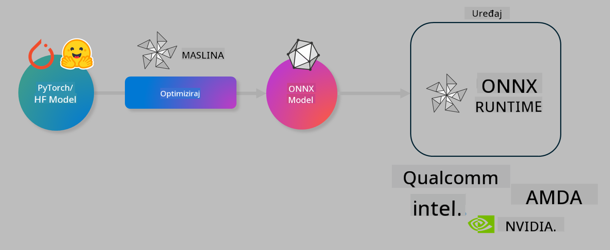

<!--
CO_OP_TRANSLATOR_METADATA:
{
  "original_hash": "6bbe47de3b974df7eea29dfeccf6032b",
  "translation_date": "2025-05-09T04:30:23+00:00",
  "source_file": "code/03.Finetuning/olive-lab/readme.md",
  "language_code": "hr"
}
-->
# Lab. Optimizirajte AI modele za izvođenje na uređaju

## Uvod

> [!IMPORTANT]  
> Ovaj laboratorij zahtijeva **Nvidia A10 ili A100 GPU** s pripadajućim upravljačkim programima i instaliranim CUDA toolkitom (verzija 12+).

> [!NOTE]  
> Ovo je **35-minutni** laboratorij koji će vam pružiti praktični uvod u osnovne koncepte optimizacije modela za izvođenje na uređaju koristeći OLIVE.

## Ciljevi učenja

Na kraju ovog laboratorija moći ćete koristiti OLIVE za:

- Kvantizaciju AI modela koristeći AWQ metodu kvantizacije.  
- Fino podešavanje AI modela za specifičan zadatak.  
- Generiranje LoRA adaptera (fino podešenog modela) za učinkovito izvođenje na uređaju koristeći ONNX Runtime.

### Što je Olive

Olive (*O*NNX *live*) je alat za optimizaciju modela s pratećim CLI-jem koji vam omogućuje isporuku modela za ONNX runtime +++https://onnxruntime.ai+++ uz kvalitetu i performanse.



Ulaz u Olive obično je PyTorch ili Hugging Face model, a izlaz je optimizirani ONNX model koji se izvršava na uređaju (ciljnoj platformi) koja koristi ONNX runtime. Olive optimizira model za AI akcelerator ciljane platforme (NPU, GPU, CPU) koji isporučuje proizvođač hardvera poput Qualcomma, AMD-a, Nvidije ili Intela.

Olive izvršava *workflow*, što je uređeni niz pojedinačnih zadataka optimizacije modela nazvanih *passes* – primjeri takvih zadataka su: kompresija modela, hvatanje grafa, kvantizacija, optimizacija grafa. Svaki zadatak ima skup parametara koje je moguće podesiti kako bi se postigli najbolji rezultati, poput točnosti i latencije, koje procjenjuje odgovarajući evaluator. Olive koristi strategiju pretraživanja koja koristi algoritam pretraživanja za automatsko podešavanje svakog zadatka zasebno ili skupa zadataka zajedno.

#### Prednosti Olive

- **Smanjuje frustraciju i vrijeme** ručnih pokušaja i pogrešaka pri eksperimentiranju s različitim tehnikama optimizacije grafa, kompresije i kvantizacije. Definirajte svoje zahtjeve za kvalitetom i performansama i dopustite da Olive automatski pronađe najbolji model za vas.  
- **Više od 40 ugrađenih komponenti za optimizaciju modela** koje pokrivaju najnovije tehnike u kvantizaciji, kompresiji, optimizaciji grafa i finoj prilagodbi.  
- **Jednostavan CLI** za uobičajene zadatke optimizacije modela. Na primjer, olive quantize, olive auto-opt, olive finetune.  
- Ugrađeno pakiranje i implementacija modela.  
- Podrška za generiranje modela za **Multi LoRA servisiranje**.  
- Konstrukcija workflowa pomoću YAML/JSON za orkestraciju zadataka optimizacije i implementacije modela.  
- Integracija s **Hugging Face** i **Azure AI**.  
- Ugrađeni mehanizam **cacheiranja** za **uštede troškova**.

## Upute za laboratorij  
> [!NOTE]  
> Provjerite jeste li pripremili svoj Azure AI Hub i Projekt te postavili A100 računalo prema Lab 1.

### Korak 0: Povežite se na svoj Azure AI Compute

Povezat ćete se na Azure AI compute koristeći udaljenu funkciju u **VS Code**.

1. Otvorite **VS Code** desktop aplikaciju:  
1. Otvorite **command palette** pritiskom na **Shift+Ctrl+P**  
1. U command palette-u potražite **AzureML - remote: Connect to compute instance in New Window**.  
1. Slijedite upute na ekranu za povezivanje s računalom. To uključuje odabir vaše Azure pretplate, Resource Group, Projekta i imena računala koje ste postavili u Lab 1.  
1. Nakon što se povežete na Azure ML Compute node, to će biti prikazano u **donjem lijevom kutu Visual Code-a** `><Azure ML: Compute Name`

### Korak 1: Klonirajte ovaj repozitorij

U VS Codeu možete otvoriti novi terminal pritiskom na **Ctrl+J** i klonirati ovaj repozitorij:

U terminalu trebate vidjeti prompt

```
azureuser@computername:~/cloudfiles/code$ 
```  
Klonirajte rješenje

```bash
cd ~/localfiles
git clone https://github.com/microsoft/phi-3cookbook.git
```

### Korak 2: Otvorite mapu u VS Codeu

Da biste otvorili VS Code u odgovarajućoj mapi, izvršite sljedeću naredbu u terminalu, što će otvoriti novi prozor:

```bash
code phi-3cookbook/code/04.Finetuning/Olive-lab
```

Alternativno, mapu možete otvoriti odabirom **File** > **Open Folder**.

### Korak 3: Ovisnosti

Otvorite terminal u VS Codeu na vašem Azure AI Compute Instance (savjet: **Ctrl+J**) i izvršite sljedeće naredbe za instalaciju ovisnosti:

```bash
conda create -n olive-ai python=3.11 -y
conda activate olive-ai
pip install -r requirements.txt
az extension remove -n azure-cli-ml
az extension add -n ml
```

> [!NOTE]  
> Instalacija svih ovisnosti trajat će oko 5 minuta.

U ovom laboratoriju ćete preuzimati i prenositi modele u Azure AI Model katalog. Da biste pristupili katalogu modela, morate se prijaviti u Azure pomoću:

```bash
az login
```

> [!NOTE]  
> Tijekom prijave bit ćete upitani da odaberete pretplatu. Provjerite da ste odabrali pretplatu dodijeljenu za ovaj laboratorij.

### Korak 4: Izvršite Olive naredbe

Otvorite terminal u VS Codeu na vašem Azure AI Compute Instance (savjet: **Ctrl+J**) i provjerite je li aktivirano `olive-ai` conda okruženje:

```bash
conda activate olive-ai
```

Zatim izvršite sljedeće Olive naredbe u naredbenom retku.

1. **Pregledajte podatke:** U ovom primjeru ćete fino podesiti Phi-3.5-Mini model kako bi bio specijaliziran za odgovaranje na pitanja vezana uz putovanja. Sljedeći kod prikazuje prvih nekoliko zapisa skupa podataka, koji su u JSON lines formatu:

    ```bash
    head data/data_sample_travel.jsonl
    ```  
1. **Kvantizirajte model:** Prije treniranja modela prvo ga kvantizirajte pomoću naredbe koja koristi tehniku zvanu Active Aware Quantization (AWQ) +++https://arxiv.org/abs/2306.00978+++. AWQ kvantizira težine modela uzimajući u obzir aktivacije proizvedene tijekom izvođenja. To znači da proces kvantizacije uzima u obzir stvarnu distribuciju podataka u aktivacijama, što rezultira boljim očuvanjem točnosti modela u usporedbi s tradicionalnim metodama kvantizacije težina.

    ```bash
    olive quantize \
       --model_name_or_path microsoft/Phi-3.5-mini-instruct \
       --trust_remote_code \
       --algorithm awq \
       --output_path models/phi/awq \
       --log_level 1
    ```

    Kvantizacija AWQ traje oko **8 minuta**, a veličina modela se smanjuje s otprilike ~7.5GB na ~2.5GB.

    U ovom laboratoriju pokazujemo kako unijeti modele iz Hugging Face (na primjer: `microsoft/Phi-3.5-mini-instruct`). However, Olive also allows you to input models from the Azure AI catalog by updating the `model_name_or_path` argument to an Azure AI asset ID (for example:  `azureml://registries/azureml/models/Phi-3.5-mini-instruct/versions/4`). 

1. **Train the model:** Next, the `olive finetune` naredba fino podešava kvantizirani model. Kvantizacija modela *prije* fino podešavanja daje bolju točnost jer proces fino podešavanja kompenzira dio gubitka nastalog kvantizacijom.

    ```bash
    olive finetune \
        --method lora \
        --model_name_or_path models/phi/awq \
        --data_files "data/data_sample_travel.jsonl" \
        --data_name "json" \
        --text_template "<|user|>\n{prompt}<|end|>\n<|assistant|>\n{response}<|end|>" \
        --max_steps 100 \
        --output_path ./models/phi/ft \
        --log_level 1
    ```

    Fino podešavanje traje oko **6 minuta** (s 100 koraka).

1. **Optimizacija:** Nakon treniranja modela, sada ga optimizirajte koristeći Olive naredbu `auto-opt` command, which will capture the ONNX graph and automatically perform a number of optimizations to improve the model performance for CPU by compressing the model and doing fusions. It should be noted, that you can also optimize for other devices such as NPU or GPU by just updating the `--device` and `--provider` - no za potrebe ovog laboratorija koristit ćemo CPU.

    ```bash
    olive auto-opt \
       --model_name_or_path models/phi/ft/model \
       --adapter_path models/phi/ft/adapter \
       --device cpu \
       --provider CPUExecutionProvider \
       --use_ort_genai \
       --output_path models/phi/onnx-ao \
       --log_level 1
    ```

    Optimizacija traje oko **5 minuta**.

### Korak 5: Brzi test inferencije modela

Za testiranje inferencije modela, kreirajte Python datoteku u svojoj mapi pod nazivom **app.py** i kopirajte sljedeći kod:

```python
import onnxruntime_genai as og
import numpy as np

print("loading model and adapters...", end="", flush=True)
model = og.Model("models/phi/onnx-ao/model")
adapters = og.Adapters(model)
adapters.load("models/phi/onnx-ao/model/adapter_weights.onnx_adapter", "travel")
print("DONE!")

tokenizer = og.Tokenizer(model)
tokenizer_stream = tokenizer.create_stream()

params = og.GeneratorParams(model)
params.set_search_options(max_length=100, past_present_share_buffer=False)
user_input = "what is the best thing to see in chicago"
params.input_ids = tokenizer.encode(f"<|user|>\n{user_input}<|end|>\n<|assistant|>\n")

generator = og.Generator(model, params)

generator.set_active_adapter(adapters, "travel")

print(f"{user_input}")

while not generator.is_done():
    generator.compute_logits()
    generator.generate_next_token()

    new_token = generator.get_next_tokens()[0]
    print(tokenizer_stream.decode(new_token), end='', flush=True)

print("\n")
```

Pokrenite kod koristeći:

```bash
python app.py
```

### Korak 6: Prenesite model u Azure AI

Prijenos modela u Azure AI repozitorij modela omogućuje dijeljenje modela s drugim članovima vašeg razvojnog tima i upravljanje verzijama modela. Za prijenos modela pokrenite sljedeću naredbu:

> [!NOTE]  
> Ažurirajte `{}`` placeholders with the name of your resource group and Azure AI Project Name. 

To find your resource group ` sa svojim nazivom Resource Group i Azure AI Project imenom, zatim pokrenite naredbu

```
az ml workspace show
```

Ili idite na +++ai.azure.com+++ i odaberite **management center** > **project** > **overview**

Ažurirajte `{}` mjesta rezervirana za naziv vaše resource grupe i Azure AI Project imena.

```bash
az ml model create \
    --name ft-for-travel \
    --version 1 \
    --path ./models/phi/onnx-ao \
    --resource-group {RESOURCE_GROUP_NAME} \
    --workspace-name {PROJECT_NAME}
```  
Zatim možete vidjeti svoj preneseni model i implementirati ga na https://ml.azure.com/model/list

**Odricanje od odgovornosti**:  
Ovaj je dokument preveden pomoću AI usluge za prevođenje [Co-op Translator](https://github.com/Azure/co-op-translator). Iako težimo točnosti, imajte na umu da automatski prijevodi mogu sadržavati pogreške ili netočnosti. Izvorni dokument na izvornom jeziku treba smatrati autoritativnim izvorom. Za važne informacije preporučuje se profesionalni ljudski prijevod. Ne snosimo odgovornost za bilo kakve nesporazume ili pogrešna tumačenja koja proizlaze iz korištenja ovog prijevoda.