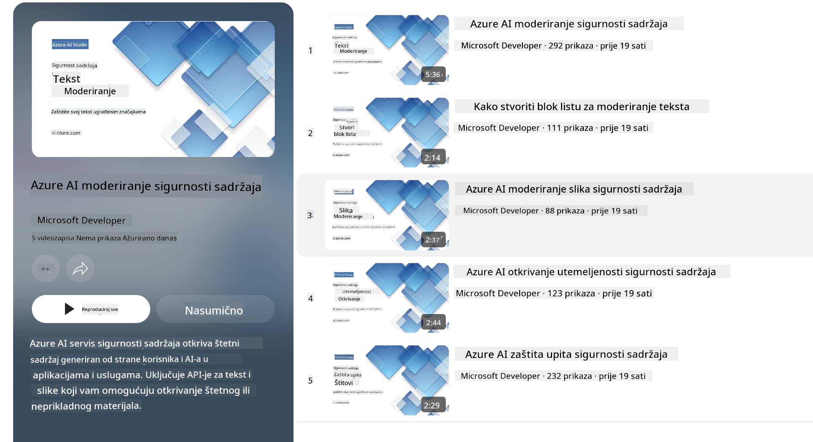

<!--
CO_OP_TRANSLATOR_METADATA:
{
  "original_hash": "c8273672cc57df2be675407a1383aaf0",
  "translation_date": "2025-05-09T06:27:49+00:00",
  "source_file": "md/01.Introduction/01/01.AISafety.md",
  "language_code": "hr"
}
-->
# Sigurnost AI-ja za Phi modele  
Obitelj Phi modela razvijena je u skladu s [Microsoft Responsible AI Standard](https://query.prod.cms.rt.microsoft.com/cms/api/am/binary/RE5cmFl), što je skup zahtjeva na razini tvrtke temeljen na sljedećih šest načela: odgovornost, transparentnost, pravičnost, pouzdanost i sigurnost, privatnost i sigurnost te inkluzivnost, koja čine [Microsoftova načela odgovornog AI-ja](https://www.microsoft.com/ai/responsible-ai).  

Kao i kod prethodnih Phi modela, usvojen je višeslojni pristup evaluaciji sigurnosti i post-trening sigurnosnim mjerama, uz dodatne korake koji uzimaju u obzir višelingvalne sposobnosti ovog izdanja. Naš pristup treniranju sigurnosti i evaluacijama, uključujući testiranje na više jezika i u različitim kategorijama rizika, opisan je u [Phi Safety Post-Training Paper](https://arxiv.org/abs/2407.13833). Iako Phi modeli imaju koristi od ovog pristupa, developeri bi trebali primjenjivati najbolje prakse odgovornog AI-ja, uključujući mapiranje, mjerenje i ublažavanje rizika povezanih s njihovim specifičnim slučajem upotrebe i kulturnim te jezičnim kontekstom.  

## Najbolje prakse  

Kao i drugi modeli, Phi obitelj modela može se potencijalno ponašati na načine koji nisu pravični, pouzdani ili mogu biti uvredljivi.  

Neki od ograničavajućih ponašanja SLM i LLM o kojima treba biti svjestan uključuju:  

- **Kvaliteta usluge:** Phi modeli su prvenstveno trenirani na engleskom tekstu. Jezici osim engleskog mogu pokazivati lošije performanse. Varijante engleskog jezika koje su slabije zastupljene u trening podacima mogu imati lošije rezultate u usporedbi sa standardnim američkim engleskim.  
- **Prikaz štete i održavanje stereotipa:** Ovi modeli mogu prekomjerno ili nedovoljno prikazivati određene skupine ljudi, izbrisati prikaz nekih skupina ili učvrstiti omalovažavajuće ili negativne stereotipe. Unatoč sigurnosnim post-trening mjerama, ove ograničenosti i dalje mogu postojati zbog različitih razina zastupljenosti skupina ili prisutnosti primjera negativnih stereotipa u trening podacima koji odražavaju stvarne obrasce i društvene pristranosti.  
- **Neprimjereni ili uvredljivi sadržaji:** Ovi modeli mogu proizvesti druge vrste neprimjerenog ili uvredljivog sadržaja, što može učiniti njihovu primjenu neprimjerenom u osjetljivim kontekstima bez dodatnih mjera prilagođenih specifičnoj upotrebi.  
- **Pouzdanost informacija:** Jezični modeli mogu generirati besmislene sadržaje ili izmišljati informacije koje mogu zvučati uvjerljivo, ali su netočne ili zastarjele.  
- **Ograničen opseg za kod:** Većina trening podataka Phi-3 modela bazirana je na Pythonu i koristi uobičajene pakete poput "typing, math, random, collections, datetime, itertools". Ako model generira Python skripte koje koriste druge pakete ili skripte u drugim jezicima, snažno preporučujemo korisnicima da ručno provjere sve API pozive.  

Developeri bi trebali primjenjivati najbolje prakse odgovornog AI-ja i odgovorni su za osiguravanje da specifični slučaj upotrebe bude u skladu s relevantnim zakonima i propisima (npr. privatnost, trgovina itd.).  

## Razmatranja odgovornog AI-ja  

Kao i drugi jezični modeli, Phi serija modela može se potencijalno ponašati na načine koji nisu pravični, pouzdani ili mogu biti uvredljivi. Neki od ograničavajućih ponašanja o kojima treba biti svjestan uključuju:  

**Kvaliteta usluge:** Phi modeli su prvenstveno trenirani na engleskom tekstu. Jezici osim engleskog mogu pokazivati lošije performanse. Varijante engleskog jezika koje su slabije zastupljene u trening podacima mogu imati lošije rezultate u usporedbi sa standardnim američkim engleskim.  

**Prikaz štete i održavanje stereotipa:** Ovi modeli mogu prekomjerno ili nedovoljno prikazivati određene skupine ljudi, izbrisati prikaz nekih skupina ili učvrstiti omalovažavajuće ili negativne stereotipe. Unatoč sigurnosnim post-trening mjerama, ove ograničenosti i dalje mogu postojati zbog različitih razina zastupljenosti skupina ili prisutnosti primjera negativnih stereotipa u trening podacima koji odražavaju stvarne obrasce i društvene pristranosti.  

**Neprimjereni ili uvredljivi sadržaji:** Ovi modeli mogu proizvesti druge vrste neprimjerenog ili uvredljivog sadržaja, što može učiniti njihovu primjenu neprimjerenom u osjetljivim kontekstima bez dodatnih mjera prilagođenih specifičnoj upotrebi.  
Pouzdanost informacija: Jezični modeli mogu generirati besmislene sadržaje ili izmišljati informacije koje mogu zvučati uvjerljivo, ali su netočne ili zastarjele.  

**Ograničen opseg za kod:** Većina trening podataka Phi-3 modela bazirana je na Pythonu i koristi uobičajene pakete poput "typing, math, random, collections, datetime, itertools". Ako model generira Python skripte koje koriste druge pakete ili skripte u drugim jezicima, snažno preporučujemo korisnicima da ručno provjere sve API pozive.  

Developeri bi trebali primjenjivati najbolje prakse odgovornog AI-ja i odgovorni su za osiguravanje da specifični slučaj upotrebe bude u skladu s relevantnim zakonima i propisima (npr. privatnost, trgovina itd.). Važna područja za razmatranje uključuju:  

**Dodjela:** Modeli možda nisu prikladni za scenarije koji bi mogli imati značajan utjecaj na pravni status ili dodjelu resursa ili životnih prilika (npr. stanovanje, zapošljavanje, kredit itd.) bez dodatnih procjena i tehnika uklanjanja pristranosti.  

**Scenariji visokog rizika:** Developeri bi trebali procijeniti prikladnost korištenja modela u visokorizičnim scenarijima gdje nepravedni, nepouzdani ili uvredljivi rezultati mogu biti iznimno skupi ili dovesti do štete. To uključuje davanje savjeta u osjetljivim ili stručnim područjima gdje su točnost i pouzdanost ključni (npr. pravni ili zdravstveni savjeti). Dodatne mjere zaštite trebaju se implementirati na razini aplikacije prema kontekstu primjene.  

**Dezinformacije:** Modeli mogu proizvesti netočne informacije. Developeri bi trebali slijediti najbolje prakse transparentnosti i obavijestiti krajnje korisnike da komuniciraju s AI sustavom. Na razini aplikacije developeri mogu izgraditi mehanizme povratnih informacija i kanale za temeljenje odgovora na kontekstualnim informacijama specifičnim za slučaj upotrebe, tehniku poznatu kao Retrieval Augmented Generation (RAG).  

**Generiranje štetnog sadržaja:** Developeri bi trebali procijeniti izlaze u njihovom kontekstu i koristiti dostupne sigurnosne klasifikatore ili prilagođena rješenja prikladna za njihov slučaj upotrebe.  

**Zlouporaba:** Druge vrste zlouporabe poput prijevare, neželjene pošte ili proizvodnje zlonamjernog softvera mogu biti moguće, te developeri trebaju osigurati da njihove aplikacije ne krše važeće zakone i propise.  

### Fino podešavanje i sigurnost AI sadržaja  

Nakon fino podešavanja modela, toplo preporučujemo korištenje mjera [Azure AI Content Safety](https://learn.microsoft.com/azure/ai-services/content-safety/overview) za praćenje sadržaja koji modeli generiraju, identifikaciju i blokiranje potencijalnih rizika, prijetnji i problema s kvalitetom.  

  

[Azure AI Content Safety](https://learn.microsoft.com/azure/ai-services/content-safety/overview) podržava i tekstualni i slikovni sadržaj. Može se implementirati u oblaku, u odvojenim kontejnerima i na edge/ugrađenim uređajima.  

## Pregled Azure AI Content Safety  

Azure AI Content Safety nije rješenje koje odgovara svima; može se prilagoditi kako bi se uskladilo s politikama pojedinih tvrtki. Osim toga, njegovi višelingvalni modeli omogućuju razumijevanje više jezika istovremeno.  

  

- **Azure AI Content Safety**  
- **Microsoft Developer**  
- **5 videa**  

Azure AI Content Safety servis detektira štetni sadržaj koji generiraju korisnici i AI u aplikacijama i uslugama. Uključuje tekstualne i slikovne API-je koji omogućuju otkrivanje štetnog ili neprimjerenog materijala.  

[AI Content Safety Playlist](https://www.youtube.com/playlist?list=PLlrxD0HtieHjaQ9bJjyp1T7FeCbmVcPkQ)

**Odricanje od odgovornosti**:  
Ovaj je dokument preveden pomoću AI prevoditeljskog servisa [Co-op Translator](https://github.com/Azure/co-op-translator). Iako nastojimo postići točnost, imajte na umu da automatski prijevodi mogu sadržavati pogreške ili netočnosti. Izvorni dokument na izvornom jeziku treba smatrati službenim i autoritativnim izvorom. Za važne informacije preporučuje se profesionalni ljudski prijevod. Ne snosimo odgovornost za bilo kakve nesporazume ili pogrešne interpretacije koje proizlaze iz korištenja ovog prijevoda.