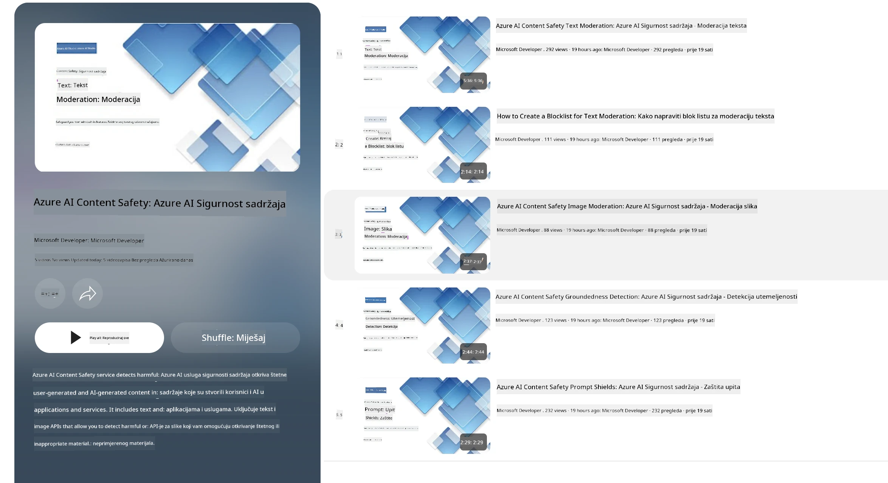

# Sigurnost umjetne inteligencije za Phi modele
Obitelj Phi modela razvijena je u skladu s [Microsoftovim standardom za odgovornu umjetnu inteligenciju](https://www.microsoft.com/ai/principles-and-approach#responsible-ai-standard), koji je skup zahtjeva za cijelu tvrtku zasnovan na sljedećih šest načela: odgovornost, transparentnost, pravičnost, pouzdanost i sigurnost, privatnost i sigurnost te uključenost, koji oblikuju [Microsoftova načela odgovorne umjetne inteligencije](https://www.microsoft.com/ai/responsible-ai).

Kao i kod prethodnih Phi modela, usvojen je višeslojni pristup ocjeni sigurnosti i post-trening sigurnosnim mjerama, uz dodatne mjere kako bi se uzela u obzir višejezična sposobnost ovog izdanja. Naš pristup treningu sigurnosti i evaluacijama, uključujući testiranje na više jezika i kroz različite kategorije rizika, opisan je u [Phi Safety Post-Training Paper](https://arxiv.org/abs/2407.13833). Dok Phi modeli koriste ovaj pristup, programeri trebaju primjenjivati najbolje prakse odgovorne umjetne inteligencije, uključujući mapiranje, mjerenje i ublažavanje rizika povezanih s njihovim specifičnim slučajem upotrebe i kulturnim i jezičnim kontekstom.

## Najbolje prakse

Kao i drugi modeli, obitelj Phi modela može potencijalno djelovati na načine koji su nepravedni, nepouzdani ili uvredljivi.

Neki od ograničavajućih ponašanja SLM i LLM modela kojih trebate biti svjesni uključuju:

- **Kvaliteta usluge:** Phi modeli su primarno trenirani na engleskom tekstu. Jezici osim engleskog pokazat će lošije performanse. Varijante engleskog jezika s manje zastupljenosti u podacima za treniranje mogu pokazati slabije performanse u odnosu na standardni američki engleski.
- **Predstavljanje štete i perpetuiranje stereotipa:** Ovi modeli mogu previše ili premalo predstavljati određene grupe ljudi, izbrisati zastupljenost nekih grupa ili ojačati omalovažavajuće ili negativne stereotipe. Unatoč post-trening sigurnosnim mjerenjima, ove ograničenosti mogu i dalje postojati zbog različitih razina zastupljenosti različitih grupa ili učestalosti primjera negativnih stereotipa u podacima za treniranje koji odražavaju stvarne obrasce i društvene predrasude.
- **Neprimjereni ili uvredljivi sadržaj:** Ovi modeli mogu proizvesti i druge vrste neprimjerenog ili uvredljivog sadržaja, zbog čega njihova primjena u osjetljivim kontekstima bez dodatnih mjera ublažavanja specifičnih za slučaj upotrebe može biti neprimjerena.
- **Pouzdanost informacija:** Jezični modeli mogu generirati besmislene sadržaje ili izmišljati sadržaje koji mogu zvučati razumljivo, ali su netočni ili zastarjeli.
- **Ograničen opseg za kod:** Većina trening podataka Phi-3 modela bazirana je na Pythonu i koristi uobičajene pakete poput "typing, math, random, collections, datetime, itertools". Ako model generira Python skripte koje koriste druge pakete ili skripte na drugim jezicima, snažno preporučujemo korisnicima da ručno provjere svaku upotrebu API-ja.

Programeri trebaju primijeniti najbolje prakse odgovorne umjetne inteligencije i odgovorni su za osiguranje da specifični slučaj upotrebe bude u skladu s relevantnim zakonima i propisima (npr. privatnost, trgovina itd.).

## Razmatranja za odgovornu umjetnu inteligenciju

Kao i drugi jezični modeli, Phi serija modela može potencijalno djelovati na načine koji su nepravedni, nepouzdani ili uvredljivi. Neki od ograničavajućih ponašanja kojih treba biti svjestan uključuju:

**Kvaliteta usluge:** Phi modeli su primarno trenirani na engleskom tekstu. Jezici osim engleskog pokazuju lošije performanse. Varijante engleskog jezika s manje zastupljenosti u podacima za treniranje mogu pokazati slabije performanse u odnosu na standardni američki engleski.

**Predstavljanje štete i perpetuiranje stereotipa:** Ovi modeli mogu previše ili premalo predstavljati određene grupe ljudi, izbrisati zastupljenost nekih grupa ili ojačati omalovažavajuće ili negativne stereotipe. Unatoč post-trening sigurnosnim mjerama, ove ograničenosti mogu i dalje postojati zbog različitih razina zastupljenosti različitih grupa ili učestalosti primjera negativnih stereotipa u podacima za treniranje koji odražavaju stvarne obrasce i društvene predrasude.

**Neprimjereni ili uvredljivi sadržaj:** Ovi modeli mogu proizvesti druge vrste neprimjerenog ili uvredljivog sadržaja, zbog čega njihova primjena u osjetljivim kontekstima bez dodatnih mjera ublažavanja specifičnih za slučaj upotrebe može biti neprimjerena.
Pouzdanost informacija: Jezični modeli mogu generirati besmislene sadržaje ili izmišljati sadržaje koji mogu zvučati razumljivo, ali su netočni ili zastarjeli.

**Ograničen opseg za kod:** Većina trening podataka Phi-3 modela bazirana je na Pythonu i koristi uobičajene pakete poput "typing, math, random, collections, datetime, itertools". Ako model generira Python skripte koje koriste druge pakete ili skripte na drugim jezicima, snažno preporučujemo korisnicima da ručno provjere svaku upotrebu API-ja.

Programeri trebaju primijeniti najbolje prakse odgovorne umjetne inteligencije i odgovorni su za osiguranje da specifični slučaj upotrebe bude u skladu s relevantnim zakonima i propisima (npr. privatnost, trgovina itd.). Važna područja za razmatranje uključuju:

**Dodjela:** Modeli možda nisu prikladni za scenarije koji mogu imati značajan utjecaj na pravni status ili dodjelu resursa ili životnih prilika (npr. stanovanje, zaposlenje, kredit itd.) bez dodatnih procjena i daljnjih tehnika uklanjanja pristranosti.

**Visoki rizik:** Programeri bi trebali procijeniti prikladnost korištenja modela u scenarijima visokog rizika gdje nepravedni, nepouzdani ili uvredljivi rezultati mogu imati vrlo visoke troškove ili prouzročiti štetu. To uključuje pružanje savjeta u osjetljivim ili stručnim područjima gdje su točnost i pouzdanost kritični (npr. pravni ili zdravstveni savjeti). Dodatne sigurnosne mjere trebaju se primijeniti na razini aplikacije prema kontekstu implementacije.

**Dezinformacije:** Modeli mogu proizvesti netočne informacije. Programeri bi trebali slijediti najbolje prakse transparentnosti i obavijestiti krajnje korisnike da komuniciraju s AI sustavom. Na razini aplikacije, programeri mogu izgraditi mehanizme za povratne informacije i cjevovode za temeljene odgovore na specifične, kontekstualne informacije slučaja upotrebe, tehniku poznatu kao Retrieval Augmented Generation (RAG).

**Generiranje štetnog sadržaja:** Programeri bi trebali procijeniti ishod prema njihovom kontekstu i koristiti dostupne klasifikatore sigurnosti ili prilagođena rješenja prikladna za njihov slučaj upotrebe.

**Zlouporaba:** Drugi oblici zloupotrebe poput prijevara, spama ili proizvodnje malwarea mogu biti mogući, te programeri trebaju osigurati da njihove aplikacije ne krše važeće zakone i propise.

### Fein-tuning i sigurnost AI sadržaja

Nakon fino podešavanja modela, toplo preporučujemo korištenje mjera [Azure AI Content Safety](https://learn.microsoft.com/azure/ai-services/content-safety/overview) za praćenje sadržaja koji generiraju modeli, identificiranje i blokiranje potencijalnih rizika, prijetnji i problema kvalitete.

[Azure AI Content Safety](https://learn.microsoft.com/azure/ai-services/content-safety/overview) podržava zapise teksta i slike. Može se implementirati u oblaku, odvojenim spremnicima i na edge/ugrađenim uređajima.

## Pregled Azure AI Content Safety

Azure AI Content Safety nije univerzalno rješenje; može se prilagoditi kako bi se uskladilo sa specifičnim politikama tvrtki. Osim toga, njegovi višejezični modeli omogućuju istovremeno razumijevanje više jezika.

- **Azure AI Content Safety**
- **Microsoft Developer**
- **5 videozapisa**

Usluga Azure AI Content Safety otkriva štetni sadržaj koji generiraju korisnici i AI u aplikacijama i uslugama. Ona uključuje tekstualne i slikovne API-jeve koji omogućuju otkrivanje štetnog ili neprimjerenog materijala.

[AI Content Safety Playlist](https://www.youtube.com/playlist?list=PLlrxD0HtieHjaQ9bJjyp1T7FeCbmVcPkQ)

---

<!-- CO-OP TRANSLATOR DISCLAIMER START -->
**Odricanje od odgovornosti**:
Ovaj dokument preveden je pomoću AI prevoditeljskog servisa [Co-op Translator](https://github.com/Azure/co-op-translator). Iako težimo točnosti, imajte na umu da automatski prijevodi mogu sadržavati pogreške ili netočnosti. Izvorni dokument na njegovom izvornom jeziku treba smatrati autoritativnim izvorom. Za ključne informacije preporučuje se stručni ljudski prijevod. Ne snosimo odgovornost za bilo kakva nesporazuma ili pogrešna tumačenja koja proizlaze iz korištenja ovog prijevoda.
<!-- CO-OP TRANSLATOR DISCLAIMER END -->